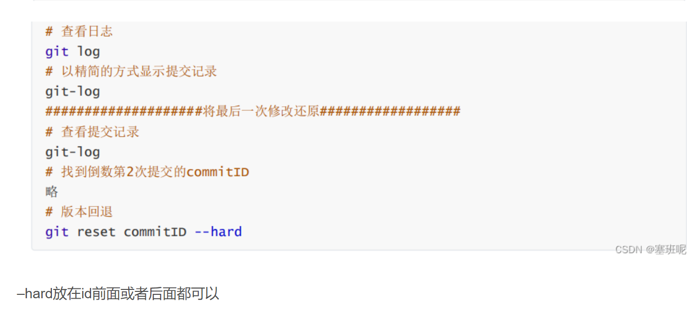
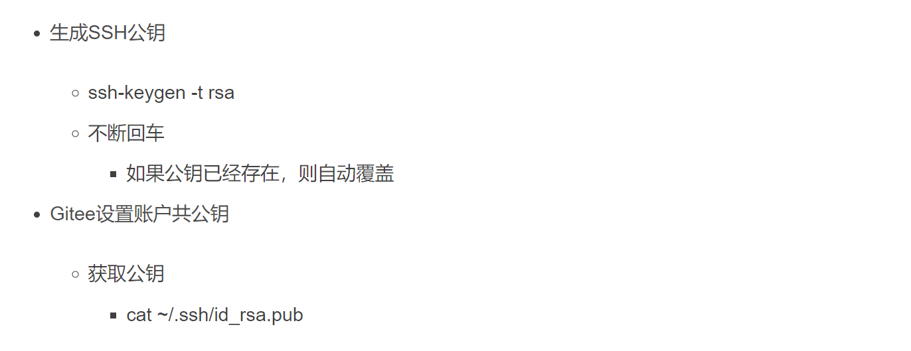
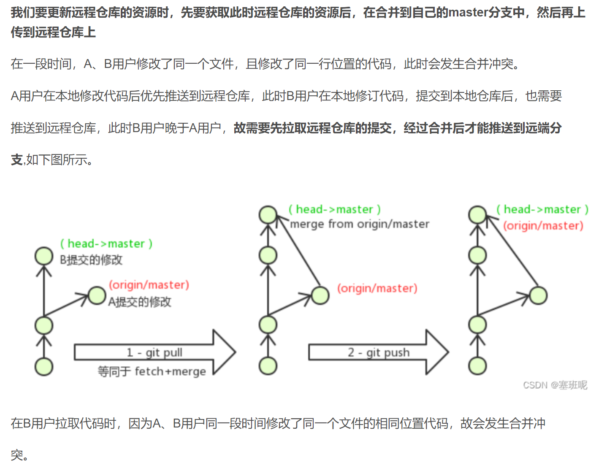
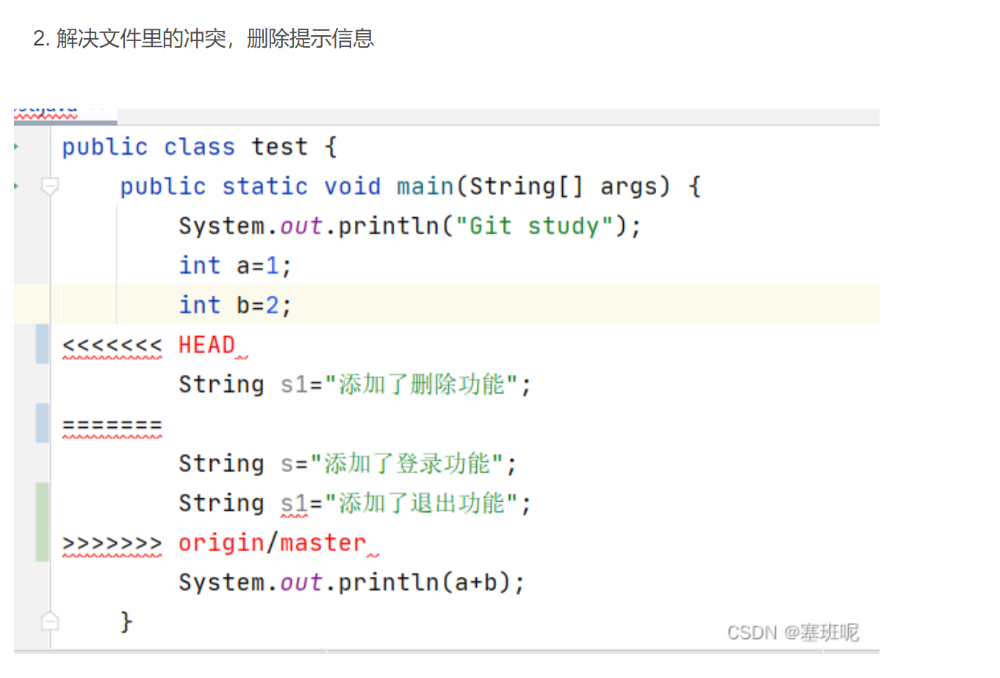

---

---

# 1、目标


# 2、概述

## 2.1、开发中的实际场景

> 场景一：备份 小明负责的模块就要完成了，就在即将Release之前的一瞬间，电脑突然蓝屏，硬盘光荣牺牲！几个月 来的努力付之东流 
>
> 场景二：代码还原 这个项目中需要一个很复杂的功能，老王摸索了一个星期终于有眉目了，可是这被改得面目全非的 代码已经回不到从前了。什么地方能买到哆啦A梦的时光机啊？ 
>
> 场景三：协同开发 小刚和小强先后从文件服务器上下载了同一个文件：Analysis.java。小刚在Analysis.java 文件中的第30行声明了一个方法，叫count()，先保存到了文件服务器上；小强在Analysis.java文件中的 第50行声明了一个方法，叫sum()，也随后保存到了文件服务器上，于是，count()方法就只存在于小刚的记 忆中了 
>
> 场景四：追溯问题代码的编写人和编写时间！ 老王是另一位项目经理，每次因为项目进度挨骂之后，他都不知道该扣哪个程序员的工资！就拿这 次来说吧，有个Bug调试了30多个小时才知道是因为相关属性没有在应用初始化时赋值！可是二胖、王东、刘 流和正经牛都不承认是自己干的！


## 2.2、版本控制器的方式

> a、集中式版本控制工具 
> 集中式版本控制工具，版本库是集中存放在中央服务器的，team里每个人work时从中央服务器下载代码，是必须联网才能工作，局域网或互联网。个人修改后然后提交到中央版本库。 举例：SVN和CVS 
> b、分布式版本控制工具 
> 分布式版本控制系统没有“中央服务器”，每个人的电脑上都是一个完整的版本库，这样工作的时候，无需联网了，因为版本库就在你自己的电脑上。多人协作只需要各自的修改推送给对方，就能互相看到对方的 修改了。举例：Git

集中式版本控制的缺点：

需要联网，中央服务器磁盘损坏，项目会彻底崩溃

## 2.3、Git

> Git是分布式的,Git不需要有中心服务器，我们每台电脑拥有的东西都是一样的。我们使用Git并且有个 中心服务器，仅仅是为了方便交换大家的修改，但是这个服务器的地位和我们每个人的PC是一样的。我们可以 把它当做一个开发者的pc就可以就是为了大家代码容易交流不关机用的。没有它大家一样可以工作，只不 过“交换”修改不方便而已。 
> git是一个开源的分布式版本控制系统，可以有效、高速地处理从很小到非常大的项目版本管理。Git是 Linus Torvalds 为了帮助管理 Linux 内核开发而开发的一个开放源码的版本控制软件。 同生活中的许多伟大事物一样，Git 诞生于一个极富纷争大举创新的年代。Linux 内核开源项目有着为数众 多的参与者。 绝大多数的 Linux 内核维护工作都花在了提交补丁和保存归档的繁琐事务上（1991－2002 年间）。 到 2002 年，整个项目组开始启用一个专有的分布式版本控制系统 BitKeeper 来管理和维护代 码。到了 2005 年，开发 BitKeeper 的商业公司同 Linux 内核开源社区的合作关系结束，他们收回了 Linux 内核社区免费使用 BitKeeper 的权力。 这就迫使 Linux 开源社区（特别是 Linux 的缔造者 Linus Torvalds）基于使用 BitKeeper 时的经验教训，开发出自己的版本系统。 
> 他们对新的系统制订 了若干目标： 
> 速度简单的设计 
> 对非线性开发模式的强力支持（允许成千上万个并行开发的分支） 
> 完全分布式 
> 有能力高效管理类似 Linux 内核一样的超大规模项目（速度和数据量）


**重点**

> Git是一个分布式版本管理系统，他通过共享版本库来共享版本信息，所以相当于每个开发人员的本地都有一个共享版本库的拷贝，所有人员的本地版本库和共享版本库都是同步的，所以不用担心共享版本库宕机的问题，只要拿一个开发人员的本地版本库传到共享版本库就好了，开发人员之间可以直接交换版本信息，但是这种方式不常用，我们一般还是通过共享版本库实现共享，这样所有的人员都可以共享到版本信息，无需联网了，因为版本库就在你自己的电脑上，但是要实现版本共享的时候还是需要联网的，自己开发的时候不需要联网。

## 2.4 Git工作流程图


**命令如下：**

1. **clone（克隆）: 从远程仓库中克隆代码到本地仓库**
2. **checkout （检出）:从本地仓库中检出一个仓库分支然后进行修订**
3. **add（添加）: 在提交前先将代码提交到暂存区**
4. **commit（提交）: 提交到本地仓库。本地仓库中保存修改的各个历史版本**
5. **fetch (抓取) ： 从远程库，抓取到本地仓库，不进行任何的合并动作，一般操作比较少。**
6. **pull (拉取) ： 从远程库拉到本地库，自动进行合并(merge)，然后放到到工作区，相当于fetch+merge**
7. **push（推送） : 修改完成后，需要和团队成员共享代码时，将代码推送到远程仓库**

# 3、Git安装与常用命令

本教程里的git命令例子都是在Git Bash中演示的，会用到一些基本的linux命令，在此为大家提前列举：

- ls/ll 查看当前目录 ll是查看当前文件夹下的所有文件，包括隐藏文件
- cat 查看文件内容
- touch 创建文件
- vi vi编辑器（使用vi编辑器是为了方便展示效果，学员可以记事本、editPlus、notPad++等其它编辑器）

## 3.1、Git环境配置

### 3.1.1下载与安装

下载地址： [https://git-scm.com/download](https://git-scm.com/download)


备注：

Git GUI：Git提供的图形界面工具

Git Bash：Git提供的命令行工具

**当安装Git后首先要做的事情是设置用户名称和email地址。这是非常重要的，因为每次Git提交都会使用该用户信息**

Git版本控制要记录哪个人什么时候做了什么事情，Git就是通过邮箱去辨识是哪个人的

### 3.1.2 基本配置


1. 打开Git Bash
2. 设置用户信息

git config --global user.name “itcast”

git config --global user.email “hello@itcast.cn”


邮箱可以是假邮箱

查看配置信息

git config --global user.name

git config --global user.email

### 3.1.3 为常用指令配置别名（可选）

有些常用的指令参数非常多，每次都要输入好多参数，我们可以使用别名。

1. 打开用户目录，创建 .bashrc 文件

部分windows系统不允许用户创建点号开头的文件**，可以打开gitBash,执行 touch ~/.bashrc**


1. 在 .bashrc 文件中输入如下内容：

   **这个是设置别名的，使用前要先弄一下**

   ```git
   #用于输出git提交日志 
   alias git-log='git log --pretty=oneline --all --graph --abbrev-commit' 
   #用于输出当前目录所有文件及基本信息 
   alias ll='ls -al'
   ```

2. 打开gitBash，执行 source ~/.bashrc


### 3.1.4 解决GitBash乱码问题

1. 打开GitBash执行下面命令

```
git config --global core.quotepath false
```

1. ${git_home}/etc/bash.bashrc 文件最后加入下面两行

```
export LANG="zh_CN.UTF-8" 
export LC_ALL="zh_CN.UTF-8"
```

## 3.2、获取本地仓库

要使用Git对我们的代码进行版本控制，首先需要获得本地仓库

1）在电脑的任意位置创建一个空目录（例如test）作为我们的本地Git仓库

2）进入这个目录中，点击右键打开Git bash窗口

3）执行命令git init

4）如果创建成功后可在文件夹下看到隐藏的.git目录。


## 3.3、基础操作指令

**touch .加文件名称   创建文件**

Git工作目录下对于文件的**修改**(增加、删除、更新)会存在几个状态，这些**修改**的状态会随着我们执行Git

的命令而发生变化。


工作区，就是平时存放项目代码的地方。

本章节主要讲解如何使用命令来控制这些状态之间的转换：

1. git add (工作区 --> 暂存区) **git add .**添加所有文件、文件夹和子文件夹，包括.gitignore和以点开头的任何其他内容；
2. git commit (暂存区 --> 本地仓库) 


### 3.3.1、查看修改的状态（status）

- 作用：查看的修改的状态（暂存区、工作区）
- 命令形式：git status


新创建的文件是未跟踪状态


即将被提交的意思


提交完后显示缓冲区没有东西可以提交了

**新建文件是显示new file 修改文件就是实现modified:**


### 3.3.4、查看提交日志(log)

**在3.1.3中配置的别名 git-log 就包含了这些参数，所以后续可以直接使用指令 git-log**

- 作用:查看提交记录
- 命令形式：git log [option]
  - options
    - all 显示所有分支
    - pretty=oneline 将提交信息显示为一行
    - abbrev-commit 使得输出的commitId更简短
    - graph 以图的形式显示

查看log我们一般都是会加上上面全部的参数的，这样显示更美观有序，我们在上面给这个指令设置了别名


### 3.3.5、版本回退


**如果是误删的话可以git reflog 来查看删除的记录，然后在使用  git reset --hard  提交的id**

### 3.3.6、添加文件至忽略列表




## 3.4、分支


### 3.4.1、查看本地分支


### 3.4.2、创建本地分支


### 3.4.4、切换分支(checkout)

**DHEAD 指到谁，谁就是当前分支**


### 3.4.5、合并分支merge)

**创建新分支的话，会把前面提交的也提交给新的分支，然后两分支在进行不同的操作**

**合并分支是将指定的分支合并到当前分支**


### 3.4.6、删除分支


**git branch -d 分支名称**

**如果实在是删除不了，在使用D**

### 3.4.7、解决冲突


### 3.4.8、开发中分支使用原则与流程


# 4、Git远程仓库

### 4.1、 常用的托管服务[远程仓库]

```git
前面我们已经知道了Git中存在两种类型的仓库，即本地仓库和远程仓库。那么我们如何搭建Git远程仓库 呢？我们可以借助互联网上提供的一些代码托管服务来实现，其中比较常用的有GitHub、码云、GitLab等。 
gitHub（ 地址：https://github.com/ ）是一个面向开源及私有软件项目的托管平台，因为只支持 Git 作为唯一的版本库格式进行托管，故名gitHub 

码云（地址： https://gitee.com/ ）是国内的一个代码托管平台，由于服务器在国内，所以相比于 GitHub，码云速度会更快 

GitLab （地址： https://about.gitlab.com/ ）是一个用于仓库管理系统的开源项目，使用Git作 为代码管理工具，并在此基础上搭建起来的web服务,一般用于在企业、学校等内部网络搭建git私服。
```

企业里面我们一般使用GitLab,毕竟代码放在自己的机房里面才安全，gitLab要自己部署

## 4.2、 注册码云


## 4.4、配置SSH公钥




## 4.5、操作远程仓库

### 4.5.1、添加远程仓库


### 4.5.2、查看远程仓库


### 4.5.3、推送到远程仓库


### 4.5.4、 本地分支与远程分支的关联关系


### 4.5.5、从远程仓库克隆


### 4.5.6、从远程仓库中抓取和拉取


### 4.5.7、解决合并冲突




# 5、在Idea中使用Git（重点掌握）

## 5.1、在Idea中配置Git


## 5.2、在Idea中操作Git


### 5.2.1、创建项目远程仓库（参照4.3）


### 5.2.2、初始化本地仓库（将当前项目初始化为仓库）


### 5.2.3、设置远程仓库


### 5.2.4、提交到本地仓库


### 5.2.6、推送到远程仓库


### 5.2.7、克隆远程仓库到本地


**每次提交代码的时候都看一下，都先从远程仓库克隆pull出来，再到本地里面改了之后再push**

### 5.2.8、创建分支


### 5.2.9、切换分支及其他分支相关操作


### 5.2.10、解决冲突





### 5.2.11查看分支


### 5.2.12创建分支


### 5.2.13合并分支


## 5.3、IDEA常用GIT操作入口


