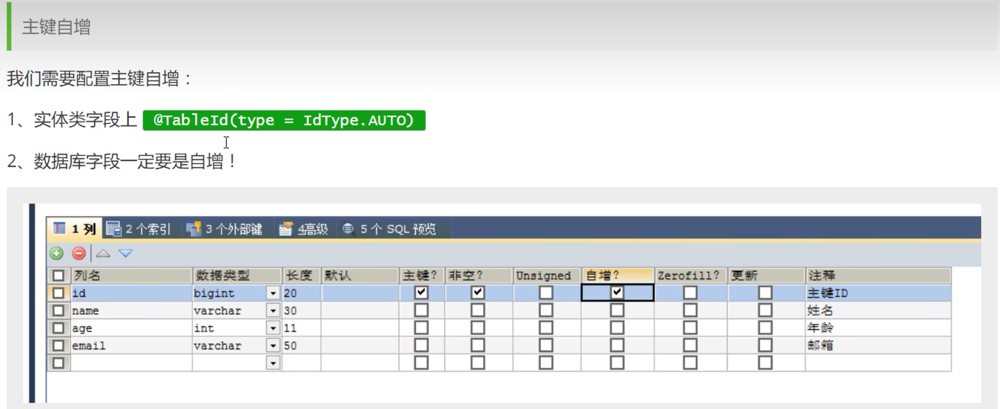
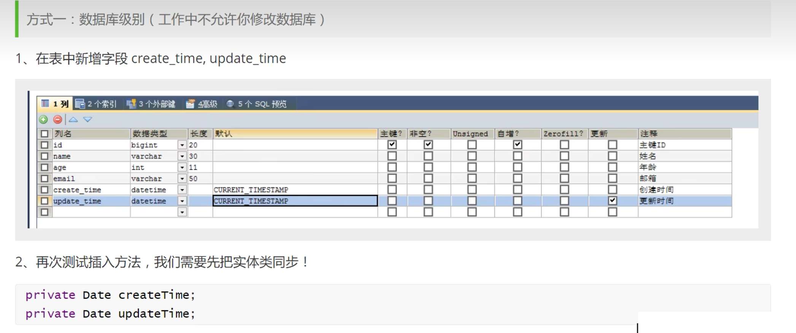
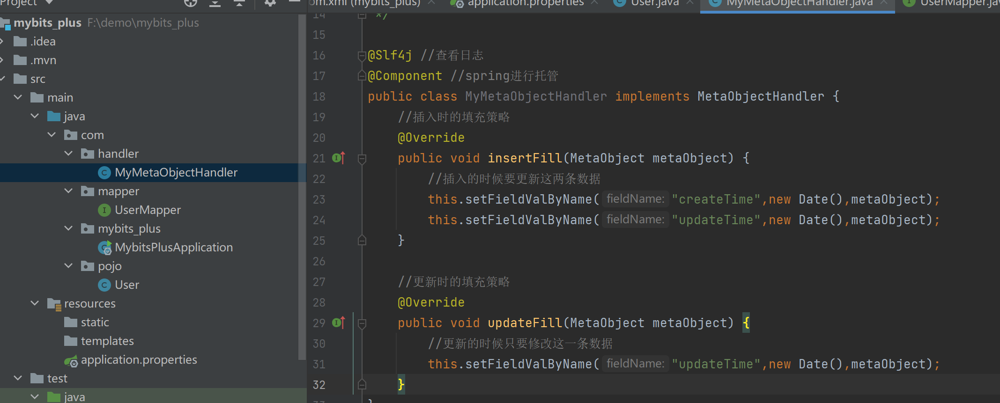
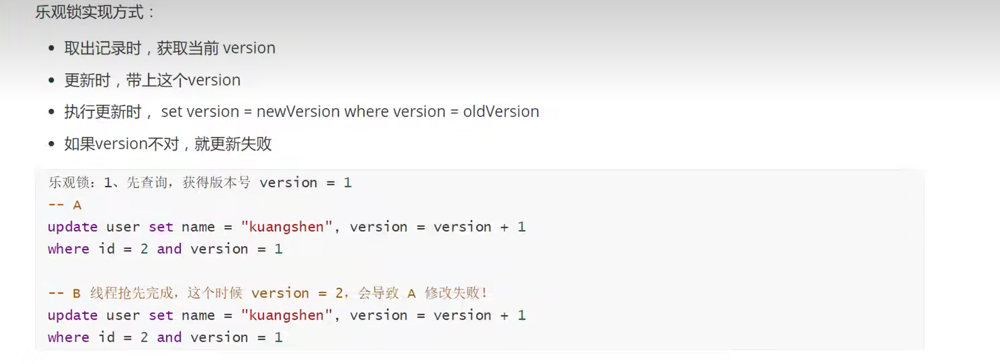
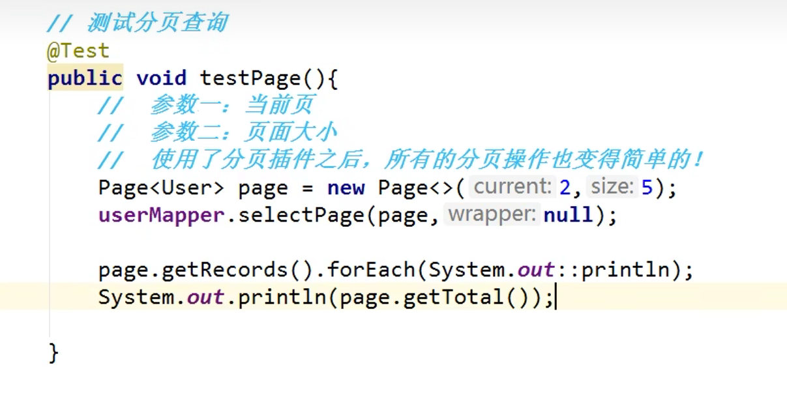
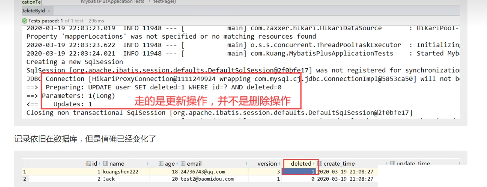

# MyBatis-Plus 学习笔记

MyBatis-Plus ( 简称 MP ) 是一款基于 MyBatis 的增强工具，他并不是由官方提供，而是由个人开发出来的一款增强框架，在 MyBatis 的基础上只做增强不做改变，为简化开发、提高效率而生，后面 mybatis-plus 会简称为 MP

> 官方自述

- **无侵入**：只做增强不做改变，引入它不会对现有工程产生影响，如丝般顺滑
- **损耗小**：启动即会自动注入基本 CURD，性能基本无损耗，直接面向对象操作
- **强大的 CRUD 操作**：内置通用 Mapper、通用 Service，仅仅通过少量配置即可实现单表大部分 CRUD 操作，更有强大的条件构造器，满足各类使用需求
- **支持 Lambda 形式调用**：通过 Lambda 表达式，方便的编写各类查询条件，无需再担心字段写错
- **支持主键自动生成**：支持多达 4 种主键策略（内含分布式唯一 ID 生成器 - Sequence），可自由配置，完美解决主键问题
- **支持 ActiveRecord 模式**：支持 ActiveRecord 形式调用，实体类只需继承 Model 类即可进行强大的 CRUD 操作
- **支持自定义全局通用操作**：支持全局通用方法注入（ Write once, use anywhere ）
- **内置代码生成器**：采用代码或者 Maven 插件可快速生成 Mapper 、 Model 、 Service 、 Controller 层代码，支持模板引擎，更有超多自定义配置等您来使用
- **内置分页插件**：基于 MyBatis 物理分页，开发者无需关心具体操作，配置好插件之后，写分页等同于普通 List 查询
- **分页插件支持多种数据库**：支持 MySQL、MariaDB、Oracle、DB2、H2、HSQL、SQLite、Postgre、SQLServer 等多种数据库
- **内置性能分析插件**：可输出 Sql 语句以及其执行时间，建议开发测试时启用该功能，能快速揪出慢查询
- **内置全局拦截插件**：提供全表 delete 、 update 操作智能分析阻断，也可自定义拦截规则，预防误操作


## 1.快速入门初体验

跟着官方文档进行一次 MP 的快速入门体验：

> 前置条件准备

**1. **创建数据库

~~~sql
-- 初始化测试
DROP TABLE IF EXISTS `USER`;
DROP TABLE IF EXISTS T_USER;

CREATE TABLE `USER`(
  ID BIGINT(20) NOT NULL COMMENT '主键ID',
  `NAME` VARCHAR(30) NULL DEFAULT NULL COMMENT '姓名',
  AGE INT(11) NULL DEFAULT NULL COMMENT '年龄',
  EMAIL VARCHAR(50) NULL DEFAULT NULL COMMENT '邮箱',
  PRIMARY KEY (id)
);

INSERT INTO `USER`(ID, `NAME`, AGE, EMAIL) VALUES
(1, '张三', 18, 'test1@qq.com'),
(2, '王富贵', 20, 'test2@qq.com'),
(3, '老八', 28, 'test3@qq.com'),
(4, '马云', 21, 'test4@qq.com'),
(5, '王健林', 24, 'test5@qq.com');

-- 测试表名称绑定
RENAME TABLE USER TO T_USER;

-- 自动填充练习
ALTER TABLE T_USER ADD CREATE_TIME DATETIME DEFAULT NOW();
ALTER TABLE T_USER ADD CHANGE_TIME DATETIME DEFAULT NOW();

-- 乐观锁练习
ALTER TABLE T_USER ADD VERSION INT DEFAULT 1;

-- 逻辑删除练习
ALTER TABLE T_USER ADD DELETED INT(1) DEFAULT 1;
~~~

**2. **快速创建一个 springboot 的程序引入相关的依赖

~~~xml
<!-- maven依赖引入 -->
<dependency>
    <groupId>mysql</groupId>
    <artifactId>mysql-connector-java</artifactId>
    <version>5.1.49</version>
    <scope>runtime</scope>
</dependency>
<dependency>
    <groupId>org.projectlombok</groupId>
    <artifactId>lombok</artifactId>
    <optional>true</optional>
</dependency>
<!-- mybatis-plus依赖 -->
<dependency>
    <groupId>com.baomidou</groupId>
    <artifactId>mybatis-plus-boot-starter</artifactId>
    <version>3.4.0</version>
</dependency>
~~~

**3. **配置数据库连接

```yml
spring:
  datasource:
    druid:  //这里可以选择更换数据源
      driver-class-name: com.mysql.jdbc.Driver
      url: jdbc:mysql://localhost:3306/reg?serverTimezone=UTC&characterEncoding=utf8
      username: "root"
      password: "root"
      这个是配置数据源的
```

~~~properties
spring.datasource.driver-class-name=com.mysql.jdbc.Driver
spring.datasource.url=jdbc:mysql:///zhe
spring.datasource.username=root
spring.datasource.password=******
# 这里配置了日志输入，方便日后观察
mybatis-plus.configuration.log-impl=org.apache.ibatis.logging.stdout.StdOutImpl
~~~

> 开始编码

在我们把数据库以及程序都布置好了之后，我们尝试做一次简单的查询：


**1. **创建实体类以及 dao 接口

~~~java
// 创建数据表对应的实体类
@Data
public class User {
    private Long id;
    private String name;
    private Integer age;
    private String email;
}
~~~

**2. **创建 dao 接口，这里需要注意 <font color="red">接口类需要继承 `BaseMapper` 抽象类并填写实体类对应泛型</font>，然后就不用管了

~~~java
// 创建dao接口
@Mapper   
@Repository    这里可以直接写一个@Mapper就可以直接扫描了
public interface UserDao extends BaseMapper<User> {
      // 要继承BaseMapper<User>   <> 这个里面填什么实体对应的就操作那张表
}
~~~

**3. **接下来我们在测试类中书写代码即可：

~~~java
@SpringBootTest
class Springboot01MybatisPlusApplicationTests {

	@Autowired
	private UserDao ud;

	@Test
	void contextLoads() {
		ud.selectList(null).forEach( item->System.out.println(item) );
	}

}
~~~

查询就这么简单的完成了！

## 2.配置日志


```yml
#配置日志
mybatis-plus.configuration.log-impl=org.apache.ibatis.logging.stdout.StdOutImpl
```


## 3.快速CRUD练习

> insert 插入

```java
// 快速插入一条数据
@SpringBootTest
class Springboot01Test {
   @Autowired
   private UserDao ud;

   @Test
   void contextLoads() {
      User user = new User();
      user.setName("1");
      user.setAge(50);
      user.setEmail("zhang_hanzhe@qq.com");
      ud.insert(user);//帮我们自动生成id
        System.out.println(user);//发现id会自动回填
   }
}
```

> update 更新

```java
// 快速更新一条数据
@SpringBootTest
class Springboot01Test {
   @Autowired
   private UserDao ud;

   @Test
   void contextLoads() {
      User user = new User();
      user.setName("1");
      user.setAge(21);
      user.setEmail("zhang_hanzhe@qq.com");
      ud.updateById(user);
   }
}
```

> delete 删除

```java
@SpringBootTest
class Springboot01Test {
   @Autowired
   private UserDao ud;

   @Test
   void contextLoads() {
      // 根据ID删除
      ud.deleteById(1);
      // 根据ID删除多个
      ud.deleteBatchIds(Arrays.asList(2, 3, 4, 5));
      // 根据条件删除
      HashMap<String, Object> map = new HashMap<>();
      map.put("name", "张涵哲");
      ud.deleteByMap(map);
   }
}
```

> select 查询

由于刚刚的测试将数据都删光了，这里建议在执行一次初始化的 SQL 重置一下数据，然后在跟着测试：

```java
@SpringBootTest
class Springboot01Test {
   @Autowired
   private UserDao ud;

   @Test
   void contextLoads() {
      // 根据ID查询
      System.out.println(ud.selectById(1L));
      // 根据指定ID查询多个
      System.out.println(ud.selectBatchIds(Arrays.asList(1, 2, 3)));
      // 查询所有
      System.out.println(ud.selectList(null));
      // 根据条件查询
      HashMap<String, Object> map = new HashMap<>();
      map.put("name", "老八");
      System.out.println(ud.selectByMap(map));
      // 查询总记录数
      System.out.println(ud.selectCount(null));
   }
}
```

## 4.主键生成策略





### 4.1自动填充







```java
@Slf4j //查看日志
@Component //spring进行托管
public class MyMetaObjectHandler implements MetaObjectHandler {
    //插入时的填充策略
    @Override
    public void insertFill(MetaObject metaObject) {
        //插入的时候要更新这两条数据
        this.setFieldValByName("createTime",new Date(),metaObject);
        this.setFieldValByName("updateTime",new Date(),metaObject);
    }

    //更新时的填充策略
    @Override
    public void updateFill(MetaObject metaObject) {
        //更新的时候只要修改这一条数据
        this.setFieldValByName("updateTime",new Date(),metaObject);
    }
}
```


```java
public enum FieldFill {
    /**
     * 默认不处理
     */
    DEFAULT,
    /**
     * 插入时填充字段
     */
    INSERT,
    /**
     * 更新时填充字段
     */
    UPDATE,
    /**
     * 插入和更新时填充字段
     */
    INSERT_UPDATE
}


```


### 4.2乐观锁





3.注册乐观锁

```java
/**
 * 注册乐观锁
 */
@Bean
public MybatisPlusInterceptor mybatisPlusInterceptor() {
    MybatisPlusInterceptor interceptor = new MybatisPlusInterceptor();
    interceptor.addInnerInterceptor(new OptimisticLockerInnerInterceptor());
    return interceptor;
}
```


### 4.3分页查询




```java
/**
 MP分页查询工具类
 */
@Configuration
public class MybatisPlusConfig {

    @Bean
    public MybatisPlusInterceptor mybatisPlusInterceptor(){
        MybatisPlusInterceptor mybatisPlusInterceptor = new MybatisPlusInterceptor();
        mybatisPlusInterceptor.addInnerInterceptor(new PaginationInnerInterceptor());
        return mybatisPlusInterceptor;
    }
}
```


### 4.4逻辑删除


在aplication.yml中进行配置

```yaml
mybatis-plus:
  global-config:
    db-config:
      logic-delete-field: flag # 全局逻辑删除的实体字段名(since 3.3.0,配置后可以忽略不配置步骤2)
      logic-delete-value: 1 # 逻辑已删除值(默认为 1)
      logic-not-delete-value: 0 # 逻辑未删除值(默认为 0)
```



**查询的时候会自动过滤掉被逻辑删除的字段**

### 4.5性能分析插件


## 5常用注解学习

### 5.1TableName注解

刚刚我们快速过了一遍 CRUD，表名和实体类是对应的，如果我们稍作修改的话再来尝试一下：

- 表名：`T_USER`，实体类名：`UserEntity`

~~~
org.springframework.jdbc.BadSqlGrammarException: 
### Error querying database.  Cause: com.mysql.jdbc.exceptions.jdbc4.MySQ                                                                LSyntaxErrorException: Table 'zhe.user_entity' doesn't exist
### The error may exist in site/hanzhe/dao/UserDao.java (best guess)
### The error may involve defaultParameterMap
### The error occurred while setting parameters
### SQL: SELECT  id,name,age,email  FROM user_entity
......
~~~

这里就可以发现程序报错了，因为他的 SQL 是自动生成的，自动生成的表明默认按照实体类的驼峰转下划线完成的，那么这里就需要使用 `@TableName` 来重新配置一下了

~~~java
@Data
@TableName("T_USER") // 默认属性就是表名称
public class UserEntity { ... }
~~~

查询成功！该注解主要用于实体类和表名称的绑定，除此之外还有其他功能但并不常用，如有需要去查官方文档

### 5.2TableId 主键注解

仔细看之前的插入语句会发现有一个细节：==我们并没有为这个对象设置 ID，但是数据库中却存进去了 ID==，这是因为 MP 会对表中的主键自动生成一个 ID，关于主键自动填充我们需要了解一下 `@TableId` 主键注解

`@TableId` 默认 `value` 对应的是主键字段名称，第二个`type` 是枚举类型，用来修改自动生成类型：

- `IdType.AUTO`：对应数据库中的自增
- `IdType.NONE`：不对主键进行任何处理
- `IdType.INTUT`：我们在执行插入之前手动设置值
- `IdType.ASSIGN_ID`：使用**雪花算法**计算 ID
- `IdType.ASSIGN_UUID`：分配 UUID

> 修改自动生成类型

==使用 AUTO 类型必须将数据库中的自增开启==，剩下的类型如法炮制，就不写了

~~~java
@Data
@TableName("T_USER")
public class UserEntity{
    // 这里修改了变量名为 aaa，但是通过value绑定了数据中的字段名，所以不会报错
    @TableId(value = "ID", type = IdType.AUTO)
    private Long aaa;
    private String name;
    private Integer age;
    private String email;
}
~~~


### 5.3TableField 非主键注解

既然由主键注解，当然也就有非主键注解 `@TableField`，一般用来绑定库内的字段名，还可以进行一些高级操作

> 自动填充

在我们创建表的时候，有的表会涉及到时间列，包含创建时间以及修改时间，这两个我们可以通过 SQL 写死，也可以在 java 中创建一个 Date 实例丢给他，学习了 MP 之后我们就可以使用自动填充了 ( 自己创建好两个列 )：

**1. **`TableField` 注解中的 `fill` 表示自动填充，使用自动填充一定要知道什么情况下被填充，填充的内容是什么

~~~java
// 实体类配置
@Data
@TableName("T_USER")
public class UserEntity{
	......
    // FieldFill.INSERT: 只有在插入的时候填充
    @TableField(fill = FieldFill.INSERT)
    private Date createTime;
    // FieldFill.INSERT_UPDATE: 插入和修改的时候都填充
    @TableField(fill = FieldFill.INSERT_UPDATE)
    private Date changeTime;
}
~~~

**2. **实体类配置好自动填充时机时候，我们还要配置一下自动填充的内容：

~~~java
// 在配置类中配置自动填充内容
@Configuration
public class FillConfig implements MetaObjectHandler {
    // 书写规则：第一个写死，第二个为填充的目标变量名，第三个为填充类型，第四个是对应的值
    
    @Override   // 插入级别配置
    public void insertFill(MetaObject metaObject) {
        // INSERT
        this.strictInsertFill(metaObject, "createTime", Date.class, new Date());
        // INSERT_UPDATE
        this.strictUpdateFill(metaObject, "changeTime", Date.class, new Date());
    }
    @Override  // 更新级别配置
    public void updateFill(MetaObject metaObject) {
        // UPDATE
        this.strictUpdateFill(metaObject, "changeTime", Date.class, new Date());
    }
}
~~~

> 非表中字段

实体类中并不是每个属性都是表中的字段，例如表中的性别字段，1代表男，0代表女，区分起来就很麻烦，为了解决这个问题我们需要在类中定义两个常量，再告诉 MP 这不是表中的字段，就解决了这个问题

```java
@Data
@TableName("T_USER")
public class UserEntity{
    @TableId(value = "ID", type = IdType.AUTO)
    private Long aaa;
    private String name;
    private Integer age;
    private Integer gender;
    private String email;
    
    @TableField(exist = false)
    public static final int MALE = 1;   // 男
    @TableField(exist = false)
    public static final int FEMALE = 0; // 女
}
```


### 5.4Version 乐观锁

所谓乐观锁就是在数据库中添加一个列作为标识列，一般为 version，在进行 upd ate 之前先进行 select 查询，如果查询的 version 和更新时的 version 是一致的就证明没人操作过这行记录，那么就进行修改，并且修改 version 列，如果查询时和修改时的列不一致就证明有人进行了修改，为了防止脏读就会取消更新。

> 测试乐观锁

在使用乐观锁之前我们需要添加乐观锁插件：

~~~java
@Bean
public OptimisticLockerInterceptor optimisticLockerInterceptor() {
    return new OptimisticLockerInterceptor();
}
~~~

乐观锁对应注解为 `@Version`，没有任何参数，如果变量名与字段名对应不上可以使用 `@TableFiels` 注解进行绑定，记得在测试之前要在数据库中添加标识字段 ( 建议使用 version )：

~~~java
// 实体类代码
@Data
@TableName("T_USER")
public class UserEntity{
    ......
    @Version   // 添加@Version注解
    private Integer version;
}
~~~

只需要这两步，这样一来乐观锁就配置完成了，现在我们来开始测试 ( version 默认是 1 )：

~~~java
@SpringBootTest
class Springboot01Test {
	@Autowired
	private UserDao ud;

	@Test
	void contextLoads() {
        // 按照乐观锁的逻辑，修改前先获取到version，然后在修改的时候在传过去，如果值一样就可以修改
		Integer version = ud.selectById(2L).getVersion();
		UserEntity user = new UserEntity();
		user.setAaa(2L);
		user.setEmail("fu_gui@qq.com");
		user.setVersion(version);
		ud.updateById(user);
	}
}
~~~

测试运行成功！version 字段被修改成了 2，再次测试一样成功！version 变成 3，按照之前分析的逻辑每次更新时 version 都会发生变化，现在我们来模拟一次更新失败的情况：

~~~java
@SpringBootTest
class Springboot01Test {

	@Autowired
	private UserDao ud;

	@Test
	void contextLoads() {
		// 在修改前获取到version
		Integer v1 = ud.selectById(2L).getVersion();
		UserEntity user1 = new UserEntity();
		user1.setAaa(2L);
		user1.setEmail("update1@qq.com");  // 注意这里是update1
		user1.setVersion(v1);
		// 在执行修改之前另一个人进行了操作并且完成了修改
		Integer v2 = ud.selectById(2L).getVersion();
		UserEntity user2 = new UserEntity();
		user2.setAaa(2L);
		user2.setEmail("update2@qq.com");  // 注意这里是update2
		user2.setVersion(v2);
		System.out.println(ud.updateById(user2));  // 这里执行了2
		// 然后第一个开始进行修改
		System.out.println(ud.updateById(user1));  // 1是最后执行的
	}

}
~~~

输出结果 1 和 0，代表第一次执行成功了，第二次执行失败了，查看数据库，邮箱也是留在了 update2，成功！


### 5.5TableLogic 逻辑删除

当我们在页面中删除某个数据的时候，往往不是真的删除，而是通过修改某个字段让用户不在读取，因为在某些业务中被删除的数据也有存在的价值

在 MP 中使用逻辑删除也非常的简单，当然我们需要在添加一个列作为逻辑删除列 ( 这里推荐使用 deleted )，且所有表中的逻辑删除字段都要使用这个名字，然后来约定一个值，我这里就是 0 代表已删除，1 代表正常

~~~java
// 实体类进行修改，由于之前测试将属性名乱七八糟，这里就顺便都改回来了
@Data
@TableName("T_USER")
public class UserEntity {
    @TableId(value = "ID", type = IdType.AUTO)
    private Long id;
    private String name;
    private Integer age;
    private String email;
    @TableField(fill = FieldFill.INSERT)
    private Date createTime;
    @TableField(fill = FieldFill.INSERT_UPDATE)
    private Date changeTime;
    // 这里通过@TableLogic设置了逻辑删除
    @TableLogic
    private Integer deleted;
}
~~~

实体类修改完成之后，我们还需要添加一个配置：

~~~properties
# 逻辑删除字段名为deleted
mybatis-plus.global-config.db-config.logic-delete-field=deleted
# 被删除的变量值
mybatis-plus.global-config.db-config.logic-delete-value=0
# 正常显示的变量值
mybatis-plus.global-config.db-config.logic-not-delete-value=1
~~~

接下来我们来测试

~~~java
@SpringBootTest
class Springboot01Test {
	@Autowired
	private UserDao ud;

	@Test
	void contextLoads() {
		ud.deleteById(1L);
		ud.selectList(null).forEach(System.out::println);
	}
}
~~~

测试后我们通过日志发现，原来的 delete 语句变成了现在的 update 语句，而且在执行 selectList 的时候查询不到删除后的数据，MP 已经帮我们全都配置好了


### 5.6常用注解小总结

| 注解        | 作用                                                         |
| ----------- | ------------------------------------------------------------ |
| @TableName  | 用来绑定实体类和数据表名称                                   |
| @TableId    | 用来设置主键列，可以绑定名称以及修改自动生成类型，例如雪花算法，自增等 |
| @TableField | 用来设置非主键列，可以设置绑定名称以及自动填充等等           |
| @Version    | 用来设置乐观锁，需要配合 `OptimisticLockerInterceptor` 类使用 |
| @TableLogic | 配置逻辑删除，需要在配置文件中添加逻辑删除列，删除和未删除对应的值 |


## 6.高级查询学习

### 6.1Page 分页查询

我们在使用 mybatis 的时候使用的分页插件是第三方的 `PageHelper` 分页插件，而在 MP 中为我们内置了一个分页插件，我们只需要将它配置进来就可以使用了

测试分页查询首先要有足够的数据，这里我们通过 for 循环插入30条测试数据：

~~~java
@SpringBootTest
class Springboot09ApplicationTests {
    @Autowired
    private UserDao ud;

    @Test
    void contextLoads() {
        for (int i = 0; i < 30; i++) {
            UserEntity user = new UserEntity();
            user.setName("伞兵" + i + "号");
            user.setAge(20+i);
            user.setEmail("sanbing" + (i+1) + "hao@163.com");
            ud.insert(user);
        }
    }
}
~~~

**1. **测试数据插入完毕后，我们开始练习分页查询，首先要引入 MP 的分页插件：

~~~java
@Bean   // 这些类似的配置官方文档都有，直接照搬即可
public PaginationInterceptor paginationInterceptor() {
    PaginationInterceptor paginationInterceptor = new PaginationInterceptor();
    paginationInterceptor.setCountSqlParser(new JsqlParserCountOptimize(true));
    return paginationInterceptor;
}
~~~

**2. **配置已经完成了，接下来我们来查询测试一下：

~~~java
@SpringBootTest
class Springboot09ApplicationTests {
    @Autowired
    private UserDao ud;

    @Test
    void contextLoads() {
        // 需要创建分页实例，参数为： 查询第2页，每页显示5条记录
        Page<UserEntity> page = new Page<>(2, 5);
        // 查询时使用selectPage进行查询，结果会返回给page实例
        ud.selectPage(page, null);
        // 然后在通过page实例获取相关分页信息
        System.out.println("======================== Page ========================");
        System.out.println("当前第" + page.getCurrent() + "页");
        System.out.println("总页码为" + page.getPages() + "页");
        System.out.println("结果集为：" + page.getRecords());
        System.out.println("查询到" + page.getSize() + "条记录");
        System.out.println("总记录数" + page.getTotal() + "条");
        System.out.println("是否有上一页：" + page.hasPrevious());
        System.out.println("是否有下一页：" + page.hasNext());
    }
}
~~~

这样一来分页就测试完成了！


### 6.2Wrapper 条件构造器

wrapper 条件构造器，它可以帮助我们完成 SQL 中的绝大多数操作，例如大于等于，小于，区间以及模糊查询，对应的条件构造器为 `QueryWrapper`，修改操作同样也有对应的条件构造器 `UpdateWrapper`

接下来我们练习一下：

>查询年龄在25-35之间的用户

~~~java
@Test
void contextLoads() {
    QueryWrapper<UserEntity> wrapper = new QueryWrapper<>();
    // 查询年龄在25-35之间的用户
    wrapper.between("AGE", 25, 35);
    ud.selectList(wrapper).forEach(System.out::println);
}
~~~

>查询名称中包含 '伞兵' 的用户

~~~java
@Test
void contextLoads() {
    QueryWrapper<UserEntity> wrapper = new QueryWrapper<>();
    wrapper.like("NAME", "伞兵");
    ud.selectList(wrapper).forEach(System.out::println);
}
~~~

>查询所有邮箱为 null 的用户

~~~java
@Test
void contextLoads() {
    QueryWrapper<UserEntity> wrapper = new QueryWrapper<>();
    wrapper.isNull("EMAIL");
    ud.selectList(wrapper).forEach(System.out::println);
}
~~~

>查询名称中不包含 '伞兵' 且年龄大于 20 邮箱不为空的所有用户

~~~java
@Test
void contextLoads() {
QueryWrapper<UserEntity> wrapper = new QueryWrapper<>();
    wrapper    // 这里使用链式编程
        .notLike("NAME", "伞兵")
        .gt("AGE", 20)
        .isNotNull("EMAIL");
    ud.selectList(wrapper).forEach(System.out::println);
}
~~~


## 7.映射mapper.xml

开始的时候也说了，MP 是基于 mybatis 框架进行的增强，也就是说除了之前那些功能之外我们还是可以把它当成 mybatis 使用的，可以配置 mapper.xml 映射文件，接下来我们就来配置 xml 开发：

~~~yml
# 把MP看做成Mybatis即可，所有的配置项都是相同的，只是换了个名字
mybatis-plus:
  configuration:
    log-impl: org.apache.ibatis.logging.stdout.StdOutImpl
  global-config:
    db-config:
      logic-delete-field: deleted
      logic-not-delete-value: 1
      logic-delete-value: 0
  # 在这里配置mapper映射文件的位置
  mapper-locations: classpath:mappers/*Mapper.xml
~~~

然后在目标位置创建 mapper 文件绑定接口进行调用即可，和 mybatis 是一样的流程


