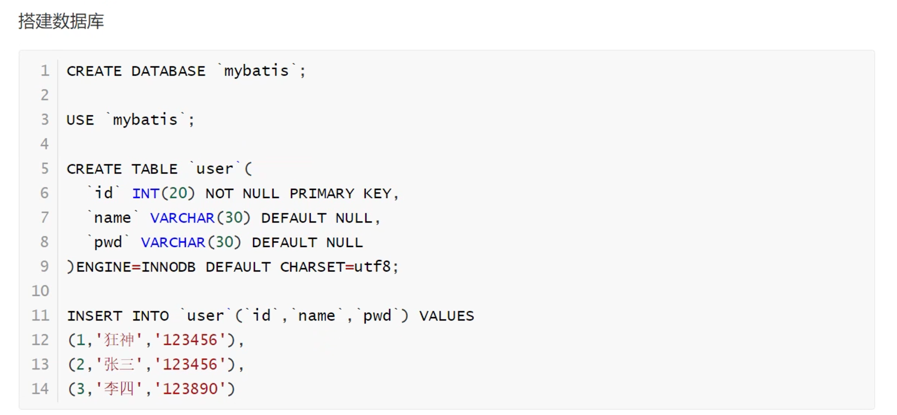
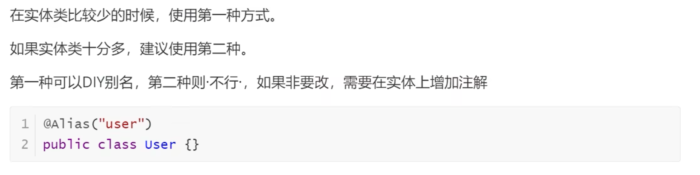
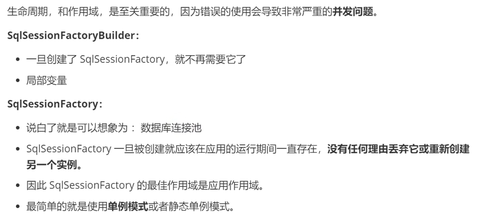
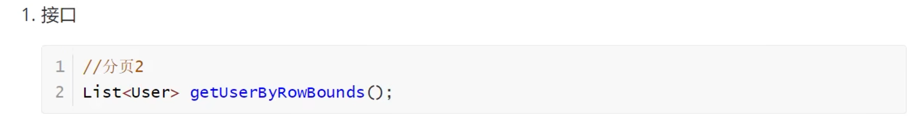
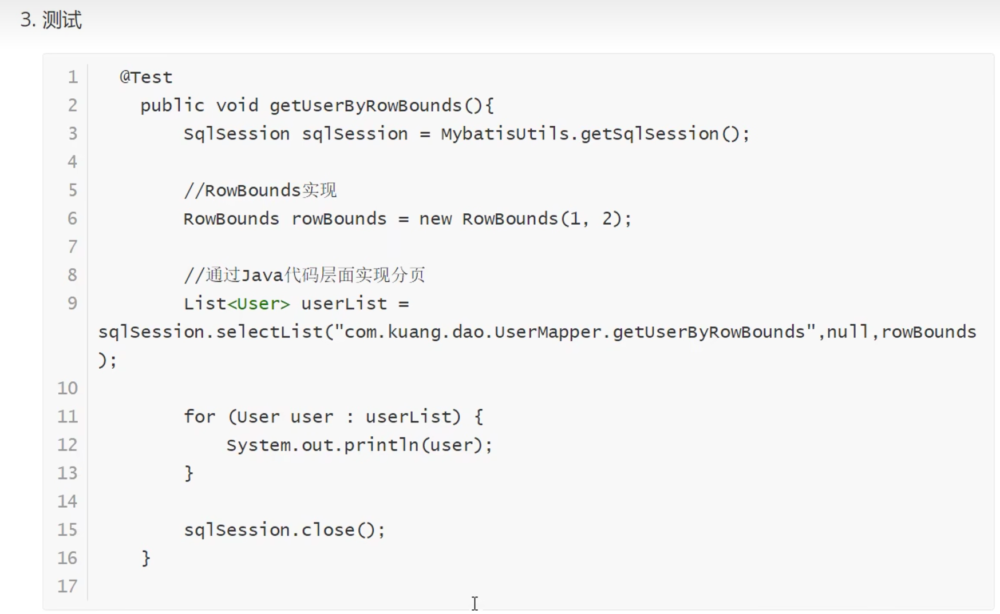

# 1. 简介

## 1.1 什么是mybatis

[Mybatis文档网站：](https://mybatis.net.cn/)

- MyBatis 是一款优秀的**持久层框架**，
- 它支持自定义 SQL、存储过程以及高级映射。
- MyBatis 免除了几乎所有的 JDBC 代码以及设置参数和获取结果集的工作。
- MyBatis 可以通过简单的 XML 或注解来配置和映射原始类型、接口和 Java POJO（Plain Old Java Objects，普通老式 Java 对象）为数据库中的记录。

如何获取mybatis


maveb仓库：

```xml
 <dependency>
          <groupId>org.mybatis</groupId>
          <artifactId>mybatis</artifactId>
          <version>3.5.9</version>
      </dependency>
```

## 1.2 持久化


## 1.3持久层


## 1.4为什么需要mybatis


# 2.第一个mybatis程序


## 2.1 搭建环境




```xml
  <dependencies>
<!-- mybatis依赖-->
      <dependency>
          <groupId>org.mybatis</groupId>
          <artifactId>mybatis</artifactId>
          <version>3.5.9</version>
      </dependency>
<!-- 数据库依赖-->
      <dependency>
          <groupId>mysql</groupId>
          <artifactId>mysql-connector-java</artifactId>
          <version>8.0.17</version>
      </dependency>
<!--  junit依赖-->
      <dependency>
          <groupId>junit</groupId>
          <artifactId>junit</artifactId>
          <version>4.13.1</version>
          <scope>test</scope>
      </dependency>
  </dependencies>
```

## 2.1 创建一个模块

- 编写mybatis的核心配置文件

  ```xml
  <!--configguration核心配置文件-->
  <configuration>
      <environments default="development">
          <environment id="development">
              <transactionManager type="JDBC"/>
              <dataSource type="POOLED">
                  <property name="driver" value="com.mysql.jdbc.Driver"/>
                  <property name="url" value="jdbc:mysql://localhost:3306/mybatis?useSSl=true&amp;characterEncoding=UTF-8&amp;useUnicode=true"/>
                  <property name="username" value="root"/>
                  <property name="password" value="root"/>
              </dataSource>
          </environment>
      </environments>
  ```

- 编写mybatis工具类

  ```java
  /**
  Mybatis工具类
   */
  public class MybatisUtils {
      static SqlSessionFactory sqlSessionFactory = null;
      static {
          //使用mybatis第一步：获取sqlSessionFactory对象
          String resource = "mybatis-config.xml";
          InputStream inputStream = null;
          try {
              inputStream = Resources.getResourceAsStream(resource);
          } catch (IOException e) {
              e.printStackTrace();
          }
           sqlSessionFactory = new SqlSessionFactoryBuilder().build(inputStream);
      }
      //既然有了sqlSessionFactory，我们就可以从中获得SqlSession的实列了。
      // SqlSession 完全包含了面向数据库执行SQL命令所需要的所有方法
      public static SqlSession getSqlSession() {
          return sqlSessionFactory.openSession();
      }
  }
  ```

  ## 2.3编写代码

  - 实体类

    ```java
    /**
    user实体类
     */
    public class User {
        private int id;
        private String name;
        private String pwd;
        public User() {
        }
        public User(int id, String name, String pwd) {
            this.id = id;
            this.name = name;
            this.pwd = pwd;
        }
        public int getId() {
            return id;
        }
        public void setId(int id) {
            this.id = id;
        }
        public String getName() {
            return name;
        }
        public void setName(String name) {
            this.name = name;
        }
        public String getPwd() {
            return pwd;
        }
        public void setPwd(String pwd) {
            this.pwd = pwd;
        }
    }
    ```

    

  - Dao接口

    ```java
    package com.dao;
    import com.Pojo.User;
    import java.util.List;
    /**
    实现接口
     */
    public interface UserDap {
        List<User> getUserList();
    }
    ```

    

  - 接口实现类 由原来的UserDaoImpl转变成一个Mapper配置文件

    ```java
    <?xml version="1.0" encoding="UTF-8" ?>
    <!DOCTYPE mapper
            PUBLIC "-//mybatis.org//DTD Mapper 3.0//EN"
            "http://mybatis.org/dtd/mybatis-3-mapper.dtd">
    <!--namespace 绑定一个对应的Dao/Mapper接口-->
    <mapper namespace="com.dao.UserDap">
    <!-- id:对应的接口的方法名称  resultType：对应的返回的参数类型-->
        <select id="getUserList" resultType="com.Pojo.User">
            select * from user ;
        </select>
    </mapper>
    ```

    ## 2,2 测试

    注意点**:org.apache.ibatis.binding.BindingException: Type interface com.dao.UserDap is not known to the MapperRegistry.**

```xml
<!--<?xml version="1.0" encoding="UTF-8" ?>-->
<!--<!DOCTYPE configuration-->
<!--        PUBLIC "-//mybatis.org//DTD Config 3.0//EN"-->
<!--        "http://mybatis.org/dtd/mybatis-3-config.dtd">-->

<!--&lt;!&ndash;configguration核心配置文件&ndash;&gt;-->
<!--<configuration>-->
<!--    <environments default="development">-->
<!--        <environment id="development">-->
<!--            <transactionManager type="JDBC"/>-->
<!--            <dataSource type="POOLED">-->
<!--                <property name="driver" value="com.mysql.jdbc.Driver"/>-->
<!--                <property name="url" value="jdbc:mysql://localhost:3306/mybatis?useSSl=true&amp;characterEncoding=UTF-8&amp;serverTimezone=UTC;&amp;useUnicode=true"/>-->
<!--                <property name="username" value="root"/>-->
<!--                <property name="password" value="root"/>-->
<!--            </dataSource>-->
<!--        </environment>-->
<!--    </environments>-->
<!--    &lt;!&ndash; 每一个Mapper.xml都需要在Mybatis核心配置文件中注册&ndash;&gt;-->
<!--    <mappers>-->
<!--        <mapper resource="com/dao/UserDao.xml"/>-->
<!--    </mappers>-->
<!--</configuration>-->
```

```xml
<!--    在build中配置resources ， 来防止我们资源导出失败的问题-->
<build>
    <resources>
        <resource>
            <directory>src/main/resources</directory>
            <includes>
                <include>**/*.properties</include>
                <include>**/*.xml</include>
            </includes>
        </resource>
        <resource>
            <directory>src/main/java</directory>
            <includes>
                <include>**/*.properties</include>
                <include>**/*.xml</include>
            </includes>
        </resource>
    </resources>
</build>
```


# 3.CRUD(增删改查)

## 1.namespace

namespace中的包名要和Dao/mapper接口的包名一致！

## 2.select

选择，查询语句：

- id：就是对应的namespace中的方法名
- resultType：sql语句执行的返回值！
- parameterType:参数类型！

```java
 /**
     * 增删改需要提交事务
     */
    @Test
    public void insert(){
        SqlSession sqlSession = MybatisUtils.getSqlSession();
        UserMapper mapper = sqlSession.getMapper(UserMapper.class);
        User user = new User();
        user.setId(4);
        user.setName("张三");
        user.setPwd("111111");
        int i = mapper.addUser(user);
        if (i > 0){
            System.out.println("添加成功");
        }else {
            System.out.println("添加失败");
        }
         sqlSession.commit();//需要提交事务才可以
        sqlSession.close();
    }
```

## 3.错误分析


## 4.万能Map


```java
    //万能的map
    int addUser1(Map<String,Object> map);
```

```java
    <insert id="addUser1" parameterType="map">
        insert into user(id,name,pwd)
        values(#{i1d},#{na1me},#{p1wd})
    </insert>
```

```java
 @Test
    public void map(){
        SqlSession sqlSession = MybatisUtils.getSqlSession();
        UserMapper mapper = sqlSession.getMapper(UserMapper.class);
        Map<String, Object> map = new HashMap<>();
        map.put("i1d",11);
        map.put("na1me","12222");
        map.put("p1wd","1111111");
        int i = mapper.addUser1(map);
        if (i > 0 ){
            System.out.println("添加成功");
        }

        sqlSession.commit();
        sqlSession.close();
    }
```


## 5.思考题


# 4.配置解析

## 1. 核心配置文件


```xml
properties（属性）
settings（设置）
typeAliases（类型别名）
typeHandlers（类型处理器）
objectFactory（对象工厂）
plugins（插件）
environments（环境配置）
environment（环境变量）
transactionManager（事务管理器）
dataSource（数据源）
databaseIdProvider（数据库厂商标识）
mappers（映射器）
```

## 2.环境配置（environments）


## 3.属性（properties）


```properties
driver = com.mysql.jdbc.Driver
url = "jdbc:mysql://localhost:3306/mybatis?useSSl=true&characterEncoding=UTF-8&serverTimezone=UTC&useUnicode=true"
username = root
password = root
```


## 4.类型别名（typeAliases）


```java
    <!--起别名  给实体类取别名-->
    <typeAliases>
        <typeAlias type="com.Pojo.User" alias="User"/>
    </typeAliases>
```


```java
    <!--起别名  给实体类取别名-->
    <typeAliases>
        <package name="com.Pojo"/> 
    </typeAliases>
```



## 5.设置（settings）


## 6.映射器（mappers）


- 方式一

   ~~~xml
   ```xml
       <!-- 每一个Mapper.xml都需要在Mybatis核心配置文件中注册-->
       <mappers>
      <mapper resource="com/mapper/UserMapper.xml"/>
       </mappers>
   ```
   ~~~

-  方式二：使用class文件绑定注册

  ```xml
      <mappers>
     <mapper class="com/mapper/UserMapper"/>
      </mappers>
  ```


- 方式三：使用扫描包进行注入绑定

 ```xml
    <mappers>
   <package name="com.mapper"/>//包扫描的方式
     </mappers>
 ```


## 7.生命周期和作用域





# 5.解决属性名和字段名不一致的问题

## 1.问题


## 2.resultMap


# 6.日志

## 1.日志工厂


```xml
logImpl
```

```xml
<!--设置日志-->
<settings>
    <setting name="logImpl" value="STDOUT_LOGGING"/>
</settings>
```

## 2.Log4j


```xml
  <dependency>
            <groupId>log4j</groupId>
            <artifactId>log4j</artifactId>
            <version>1.2.17</version>
        </dependency>
```

**这个之后在看**


# 7.分页

**思考：为什么需要分页？**

- 减少数据的处理量


## 1.**使用Limit分页**

```sql
语法： select * from user limit startIndex,pageSize
select * from user limit 3; #[0,n]
```


使用Mybatis实现分页，核心SQL

1.接口

```java
   //分页
    List<User2> getUserLimit(Map<String,Integer> map);
```

2.Mapper.xml

```xml
  <!--分页查询-->
    <select id="getUserLimit" resultType="user2" parameterType="map">
         select * from user limit #{startIndex},#{pageSize}
    </select>
```

3.测试

```java
    @Test
    public void t1(){
        SqlSession sqlSession = MybatisUtils.getSqlSession();
        UserMapper mapper = sqlSession.getMapper(UserMapper.class);
        Map<String, Integer> map= new HashMap<>();
        map.put("startIndex",0);
        map.put("pageSize",2);
        List<User2> userLimit = mapper.getUserLimit(map);
        System.out.println(userLimit);
        sqlSession.close();
    }
```


## 2.RowBounds分页








# 8.使用注解

 1.注解在接口上实现

```java
   //获取所有用户
    @Select("select * from user ")
    List<User3> getUser();
```

2.需要在核心配置文件中绑定接口！

```xml
 <!-- 每一个Mapper.xml都需要在Mybatis核心配置文件中注册-->
    <mappers> <!--绑定接口-->
   <mapper class="com.mapper.UserMapper"/>
    </mappers>
```


**之后看**


# 9.Lombok


# 10.多对一处理


实体类：

```java
public class Student {
    private int id;
    private String name;
    private Teacher teacher;
}
```

## 1. 按照查询嵌套处理

```xml
    <!--
    思路：
        1.查询所有的学生信息
        2.根据查询出来的学生的tid，寻找对应的老师
    -->
    <!--//查询所有老师的信息，以及对应老师的信息-->
 <select id="getStudent" resultMap="studentTeacher">
     select * from student
 </select>
    <resultMap id="studentTeacher" type="student">
        <result column="id" property="id"></result>
        <result column="name" property="name"></result>
        <!--复杂的属性我们要单独处理
        对象：association
        集合：collection
        -->
        <association property="teacher" column="tid" javaType="Teacher" select="getTeacher"/>
    </resultMap>
 <select id="getTeacher" resultType="Teacher">
     select * from teacher where id = #{id}
 </select>
```

## 2. 按照结果嵌套处理

```xml
  <resultMap id="studentTeacher" type="Student">
     <result property="id" column="sid"/>
        <result property="name" column="sname"/>
        <association property="teacher" javaType="teacher">
            <result property="name" column="tname"/>
        </association>
    </resultMap>

    <select id="getStudent2" resultMap="studentTeacher">
        select s.id sid,s.name sname,t.name tname
        from student s,teacher t
        where s.tid = t.id;
    </select>
```


# 11.一对多


实体类：

```java
/**
学生实体类
 */
public class Student {
    private int id;
    private String name;
    //学生需要关联一个老师
    private int tid;
```

## 1.按结果嵌套查询


## 2.按照查询嵌套处理


# 12.动态SQL


## 1.IF

```java
public class Blog {
    private String id;
    private String title;
    private String author;
    private Date createTime;
    private int views;
}
```

```xml
 <select id="getBlogif" resultType="Blog" parameterType="map">
        select * from blog
       where 1 = 1
    <if test="title!=null">
        and title = #{title}
    </if>
   <if test="author != null">
       and author = #{author}
   </if>
    </select>
```

| mapUnderscoreToCamelCase        | 是否开启驼峰命名自动映射，即从经典数据库列名 A_COLUMN 映射到经典 Java 属性名 aColumn。 | true \| false | False |
| ------------------------------- | ------------------------------------------------------------ | ------------- | ----- |
| 这个是到mybatis核心配置文件里面 |                                                              |               |       |

```xml
<settings>
    <setting name="mapUnderscoreToCamelCase" value="true "/>
</settings>
```

```java
 @Test
   public void t2(){
      SqlSession sqlSession = MybatisUtils.getSqlSession();
      BlogMapper mapper = sqlSession.getMapper(BlogMapper.class);
      Map<String, String> map = new HashMap<String, String>();
      map.put("title","Mybatis如此简单");
//      map.put("author","");
      List<Blog> blogif = mapper.getBlogif(map);
      for (Blog b: blogif) {
         System.out.println(b);
      }
      sqlSession.close();
   }
```

```java
//工具类
public class IDutils {

    public static String getId(){
        return UUID.randomUUID().toString().replaceAll("-","");
    }
    @Test
    public void w(){
        String id = IDutils.getId();
        System.out.println(id);
    }
}
```

## 2,choose(when、otherwise)

```xml
   <select id="queryChoose" resultType="com.Pojo.Blog">
        select * from blog
     <where>
         <choose>
             <when test="title!=null">
                 and title = #{title}
             </when>
             <when test="author != null">
                 and author = #{author}
             </when>
<otherwise>
    /*如果前面的不满足就执行这个，跟java中的switch一样*/
</otherwise>
         </choose>
     </where>
    </select>
```


## 3.trim(where、set)


**set：是用在update 中的，可以帮你去掉逗号。**

## 4.sql片段


减少代码的复用

##  5.foreach(用到了在学)

# 13.缓存

## 1.简介


## 2.mybatis缓存

