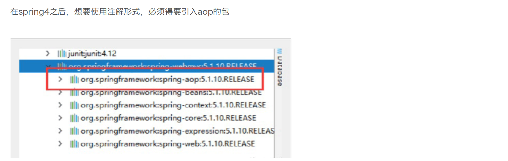
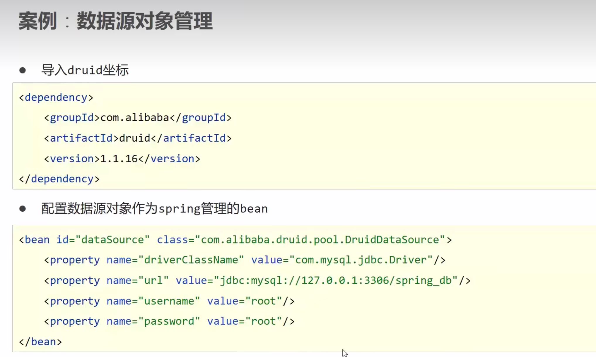
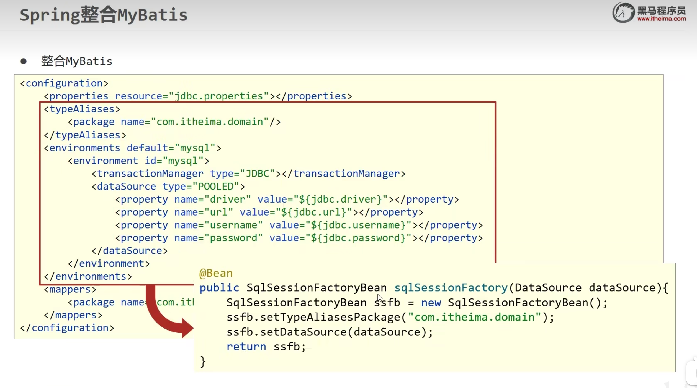

# Spring

## 1.简介


```xml
   <dependency>
        <groupId>org.springframework</groupId>
        <artifactId>spring-webmvc</artifactId>
        <version>5.3.15</version>
    </dependency>
   <dependency>
            <groupId>org.springframework</groupId>
            <artifactId>spring-jdbc</artifactId>
            <version>5.3.15</version>
        </dependency>
```
## 2.优点


## 3. 组成


# 2.IOC理论推导

**1.UserDao接口**


**2.UserDaoImpl**


**3.UserService业务接口**


**4.UserServiceImpl业务实现类**


## 1.IOC本质


## 2.HelloSpring

```xml
bean.xml

<?xml version="1.0" encoding="UTF-8"?>
<!--suppress SpringFacetInspection -->
<beans xmlns="http://www.springframework.org/schema/beans"
       xmlns:xsi="http://www.w3.org/2001/XMLSchema-instance"
       xsi:schemaLocation="http://www.springframework.org/schema/beans http://www.springframework.org/schema/beans/spring-beans.xsd">

    <!--使用Spring来创建对象，在Spring这些都称为Bean
    类型 变量名 = new 类型();
    Hello hello = new Hello();
    id = 变量名
    class = new 的对象
    property 相当于给对象中的属性设置一个值
    ref 引⽤spring 中创建好的对象
    value 基本数据类型
    -->
   <bean id="Hello" class="com.Pojo.Hello">
       <property name="name" value="Spring"></property>
   </bean>
</beans>
```

```java
public class my {
    public static void main(String[] args) {
        //获取Spring的上下文对象
        ClassPathXmlApplicationContext context = new ClassPathXmlApplicationContext("bean.xml");
        //我们的对象现在都是在Spring中管理啦，我们要使用，直接去里面取出来就可以啦
        Hello hello = (Hello) context.getBean("Hello");
        hello.show();
    }
}
```

## 3.思考

Hello 对象是谁创建的 ?  hello 对象是由Spring创建的

Hello 对象的属性是怎么设置的 ? hello 对象的属性是由Spring容器设置的

这个过程就叫控制反转 :

控制 : 谁来控制对象的创建 , 传统应⽤程序的对象是由程序本⾝控制创建的 , 使⽤Spring后 , 对象是由Spring来创建的

反转 : 程序本⾝不创建对象 , ⽽变成被动的接收对象 .

依赖注⼊ : 就是利⽤set⽅法来进⾏注⼊的.

IOC是⼀种编程思想，由主动的编程变成被动的接收

可以通过newClassPathXmlApplicationContext去浏览⼀下底层源码 .

修改spring-01-ioc

新增⼀个Spring配置⽂件beans.xml

```xml
<?xml version="1.0" encoding="UTF-8"?>
<beans xmlns="http://www.springframework.org/schema/beans"
xsi="http://www.w3.org/2001/XMLSchema-instance" schemaLocation="http://www.springframework.org/schema/beans
 https://www.springframework.org/schema/beans/spring-beans.xsd">
<!-- 使⽤Spring 来创建对象，在spring 中这些都被称为Bean
类型 变量名 = new 类型();
 Hello hello = new Hello();
 id = 变量名
 class = new 的对象
property 相当于给对象的数性设置⼀个值
ref 引⽤spring 中创建好的对象
value 基本数据类型
--><bean id="UserDaoImpl" class="com.kuang.dao.UserDaoImpl"/>
<bean id="UserDaoMysqlmpl" class="com.kuang.dao.UserDaoMysqlmpl"/>
<bean id="UserDaoOracleImpl" class="com.kuang.dao.UserDaoOracleImpl"/>
<bean id="UserServiceImpl" class="com.kuang.service.UserServiceImpl">
<property name="userDao" ref="UserDaoOracleImpl"/>
</bean>
</beans>
```

测试：

```java
public static void main(String[] args) {
    // 获取ApplicationContext: 拿到Spring 的容器
 ApplicationContext context = new ClassPathXmlApplicationContext("beans.xml"); 
    // 容器在⼿，天下我有，需要什么，就直接get 什么！
 UserServiceImpl userServiceImpl = (UserServiceImpl) context.getBean("UserServiceImpl"); userServiceImpl.getUser();
```

## 4.IOC创建对象的方式

### 1.通过⽆参构造来创建

```java
public class User {
    private String name;
    public User() {
        System.out.println("user⽆参构造⽅法");
    }

    public void setName(String name) {
        this.name = name;
    }

    public void show(){
        System.out.println("name="+ name );
    }
}
```

2、beans.xml

```xml
    <bean id="User" class="com.Pojo.User">
        <property name="name" value="杨润"></property>
     </bean>
```

3.测试

```java
    public static void main(String[] args) {
        //获取Spring的上下文对象
        ClassPathXmlApplicationContext context = new ClassPathXmlApplicationContext("bean.xml");
        //我们的对象现在都是在Spring中管理啦，我们要使用，直接去里面取出来就可以啦
        User hello = (User) context.getBean("User");
        hello.show();
    }
```

结果可以发现，在调⽤show⽅法之前，User对象已经通过⽆参构造初始化了！

### 2.通过有参构造⽅法来创建


**1.下标赋值**

```xml
<!--第一种  下标赋值-->
    <bean id="User" class="com.Pojo.User">
       <constructor-arg index="0" value="杨"></constructor-arg> 给构造里面赋值  index是下标，构造器的形参从左往右计算的
     </bean>
```

**2.通过类型创建 不建议使用**

```xml
<!--第二种方式：通过类型创建 不建议使用-->
    <bean id="User" class="com.Pojo.User">
        <constructor-arg type="java.lang.String" value="1"></constructor-arg>
    </bean>
```

**3.通过参数来创建**

```xml
   <!-- 第⼆种根据参数名字设置--> 
<bean id="userT" class="com.kuang.pojo.UserT">
<!-- name 指参数名--> 
    <constructor-arg name="name" value="kuangshen2"/>
</bean>
```

结论：在配置⽂件加载的时候。其中管理的对象都已经初始化了！

## 5.Spring 配置

### 1.别名

```xml
   <bean id="User" class="com.Pojo.User">
        <constructor-arg type="java.lang.String" value="1"></constructor-arg>
    </bean>
<!-- 别名: 如果添加了别名，我们也可以使⽤别名获取到这个对象--> 
<alias name="User" alias="u1"></alias>
User 用ul代替了
```

### 2.Bean的配置

```xml
<!-- id : bean 的唯⼀标识符，相当于类名
class : bean 对象所对应的完全限定名：包名 + 类型
name : 也是别名, ⽽且name 更⾼级，可以取多个，⽽且有多个分隔符
--> <bean id="UserT" class="com.kuang.pojo.UserT" name="u2 u21,u22;u23">
<property name="name" value="123"/>
</bean>
```

### 3.import

团队的合作通过import来实现 .


```xml
<import resource="beans.xml"/>
```

能将多个⼈开发的不同的配置xml⽂件整合到applicationContext.xml⽂件中，并且能够合适的去重。

### 4.依赖注⼊（DI）

- 依赖注⼊（Dependency Injection,DI）。
- 依赖 : 指Bean对象的创建依赖于容器 . Bean对象的依赖资源 .
- 注⼊ : 指Bean对象所依赖的资源 , 由容器来设置和装配 .

### 1.构造器注入

前面已经介绍了

### 2.Set方式注入（重点）


```xml
<?xml version="1.0" encoding="UTF-8"?>
<!--suppress SpringFacetInspection -->
<beans xmlns="http://www.springframework.org/schema/beans"
       xmlns:xsi="http://www.w3.org/2001/XMLSchema-instance"
       xsi:schemaLocation="http://www.springframework.org/schema/beans http://www.springframework.org/schema/beans/spring-beans.xsd">

<bean id="student" class="com.Pojo.Student">
    <property name="name" value="杨润"></property> <!-- 常量注⼊-->
    <property name="address" ref="address"></property> <!--Bean注⼊ 使用ref填写address路径 -->
    <property name="book"> <!--数组注⼊-->
        <array>
            <value>三国演义</value>
            <value>红楼梦</value>
            <value>⽔浒传</value>
            <value>⽃罗⼤陆</value>
        </array>
    </property>
    <property name="hobby"><!--List注⼊-->
        <list>
            <value>打游戏</value>
            <value>打代码</value>
            <value>看电影</value>
        </list>
    </property>
    <property name="card"><!--Map注⼊ key=对应的键，value = 给键值对赋值    -->
        <map>
            <entry key="学⽣卡" value="123123123123"/>
            <entry key="银⾏卡" value="321321321321"/>
        </map>
    </property>
    <property name="games"><!--Set注⼊-->
        <set>
            <value>LOL</value>
            <value>COC</value>
            <value>BOB</value>
        </set>
    </property>
    <property name="info"> <!--Properties注⼊-->
        <props>
            <prop key="driver">123</prop>
            <prop key="url">123132</prop>
            <prop key="username">123465</prop>
            <prop key="password">48654865132</prop>
        </props>
    </property>
    <property name="wife"> <!--NULL注⼊-->
        <null></null>
    </property>
</bean>
<bean id="address" class="com.Pojo.Address">
    <property name="address" value="长沙"></property>
</bean>
</beans>
```

#### 1.常量注⼊

```xml
<property name="name" value="杨润"></property> 
```

#### 2 .Bean注⼊

```xml
<property name="address" ref="address"></property>
```

#### 3 .数组注⼊

```xml
<property name="book"> <!--数组注⼊-->
        <array>
            <value>三国演义</value>
            <value>红楼梦</value>
            <value>⽔浒传</value>
            <value>⽃罗⼤陆</value>
        </array>
    </property>
```

#### 4.List注⼊

```xml
 <property name="hobby"><!--List注⼊-->
        <list>
            <value>打游戏</value>
            <value>打代码</value>
            <value>看电影</value>
        </list>
    </property>
```

#### 5.Map注⼊

```xml
   <property name="card"><!--Map注⼊ key=对应的键，value = 给键值对赋值    -->
        <map>
            <entry key="学⽣卡" value="123123123123"/>
            <entry key="银⾏卡" value="321321321321"/>
        </map>
    </property>
```

#### 6. Set注⼊

```xml
 <property name="games"><!--Set注⼊-->
        <set>
            <value>LOL</value>
            <value>COC</value>
            <value>BOB</value>
        </set>
    </property>
```

#### 7.NULL注⼊

```xml
 <property name="wife"> <!--NULL注⼊-->
        <null></null>
    </property>
```

#### 8.Properties注⼊

```xml
   <property name="info"> <!--Properties注⼊-->
        <props>
            <prop key="driver">123</prop>
            <prop key="url">123132</prop>
            <prop key="username">123465</prop>
            <prop key="password">48654865132</prop>
        </props>
    </property>
```

**数组注⼊、List注⼊、Set注⼊、Set注⼊都是标签<value>**

### 3.拓展方式注入


### 4.bean的作用域


**1.代理模式(Spring默认机制)**

当⼀个bean的作⽤域为Singleton，那么Spring IoC容器中只会存在⼀个共享的bean实例，并且所有对bean的请求，只要id与该bean定义相匹配，则只会返回bean的同⼀实例。Singleton是单例类型，就是在创建起容器时就同时⾃动创建了⼀个bean的对象，不管你是否使⽤，他都存在了，每次获取到的对象都是同⼀个对象。注意，Singleton作⽤域是Spring中的缺省作⽤域。要在XML中将bean定义成singleton，可以这样配置：

```xml
<bean id="User2" class="com.kuang.pojo.User" age="18" name="⽼李" scope="singleton"/>
```

```java
@Test public void test1(){
 ApplicationContext context = new ClassPathXmlApplicationContext("userbeans.xml"); User user1 = context.getBean("User2", User.class); User user2 = context.getBean("User2", User.class);
 System.out.println(user1==user2); }
```

说明user1和user2是同⼀个对象，即是有且只有⼀个user

**2.原型模式**

**每次从容器中get的时候，都会产⽣⼀个新的对象，不像单例模式当⼀个bean的作⽤域为Prototype**，表⽰⼀个bean定义对应多个对象实例。Prototype作⽤域的bean会导致在每次对该bean请求（将其注⼊到另⼀个bean中，或者以程序的⽅式调⽤容器的getBean()⽅法）时都会创建⼀个新的bean实例。Prototype是原型类型，它在我们创建容器的时候并没有实例化，⽽是当我们获取bean的时候才会去创建⼀个对象，⽽且我们每次获取到的对象都不是同⼀个对象。根据经验，对有状态的bean应该使⽤prototype作⽤域，⽽对⽆状态的bean则应该使⽤singleton作⽤域。在XML中将bean定义成prototype，可以这样配置：

```xml
<bean id="User2" class="com.kuang.pojo.User" age="18" name="⽼李" scope="prototype"/>
```

说明user1和user2不是同⼀个对象

**3.其余模式**

如request,session,application这些只能在web开发中使⽤

# 3.Bean的自动装配


```java
  @Test
    public void t1(){
        ApplicationContext context = new ClassPathXmlApplicationContext("bean.xml");
        People people = context.getBean("People", People.class);//直接可以这样写，就不用强转类型了
        System.out.println(people.getName());
    }
```

## 1.ByName自动装配

```xml

    <bean id="dog" class="com.Pojo.Dog"/>
    <bean id="cat" class="com.Pojo.Cat"/>
    <!--
    ByName:会自动在容器上下文中查找，和自己对象set方法后面的值对应的beanid
    -->
    <bean id="people" class="com.Pojo.People" autowire="byName">
        <property name="name" value="牛逼"/>
<!--        <property name="cat" ref="cat"/>-->
<!--        <property name="dog" ref="dog"/>-->
    </bean>
```

## 2.ByType自动装配

```xml
    <bean id="dog" class="com.Pojo.Dog"/>
    <bean id="cat" class="com.Pojo.Cat"/>
    <!--
    byType:会自动在容器上下文中查找，和自己对象属性类型相同的bean！
    -->
    <bean id="people" class="com.Pojo.People" autowire="byType">
        <property name="name" value="牛逼"/>
<!--        <property name="cat" ref="cat"/>-->
<!--        <property name="dog" ref="dog"/>-->
    </bean>
```


## 3.使用注解实现自动装配

要使用注解须知：

   1.导入约束 .。context约束

​    **2.配置注解的支持   <context:annotation-config/>支持**

```xml
<?xml version="1.0" encoding="UTF-8"?>
<beans xmlns="http://www.springframework.org/schema/beans"
xsi="http://www.w3.org/2001/XMLSchema-instance"
  xmlns:context="http://www.springframework.org/schema/context"
  schemaLocation="http://www.springframework.org/schema/beans
 https://www.springframework.org/schema/beans/spring-beans.xsd
 http://www.springframework.org/schema/context
 https://www.springframework.org/schema/context/spring-context.xsd">
<context:annotation-config/>
</beans>
```

**@Autowired**


```java
public class Cat {

    public void show(){
        System.out.println("cat");
    }
}

public class Dog {
    public void show(){
        System.out.println("dog");
    }
}

public class People {
   @Autowired
    private Cat cat;
    @Autowired
    private Dog dog;
    private String name;
    public People() {
    }
    public People(Cat cat, Dog dog, String name) {
        this.cat = cat;
        this.dog = dog;
        this.name = name;
    }
    public Cat getCat() {
        return cat;
    }
    public void setCat(Cat cat) {
        this.cat = cat;
    }
    public String getName() {
        return name;
    }
    public void setName(String name) {
        this.name = name;
    }
    @Override
    public String toString() {
        return "People{" +
                "cat=" + cat +
                ", dog=" + dog +
                ", name='" + name + '\'' +
                '}';
    }
}
```

**配置文件：**

```xml
<?xml version="1.0" encoding="UTF-8"?>
<!--suppress SpringFacetInspection -->
<beans xmlns="http://www.springframework.org/schema/beans"
       xmlns:xsi="http://www.w3.org/2001/XMLSchema-instance"
       xmlns:context="http://www.springframework.org/schema/context"
       xsi:schemaLocation="http://www.springframework.org/schema/beans
       http://www.springframework.org/schema/beans/spring-beans.xsd
       http://www.springframework.org/schema/context
        http://www.springframework.org/schema/context/spring-context.xsd"
>
<!--开启注解支持-->
    <context:annotation-config/>
    <bean id="dog" class="com.Pojo.Dog"/>
    <bean id="cat" class="com.Pojo.Cat"/>
    <bean id="people" class="com.Pojo.People"/>
</beans>
```

**测试：**

```java
public class t {
    @Test
    public void t1(){
        ApplicationContext context = new ClassPathXmlApplicationContext("bean.xml");
        People people = context.getBean("people", People.class);
        System.out.println(people.getName());
        people.getCat().show();
        people.getDog().show();
    }
}
```


**@Qualifier**

- @Autowired是根据类型⾃动装配的，加上@Qualifier则可以根据byName的⽅式⾃动装配
- @Qualifier不能单独使⽤。

```java
public class People {
    private String name;
    @Autowired
    @Qualifier("cat") 
    private Cat cat;
    @Autowired
    @Qualifier("dog") 
    private Dog dog; 
}
```

**@Resource注解**

- @Resource如有指定的name属性，先按该属性进⾏byName⽅式查找装配；
- 其次再进⾏默认的byName⽅式进⾏装配；
- 如果以上都不成功，则按byType的⽅式⾃动装配。
- 都不成功，则报异常。

```java
public class People { 
    private String name; 
    @Resource(name = "cat")
    private Cat cat; 
    @Resource(name = "dog") 
    private Dog dog;
}
```

**⼩结**

- 

# 4.使用注解开发



在配置⽂件当中，还得要引⼊⼀个context约束

```xml
<?xml version="1.0" encoding="UTF-8"?>
<!--suppress SpringFacetInspection -->
<beans xmlns="http://www.springframework.org/schema/beans"
       xmlns:xsi="http://www.w3.org/2001/XMLSchema-instance"
       xmlns:context="http://www.springframework.org/schema/context"
       xsi:schemaLocation="http://www.springframework.org/schema/beans
       http://www.springframework.org/schema/beans/spring-beans.xsd
       http://www.springframework.org/schema/context
        http://www.springframework.org/schema/context/spring-context.xsd"
>
<context:annotation-config/>
</beans>
```

## 1.bean

我们之前都是使⽤ bean 的标签进⾏bean注⼊，但是实际开发中，我们⼀般都会使⽤注解！

1、配置扫描哪些包下的注解

```xml
   <!--指定要扫描的包，这个包下的注解就会生效-->
     <context:component-scan base-package="com.Pojo"/>
    <context:annotation-config/>
```

2、在指定包下编写类，增加注解

```java
/**
 等价于    <bean id="user" class="com.Pojo.User"/>
 @Component 组件 放在类上说明这个类被Spring管理了，就是bean
 */
@Component
public class User {
    @Value("广深") // 相当于 <property name="name" value="kuangs"
    private String name = "牛逼";

    public String getName() {
        return name;
    }

    public void setName(String name) {
        this.name = name;
    }
}
```

3、测试

```java
public class tt {
    @Test
    public void t1(){
        ApplicationContext context = new ClassPathXmlApplicationContext("bean.xml");
        User user = context.getBean("user", User.class);
        System.out.println(user.getName());
    }
}
```


## 2.属性如何注入

1、可以不⽤提供set⽅法，直接在直接名上添加@value(“值”)

```java
@Component("user") // 相当于配置⽂件中<bean id="user" class=" 当前注解的类"/>
public class User {
@Value("秦疆") // 相当于配置⽂件中 <property name="name" value=" 秦疆"/>
public String name;
```

2、如果提供了set⽅法，在set⽅法上添加@value(“值”);

```java
 @Component("user") 
 public class User { 
    public String name;
    @Value("秦疆") 
    public void setName(String name) {
     this.name = name; 
    } 
}
```

## 3.衍生的注解

@Component三个衍⽣注解

为了更好的进⾏分层，Spring可以使⽤其它三个注解，功能⼀样，⽬前使⽤哪⼀个功能都⼀样。

- **@Controller：web层**
- **@Service：service层**
- **@Repository：dao层**

写上这些注解，就相当于将这个类交给Spring管理装配了！

## 4.自动装配置

在Bean的⾃动装配已经讲过了，可以回顾！

## 5.作用域

@scope

- singleton：默认的，Spring会采⽤单例模式创建这个对象。关闭⼯⼚ ，所有的对象都会销毁。
- prototype：多例模式。关闭⼯⼚ ，所有的对象不会销毁。内部的垃圾回收机制会回收

```java
@Controller("user")
@Scope("prototype") public class User {
@Value("秦疆") public String name; }
```

## 6.小结

**XML与注解⽐较**

- XML可以适⽤任何场景 ，结构清晰，维护⽅便
- 注解不是⾃⼰提供的类使⽤不了，开发简单⽅便

**xml与注解整合开发 ：推荐最佳实践**

- xml管理Bean
- 注解完成属性注⼊
- 使⽤过程中， 可以不⽤扫描，扫描是为了类上的注解

```xml
  <context:annotation-config/>
```

**作⽤：**

- 进⾏注解驱动注册，从⽽使注解⽣效
- ⽤于激活那些已经在spring容器⾥注册过的bean上⾯的注解，也就是显⽰的向Spring注册
- 如果不扫描包，就需要⼿动配置bean
- 如果不加注解驱动，则注⼊的值为null！

# 5.使⽤java的⽅式配置Spring

我们现在要完全不使⽤spring的xml配置，全权交给java来做。

实体类User

```java
package com.kuang.pojo; 
import org.springframework.beans.factory.annotation.Value; 
import org.springframework.stereotype.Controller; // 这⾥的这个注解的意思，就是说明这个类被Spring 托管了，注册到了容器中
@Controller 
public class User { // 属性的注⼊
@Value("qingjiang") 
    private String name; 
    public String getName() { 
        return name; 
    }
    public void setName(String name) 
    {
this.name = name; 
    }
    @Override 
    public String toString()
    { return
        "User{" + "name='" + name + '\'' + '}';
    } 
}
```

配置类

```java
package com.kuang.config; 
import com.kuang.pojo.User; 
import org.springframework.context.annotation.*; 
// @Configuration 本质上也是⼀个Controller ，也会被spring 托管，注册到容器中
// @Configuration 表⽰这是⼀个配置类，和之前的beans.xml 的功能⼀样的

@Configuration
@ComponentScan("com.kuang.pojo") // @ComponentScan 表⽰组件的扫描
@Import(MyConfig1.class) // 通过import 导⼊其他的配置类
public class MyConfig {
// @Bean 表⽰注册⼀个bean // ⽅法的名字即是bean 中的id
// ⽅法的返回值就是bean 中的class
@Bean
public User getUser(){ 
    return new User(); // return 就是返回要注⼊到bean 中的对象
}
}
```

测试类

```java
import com.kuang.config.MyConfig; 
import com.kuang.pojo.User; 
import org.junit.Test;
import org.springframework.context.ApplicationContext;
import org.springframework.context.annotation.AnnotationConfigApplicationContext;
public class MyTest { 
    @Test
    public void test()
    { // 如果使⽤了java 配置类的⽅式来注册bean ，
        // 只能通过AnnotationConfig 上下⽂来获取容器，通过配置类的class 对象加载！
   ApplicationContext context = new AnnotationConfigApplicationContext(MyConfig.class); 
        // 获取通过配置类中的⽅法getUser ⽅法来获得的User 对象
   User user = (User) context.getBean("getUser");
   System.out.println(user.toString()); 
    }
}
```

这种纯java配置⽅式，在SpringBoot中随处可见！


**这个自动装配的注解代替了set方法**


# 6.代理模式


代理模式：

- 静态代理
- 动态代理

## 1.静态代理


Rent.java接⼝类

```java
/**
 租房接口
 */
public interface Rent {

    public void rent();
}
```

Host.java 房东类

```java
/**
房东
 */
public class Host implements Rent{

    @Override
    public void rent() {
        System.out.println("房东要出租房子");
    }
}
```

Proxy.java代理类

```java
package com.Demo01;
/**
客户
 */
public class Proxy implements Rent{
    private Host host;

    public Proxy(){

    }
    public Proxy(Host host){
        this.host = host;
    }

    @Override
    public void rent() {
        seeHouse();
        host.rent();
        htong();
        fare();
    }

    //看房
    public void seeHouse(){
        System.out.println("中介带你去看房子");
    }
    //收中介费
    public void fare(){
        System.out.println("收中介费");
    }

    //合同
    public void htong(){
        System.out.println("签租赁合同");
    }
}

```

Client.java 客户类

```java
/**
客户
 */
public class Client {
    public static void main(String[] args) {
        Host host = new Host();
       //代理
        Proxy proxy = new Proxy(host);
        proxy.rent();
    }
}
```


## 2.加深理解

1、创建⼀个抽象⾓⾊，⽐如咋们平时做的⽤户业务，抽象起来就是增删改查！

```java
// 抽象⾓⾊：增删改查业务
public interface UserService {
void add();
void delete();
void update();
void query(); }
```

2、我们需要⼀个真实对象来完成这些增删改查操作

```java
// 真实对象，完成增删改查操作的⼈
public class UserServiceImpl implements UserService { public void add() {
 System.out.println("增加了⼀个⽤户"); }public void delete() {
 System.out.println("删除了⼀个⽤户"); }public void update() {
 System.out.println("更新了⼀个⽤户"); }public void query() {
 System.out.println("查询了⼀个⽤户"); } }
```

3、需求来了，现在我们需要增加⼀个⽇志功能，怎么实现！

- 思路1 ：在实现类上增加代码 【⿇烦！】
- 思路2：使⽤代理来做，能够不改变原来的业务情况下，实现此功能就是最好的了！

4、设置⼀个代理类来处理⽇志！代理⾓⾊

```java
// 代理⾓⾊，在这⾥⾯增加⽇志的实现
public class UserServiceProxy implements UserService {
    private UserServiceImpl userService;
    public void setUserService(UserServiceImpl userService) {
this.userService = userService;
    }
    public void add() {
        log("add");
        userService.add(); 
    }
    public void delete() {
        log("delete");
        userService.delete(); 
    }
    public void update() {
        log("update"); 
        userService.update();
    }
    public void query() {
        log("query"); 
        userService.query();
    }
    public void log(String msg){
 System.out.println("执⾏了"+msg+"⽅法"); 
    } 
}
```

5、测试访问类：

```java
public class Client { 
    public static void main(String[] args) {
        // 真实业务
 UserServiceImpl userService = new UserServiceImpl(); // 代理类
 UserServiceProxy proxy = new UserServiceProxy(); // 使⽤代理类实现⽇志功能！
 proxy.setUserService(userService);
        proxy.add();
    } 
}
```

OK，到了现在代理模式⼤家应该都没有什么问题了，重点⼤家需要理解其中的思想；我们在不改变原来的代码的情况下，实现了对原有功

能的增强，这是AOP中最核⼼的思想

聊聊AOP：纵向开发,横向开发

## 3.动态代理

 动态代理的⾓⾊和静态代理的⼀样 .

动态代理的代理类是动态⽣成的 . 静态代理的代理类是我们提前写好的

动态代理分为两类 : ⼀类是基于接⼝动态代理 , ⼀类是基于类的动态代理

- 基于接⼝的动态代理----JDK动态代理
- 基于类的动态代理–cglib
- 现在⽤的⽐较多的是 javasist 来⽣成动态代理 . 百度⼀下javasist
- 我们这⾥使⽤JDK的原⽣代码来实现，其余的道理都是⼀样的！


【InvocationHandler：调⽤处理程序】

```java
Object invoke(Object proxy, ⽅法 method, Object[] args)； // 参数
//proxy - 调⽤该⽅法的代理实例
//method - 所述⽅法对应于调⽤代理实例上的接⼝⽅法的实例。⽅法对象的声明类将是该⽅法声明的接⼝，它可以是代理类继承该⽅法的代理接⼝的超级接⼝。
//args - 包含的⽅法调⽤传递代理实例的参数值的对象的阵列，或null 如果接⼝⽅法没有参数。原始类型的参数包含在适当的原始包装器类的实例中，例如 java.la
ng.Integer 或java.lang.Boolean 。
```

代码实现：

动态代理程序:

```java
package com.Demo04;
import com.Demo03.Rent;
import java.lang.reflect.InvocationHandler;
import java.lang.reflect.Method;
import java.lang.reflect.Proxy;
/**
等下用这个类自动生成代理类
 */
public class ProxyInvocationHandle implements InvocationHandler {
    //被代理的接口
    private Object target;

    public void settarget(Object target) {
        this.target = target;
    }
    //生成得到代理类
    public Object get(){
        Object proxyInstance = Proxy.newProxyInstance(this.getClass().getClassLoader(),
                target.getClass().getInterfaces(), this);
        return proxyInstance;
    }
    @Override //处理代理实列，并返回结果
    public Object invoke(Object proxy, Method method, Object[] args) throws Throwable {
        //动态代理的本质，就是使用反射机制实现
        Object invoke = method.invoke(target, args);
        return invoke;
    }
}
```

测试：

```java
public class Client {
    public static void main(String[] args) {
        //真实角色
        UserServiceImpl userService = new UserServiceImpl();
        //代理角色，不存在
        ProxyInvocationHandle pih = new ProxyInvocationHandle();
        //设置要代理的对象
        pih.settarget(userService);
        UserService o = (UserService) pih.get();
        o.add();
    }
    
    /**
客户
 */
public class Client {
    public static void main(String[] args) {
        //真实角色
        Host host = new Host();
        //代理角色：现在没有
        ProxyInvocationHandle pih = new ProxyInvocationHandle();
        //通过调用程序处理角色来处理我们要调用的接口对象
        pih.setRent(host);
        Rent o = (Rent) pih.get();//这里的o就是动态生成的
        o.rent();
    }
}
```

## 4.编写⼀个通⽤代理⼯具类：

```java
package com.Demo04;

import com.Demo03.Rent;

import java.lang.reflect.InvocationHandler;
import java.lang.reflect.Method;
import java.lang.reflect.Proxy;

/**
等下用这个类自动生成代理类
 */
public class ProxyInvocationHandle implements InvocationHandler {

    //被代理的接口
    private Object target;

    public void settarget(Object target) {
        this.target = target;
    }

    //生成得到代理类
    public Object get(){
        Object proxyInstance = Proxy.newProxyInstance(this.getClass().getClassLoader(),
                target.getClass().getInterfaces(), this);
        return proxyInstance;
    }

    @Override //处理代理实列，并返回结果
    public Object invoke(Object proxy, Method method, Object[] args) throws Throwable {
        //动态代理的本质，就是使用反射机制实现
        Object invoke = method.invoke(target, args);
        return invoke;
    }
}
```

## 5.动态代理的好处

静态代理有的它都有，静态代理没有的，它也有！

- 可以使得我们的真实⾓⾊更加纯粹 . 不再去关注⼀些公共的事情 .
- 公共的业务由代理来完成 . 实现了业务的分⼯ ,
- 公共业务发⽣扩展时变得更加集中和⽅便 .
- ⼀个动态代理 , ⼀般代理某⼀类业务
- ⼀个动态代理可以代理多个类，代理的是接⼝！

# 7.AOP

## 1.什么是AOP

AOP（Aspect Oriented Programming）意为：⾯向切⾯编程，通过预编译⽅式和运⾏期动态代理实现程序功能的统⼀维护的⼀种技

术。AOP是OOP的延续，是软件开发中的⼀个热点，也是Spring框架中的⼀个重要内容，是函数式编程的⼀种衍⽣范型。利⽤AOP可以对

业务逻辑的各个部分进⾏隔离，从⽽使得业务逻辑各部分之间的耦合度降低，提⾼程序的可重⽤性，同时提⾼了开发的效率。


## 2.Aop在Spring中的作⽤

**提供声明式事务；允许⽤户⾃定义切⾯**

以下名词需要了解下：

- 横切关注点：跨越应⽤程序多个模块的⽅法或功能。即是，与我们业务逻辑⽆关的，但是我们需要关注的部分，就是横切关注点。如⽇
- 志 , 安全 , 缓存 , 事务等等 …
- 切⾯（ASPECT）：横切关注点 被模块化 的特殊对象。即，它是⼀个类。
- 通知（Advice）：切⾯必须要完成的⼯作。即，它是类中的⼀个⽅法。
- ⽬标（Target）：被通知对象。
- 代理（Proxy）：向⽬标对象应⽤通知之后创建的对象。
- 切⼊点（PointCut）：切⾯通知 执⾏的 “地点”的定义。
- 连接点（JointPoint）：与切⼊点匹配的执⾏点。


## 

**连接点的范围比切入点的范围大**

## 3. 使⽤Spring实现Aop

【重点】使⽤AOP织⼊，需要导⼊⼀个依赖包！

```xml
<!-- https://mvnrepository.com/artifact/org.aspectj/aspectjweaver -->
<dependency> 
    <groupId>org.aspectj</groupId>
    <artifactId>aspectjweaver</artifactId>
    <version>1.9.4</version>
</dependency>
```

### 1.第⼀种⽅式

通过 Spring API 实现

⾸先编写我们的业务接⼝和实现类

```java
public interface UserService {
    public void add();
    public void delete();
    public void update();
    public void search();
}
```

```java
public class UserServiceImpl implements UserService{ 
    @Override 
    public void add() {
      System.out.println("增加⽤户");
    }
    @Override
    public void delete() {
      System.out.println("删除⽤户"); 
    }
    @Override
    public void update() {
      System.out.println("更新⽤户");
    }
    @Override 
    public void search() {
      System.out.println("查询⽤户");
    } 
}
```

然后去写我们的增强类 , 我们编写两个 , ⼀个前置增强 ⼀个后置增强

```java
public class Log implements MethodBeforeAdvice { 
//method : 要执⾏的⽬标对象的⽅法
//objects : 被调⽤的⽅法的参数
//Object : ⽬标对象
   @Override
  public void before(Method method, Object[] objects, Object o) throws Throwable {
 System.out.println( o.getClass().getName() + "的" + method.getName() + "⽅法被执⾏了"); 
}
}
```

```java
public class AfterLog implements AfterReturningAdvice { //returnValue 返回值
//method 被调⽤的⽅法
//args 被调⽤的⽅法的对象的参数
//target 被调⽤的⽬标对象
@Override public void afterReturning(Object returnValue, Method method, Object[] args, Object target) throws Throwable {
 System.out.println("执⾏了" + target.getClass().getName()
+"的"+method.getName()+"⽅法,"
+"返回值："+returnValue); } }
```

最后去spring的⽂件中注册 , 并实现aop切⼊实现 , 注意导⼊约束 .

```xml
<?xml version="1.0" encoding="UTF-8"?>
<!--suppress SpringFacetInspection -->
<beans xmlns="http://www.springframework.org/schema/beans"
       xmlns:xsi="http://www.w3.org/2001/XMLSchema-instance" xmlns:aop="http://www.springframework.org/schema/aop"
       xsi:schemaLocation="http://www.springframework.org/schema/beans
       http://www.springframework.org/schema/beans/spring-beans.xsd
       http://www.springframework.org/schema/aop
       http://www.springframework.org/schema/aop/spring-aop.xsd
">

  <!--注册bean-->
    <bean id="UserService" class="com.service.UserServiceImpl"/>
    <bean id="log" class="com.log.log"/>
<bean id="afterLog" class="com.log.afterLog"/>
    <!--方式一：使用原生Spring API接口-->
    <!--配置aop：需要导入aop的约束-->
    <aop:config>
        <!--切入点：expression：表达式，execution(要执行的位置 *  *  ** * * )-->
        <aop:pointcut id="pointcut" expression="execution(* com.service.UserServiceImpl.*(..))"/>
        <!--执行环绕增加-->
        <aop:advisor advice-ref="log" pointcut-ref="pointcut"/>
        <aop:advisor advice-ref="afterLog" pointcut-ref="pointcut"/>
    </aop:config>
</beans>
```

测试

```java
public class MyTest { @Test public void test(){
 ApplicationContext context = new ClassPathXmlApplicationContext("beans.xml");
 UserService userService = (UserService) context.getBean("userService"); 
    userService.search();
} 
                    }
```

Aop的重要性 : 很重要 . ⼀定要理解其中的思路 , 主要是思想的理解这⼀块 .

Spring的Aop就是将公共的业务 (⽇志 , 安全等) 和领域业务结合起来 , 当执⾏领域业务时 , 将会把公共业务加进来 . 实现公共业务的重复利

⽤ . 领域业务更纯粹 , 程序猿专注领域业务 , 其本质还是动态代理 .


### 3.⾃定义类来实现Aop


⽬标业务类不变依旧是userServiceImpl

第⼀步 : 写我们⾃⼰的⼀个切⼊类

```java
public class DiyPointCut {

    public void before(){
        System.out.println("---------⽅法执⾏前---------");
    }

    public void after(){
        System.out.println("---------⽅法执⾏后---------");
    }
}
```

去spring中配置

```xml
  <!--方式二-->
    <bean id="diy" class="com.diy.DiyPointCut"/>
    <aop:config>
        <!--自定义切面 ，ref要引用的类-->
        <aop:aspect id="diy" ref="diy">
            <!--切入点-->
           <aop:pointcut id="pointcut" expression="execution(* com.service.UserServiceImpl.*(..))"/>
            <!--通知-->
            <aop:before method="before"  pointcut-ref="pointcut" />
            <aop:after method="after" pointcut-ref="pointcut"/>
        </aop:aspect>
    </aop:config>
```

测试:

```java
public class tt {
    public static void main(String[] args) {
        ClassPathXmlApplicationContext context = new ClassPathXmlApplicationContext("bean.xml");
        //动态代理的是接口
        UserService userService = (UserService) context.getBean("UserService");
         userService.add();
    }
}
```

### 3第三种⽅式 使⽤注解实现（之后了解）


# 8.整合mybatis

步骤：

1.导⼊相关jar包

```xml
  <dependencies>
      <!--junit-->
      <dependency>
          <groupId>junit</groupId>
          <artifactId>junit</artifactId>
          <version>4.13.1</version>
          <scope>test</scope>
      </dependency>
      <!--mysql-->
      <dependency>
          <groupId>mysql</groupId>
          <artifactId>mysql-connector-java</artifactId>
          <version>5.1.49</version>
      </dependency>
      <!--mybatis-->
      <dependency>
          <groupId>org.mybatis</groupId>
          <artifactId>mybatis</artifactId>
          <version>3.5.9</version>
      </dependency>
      <!--spring-->
      <dependency>
          <groupId>org.springframework</groupId>
          <artifactId>spring-webmvc</artifactId>
          <version>5.3.1</version>
      </dependency>
      <dependency>
          <groupId>org.springframework</groupId>
          <artifactId>spring-jdbc</artifactId>
          <version>5.3.1</version>
      </dependency>

      <!--aop-->
      <dependency>
          <groupId>org.springframework</groupId>
          <artifactId>spring-webmvc</artifactId>
          <version>5.3.1</version>
      </dependency> 
      <dependency>
      <groupId>org.springframework</groupId>
      <artifactId>spring-jdbc</artifactId>
      <version>5.3.1</version>
      </dependency>

      <!--mybatis-spring-->
      <dependency>
          <groupId>org.mybatis</groupId>
          <artifactId>mybatis-spring</artifactId>
          <version>2.0.2</version>
      </dependency>

  </dependencies>

    <!--配置Maven静态资源过滤问题！-->
    <build>
        <resources>
            <resource>
                <directory>src/main/java</directory>
                <includes>
                    <include>**/*.properties</include>
                    <include>**/*.xml</include>
               </includes>
                <filtering>true</filtering>
           </resource>
    </resources>
    </build>
</project>
```


2.编写配置⽂件

3.测试


# 9.Mybatis-spring

引⼊Spring之前需要了解mybatis-spring包中的⼀些重要类；

什么是 MyBatis-Spring？

MyBatis-Spring 会帮助你将 MyBatis 代码⽆缝地整合到 Spring 中。

知识基础

在开始使⽤ MyBatis-Spring 之前，你需要先熟悉 Spring 和 MyBatis 这两个框架和有关它们的术语。这很重要

如果使⽤ Maven 作为构建⼯具，仅需要在 pom.xml 中加⼊以下代码即可：

```xml
<dependency> 
    <groupId>org.mybatis</groupId> 
    <artifactId>mybatis-spring</artifactId> 
    <version>2.0.2</version>
</dependency>
```

要和 Spring ⼀起使⽤ MyBatis，需要在 Spring 应⽤上下⽂中定义⾄少两样东西：⼀个 SqlSessionFactory 和⾄少⼀个数据映射器类即

DataSource。

在 MyBatis-Spring 中，可使⽤SqlSessionFactoryBean来创建 SqlSessionFactory。要配置这个⼯⼚ bean，只需要把下⾯代码放在

Spring 的 XML 配置⽂件中：

```xml
qlSessionFactory" class="org.mybatis.spring.SqlSessionFactoryBean">
<property name="dataSource" ref="dataSource" />
</bean>
```

注意：SqlSessionFactory需要⼀个 DataSource（数据源）。这可以是任意的 DataSource，只需要和配置其它 Spring 数据库连接⼀样

配置它就可以了。

在基础的 MyBatis ⽤法中，是通过 SqlSessionFactoryBuilder 来创建 SqlSessionFactory 的。⽽在 MyBatis-Spring 中，则使⽤

SqlSessionFactoryBean 来创建。

在 MyBatis 中，你可以使⽤ SqlSessionFactory 来创建 SqlSession。⼀旦你获得⼀个 session 之后，你可以使⽤它来执⾏映射了的语

句，提交或回滚连接，最后，当不再需要它的时候，你可以关闭 session。SqlSessionFactory有⼀个唯⼀的必要属性：⽤于 JDBC 的 DataSource。这可以是任意的 DataSource 对象，它的配置⽅法和其它

Spring 数据库连接是⼀样的。

⼀个常⽤的属性是 configLocation，它⽤来指定 MyBatis 的 XML 配置⽂件路径。它在需要修改 MyBatis 的基础配置⾮常有⽤。通常，

基础配置指的是 < settings> 或 < typeAliases>元素。

需要注意的是，这个配置⽂件并不需要是⼀个完整的 MyBatis 配置。确切地说，任何环境配置（），数据源（）和 MyBatis 的事务管理器

（）都会被忽略。SqlSessionFactoryBean 会创建它⾃有的 MyBatis 环境配置（Environment），并按要求设置⾃定义环境的值。

SqlSessionTemplate 是 MyBatis-Spring 的核⼼。作为 SqlSession 的⼀个实现，这意味着可以使⽤它⽆缝代替你代码中已经在使⽤的

SqlSession。

模板可以参与到 Spring 的事务管理中，并且由于其是线程安全的，可以供多个映射器类使⽤，你应该总是⽤ SqlSessionTemplate 来替

换 MyBatis 默认的 DefaultSqlSession 实现。在同⼀应⽤程序中的不同类之间混杂使⽤可能会引起数据⼀致性的问题。

可以使⽤ SqlSessionFactory 作为构造⽅法的参数来创建 SqlSessionTemplate 对象。

```xml
<bean id="sqlSession" class="org.mybatis.spring.SqlSessionTemplate">
<constructor-arg index="0" ref="sqlSessionFactory" />
</bean>
```

现在，这个 bean 就可以直接注⼊到你的 DAO bean 中了。你需要在你的 bean 中添加⼀个 SqlSession 属性，就像下⾯这样：

```java
public class UserDaoImpl implements UserDao { 
    private SqlSession sqlSession; 
    public void setSqlSession(SqlSession sqlSession) {
     this.sqlSession = sqlSession; 
    }
    public User getUser(String userId) {
        return sqlSession.getMapper...;
    } 
}
```

按下⾯这样，注⼊ SqlSessionTemplate：

```xml
<bean id="userDao" class="org.mybatis.spring.sample.dao.UserDaoImpl">
<property name="sqlSession" ref="sqlSession" />
</bean>
```


## 1.第一种方式

1.编写数据源配置

```xml
<?xml version="1.0" encoding="UTF-8"?>
<!--suppress SpringFacetInspection -->
<beans xmlns="http://www.springframework.org/schema/beans"
       xmlns:xsi="http://www.w3.org/2001/XMLSchema-instance" xmlns:aop="http://www.springframework.org/schema/aop"
       xsi:schemaLocation="http://www.springframework.org/schema/beans
       http://www.springframework.org/schema/beans/spring-beans.xsd
       http://www.springframework.org/schema/aop
       http://www.springframework.org/schema/aop/spring-aop.xsd
">

    <!--DataSource：使用Spring的数据源替换Mybatis的配置 c3p0 dbcp druid
    我们使用的是Spring提供的JDBC：org.springframework.jdbc.datasource.
    -->

    <bean id="DataSource" class="org.springframework.jdbc.datasource.DriverManagerDataSource">
        <property name="driverClassName" value="com.mysql.jdbc.Driver"/>
        <property name="url" value="jdbc:mysql://localhost:3306/mybatis?useSSL=true&amp;useUnicode=true&amp;characterEncoding=utf8"/>
        <property name="username" value="root"/>
        <property name="password" value="root"/>
    </bean>

    <!--sqlSessionFactory-->
    <bean id="sqlSessionFactory" class="org.mybatis.spring.SqlSessionFactoryBean">
        <property name="DataSource" ref="DataSource"/>
        <!--绑定Mabatis配置文件-->
        <property name="configLocation" value="classpath:mybatis-config.xml"/>
        <property name="mapperLocations" value="classpath:com/mapper/*.xml"/>
    </bean>

    <!--SqlSessionTemplate：就是我们使用的sqlSession-->
    <bean id="sqlSession" class="org.mybatis.spring.SqlSessionTemplate">
        <!--只能通过构造器注入sqlSessionFactory，因为没有set方法-->
        <constructor-arg index="0" ref="sqlSessionFactory"/>
    </bean>

    <bean id="userMapper" class="com.mapper.UserMapperImpl">
        <property name="sqlSession" ref="sqlSession"/>
    </bean>
</beans>

```

2.sqlSessionFactory

```xml
  <!--sqlSessionFactory-->
    <bean id="sqlSessionFactory" class="org.mybatis.spring.SqlSessionFactoryBean">
        <property name="DataSource" ref="DataSource"/>
        <!--绑定Mabatis配置文件-->
        <property name="configLocation" value="classpath:mybatis-config.xml"/>
        <property name="mapperLocations" value="classpath:com/mapper/*.xml"/>
    </bean>
```

2.sqlSessionTemplate

```xml
    <!--SqlSessionTemplate：就是我们使用的sqlSession-->
    <bean id="sqlSession" class="org.mybatis.spring.SqlSessionTemplate">
        <!--只能通过构造器注入sqlSessionFactory，因为没有set方法-->
        <constructor-arg index="0" ref="sqlSessionFactory"/>
    </bean>
```


4.需要给接口加实现类

```java
public class UserMapperImpl implements UserMapper{
    //我们现在所有操作，都使用sqlsession来执行，在原来，现在都使用SqlSessionTemplate
    private SqlSessionTemplate sqlSession;
    @Override
    public List<P> getUserAll() {
        UserMapper mapper = sqlSession.getMapper(UserMapper.class);
        return mapper.getUserAll();
    }

    public void setSqlSession(SqlSessionTemplate sqlSession) {
        this.sqlSession = sqlSession;
    }
}
```

5.将自己写的实现类，注入到Spring中

```xml
 <bean id="userMapper" class="com.mapper.UserMapperImpl">
        <property name="sqlSession" ref="sqlSession"/>
    </bean>
```

6.测试使用即可

```java
 ClassPathXmlApplicationContext Context = new ClassPathXmlApplicationContext("Spring-dao.xml");
        UserMapperImpl userMapper = Context.getBean("userMapper", UserMapperImpl.class);
        List<P> userAll = userMapper.getUserAll();
        for (P p : userAll) {
            System.out.println(p);
        }
```

# 10.声明式事物(需要了在学)

## 1.事物的回顾

- 事务在项⽬开发过程⾮常重要，涉及到数据的⼀致性的问题，不容马虎！
- 事务管理是企业级应⽤程序开发中必备技术，⽤来确保数据的完整性和⼀致性。

事务就是把⼀系列的动作当成⼀个独⽴的⼯作单元，这些动作要么全部完成，要么全部不起作⽤。








```java
public class MybatisConfig {

    @Bean
    public SqlSessionFactoryBean sqlSessionFactory(DataSource dataSource){
        SqlSessionFactoryBean ssfb = new SqlSessionFactoryBean();
        ssfb.setDataSource(dataSource);
        return ssfb;
    }

    @Bean
    public MapperScannerConfigurer mapperScannerConfigurer(){
        MapperScannerConfigurer m = new MapperScannerConfigurer();
        m.setBasePackage("com");
        return m;
    }
}
```

```java
@Configuration
public class JdbcConfig {
    @Value("${jdbc.driver}")
    private String driver;
    @Value("${jdbc.url}")
    private String url;
    @Value("${jdbc.userName}")
    private String userName;
    @Value("${jdbc.password}")
    private String password;

    @Bean
    public DataSource dataSource(){
        DruidDataSource ds = new DruidDataSource();
        ds.setDriverClassName(driver);
        ds.setUrl(url);
        ds.setUsername(userName);
        ds.setPassword(password);
        return ds;
    }
}
```

# 10.AOP表达式


# srping整合mybatis


```java
public class JDBC {
    @Value("${jdbc.driver}")
    private String driver;
    @Value("${jdbc.url}")
    private String url;
    @Value("${jdbc.username}")
    private String username;
    @Value("${jdbc.password}")
    private String password;


    @Bean
    public DataSource dataSource(){
        DruidDataSource ds = new DruidDataSource();
        ds.setDriverClassName(driver);
        ds.setUrl(url);
        ds.setUsername(username);
        ds.setPassword(password);
        return ds;
    }
}
```

```java
public class MybatisConfig {


    @Bean
    public SqlSessionFactoryBean sqlSessionFactory(DataSource dataSource){
        SqlSessionFactoryBean Sfb = new SqlSessionFactoryBean();
        Sfb.setDataSource(dataSource);
        return Sfb;
    }

   @Bean
    public MapperScannerConfigurer mapperScannerConfigurer(){
       MapperScannerConfigurer msc = new MapperScannerConfigurer();
       msc.setBasePackage("com.dao");//这个是sa
       return msc;
   }
}
```

```java
@Configuration
@ComponentScan("com")
@PropertySource("classpath:jdbc.properties")
@Import({JDBC.class,MybatisConfig.class})
public class SpirngConfig {


}
```

```properties
jdbc.driver=com.mysql.jdbc.Driver
jdbc.url=jdbc:mysql://localhost:3306/mybatis?SSL=true&serverTimezone=UTC
jdbc.username=root
jdbc.password=root
jdbc.properties//这个是文件的m
```

```xml
<dependency>
        <groupId>org.springframework</groupId>
        <artifactId>spring-context</artifactId>
        <version>5.3.15</version>
    </dependency>
    <dependency>
        <groupId>org.mybatis</groupId>
        <artifactId>mybatis</artifactId>
        <version>3.5.9</version>
    </dependency>
    <dependency>
        <groupId>mysql</groupId>
        <artifactId>mysql-connector-java</artifactId>
        <version>8.0.17</version>
    </dependency>
    <dependency>
        <groupId>com.alibaba</groupId>
        <artifactId>druid</artifactId>
        <version>1.1.12</version>
    </dependency>
    <dependency>
        <groupId>org.springframework</groupId>
        <artifactId>spring-jdbc</artifactId>
        <version>5.3.15</version>
    </dependency>
    <dependency>
        <groupId>org.mybatis</groupId>
        <artifactId>mybatis-spring</artifactId>
        <version>2.0.2</version>
    </dependency>
</dependencies>
```

# 事务


**有的异常默认不参与回滚的，要设置**


```java
 /**
     * 事务管理器
     * @param dataSource
     * @return
     */
    @Bean
    public PlatformTransactionManager transactionManager(DataSource dataSource){
        DataSourceTransactionManager dat = new DataSourceTransactionManager();
        dat.setDataSource(dataSource);
        return dat;
    }
```

