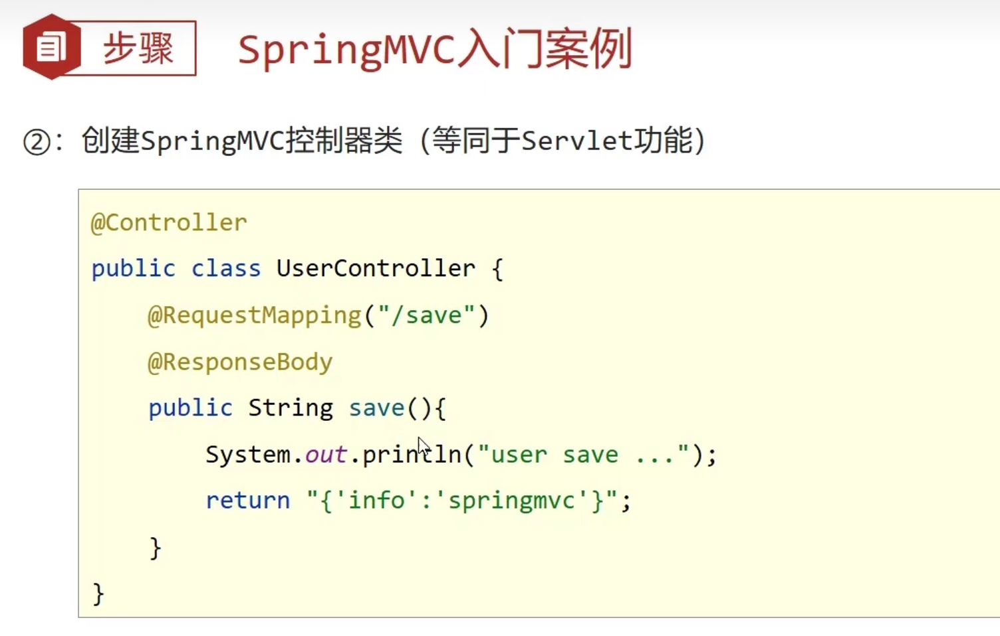
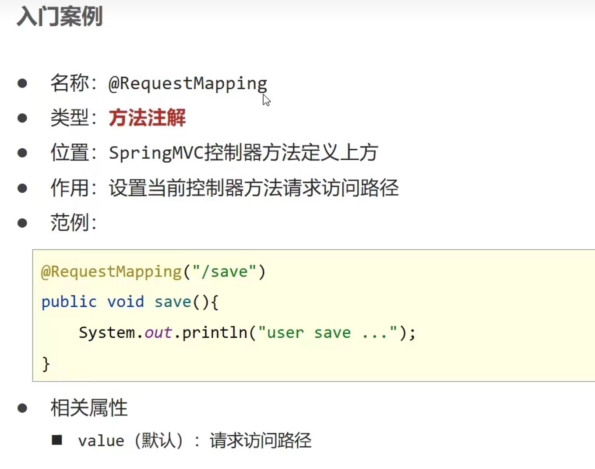
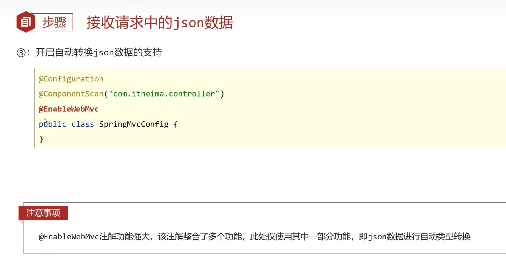
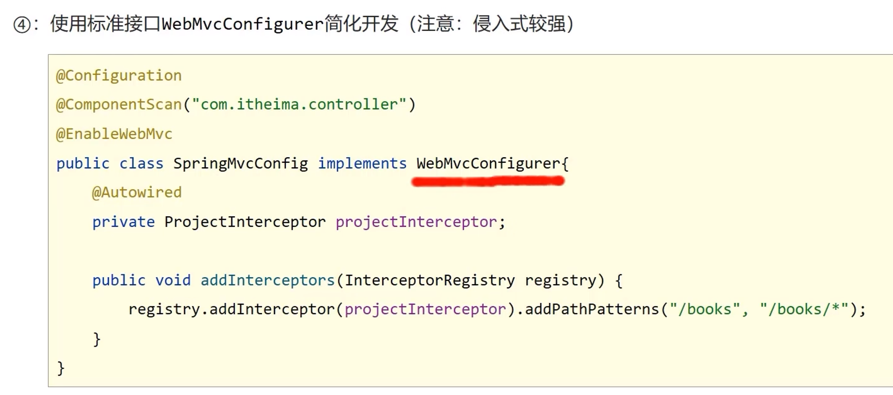

# 1.简介


# 2.Spring入门案例








## 1.Controller加载控制与业务bean加载控制


# 3.Postman


# 4.请求与响应


```java
import org.springframework.web.context.WebApplicationContext;
import org.springframework.web.context.support.AnnotationConfigWebApplicationContext;
import org.springframework.web.filter.CharacterEncodingFilter;
import org.springframework.web.servlet.support.AbstractDispatcherServletInitializer;

import javax.servlet.Filter;

//定义一个servlet容器启动的配置类，在里面加载spring的配置
public class InitConfig extends AbstractDispatcherServletInitializer {
    //加载springMVC容器配置
    @Override
    protected WebApplicationContext createServletApplicationContext() {
        AnnotationConfigWebApplicationContext ctx = new AnnotationConfigWebApplicationContext();
        ctx.register(SpringMvcConfig.class);
        return ctx;
    }

    //设置那些请求归属springMVC处理
    @Override
    protected String[] getServletMappings() {
        return new String[]{"/"};
    }

    //加载spring容器配置
    @Override
    protected WebApplicationContext createRootApplicationContext() {
        return null;
    }

    //乱码处理
    @Override
    protected Filter[] getServletFilters() {
        CharacterEncodingFilter fileter = new CharacterEncodingFilter();
        fileter.setEncoding("UTF-8");
        return new Filter[]{fileter};
    }
}
```

## 4.1POST请求中文乱码的问题


## 4.2.不同类型传参


## 4.3传递json数据类型

导入json坐标

```xml
 <dependency>
            <groupId>com.fasterxml.jackson.core</groupId>
            <artifactId>jackson-databind</artifactId>
            <version>2.9.0</version>
        </dependency>
```





## 4.4日期类型转换


## 4.5响应


# 5.REST风格

## 5.1简介


## 5.2入门案例


## 5.3RESTful快速开发


## 5.4设置对静态资源的访问放行

```java
@Configuration
public class SpringMvcSupport extends WebMvcConfigurationSupport {
    @Override
    protected void addResourceHandlers(ResourceHandlerRegistry registry) {
        //当访问/page/？？？时候不要走mvc/走page目录下的内容
        registry.addResourceHandler("/pages/**").addResourceLocations("/pages/");
        registry.addResourceHandler("/css/**").addResourceLocations("/css/");
        registry.addResourceHandler("/js/**").addResourceLocations("/js/");
        registry.addResourceHandler("/plugins/**").addResourceLocations("/plugins/");
    }
}
```


# 6.SSM整合

## 1.导入的坐标

```xml
   <dependencies>
        <dependency>
            <groupId>org.springframework</groupId>
            <artifactId>spring-webmvc</artifactId>
            <version>5.2.10.RELEASE</version>
        </dependency>

        <dependency>
            <groupId>org.springframework</groupId>
            <artifactId>spring-jdbc</artifactId>
            <version>5.2.10.RELEASE</version>
        </dependency>

        <dependency>
            <groupId>org.springframework</groupId>
            <artifactId>spring-test</artifactId>
            <version>5.2.10.RELEASE</version>
        </dependency>

        <dependency>
            <groupId>org.mybatis</groupId>
            <artifactId>mybatis</artifactId>
            <version>3.5.6</version>
        </dependency>

        <dependency>
            <groupId>org.mybatis</groupId>
            <artifactId>mybatis-spring</artifactId>
            <version>1.3.0</version>
        </dependency>

        <dependency>
            <groupId>mysql</groupId>
            <artifactId>mysql-connector-java</artifactId>
            <version>5.1.47</version>
        </dependency>

        <dependency>
            <groupId>com.alibaba</groupId>
            <artifactId>druid</artifactId>
            <version>1.1.16</version>
        </dependency>

        <dependency>
            <groupId>junit</groupId>
            <artifactId>junit</artifactId>
            <version>4.12</version>
            <scope>test</scope>
        </dependency>

        <dependency>
            <groupId>javax.servlet</groupId>
            <artifactId>javax.servlet-api</artifactId>
            <version>3.1.0</version>
            <scope>provided</scope>
        </dependency>

        <dependency>
            <groupId>com.fasterxml.jackson.core</groupId>
            <artifactId>jackson-databind</artifactId>
            <version>2.9.0</version>
        </dependency>
    </dependencies>
    <build>
        <resources>
            <resource>
                <directory>src/main/java</directory>
                <includes>
                    <include>**/*.properties</include>
                    <include>**/*.xml</include>
                </includes>
                <filtering>false</filtering>
            </resource>
        </resources>
    </build>
```


## 2.spring

**SpringConfig**

```java
import org.springframework.context.annotation.ComponentScan;
import org.springframework.context.annotation.Configuration;
import org.springframework.context.annotation.Import;
import org.springframework.context.annotation.PropertySource;
import org.springframework.transaction.annotation.EnableTransactionManagement;

@Configuration
@ComponentScan({"com.service"})
@PropertySource("classpath:jdbc.properties")
@Import({JdbcConfig.class,MyBatisConfig.class})
@EnableTransactionManagement
public class SpringConfig {
}
```

## 3.mybatis

**MybatisConfig**

```java
import org.mybatis.spring.SqlSessionFactoryBean;
import org.mybatis.spring.mapper.MapperScannerConfigurer;
import org.springframework.context.annotation.Bean;

import javax.sql.DataSource;

public class MyBatisConfig {

    @Bean
    public SqlSessionFactoryBean sqlSessionFactory(DataSource dataSource){
        SqlSessionFactoryBean factoryBean = new SqlSessionFactoryBean();
        factoryBean.setDataSource(dataSource);

        return factoryBean;
    }

    @Bean
    public MapperScannerConfigurer mapperScannerConfigurer(){
        MapperScannerConfigurer msc = new MapperScannerConfigurer();
        msc.setBasePackage("com.dao");
        return msc;
    }

}
```

**JDBCConfig**

```java
import com.alibaba.druid.pool.DruidDataSource;
import org.springframework.beans.factory.annotation.Value;
import org.springframework.context.annotation.Bean;
import org.springframework.jdbc.datasource.DataSourceTransactionManager;
import org.springframework.transaction.PlatformTransactionManager;

import javax.sql.DataSource;

public class JdbcConfig {
    @Value("${jdbc.driver}")
    private String driver;
    @Value("${jdbc.url}")
    private String url;
    @Value("${jdbc.username}")
    private String username;
    @Value("${jdbc.password}")
    private String password;

    @Bean
    public DataSource dataSource(){
        DruidDataSource dataSource = new DruidDataSource();
        dataSource.setDriverClassName(driver);
        dataSource.setUrl(url);
        dataSource.setUsername(username);
        dataSource.setPassword(password);
        return dataSource;
    }

    @Bean
    public PlatformTransactionManager transactionManager(DataSource dataSource){
        DataSourceTransactionManager ds = new DataSourceTransactionManager();
        ds.setDataSource(dataSource);
        return ds;
    }
}

```

**jdbc.properties**

```properties
jdbc.driver=com.mysql.jdbc.Driver
jdbc.url=jdbc:mysql://localhost:3306/ssm_db
jdbc.username=root
jdbc.paassword=root
```

## 4.springmvc

**SpringMvcConfig**

```java
import org.springframework.context.annotation.ComponentScan;
import org.springframework.context.annotation.Configuration;
import org.springframework.web.servlet.config.annotation.EnableWebMvc;

@Configuration
@ComponentScan({"com.controller","com.config"})
@EnableWebMvc
public class SpringMvcConfig {
}
```


**ServletConfig**

```java
import org.springframework.web.servlet.support.AbstractAnnotationConfigDispatcherServletInitializer;

public class ServletConfig extends AbstractAnnotationConfigDispatcherServletInitializer {
    protected Class<?>[] getRootConfigClasses() {
        return new Class[]{SpringConfig.class};
    }

    protected Class<?>[] getServletConfigClasses() {
        return new Class[]{SpringMvcConfig.class};
    }

    protected String[] getServletMappings() {
        return new String[]{"/"};
    }
}
```

SpringMvcSupport

```java
import org.springframework.context.annotation.Configuration;
import org.springframework.web.servlet.config.annotation.ResourceHandlerRegistry;
import org.springframework.web.servlet.config.annotation.WebMvcConfigurationSupport;

@Configuration
public class SpringMvcSupport extends WebMvcConfigurationSupport {
    @Override
    protected void addResourceHandlers(ResourceHandlerRegistry registry) {
        //当访问/page/？？？时候不要走mvc/走page目录下的内容
        registry.addResourceHandler("/pages/**").addResourceLocations("/pages/");
        registry.addResourceHandler("/css/**").addResourceLocations("/css/");
        registry.addResourceHandler("/js/**").addResourceLocations("/js/");
        registry.addResourceHandler("/plugins/**").addResourceLocations("/plugins/");
    }
}
```


## 5.表现层数据封装


## 6.异常处理器


### 1.自定义系统异常


### 2.自定义业务异常


### 3.自定义异常编码(持续补充)


### 4.触发自定义异常


### 5.拦截并处理异常


### 6.异常处理器效果对比


# 7.拦截器




## 1.执行流程


## 2.拦截器的参数


## 3.多拦截器的执行顺序


# 8.分模块开发

## 1.分模块开发意义


## 2.分模块开发


