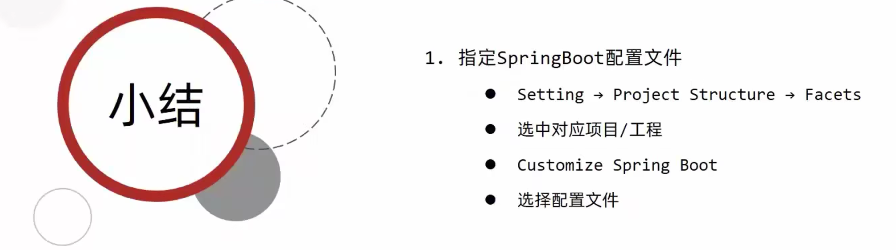

# 1.入门案例(Ideal联网版)


## 1.入门案例解析（parent）


## 2.starter


## 3.引导类


## 4.辅助功能


# 2.REST风格

## 1.REST简介


## 2.REST快速开发


# 3.基础配置

## 1.属性配置


## 2.属性提示消失的解决方法




# 4.YAMl

## 1.yaml格式


# 5.整合第三方技术

## 1.整合JUnit


## 2.整合mybatis


## 3.整合mybatis-puls


## 4.整合Druid

### 1.第一种方式


### 2.第二种方式


# 6.SSMP整合案例


## 1.模块创建


## 2.数据层开发


## 3.分页


```java
@Configuration
public class MPConfig {
    @Bean
    public MybatisPlusInterceptor mybatisPlusInterceptor(){
        MybatisPlusInterceptor interceptor = new MybatisPlusInterceptor();
        interceptor.addInnerInterceptor(new PaginationInnerInterceptor());
        return interceptor;
    }
}
```

## 4.条件查询


## 5.业务层开发


## 6.表现层开发


### 6.1表现层数据统一处理


## 7.前端设计

### 1.前后端调用

```html
<!-- 引入组件库 -->

<script src="../js/vue.js"></script>

<script src="../plugins/elementui/index.js"></script>

<script type="text/javascript" src="../js/jquery.min.js"></script>

<script src="../js/axios-0.18.0.js"></script>
```


### 2.列表功能


### 3.添加功能


### 4.删除功能


### 5.修改功能


### 6.异常消息处理


### 7.分页

```json
"flag": true,
    "data": {
        "records": [
            {
                "id": 1,
                "type": "计算机理论",
                "name": "Spring实战 第5版",
                "description": "Spring入门经典教程，深入理解Spring原理技术内幕"
            },
            {
                "id": 2,
                "type": "计算机理论",
                "name": "Spring 5核心原理与30个类手写实战",
                "description": "十年沉淀之作，手写Spring精华思想"
            },
            {
                "id": 3,
                "type": "计算机理论",
                "name": "Spring 5 设计模式",
                "description": "深入Spring源码剖析Spring源码中蕴含的10大设计模式"
            }
        ],
        "total": 16,
        "size": 3,
        "current": 1,
        "orders": [],
        "optimizeCountSql": true,
        "searchCount": true,
        "countId": null,
        "maxLimit": null,
        "pages": 6
    },
    "msg": null
```


```java
@Data
public class M {
    private Object records;
    private Integer currentPage;
    private Integer pageSize;
    private Integer total;

    public M(Object records, Integer currentPage, Integer pageSize, Integer total) {
        this.records = records;
        this.currentPage = currentPage;
        this.pageSize = pageSize;
        this.total = total;
    }
}

    //分页查询
    @Select("  select *\n" +
            "        from tbl_book limit #{currentPage},#{pageSize};")
    public List<Book> fen1(int currentPage, int pageSize );


    @Override
    public M fen1(int currentPage, int pageSize) {
       int  currentPage1 = (currentPage - 1) * pageSize;
        Integer total = bookDao.selectCount(null);
        List<Book> books = bookDao.fen1(currentPage1, pageSize);
        M m = new M(books, currentPage, pageSize, total);
        return m;
    }
```


### 8.条件查询


### 8.出现的问题

```yml
#正确的配置
spring:
  datasource:
    druid:
     driver-class-name: com.mysql.cj.jdbc.Driver
     url: jdbc:mysql://localhost:3306/ssm_db?serverTimezone=UTC&characterEncoding=utf8
     username: "root"
     password: "root"
mybatis-plus:
  global-config:
    db-config:
      table-prefix: tbl_
      id-type: auto
  configuration:
    log-impl: org.apache.ibatis.logging.stdout.StdOutImpl
  mapper-locations: classpath:mybatis/*.xml
```

xml文件

```xml
<?xml version="1.0" encoding="UTF-8" ?>
<!DOCTYPE mapper
        PUBLIC "-//mybatis.org//DTD Mapper 3.0//EN"
        "http://mybatis.org/dtd/mybatis-3-mapper.dtd">
<!--namespace 绑定一个对应的Dao/Mapper接口-->
<mapper namespace="com.Dao.BookDao">
    <select id="fen1" resultType="com.domain.Book">
   select * from tbl_book where 1 = 1
     <if test="name != null">
       and name like #{name}
   </if>
        <if test="type != null">
            and type like #{type}
        </if>
        <if test="description != null">
            and description like #{description}
        </if>
    limit #{currentPage},#{pageSize};
    </select>
</mapper>
```

需要导包

```xml
 <dependencies>
        <dependency>
            <groupId>org.springframework.boot</groupId>
            <artifactId>spring-boot-starter-web</artifactId>
        </dependency>
        <dependency>
            <groupId>org.mybatis.spring.boot</groupId>
            <artifactId>mybatis-spring-boot-starter</artifactId>
            <version>2.3.0</version>
        </dependency>

        <dependency>
            <groupId>com.mysql</groupId>
            <artifactId>mysql-connector-j</artifactId>
            <scope>runtime</scope>
        </dependency>
        <dependency>
            <groupId>org.springframework.boot</groupId>
            <artifactId>spring-boot-starter-test</artifactId>
            <scope>test</scope>
        </dependency>
        <dependency>
            <groupId>com.alibaba</groupId>
            <artifactId>druid-spring-boot-starter</artifactId>
            <version>1.2.8</version>
        </dependency>

        <dependency>
            <groupId>com.baomidou</groupId>
            <artifactId>mybatis-plus-boot-starter</artifactId>
            <version>3.4.3</version>
        </dependency>

        <dependency>
            <groupId>org.projectlombok</groupId>
            <artifactId>lombok</artifactId>
        </dependency>
    </dependencies>
```

# 7.开发实用篇

## 1.热部署


## 2.配置高级


# 8.数据层解决方案


# 9.整合第三方技术

## 1.整合Redis


# 10.ES


[https://www.elastic.co/cn/downloads/elasticsearch]: ES下载地址


## 1.ES索引操作
