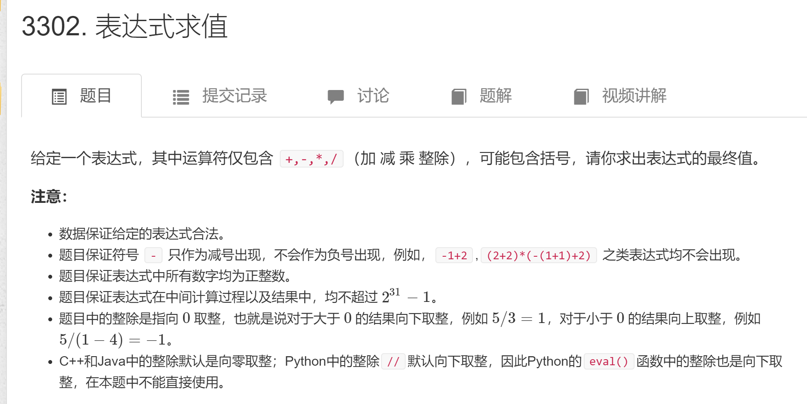
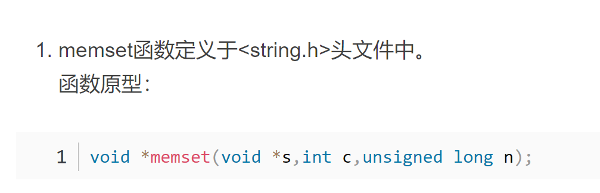

# 1.数据结构

## 1.表达式求值



```c++
#include <iostream>
#include <cstring>
#include <algorithm>
#include <stack>
#include <unordered_map>

using namespace std;

stack<int> num;
stack<char> op;

void eval()
{
    auto b = num.top(); num.pop();
    auto a = num.top(); num.pop();
    auto c = op.top(); op.pop();
    int x;
    if (c == '+') x = a + b;
    else if (c == '-') x = a - b;
    else if (c == '*') x = a * b;
    else x = a / b;
    num.push(x);
}

int main()
{
    unordered_map<char, int> pr{{'+', 1}, {'-', 1}, {'*', 2}, {'/', 2}};
    string str;
    cin >> str;
    for (int i = 0; i < str.size(); i ++ )
    {
        auto c = str[i];
        if (isdigit(c))//判断是否为数字
        {
            int x = 0, j = i;
            while (j < str.size() && isdigit(str[j]))
                x = x * 10 + str[j ++ ] - '0';
            i = j - 1;
            num.push(x);
        }
        else if (c == '(') op.push(c);//如果为左括号，就添加进栈
        else if (c == ')')//如果为右括号，就将有括号前的进去运算，只要碰到左括号
        {
            while (op.top() != '(') eval();
            op.pop();
        }
        else
        {
            while (op.size() && op.top() != '(' && pr[op.top()] >= pr[c]) eval();//pan'duan
            op.push(c);
        }
    }
    while (op.size()) eval();
    cout << num.top() << endl;
    return 0;
}

```

## 2.走迷宫问题

给定一个 n×mn×m 的二维整数数组，用来表示一个迷宫，数组中只包含 00 或 11，其中 00 表示可以走的路，11 表示不可通过的墙壁。

最初，有一个人位于左上角 (1,1)(1,1) 处，已知该人每次可以向上、下、左、右任意一个方向移动一个位置。

请问，该人从左上角移动至右下角 (n,m)(n,m) 处，至少需要移动多少次。

数据保证 (1,1)(1,1) 处和 (n,m)(n,m) 处的数字为 00，且一定至少存在一条通路。

#### 输入格式

第一行包含两个整数 nn 和 mm。

接下来 nn 行，每行包含 mm 个整数（00 或 11），表示完整的二维数组迷宫。

#### 输出格式

输出一个整数，表示从左上角移动至右下角的最少移动次数。

#### 数据范围

1≤n,m≤1001≤n,m≤100

#### 输入样例：

```
5 5
0 1 0 0 0
0 1 0 1 0
0 0 0 0 0
0 1 1 1 0
0 0 0 1 0
```

#### 输出样例：

```
8
```

```c++
#include <cstring>
#include <iostream>
#include <algorithm>
#include <queue>

using namespace std;

typedef pair<int, int> PII;

const int N = 110;

int n, m;
int g[N][N], d[N][N];
//g是存放的地图   d是存放的每一个点到开始的距离
int bfs()
{
    queue<PII> q;

    memset(d, -1, sizeof d);//初始化数组
    d[0][0] = 0;//起点的值
    q.push({0, 0});//将起点的坐标存到到队列中

    int dx[4] = {-1, 0, 1, 0}, dy[4] = {0, 1, 0, -1};

    while (q.size())
    {
        auto t = q.front();///返回队头
        q.pop();//将队头弹出

        for (int i = 0; i < 4; i ++ )//枚举四个方向
        {
            int x = t.first + dx[i], y = t.second + dy[i];
 //t.first 返回第一个键值对     t.second 返回第二个键值对
            if (x >= 0 && x < n && y >= 0 && y < m && g[x][y] == 0 && d[x][y] == -1)
            {///这个是判断是否走过这个路线   g[x][y] == 0 判断这个为0是判断是否可以走
                d[x][y] = d[t.first][t.second] + 1; // 这个加1是因为离起来的距离
                q.push({x, y});
            }
        }
    }

    return d[n - 1][m - 1];
}

int main()
{
    cin >> n >> m;
    for (int i = 0; i < n; i ++ )
        for (int j = 0; j < m; j ++ )
            cin >> g[i][j];

    cout << bfs() << endl;

    return 0;
}
```



## 3.树的重心

给定一颗树，树中包含 nn 个结点（编号 1∼n1∼n）和 n−1n−1 条无向边。

请你找到树的重心，并输出将重心删除后，剩余各个连通块中点数的最大值。

重心定义：重心是指树中的一个结点，如果将这个点删除后，剩余各个连通块中点数的最大值最小，那么这个节点被称为树的重心。

#### 输入格式

第一行包含整数 nn，表示树的结点数。

接下来 n−1n−1 行，每行包含两个整数 aa 和 bb，表示点 aa 和点 bb 之间存在一条边。

#### 输出格式

输出一个整数 mm，表示将重心删除后，剩余各个连通块中点数的最大值。

#### 数据范围

1≤n≤1051≤n≤105

#### 输入样例

```
9
1 2
1 7
1 4
2 8
2 5
4 3
3 9
4 6
```

#### 输出样例：

```
4
```

```c++
#include <cstdio>
#include <cstring>
#include <iostream>
#include <algorithm>

using namespace std;

const int N = 100010, M = N * 2;

int n;
int h[N], e[M], ne[M], idx;
//h[N]：表示第i个节点的第一条边的idx
//ne[M]：表示与第idx条边同起点的下一条边的idx 也就是链表中的指针域
//e[N]:表示第idx条边的终点 也就是链表中的值域 不过里面的值是对应的图中的编号
int ans = N;
bool st[N];

//连接边
void add(int a, int b)
{
    e[idx] = b, ne[idx] = h[a], h[a] = idx ++ ;
}

int dfs(int u)
{
    st[u] = true;

    int size = 0, sum = 1;
    for (int i = h[u]; i != -1; i = ne[i])
    {
        int j = e[i];
        if (st[j]) continue;
        int s = dfs(j);
        size = max(size, s);
        sum += s;
    }

    size = max(size, n - sum );
    ans = min(ans, size);

    return sum ;
}

int main()
{
    scanf("%d", &n);

    memset(h, -1, sizeof h);

    for (int i = 0; i < n - 1; i ++ )
    {
        int a, b;
        scanf("%d%d", &a, &b);
        add(a, b), add(b, a);
    }

    dfs(1);

    printf("%d\n", ans);

    return 0;
}
```

