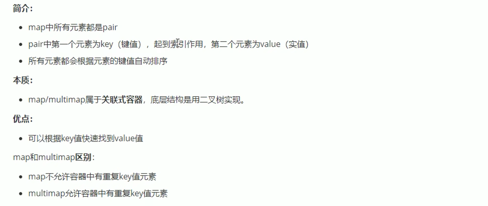

# 1.简介


## 2.STL六大组件


# 2.vector容器


vertor我们可以理解成一个数组。

```c++
#include<algorithm>//标准的算法库的头文件
```


**vector中存放自定义数据类型和存放标准类型是差不多的方式**

## 1.vector赋值操作


```C++
void print(vector<int> &m)
{
    for(vector<int> :: iterator it = m.begin() ; it != m.end() ; it++)
    cout << (*it) << " ";
    cout << endl;
}
void test()
{
    vector<int> m;
    for(int i = 1 ; i <= 5 ; i++)
    m.push_back(i);
    print(m);
    vector<int> v;
    v.assign(m.begin(),m.end());
    print(v);
    // n 个elem赋值操作
     vector<int> v1;
     v1.assign(10,23);
     print(v1);
}
```

## 2.vector容量和大小


```c++
void test()
{
    vector<int> v;
    for(int i = 1 ; i <= 5 ; i++)
    v.push_back(i);
     print(v); //打印
    if(v.empty())//判断容器是否为空
    {
        cout << "空" << endl;
    }else{
        cout << "不空" << endl;
        cout << "大小" << v.size() << endl;//容器得大小
    }
}
```

## 3.vector插入和删除


```C++
void test()
{
    vector<int> v;
    for(int i = 1 ; i <= 5 ; i++)
    v.push_back(i);//从尾部插入数据
     print(v); //打印
    v.pop_back();//删除尾部得数据
     print(v); //打印
     v.insert(v.begin(),9);//前面使用迭代器在开头插入数据
      print(v); //打印
      v.erase(v.begin());//删除开头得元素
      v.erase(v.begin(),v.end());//删除开头到结尾得数据
      v.clear();//清空容器
}
```

## 4.vector数据存取


## 5.vector互换容器


## 6.vector预留空间


# string

## 1.概念


## 2.string构造函数


```c++
#include<iostream>
#include<string>
using namespace std;
/*
string();创建一个空得字符串 例如 string str ；
string(const string & str);//使用一个string对象初始化另外一个string对象
string(const char* s);//使用字符串s初始化s
string(int n,char c);// 使用 n 个字符c初始化
*/
void test01()
{
    string str("hello"); //string(const char* s);//使用字符串s初始化s
    cout << str << endl;
    string str1(5,'a');//string(int n,char c); 使用 n 个字符c初始化
    cout << str1 << endl;
    string str2(str1);//string(const string & str);//使用一个string对象初始化另外一个string对象
    cout << str2 << endl;
}
```

## 3.string赋值操作


```c++
/*
string& assign(const char* s);//把字符串s赋值给当前字符串
string& assign(const char *s,int n);//把字符串s得前n个字符赋值给当前字符串
string& assign((const string &s);//把字符串s赋值给当前字符串
string& assign(int n,char);//用n个字符c赋值给当前字符串
*/
void test02()
{
        string str;
        str.assign("hello C++");//string& assign(const char* s);//把字符串s赋值给当前字符串
        cout << str << endl;
        string str1;
        str1.assign("hello C++",4);//string& assign(const char *s,int n);//把字符串s得前n个字符赋值给当前字符串
        cout << str1 << endl;
        string str2;//string& assign((const string &s);//把字符串s赋值给当前字符串
        str2.assign(str1);
        cout << str2 << endl;
        string str3;
        str3.assign(5,'w');
        cout << str3 << endl;string& assign(int n,char);//用n个字符c赋值给当前字符串
}
```

## 4.字符串拼接


```c++
fun()
{
    string str = "1234";
    str.append("567");
    cout << str << endl;
    string str1 ;
    str1.append("1234466",4);
    cout << str1 << endl;
    string str2;
    str2.append("123456789",3,3);
    cout << str2 << endl;
}
```

## 5.string查找和替换


```c++
//字符串查找和替换
//查找
void test()
{
    string str = "abcdefg";
    cout <<  str.find("de") << endl;//后面的参数可以不用写，默认为开头
     string str1 = "abcdedefg";
    cout <<  str1.find("de",0,1) << endl;
//    string str = "ab33cdefvdeg";
//    cout <<  str.rfind("de",str.length()) << endl;//后面的参数可以不用写，默认为开头
}
//替换
void test1()
{
    string str = "abcdefg";
    cout << str.replace(0,2,"12")<< endl;//从开头的位置替换两个字符为12
}
```

## 6.字符串比较


```c++
void test()
{
    string str = "123";
    cout << str.compare("123") << endl;
}
```

## 7.字符串存取


```c++
void test()
{
    string str = "123456";
    for(int i = 0 ; i < str.length() ; i++)
    {
        cout << str.at(i) ;
    }
}
```

## 8.string插入和删除


```c++
void test()
{
    string str = "abcd";
    cout << str.insert(1,"12") << endl;
     string str1 = "abcd";
     cout << str1.insert(0,3,'2');
     //删除
     cout << endl;
     cout << str1.erase(0,2);//从pos开始的n个字符  从0开始删除两个字符
}
```

## 9.string字串


# 3.栈和队列容器

## 1.栈的概念


## 2.栈的常用接口


```c++
void test()
{
    stack<int> s;
    s.push(i);//添加数据
    s.pop();//推出栈顶元素
    s.top();//返回栈顶元素
    s.size();//返回大小
    s.empty();//判断栈是否为空
}
```

## 3.队列的概念


## 4.队列的常用接口


```c++
void test()
{
    queue<int> Q;
    Q.push(1);//入队
    //Q.pop();//出队
    cout << Q.size() << endl;//元素的个数
    if(Q.empty())//判断元素是否为空
    {
        cout << "空" << endl;
     } else{
         cout << "不空" << endl;
     }
}
```

# 4.deque容器


## 1.deque赋值操作


```c++
赋值跟vector类似

void print(const deque<int> &v)
{
    for(deque<int> ::const_iterator it = v.begin() ; it != v.end() ; it++)
    cout << (*it) << " ";
    cout << endl;
}
void test()
{
    deque<int> v;
   for(int i = 0 ; i < 10 ; i++)
   v.push_back(i);
   print(v);
   deque<int> v1;
   v1.assign(v.begin(),v.end());//赋值操作
    print(v1);
}
```

## 2.deque大小操作


```c++
void print(const deque<int> &v)
{
    for(deque<int> ::const_iterator it = v.begin() ; it != v.end() ; it++)
    cout << (*it) << " ";
    cout << endl;
}
void test()
{
    deque<int> v;
   for(int i = 0 ; i < 10 ; i++)
   v.push_back(i);
   print(v);
  if(v.empty())
  {
      cout << "空" << endl;
   } else{
       cout << "不空" << endl;
       cout << "大小： " << v.size() << endl;  
   }
}
```

## 3.deque插入和删除


### 1.两端插入和删除

```c++
void print(const deque<int> &v)
{
    for(deque<int> :: const_iterator it = v.begin() ; it!= v.end() ; it++)
    cout << *it << " ";
        cout << endl;
}
//两端插入和删除
void test()
{
    deque<int> v;
    
     v.push_back(2);//从容器尾部插入
          v.push_back(3);
     v.push_front(1);// 从容器头部插入
     v.push_front(0);// 从容器头部插入
     print(v);
     v.pop_back();//删除容器尾部元素
     v.pop_front();//删除容器头部元素
     print(v);  
}
```

### 2.指定位置操作

```c++
test1()
{
    deque<int> v;
    v.push_back(2);//从容器尾部插入
    v.push_back(3);
     v.push_front(1);// 从容器头部插入
     v.push_front(0);// 从容器头部插入
     print(v);
     v.insert(v.begin(),6);//利用迭代器在靠头插入 6
      print(v);
}
```

## 4.deque数据存取


**跟vector一样**


## 5.deque排序


```c++
#include<iostream>
#include<deque>
#include<algorithm>//标准算法库的头文件
using namespace std;
void p(const deque<int> &v)
{
    for(deque<int> :: const_iterator it = v.begin() ; it!= v.end() ; it++)
    cout << *it << " ";
    cout << endl;
}
void test()
{
    deque<int> v;
    cout << "排序前" << endl;
    v.push_back(4);
    v.push_back(5);
    v.push_back(2);
    v.push_back(3);
    v.push_back(1);
    p(v);
    sort(v.begin(),v.end());
    cout << "排序后" << endl;
    p(v); 
}
```

# 5.list、set容器


## 1.list构造函数


## 2.list赋值和交换


```c++
#include<iostream>
#include<list>
using namespace std;
void print(list<int> l)
{
    for(list<int>::iterator it = l.begin() ; it != l.end() ; it++ )
    cout << *it << endl;
}
void test()
{
    list<int> l;
    for(int i = 1 ;i <= 5 ;i++)
    l.push_back(i);//赋值
    print(l);
    cout << endl;
//    list<int> l1;
//    l1.assign(l.begin(),l.end());//赋值
//     print(l1);
     //交换
          list<int> l1;
        l1.assign(5,10);
    print(l1);
    //交换后
      l1.swap(l);
        print(l);
            print(l1);
}
```

## 3.list大小操作


```c++
test()
{
    list<int> l;
        for(int i = 1 ;i <= 5 ;i++)
    l.push_back(i);//赋值
    cout << "大小："<<l.size() << endl;
    if(l.empty())
    {
        cout << "空" << endl;
    }else{
        cout << "不空" << endl;
    }
}
```

## 4.list插入和删除


**和前面的容器都差不多用法**

## 5.list容器存取


## 6.list反转和排序


## 7.set和multiset区别


# 6.Map容器

## 1.map的基本概念


