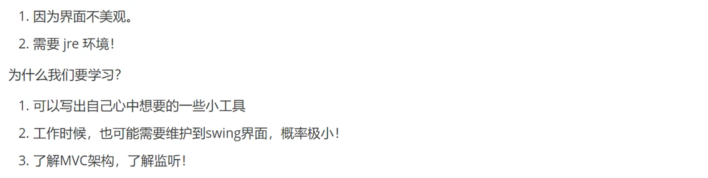
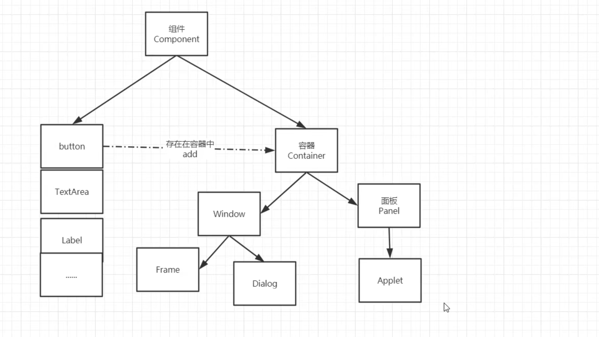
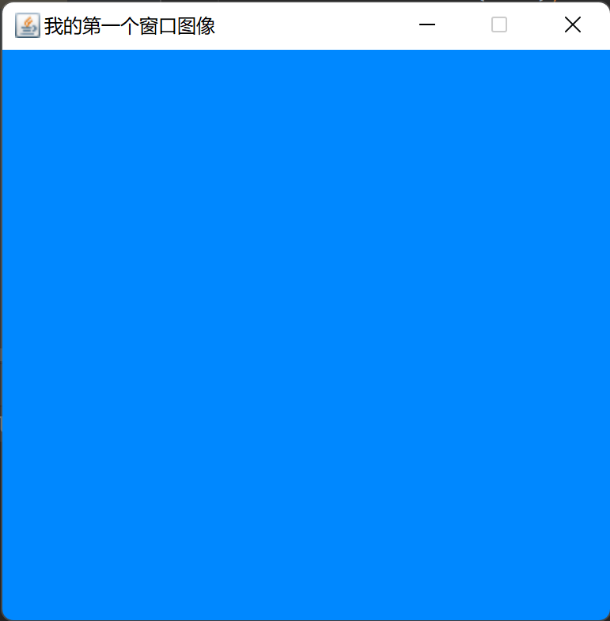
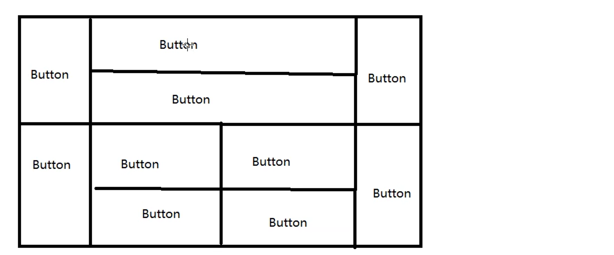
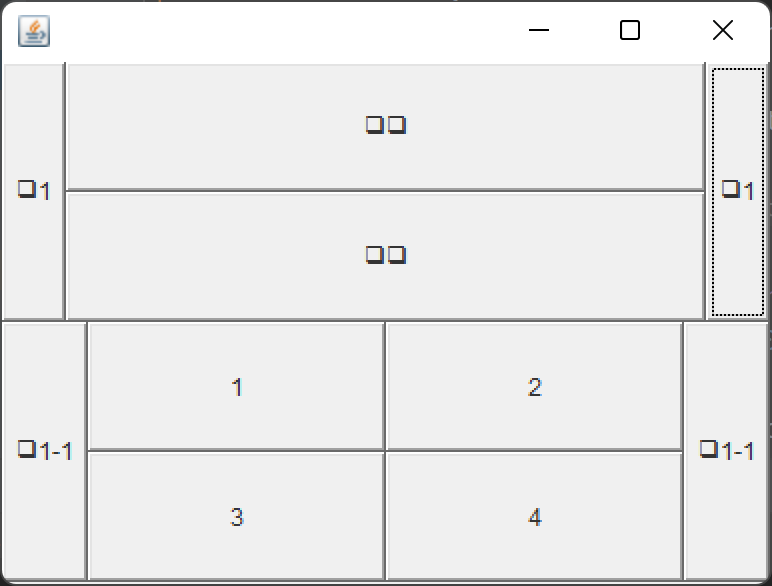
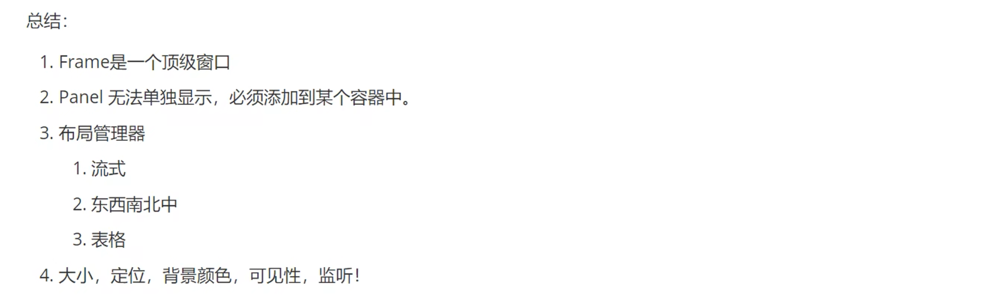
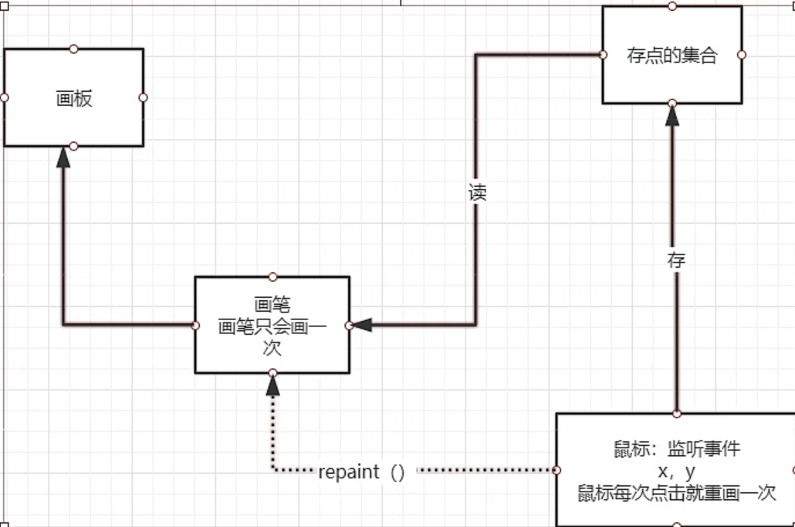
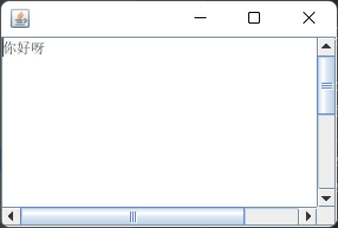

# GUI编程

**组件**

- 窗口
- 弹窗
- 面板
- 文本框
- 列表框
- 按钮
- 图片
- 监听事件
- 键盘事件

## 1、简介

GUI核心：Swing 和 AWT



## 2、AWT

###  2.2Awt介绍



### 2.3、组件和容器

#### 1.Frame

```java

import java.awt.*;
//第一个窗口界面
public class TestFrame {
    public static void main(String[] args) {
        Frame frame = new Frame("我的第一个窗口图像");
        //设置可见性
        frame.setVisible(true);
        //设置窗口大小
        frame.setSize(400,400);
        //设置背景颜色
        Color color = new Color(0, 136, 255);
        frame.setBackground(color);
        //设置初始位置
        frame.setLocation(200,300);
        //设置固定不可变   默认为true
        frame.setResizable(false);
    }
}
```



问题：发现窗口关闭不掉，停止java程序

**创建多个窗口：**

```java
package d1;

import java.awt.*;

/**
 * @author: 杨润
 * @date: 2022/8/30 19:41
 * @description:
 */
public class Frane2 {
    public static void main(String[] args) {
        //展示多个窗口
        new MyFrane(300,300,400,500,Color.CYAN);
    }
}

class MyFrane extends Frame{
    static int id = 0;//可能有多个窗口

    public MyFrane(int x,int y,int w,int h,Color color){
        super("MyFrane"+ (++id)+"窗口");
        //为什么不用类名调用，是因为继承了父类所以可以直接调用
        setVisible(true);//设置可见性
        setBounds(x,y,w,h);//等价于下面那两行代码
      /*  setSize(w,h);//设置大小
        setLocation(x,y);//设置初始位置*/
        setBackground(color);//设置背景颜色
    }
}
```

#### 2.面板(panel)

解决了关闭不了的问题

```java
package Panel;
import java.awt.*;
import java.awt.event.WindowAdapter;
import java.awt.event.WindowEvent;
//panel可以看做一个空间，但是不能单独存在
public class Panel1 {
    public static void main(String[] args) {
        Frame frame = new Frame();//创建窗口
        //布局的概念
        Panel panel = new Panel();//创建面板
        frame.setTitle("我的第二个窗口面板程序");//设置窗口的标题
        //设置布局
        frame.setLayout(null);
        //坐标  背景
        frame.setBounds(300,300,400,500);
        frame.setBackground(Color.cyan);
        //设置可见性
        frame.setVisible(true);
        //Panel设置坐标，相对于Frame
        panel.setBounds(50,50,100,100);
        panel.setBackground(Color.black);
        //将面板添加到窗口里面
        frame.add(panel);
        //监听事件，监听窗口关闭
        //适配器模式
        frame.addWindowListener(new WindowAdapter() {
            //窗口点击关闭的时候需要做的事情
            @Override
            public void windowClosing(WindowEvent e) {
                //结束程序
            System.exit(0);
            }
        });
    }
}
```

#### 3.布局管理器

- 流失布局

  ```java
  /**
   * 流式布局
   */
  public class tets {
      public static void main(String[] args) {
          Frame frame = new Frame();
          Button button = new Button("button1");
          Button button1 = new Button("button2");
          Button button2 = new Button("button3");
          //设置流式布局
          frame.setLayout(new FlowLayout());//默认为居中
        /*  frame.setLayout(new FlowLayout(FlowLayout.CENTER));//居中
          frame.setLayout(new FlowLayout(FlowLayout.LEFT));//靠左
          frame.setLayout(new FlowLayout(FlowLayout.RIGHT));//靠右*/
     frame.setBounds(300,300,500,500);
          //监听器模式
          frame.addWindowListener(new WindowAdapter() {
              @Override
              public void windowClosing(WindowEvent e) {
                  System.exit(0);
              }
          });
          frame.add(button);
          frame.add(button1);
          frame.setVisible(true);
      }
  }
  ```

  

- 东南西北中

  ```java
  package Panel;
  
  import java.awt.*;
  import java.awt.event.WindowAdapter;
  import java.awt.event.WindowEvent;
  
  /**
   * 东西南北中布局
   */
  public class BorderLayout {
      public static void main(String[] args) {
          Frame frame = new Frame();
          Button E = new Button("E");
          Button w = new Button("W");
          Button s = new Button("S");
          Button n = new Button("N");
          Button c = new Button("C");
          frame.add(E, java.awt.BorderLayout.EAST);
          frame.add(w, java.awt.BorderLayout.WEST);
          frame.add(s, java.awt.BorderLayout.SOUTH);
          frame.add(n, java.awt.BorderLayout.NORTH);
          frame.add(c, java.awt.BorderLayout.CENTER);
          frame.setSize(400,400);
          frame.setVisible(true);
          frame.addWindowListener(new WindowAdapter() {
              @Override
              public void windowClosing(WindowEvent e) {
                  System.exit(0);
              }
          });
      }
  }
  ```

- 表格布局(Grid)

```java
package Panel;
import java.awt.*;
import java.awt.event.WindowAdapter;
import java.awt.event.WindowEvent;
/**
 * 表格式布局
 */
public class boder {
    public static void main(String[] args) {
        Frame frame = new Frame();
        Button E = new Button("E");
        Button w = new Button("W");
        Button s = new Button("S");
        Button n = new Button("N");
        Button c = new Button("C");
        Button c1 = new Button("C1");
        frame.setLayout(new GridLayout(3,2));//设置三行两列
        frame.add(E);
        frame.add(w);
        frame.add(s);
        frame.add(n);
        frame.add(c);
        frame.add(c1);
frame.pack();//java函数
        frame.setSize(400,400);
        frame.setVisible(true);
        frame.addWindowListener(new WindowAdapter() {
            @Override
            public void windowClosing(WindowEvent e) {
                System.exit(0);
            }
        });
    }
}
```



代码实现：

```java
package Panel;
import javax.swing.*;
import java.awt.*;
import java.awt.BorderLayout;
import java.awt.event.WindowAdapter;
import java.awt.event.WindowEvent;
public class lian {
    public static void main(String[] args) {
        JFrame jFrame = new JFrame();
        jFrame.setLayout(new GridLayout(2,1));//两行一列
        jFrame.setSize(400,300);
        jFrame.setVisible(true);
        jFrame.setBackground(Color.cyan);
        jFrame.setLocation(300,300);
        //四个面板
        Panel panel1 = new Panel(new BorderLayout());
        Panel panel2 = new Panel(new GridLayout(2,1));
        Panel panel3 = new Panel(new BorderLayout());
        Panel panel4 = new Panel(new GridLayout(2,2));

        panel1.add(new Button("左1"), BorderLayout.EAST);
        panel1.add(new Button("右1"), BorderLayout.WEST);

        panel2.add(new Button("上中"));
        panel2.add(new Button("上下"));
        panel1.add(panel2,BorderLayout.CENTER);

        panel3.add(new Button("左1-1"), BorderLayout.EAST);
        panel3.add(new Button("右1-1"), BorderLayout.WEST);
        panel4.add(new Button("1"));
        panel4.add(new Button("2"));
        panel4.add(new Button("3"));
        panel4.add(new Button("4"));
        panel3.add(panel4, BorderLayout.CENTER);

        jFrame.add(panel1);
        jFrame.add(panel3);

        //设置关闭
        jFrame.addWindowListener(new WindowAdapter() {
            @Override
            public void windowClosing(WindowEvent e) {
                System.exit(0);
            }
        });
    }
}

```





#### 4.事件监听

事件监听：当某个事情发生的时候，干什么？

```java
package listen01;
import javax.swing.*;
import java.awt.*;
import java.awt.event.ActionEvent;
import java.awt.event.ActionListener;
import java.awt.event.WindowAdapter;
import java.awt.event.WindowEvent;
public class d1 {
    public static void main(String[] args) {
        //按下按钮，触发一些事件
        JFrame jFrame = new JFrame();
        Button button = new Button();
        //因为，addActionListener()需要一个ActionListener，所以我们需要构造一个ActionListener
        MyActionListener myActionListener = new MyActionListener();
        button.addActionListener(myActionListener);

       windowClose(jFrame);
        jFrame.add(button,BorderLayout.CENTER);
        jFrame.setSize(300,300);
        jFrame.setVisible(true);
    }
    //关闭窗体的事件
    private static void windowClose(Frame frame){
        //关闭
        frame.addWindowListener(new WindowAdapter() {
            @Override
            public void windowClosing(WindowEvent e) {
                System.exit(0);
            }
        });
    }
}
/**
 * 事件监听
 */
class MyActionListener implements ActionListener{
    @Override
    public void actionPerformed(ActionEvent e) {
        System.out.println("aaaa");
    }
}
```

**多个按钮共享一个监听器：**

```java
package listen01;
import javax.swing.*;
import java.awt.*;
import java.awt.event.ActionEvent;
import java.awt.event.ActionListener;
public class d2 {
    public static void main(String[] args) {
        //两个按钮，实现同一个监听
        //开始  停止
        JFrame jFrame = new JFrame("开始-停止");
        Button button = new Button("开始");
        Button button1 = new Button("结束");
        MyActionListener1 myActionListener1 = new MyActionListener1();
        button.addActionListener(myActionListener1);
        button1.addActionListener(myActionListener1);
        jFrame.add(button,BorderLayout.NORTH);
        jFrame.add(button1,BorderLayout.SOUTH);
        jFrame.setVisible(true);
        jFrame.pack();
    }
}
/**
 * 事件监听
 */
class MyActionListener1 implements ActionListener {
    @Override
    public void actionPerformed(ActionEvent e) {
        //e.getActionCommand() 获得按钮的信息
        System.out.println("按钮："+e.getActionCommand());
    }
}
```

#### 4.输入框 TextField 监听

```java
package listen01;
import javax.swing.*;
import java.awt.*;
import java.awt.event.ActionEvent;
import java.awt.event.ActionListener;
import java.awt.event.WindowAdapter;
import java.awt.event.WindowEvent;
public class d3 {
    public static void main(String[] args) {
          new Myfrane();
    }
}
class Myfrane extends Frame{
    public Myfrane(){
        TextField textField = new TextField();
        add(textField);
        setVisible(true);
        //监听文本框输入的文字
        MyActionListene myActionListene = new MyActionListene();
        //按下enter就会触发这个事件
        textField.addActionListener(myActionListene);
        //设置替换编码
        textField.setEchoChar('*');
        pack();
       windowclose();
    }
    private void windowclose(){
        addWindowListener(new WindowAdapter() {
            @Override
            public void windowClosing(WindowEvent e) {
                System.exit(0);
            }
        });
    }
}
/**
 * 事件监听
 */
class MyActionListene implements ActionListener {
    @Override
    public void actionPerformed(ActionEvent e) {
        TextField filed = (TextField) e.getSource();//获取一些资源，返回一个对象
        System.out.println(filed.getText());//获取文本框的内容
        filed.setText("");
    }
}
```

#### 5.简易计算器，组合+内部类回顾复习

```java
package listen01;
import java.awt.*;
import java.awt.event.ActionEvent;
import java.awt.event.ActionListener;
import java.awt.event.WindowAdapter;
import java.awt.event.WindowEvent;
/**
 * 简易计算器
 */
public class Calc {
    public static void main(String[] args) {
          new Calculator();
    }
}
/**
 * 计算器类
 */
class Calculator extends Frame{
    public Calculator(){
        //三个文本框
        TextField num1 = new TextField(10);//最大的字符数
        TextField num2 = new TextField(10);//最大的字符数
        TextField num3 = new TextField(20);//最大的字符数
        //一个按钮
        Button button = new Button("=");
        button.addActionListener(new MyCalculator(num1,num2,num3));
        //一个标签
        Label label = new Label("+");
        //布局  流式布局
        setLayout(new FlowLayout());
        add(num1);
        add(label);
        add(num2);
        add(button);
        add(num3);
        setVisible(true);
        pack();
        setSize(500,200);
        windows();//关闭窗口
        setLocation(300,300);
    }
    /**
     * 关闭事件
     */
    private void windows(){
        addWindowListener(new WindowAdapter() {
            @Override
            public void windowClosing(WindowEvent e) {
                System.exit(0);
            }
        });
    }
}
/**
 * 监听器类
 */
class MyCalculator implements ActionListener{
    //获取三个变量
    private  TextField num1,num2,num3;
    public MyCalculator(TextField num1,TextField num2,TextField num3){
        this.num1 = num1;
        this.num2 = num2;
        this.num3 = num3;
    }
    @Override
    public void actionPerformed(ActionEvent e) {
        //1.获取加数和被加数
        int n1 = Integer.parseInt(num1.getText());
        int n2 = Integer.parseInt(num2.getText());
        //2.将这个值+法运算后，返稿第三个框
        num3.setText(""+(n1+n2));
        //3。清楚前两个框
        num1.setText("");
        num2.setText("");
    }
}
```

#### 6.画笔

```java
package listen02;
import java.awt.*;
import java.awt.event.WindowAdapter;
import java.awt.event.WindowEvent;
public class paint {
    public static void main(String[] args) {
        myPanint myPanint = new myPanint();
        myPanint.load();
    }
}
class myPanint extends Frame{
    public void load(){
        setBounds(200,300,300,200);
        setVisible(true);
        window();
    }
    @Override
    public void paint(Graphics g) {
       g.setColor(Color.cyan);
     g.drawRect(100,100,100,100);
        g.fill...//是实心的
     //养成习惯，画笔用完，将他还原到最初的颜色   黑色
    }

    private void window(){
        addWindowListener(new WindowAdapter() {
            @Override
            public void windowClosing(WindowEvent e) {
                System.exit(0);
            }
        });
    }
}
```

#### 7.鼠标监听

```java
package listen02;

import java.awt.*;
import java.awt.event.MouseAdapter;
import java.awt.event.MouseEvent;
import java.util.ArrayList;
import java.util.Iterator;

/**
 * 测试鼠标
 */
public class Mouse {
    public static void main(String[] args) {
          new nn("画图");
    }
}

class nn extends Frame{
//画画需要画笔，需要听鼠标当前的位置，需要集合来存储这个点
    ArrayList points;

    public nn(String title){
        super(title);
        setBounds(200,200,400,300);
        points = new ArrayList();//存储鼠标点击的点
            this.addMouseListener(new My());
            setVisible(true);
    }

    @Override
    public void paint(Graphics g) {
        //画画，监听鼠标的事件   获取坐标
        Iterator iterator = points.iterator();
        while (iterator.hasNext()){
            Point point = (Point) iterator.next();
            g.setColor(Color.cyan);
            g.fillOval(point.x,point.y,10,10);
        }
    }

    //添加一个点到界面上  将点加入到集合中
    private void addpaint(Point point){
        points.add(point);
    }

    //适配器模式   产生坐标
    private class My extends MouseAdapter{
        ///鼠标  按下，弹起，按住不放
        @Override
        public void mousePressed(MouseEvent e) {
            nn MyFrane = (nn) e.getSource();
           // 这个点我们点击的时候，就会在界面上产生一个点
            //这个点就是我们鼠标的点
            MyFrane.addpaint( new Point(e.getX(), e.getY()));
             //每次点击鼠标都需要重新画一遍
            MyFrane.repaint();//刷新
       ;
        }
    }
}
```




#### 8.窗口监听

```java
package listen02;

import java.awt.*;
import java.awt.event.WindowAdapter;
import java.awt.event.WindowEvent;

public class TestWindos {
    public static void main(String[] args) {
      new Windos();
    }
}

class Windos extends Frame {

    public Windos(){
   setBounds(100,100,100,100);
   setBackground(Color.CYAN);
   setVisible(true);
   /*addWindowListener(new MyLister());*/
        this.addWindowListener(
                //匿名内部类
                new WindowAdapter() {
                    @Override
                    public void windowClosing(WindowEvent e) {
                        super.windowClosing(e);
                    }
                }
        );
    }
    class MyLister extends WindowAdapter{
        @Override
        public void windowClosing(WindowEvent e) {
            setVisible(false);//隐藏窗口，通过按钮，隐藏当前窗口
            System.exit(0);//正常退出 非正常退出  0 换成 1
        }
    }
}
```

#### 9.键盘监听

```java


import java.awt.*;
import java.awt.event.KeyAdapter;
import java.awt.event.KeyEvent;

public class Key {
    public static void main(String[] args) {
new MyKey();
    }
}
class MyKey extends Frame{

    public MyKey(){
        setBounds(100,100,200,200);
        setVisible(true);
        this.addKeyListener(new KeyAdapter() {
            @Override //键盘按下
            public void keyPressed(KeyEvent e) {
                System.out.println(e.getKeyChar());//在控制台输出在键盘上的键
            }
        });
    }
}
```

## 3、Swing

```java
新的窗口关闭事件 
jFrame.setDefaultCloseOperation(WindowConstants.EXIT_ON_CLOSE);//也关闭事件
```

### 1.窗口和面板

```java
import javax.swing.*;
import java.awt.*;
import java.awt.event.WindowAdapter;
import java.awt.event.WindowEvent;
public class JFraneDemo01 {
    /**
     * 初始化方法 init()
     */
    public static void init(){
        JFrame jFrame = new JFrame("这个是一个Jframe窗口");
        jFrame.setBounds(100,100,200,200);
        jFrame.setBackground(Color.CYAN);
        jFrame.setVisible(true);
        JLabel jLabel = new JLabel("欢迎来到对抗路");
        jFrame.add(jLabel);

        jLabel.setHorizontalAlignment(SwingConstants.CENTER);//设置水平居中
        jFrame.setDefaultCloseOperation(WindowConstants.EXIT_ON_CLOSE);//也关闭事件

        //window(jFrame);//关闭事件这个是自己写的关闭事件
    }

    public static void main(String[] args) {
        init();
    }

    public static void window(JFrame jFrame){
        jFrame.addWindowListener(new WindowAdapter() {
            @Override
            public void windowClosing(WindowEvent e) {
                System.exit(0);
            }
        });
    }
}
```

**标签居中：jLabel.setHorizontalAlignment(SwingConstants.CENTER);//设置水平居中**

### 2.弹窗

```java
package com.Swing.d1;
import javax.swing.*;
import java.awt.*;
import java.awt.event.ActionEvent;
import java.awt.event.ActionListener;
/****
 * 主窗口
 */
public class Dialog extends JFrame {
    public Dialog(){
        setBounds(300,300,300,200);
        setVisible(true);
        setDefaultCloseOperation(WindowConstants.EXIT_ON_CLOSE);//关闭窗口事件
        //JFrame 放东西，容器
        Container container = this.getContentPane();
        //绝对布局
        container.setLayout(null);
        //按钮
        JButton button = new JButton("弹窗");
        button.setBounds(30,30,100,40);
        //点击这个按钮的时候，弹出一个弹窗
        button.addActionListener(new ActionListener() {//监听器
            @Override
            public void actionPerformed(ActionEvent e) {
                //弹窗
               new MyDialog();
            }
        });
        //将按钮添加置容器中
        container.add(button);
    }
    public static void main(String[] args) {
      new Dialog();
    }
}
//弹窗
class MyDialog extends JDialog{
   public MyDialog(){
       this.setVisible(true);
       this.setBounds(100,100,300,300);
       Container container = this.getContentPane();
      /* container.setLayout(null);*/
       container.add(new JLabel("欢迎学习java"));
       this.setVisible(true);
   }
}
```

### 3.标签

```java

import javax.swing.*;
import java.awt.*;
import java.net.URL;

public class Image1 extends JFrame {
    public Image1()  {
        //获取图片的地址
        URL url = Image1.class.getResource("11.jpg");
        JLabel jLabel = new JLabel("12");
        ImageIcon imageIcon = new ImageIcon(url);
       jLabel.setIcon(imageIcon);//将图片放在标签里面
        jLabel.setHorizontalAlignment(SwingConstants.CENTER);//设置居中
        Container contentPane = getContentPane();
        contentPane.add(jLabel);
        setVisible(true);
        setDefaultCloseOperation(WindowConstants.EXIT_ON_CLOSE);
        setBounds(200,200,200,200);
    }

    public static void main(String[] args) {
        new Image1();
    }
}
```

 **<u>JLabel jLabel = new JLabel("12");</u>**


### 4.面板

```java
/**Jpanel**/
/**
 * 面板 jpanel
 */
public class Jpaneldemo01 extends JFrame {

    public Jpaneldemo01(){
        Container contentPane = getContentPane();//容器
        contentPane.setLayout(new GridLayout(2,1,5,5));
        JPanel jPanel1 = new JPanel(new GridLayout());
        JPanel jPanel2 = new JPanel(new GridLayout());
        JPanel jPanel3 = new JPanel(new GridLayout());
        jPanel1.add(new JButton("1"));
        jPanel1.add(new JButton("2"));
        jPanel1.add(new JButton("3"));
        setVisible(true);
        contentPane.add(jPanel1);
        setDefaultCloseOperation(WindowConstants.EXIT_ON_CLOSE);
        setBounds(200,200,200,200);
    }

    public static void main(String[] args) {
        new Jpaneldemo01();
    }
}
```

```java
package com.Swing.d2;


import javax.swing.*;
import java.awt.*;

public class JscrollDemo01 extends JFrame {

    public JscrollDemo01()  {
        Container contentPane = this.getContentPane();
        //文本域
        JTextArea jTextArea = new JTextArea(20, 30);//20行30列
        jTextArea.setText("你好呀");
        setBounds(200,200,300,200);
        //Scroll面板
        JScrollPane jScrollPane = new JScrollPane(jTextArea);
        contentPane.add(jScrollPane);
        setVisible(true);
        setDefaultCloseOperation(WindowConstants.EXIT_ON_CLOSE);
    }

    public static void main(String[] args) {
        new JscrollDemo01();
    }
}
```




### 5.按钮

- 单选按钮

  ```java
  import javax.swing.*;
  import java.awt.*;
  public class JButtonDemo02 extends JFrame{
      public JButtonDemo02() {
          Container container = this.getContentPane();
         container.setLayout(new FlowLayout());//设置流式布局
          JRadioButton jRadioButton1 = new JRadioButton("1");
          JRadioButton jRadioButton2 = new JRadioButton("2");
          JRadioButton jRadioButton3 = new JRadioButton("3");
          setVisible(true);
          //由于单选框只能选择一个，分组，一个组只能选择一个
          ButtonGroup group = new ButtonGroup();
          group.add(jRadioButton1);
          group.add(jRadioButton2);
          group.add(jRadioButton3);
  
          container.add(jRadioButton1);
          container.add(jRadioButton2);
          container.add(jRadioButton3);
          setBounds(200,200,200,200);
          setDefaultCloseOperation(WindowConstants.EXIT_ON_CLOSE);
      }
      public static void main(String[] args) {
          new JButtonDemo02();
      }
  }
  ```

- 复选按钮

  ```java
  import javax.swing.*;
  import java.awt.*;
  
  public class JButtonDemo03 extends JFrame{
  
      public JButtonDemo03() {
          Container container = this.getContentPane();
         container.setLayout(new FlowLayout());//设置流式布局
         //多选框
          JCheckBox jCheckBox1 = new JCheckBox("1");
          JCheckBox jCheckBox2 = new JCheckBox("2");
  
          container.add(jCheckBox1,new  FlowLayout());
          container.add(jCheckBox2,new  FlowLayout());
          container.add(jCheckBox2);
          setVisible(true);
          setBounds(200,200,200,200);
          setDefaultCloseOperation(WindowConstants.EXIT_ON_CLOSE);
      }
  
      public static void main(String[] args) {
          new JButtonDemo03();
      }
  }
  ```

- 图片按钮

```java
import javax.swing.*;
import java.awt.*;
import java.net.URL;

/**
 * JButton
 */
public class JButtonDemo01 extends JFrame {

    public JButtonDemo01(){
        Container container = this.getContentPane();
        //将一个图片变成一个图标
        URL url = JButtonDemo01.class.getResource("11.jpg");
        Icon imageIcon = new ImageIcon(url);
        JButton jButton = new JButton();
        jButton.setIcon(imageIcon);
        setVisible(true);
        container.add(jButton);
        setBounds(200,200,200,200);
        setDefaultCloseOperation(WindowConstants.EXIT_ON_CLOSE);
    }

    public static void main(String[] args) {
        new JButtonDemo01();
    }
}
```


### 6.列表

- 下拉框

```java
import javax.swing.*;
import java.awt.*;

/**
 * 下拉框
 */
public class ConBoxDemo01 extends JFrame {
    public ConBoxDemo01()  {
        Container container = this.getContentPane();
        JComboBox<Object> jComboBox = new JComboBox<>();
        JPanel jPanel = new JPanel();
        jComboBox.addItem("正在上映");
        jComboBox.addItem("已下架");
        jComboBox.addItem("正在热播");
       jPanel.add(jComboBox);
       container.add(jPanel);
        setVisible(true);
        setBounds(200,200,200,200);
        setDefaultCloseOperation(WindowConstants.EXIT_ON_CLOSE);
    }

    public static void main(String[] args) {
        new ConBoxDemo01();
    }
}
```

- 列表框

```java
import javax.swing.*;
import java.awt.*;

/**
 * 下拉框
 */
public class ConBoxDemo02 extends JFrame {
    public ConBoxDemo02()  {
        Container container = this.getContentPane();

        String [] con = {"1","2","3"};

        JList jList = new JList(con);
          container.add(jList);

        setVisible(true);
        setBounds(200,200,200,200);
        setDefaultCloseOperation(WindowConstants.EXIT_ON_CLOSE);
    }

    public static void main(String[] args) {
        new ConBoxDemo02();
    }
}
```


### 7.文本框

- 文本框

```java
/**
 * 文本框
 */
public class TextDemo01 extends JFrame {
    public TextDemo01()  {
        Container container = this.getContentPane();

        JTextField jTextField1 = new JTextField("卧槽");
        JTextField jTextField2 = new JTextField("你好元");

        container.add(jTextField1,BorderLayout.NORTH);
        container.add(jTextField2,BorderLayout.SOUTH);
        setVisible(true);
        setBounds(200,200,200,200);
        setDefaultCloseOperation(WindowConstants.EXIT_ON_CLOSE);
    }

    public static void main(String[] args) {
        new TextDemo01();
    }
}
```

- 密码框

```java

import javax.swing.*;
import java.awt.*;

/**
 * 密码框
 */
public class TextDemo01 extends JFrame {
    public TextDemo01()  {
        Container container = this.getContentPane();

        JPasswordField passwordField = new JPasswordField();
        passwordField.setEchoChar('*');
        container.add(passwordField);

        setVisible(true);
        setBounds(200,200,200,200);
        setDefaultCloseOperation(WindowConstants.EXIT_ON_CLOSE);
    }

    public static void main(String[] args) {
        new TextDemo01();
    }
}
```


- 文本域

```java
import javax.swing.*;
import java.awt.*;

/**
 * 文本域
 */
public class TextDemo01 extends JFrame {
    public TextDemo01()  {
        Container container = this.getContentPane();

        JTextArea jTextArea = new JTextArea();
        container.add(jTextArea);

        setVisible(true);
        setBounds(200,200,200,200);
        setDefaultCloseOperation(WindowConstants.EXIT_ON_CLOSE);
    }

    public static void main(String[] args) {
        new TextDemo01();
    }
}
```


