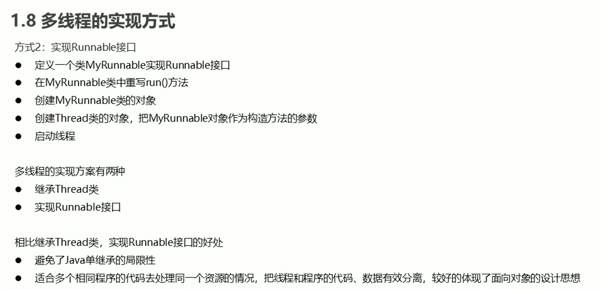

# 1.实现多线程

##  1.进程


## 2.线程


## 3.多线程的实现方式


```java
public class D1 {
    @Test
    public void test(){
        T t1 = new T();
        T t2 = new T();
        t1.start();//t1线程调用
        t2.start();//t2线程调用
    }
}
class T extends Thread{
    @Override
    public void run() {
        for (int i = 0; i < 100; i++) {
            System.out.println(i);
        }
    }
}
```

## 4.设置和获取线程名称


```java
public class D1 {
    @Test
    public void test(){
       /* T t1 = new T();
        T t2 = new T();
        t1.setName("线程1：");//设置线程t1的名称
        t2.setName("线程2：");//设置线程t2的名称*/
//        ----------利用构造方法来设置线程的名称 要在继承的类中来自己构造一个来保存姓名的构造器----------------------
        T t1 = new T("线程1：");
        T t2 = new T("线程2：");
        t1.start();
        t2.start();
    }
}
class T extends Thread{
    public T(){

    }
    public T(String name){//自己添加的一个构造方法用来直接给线程添加姓名
        super(name);
    }
    @Override
    public void run() {
        for (int i = 0; i < 100; i++) {
            System.out.println(getName()+":"+i);//getName()获取当前线程的名称
        }
    }
}
```


## 5.线程的调度


## 6.线程控制


## 7.线程的生命周期


## 8.线程Runnable接口




```java
//这种的线程不安全
public class SellTicketDemo {
    public static void main(String[] args) {
        SellTicket sellTicket = new SellTicket();
        Thread 窗口1 = new Thread(sellTicket, "窗口1");
        Thread 窗口2 = new Thread(sellTicket, "窗口2");
        Thread 窗口3 = new Thread(sellTicket, "窗口3");
        窗口1.start();
        窗口2.start();
        窗口3.start();
    }
}

class SellTicket implements Runnable{
  private int Tickets = 100;
    @Override
    public void run() {
        while (true){
            if (Tickets > 0){
                System.out.println(Thread.currentThread().getName()+"正在售卖"+Tickets+"张票");
                Tickets--;
            }
        }
    }
}
```


## 9.同步方法


## 10.线程安全的类


## 11.Lock锁


```java
public class D4 {
    public static void main(String[] args) {
        T4 T = new T4();
        Thread q1 = new Thread(T, "高铁");
        Thread q2 = new Thread(T, "飞机");
        Thread q3 = new Thread(T, "汽车");
        q1.start();
        q2.start();
        q3.start();
    }
}
// Lock是接口不能直接实例化。这里采用它的实现类：ReentrantLock来实例化
class T4 implements Runnable{
    private int Tickets = 100;
    private Lock lock = new ReentrantLock();
    @Override
    public void run() {
        while (true){
            try {
                lock.lock();//加锁
                if (Tickets > 0){
                    System.out.println(Thread.currentThread().getName()+"正在售卖"+Tickets+"张票");
                    Tickets--;
                }
            } finally {
                lock.unlock();//释放锁
            }
            }
    }
}
```

## 12.生产者消费者模式概述


```java
public class Box {
    private int milk;
    private boolean state = false;
    public synchronized void put(int milk){
        if (state){
            try {
                wait();
            } catch (InterruptedException e) {
                e.printStackTrace();
            }
        }
        this.milk = milk;
        System.out.println("送奶工将第"+this.milk+"瓶奶放入奶箱子");
        state = true;
        notifyAll();
    }

    public synchronized void get() {
        if (!state){
            try {
                wait();
            } catch (InterruptedException e) {
                e.printStackTrace();
            }
        }
        System.out.println("用户拿到第"+this.milk+"瓶奶");
        state = false;
        notifyAll();
    }
}
```

```java
public class Producer implements Runnable{
    private Box b;

    public Producer(Box b) {
        this.b = b;
    }

    @Override
    public void run() {
        for (int i = 1; i < 6; i++) {
        b.put(i);
        }
    }
}
```

```java
public class Customer implements Runnable{
    private Box b;

    public Customer(Box b) {
        this.b = b;
    }

    @Override
    public void run() {
       while (true){
           b.get();
       }
    }
}
```

```java
public class BoxDemo {
    public static void main(String[] args) {
        Box b = new Box();
        Producer producer = new Producer(b);
        Customer customer = new Customer(b);
        Thread thread = new Thread(producer);
        Thread thread1 = new Thread(customer);
        thread.start();
        thread1.start();
    }
}
```

