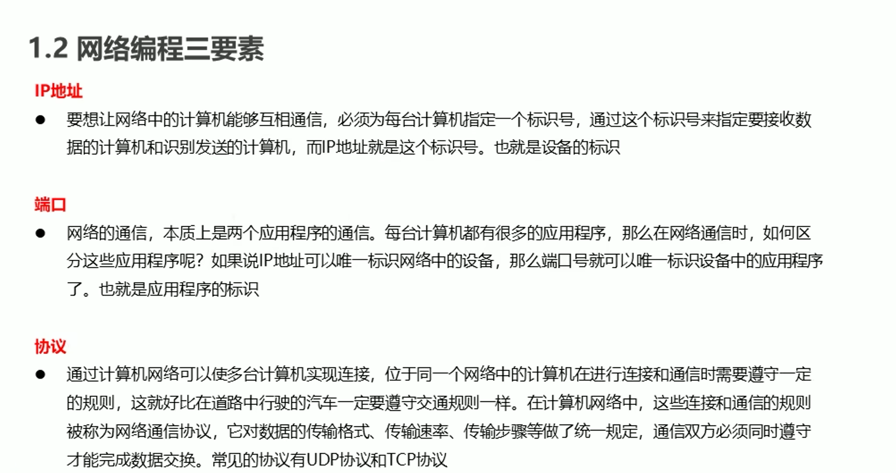

# 1.网络编程

## 1.1网络三要素



## 1.2InetAddress使用


## 1.3端口和协议


## 1.4UDP通信原理


```java
public class Demo02 {
    public static void main(String[] args) throws IOException {
        DatagramSocket ds = new DatagramSocket();

        byte[] bytes = "你好雅".getBytes();
//        int length = bytes.length;
//        InetAddress byName = InetAddress.getByName("192.168.0.11");
//        int port = 10086;
        DatagramPacket dp = new DatagramPacket(bytes, bytes.length, InetAddress.getByName("192.168.0.11"), 10086);
        ds.send(dp);
        ds.close();
    }
}
```


> **1.发送数据**

```java
public class Demo02 {
    public static void main(String[] args) throws IOException {
        DatagramSocket ds = new DatagramSocket();

        byte[] bytes = "你好雅".getBytes();
//        int length = bytes.length;
//        InetAddress byName = InetAddress.getByName("192.168.0.11");
//        int port = 10086;
        DatagramPacket dp = new DatagramPacket(bytes, bytes.length, InetAddress.getByName("192.168.137.1"), 10086);
        ds.send(dp);
        ds.close();
    }
}
```

> **2.接收数据**

```java
public class Demo03 {
    public static void main(String[] args) throws IOException {
        DatagramSocket ds = new DatagramSocket(10086);

        byte[] bytes = new byte[1024];
        DatagramPacket dp = new DatagramPacket(bytes, bytes.length);
        ds.receive(dp);
        byte[] data = dp.getData();
        String d = new String(data,0, dp.getLength());
        System.out.println("接收的数据："+d);
        ds.close();
    }
}
```


## 1.5UDP练习

发送方

```java
public class Send01 {
    public static void main(String[] args) throws IOException {
        DatagramSocket ds = new DatagramSocket();

        while (true){
            Scanner scanner = new Scanner(System.in);
            String next = scanner.next();
            if ("886".equals(next)){
                break;
            }
            byte[] bytes = next.getBytes();

            DatagramPacket dp = new DatagramPacket(bytes, bytes.length, InetAddress.getByName("192.168.137.1"), 10022);
            ds.send(dp);
        }

        ds.close();
    }
}
```

接收方

```java
public class Receive01 {
    public static void main(String[] args) throws IOException {
        DatagramSocket ds = new DatagramSocket(10022);
   while (true){
        byte[] bytes = new byte[1024];
        DatagramPacket dp = new DatagramPacket(bytes, bytes.length);
        ds.receive(dp);
        byte[] data = dp.getData();
        String d = new String(data, 0, dp.getLength());
        System.out.println(d);
//        ds.close();
    }
    }
}
```

## 1.6TCP通信原理


## 1.7TCP小练习

### 1服务器给出反馈


客户端

```java
public class ClientDemo01 {
    public static void main(String[] args) throws IOException {
        Socket socket = new Socket("192.168.137.1", 12345);

        OutputStream os = socket.getOutputStream();
        os.write("我来了".getBytes());

        InputStream is = socket.getInputStream();//接收反馈
        byte[] bytes = new byte[1024];
        int read = is.read(bytes);
        System.out.println("反馈是："+new String(bytes,0,read));
        socket.close();
    }
}
```

服务器端

```java
public class ServerDemo01 {
    public static void main(String[] args) throws IOException {
        ServerSocket serverSocket = new ServerSocket(12345);
        Socket accept = serverSocket.accept();
        InputStream is = accept.getInputStream();
        byte[] bytes = new byte[1024];
        int read = is.read(bytes);
        System.out.println("服务器已经接收："+new String(bytes,0,read));

        OutputStream os = accept.getOutputStream();
        os.write("服务器已经反馈 ".getBytes());
        serverSocket.close();

    }
}
```

### 2.练习2


客户端

```java
public class ClientDemo01 {
    public static void main(String[] args) throws IOException {
        Socket socket = new Socket("192.168.137.1", 12345);

        OutputStream os = socket.getOutputStream();
        while (true){
            Scanner scanner = new Scanner(System.in);
            String next = scanner.next();
            if ("886".equals(next)){
                break;
            }
            os.write(next.getBytes());

        }

        socket.close();
    }
}
```

服务器端

```java
public class ServerDemo01 {
    public static void main(String[] args) throws IOException {
        ServerSocket serverSocket = new ServerSocket(12345);
        Socket accept = serverSocket.accept();
        InputStream is = accept.getInputStream();
        while (true){
            byte[] bytes = new byte[1024];
            int read = is.read(bytes);
            System.out.println("服务器已经接收："+new String(bytes,0,read));
        }
    }
}
```

### 3.练习三


客户端


服务端


### 4.练习4


客户端


服务器


