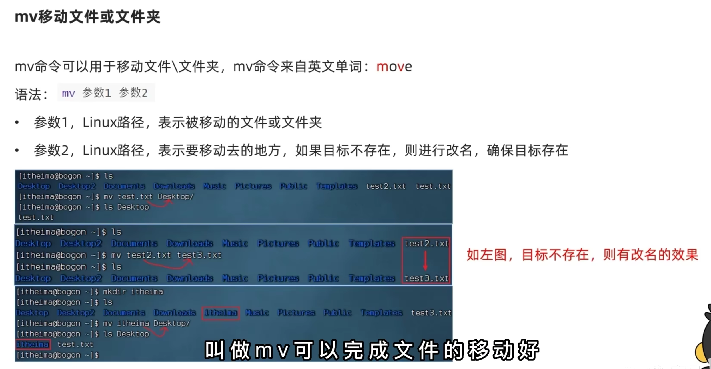
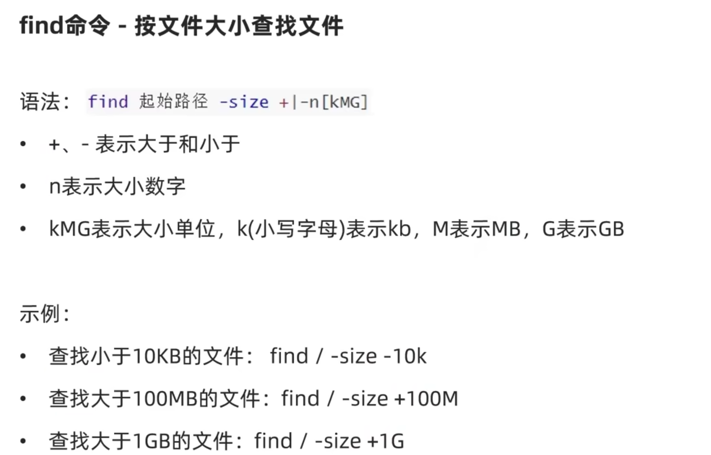
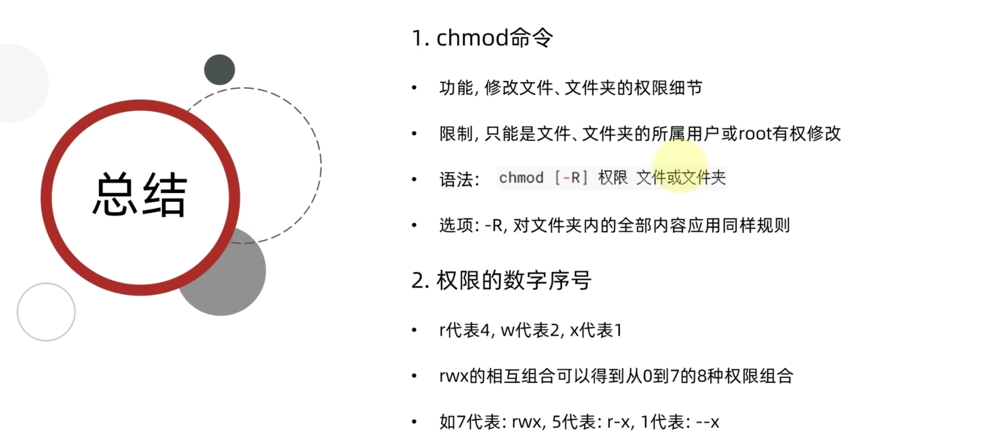
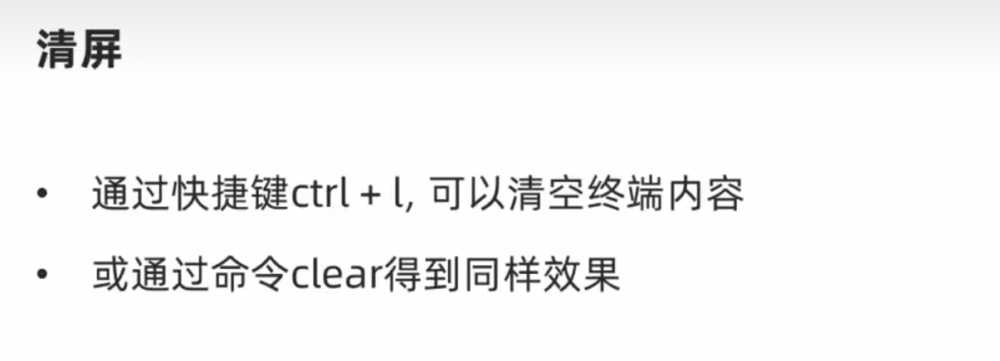

# 1.linux初识

**查看ip地址 ip addr**

# 2.虚拟机快照

# 3.linux基础命令

## 3.1.linux目录结构

## 3.2linux命令入门

### 3.2.1linux命令基础

### 3.2.2.ls命令入门

**ls其实就是list的缩写 就是列表的意思**

### 3.2.3.ls命令的参数和选项

## 3.3目录切换相关命令(cd/pwd)

## 3.4.相对路径、绝对路径和特殊路径符

## 3.5.创建目录命令(mkdir)

## 3.6.文件操作命令part1(touch、cat、more)

## 3.7.文件操作命令part2(cp、mv、rm)

## 3.8.查找命令(which、find)

## 3.9. grep、wc和管道符

**这个也可以过滤目录**

## 3.10echo、tail和重定向符

**追加的会自动换行，写入的文件不存在会自动创建只要是输出结果的命令都可以**

**这里的 -num 并不是一个单词，而是一个具体的数字**

## 3.11vi编译器

**命令模式转换成输入模式可以单独按 一个 i**

**在输入模式里面 ： p  复制**  

​                              **dd 删除**

​                              **u 撤销**

# 4.linux用户和权限

## 4.1 认知root用户

## 4.2 用户、用户组管理

## 4.3 查看权限控制

## 4.4 修改权限控制 - chmod

**用二进制的方法来标记这些**

## 4.5 修改权限控制 - chown

# 5.linux实用操作

## 5.1 各类小技巧(快捷键)

## 5.2 软件安装

## 5.3软连接

