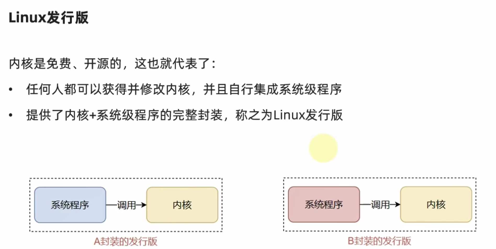

# 1.linux初识

**查看ip地址 ip addr**

# 2.虚拟机快照

# 3.linux基础命令

## 3.1.linux目录结构

## 3.2linux命令入门

### 3.2.1linux命令基础

### 3.2.2.ls命令入门

**ls其实就是list的缩写 就是列表的意思**

### 3.2.3.ls命令的参数和选项

## 3.3目录切换相关命令(cd/pwd)

## 3.4.相对路径、绝对路径和特殊路径符

## 3.5.创建目录命令(mkdir)

## 3.6.文件操作命令part1(touch、cat、more)