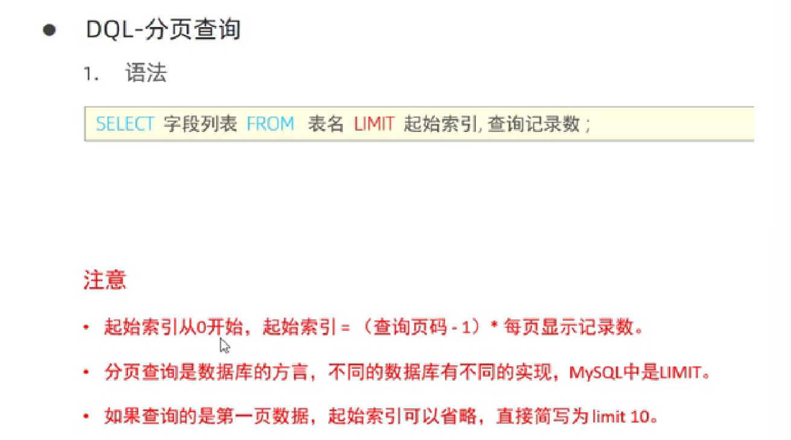
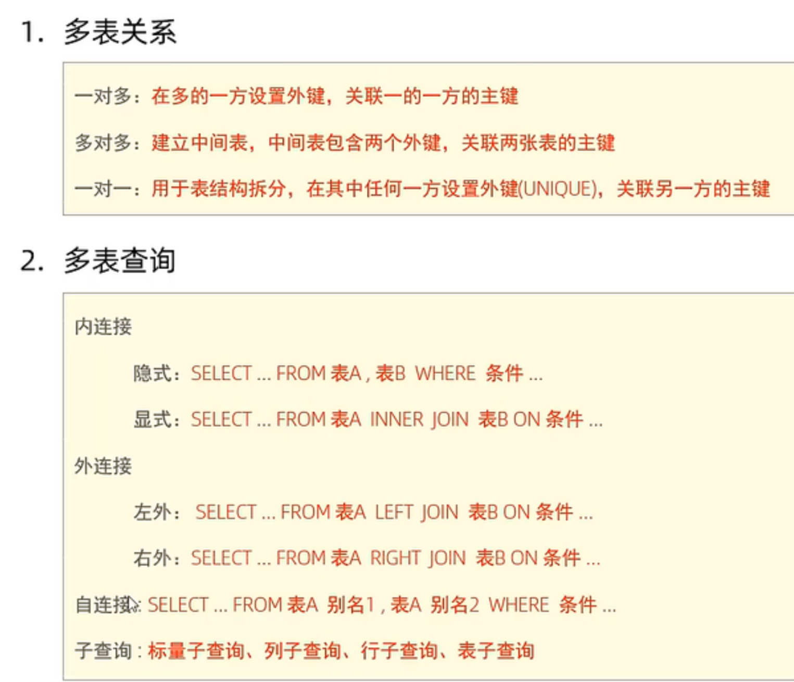
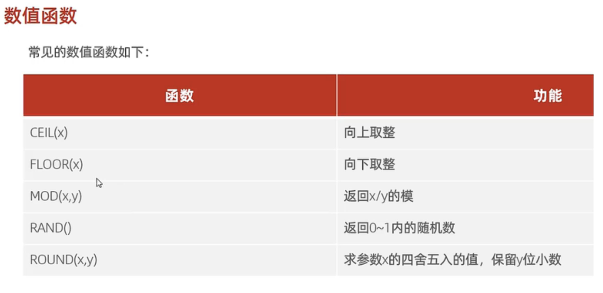
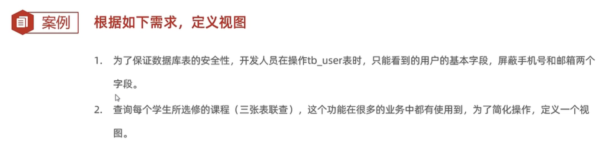
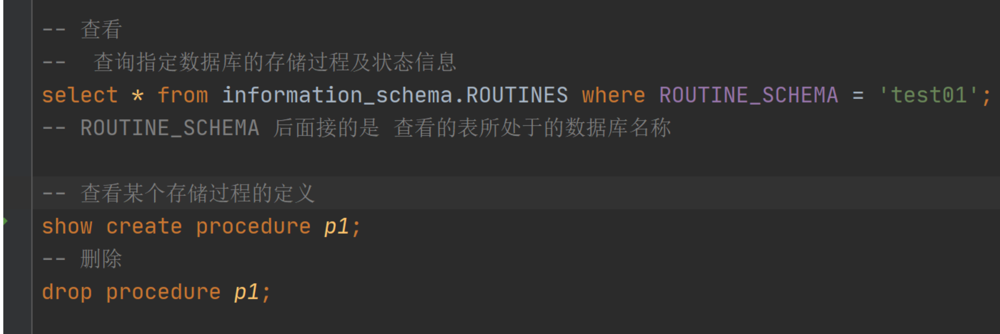
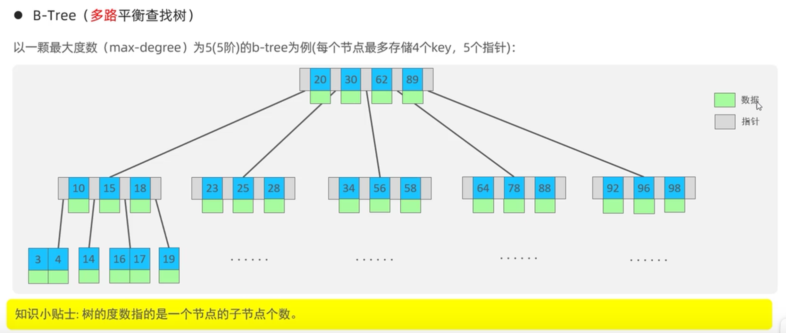
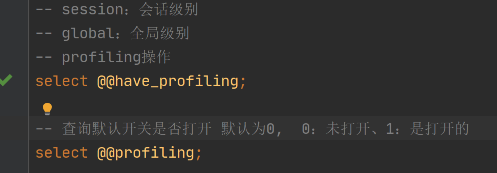

# **sql分类**

**MYSQL启动: net start mysql 80**

**MYSQL关闭: net stop mysql 80**

mysql客户端连接: mysql [-h 127.0.0.1] [-p 3306] -u root -p

## DDL

### 数据库操作

#### **1.查询所有数据库**

> **show databases;**

#### 2.**查询当前所在的数据库**

> #### **select database();**
>

#### 3.**创建**

> **create database 数据库名;**

#### 4.删除

> **drop database 数据库名**

#### 5.使用

**use 数据库**

**创建表之前要使用当前的数据库才可以创建：**

### **表操作 - 查询**

 #### **1.查询当前数据库所有表**

> **show tables;**

#### **2.查询表结构**

> **desc 表名**

#### **3.查询指定表的建表语句**

> **show create table 表名**

### 表操作 修改

#### 1.添加字段

> **alter table 表名 add 字段名 类型(长度) [comment 注释] [约束]**

#### **2.修改字段名和字段类型**

**alter table 表名 change 旧字段名 新字段名 类型(长度) [comment 注释] [约束]**

#### 3.修改数据类型

**alter table 表名 modify 字段名 新数据类型(l长度)**

#### 4.修改表名

**alter table 表名 rename to 新表名**

### 表操作删除

#### 1.删除表

**drop table [if exists] 表名**

#### 2.删除指定表，并重新创建该表

**truncate table 表名**

## DML

### 1.DML介绍

### 2.添加数据

#### 1.给指定字段添加数据

insert into 表名(字段名1，字段名2.....) values(值1，值2...)

#### 2.给全部字段添加数据

insert into values(值1，值2....)

#### 3.批量添加数据

### 3.修改数据

### 4.删除数据

 

## DQL

### 1.基本查询

#### 1.查询多个字段

#### 2.设置别名

#### 3.去除重复记录

### 2.条件查询

#### 1.模糊查询

### 3.聚合函数

#### 1.分组查询

#### 2.排序查询

#### 3.分页查询

#### 4.执行顺序

# 约束、多表查询、事务

## 1.约束

### 1.约束的概述

### 2.外键

**具有外键的表被称为子表，外键所关联的被称为父表**

#### 1.删除外键

#### 2.删除/更新行为

## 2.多表查询

### 1.多表关系

### 2.多表查询概述

### 3.连接查询

#### 1.内连接

#### 2.外连接

#### 3.自连接

#### 4.联合查询

### 4.子查询

#### 1.列子查询

#### 2.行子查询

#### 3.表子查询

## 3.事务

### 1.事务简介

### 2.事务操作

### 3.事务的四大特性

# 管理用户和权限控制

## 1.管理用户

## 2.权限控制

# 函数

## 1.字符串函数

## 2.数值函数

## 3.日期函数

## 4.流程函数

# 视图

**查看视图的数据和查询表的数据的语法是一样的，也可以使用where等。**

# 存储过程

## 1.存储过程介绍

## 2.基本语法

## 3.存储语法

### 1.if

### 2.case

### 3.while

### 4.repeat和Loop

**repeat:相当于c中的do while循环**

**until：条件是退出的条件和我们平时所学的条件刚好相反**

## 4.游标

## 5.触发器

## 5.总结

# 存储引擎

## 1. 存储引擎简介

## 2.存储引擎创建

## 3.存储引擎特点

# 索引

## 1. 索引概述

## 2.索引结构

## 3.索引分类

## 4.索引语法

## 5.SQL性能分析

## 6。索引使用

**避免索引失效：尽量使用>=或者<=;**