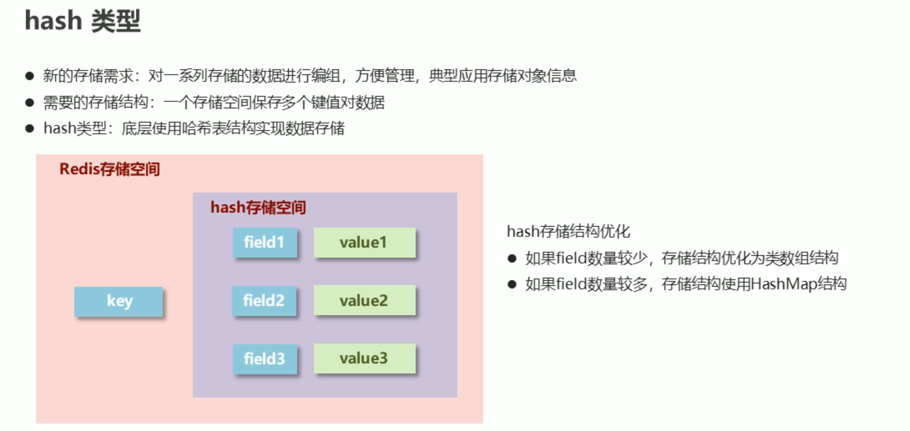
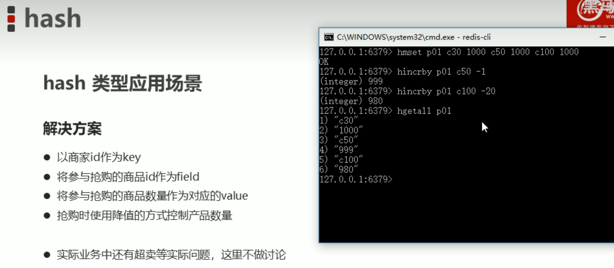

**Redis是一对键值数据库**

# 1.安装Redis


# 2.Redis的基本操作


# 3.数据类型介绍

## 3.1String类型


## 3.2Hash类型








## 3.3List类型


## 3.4Set类型


## 3.5sorted_set类型

   


# 4.通用命令

## 1.key通用命令

### 1.key的基本操作


### 2.key时效性控制


### 3.key的查询模式


### 4.key的其他操作


## 2.数据库通用命令

### 1.db的基本操作


### 2.db的其他操作


# 5.jedis

## 1.jedis简介


## 2.java连接

导入坐标

```xml
<dependency>
           <groupId>redis.clients</groupId>
           <artifactId>jedis</artifactId>
           <version>2.9.0</version>
       </dependency>
```


```java
public class D {
    public static void main(String[] args) {
      //1.连接数据库
        Jedis jedis = new Jedis("127.0.0.1", 6379);
        //操作数据库
        jedis.select(4);
      jedis.set("name","heima");
        String name = jedis.get("name");
        System.out.println(name);
        ///关闭数据库
        jedis.close();
    }
}
```

## 3.常规操作

```java
  @Test
    public void test01(){
        Jedis jedis = new Jedis("127.0.0.1", 6379);
        jedis.lpush("list1","a","b","c");
        List<String> list1 = jedis.lrange("list1", 0, -1);
        //System.out.println(list1.toString());
        for (String s:list1) {
            System.out.println(s);
        }
        System.out.println(jedis.llen("list1"));
        jedis.close();
    }
```

**其他都是一样的操作和redis的操作是一模一样的**


```java
package Redis;
import redis.clients.jedis.Jedis;
import redis.clients.jedis.exceptions.JedisBusyException;
import redis.clients.jedis.exceptions.JedisDataException;
/**
 * @author: 杨润
 * @date: 2022/12/12 16:41
 * @description:
 */
public class Service {

    private  String id ;
    private int num;
    public Service(String id,int num){
        this.id = id;
        this.num = num;
    }
    //控制单元
    public void service(){
        Jedis jedis = new Jedis("127.0.0.1", 6379);
        String s = jedis.get("compld:" + id);
        try {
        if (s == null){//不存在
            jedis.setex("compld:" + id,20,Long.MAX_VALUE-num+"");
        }else {//存在

            Long val = jedis.incr("compld:" + id);
            bussiness(id,num-(Long.MAX_VALUE-val));
        }
         }catch (JedisDataException e){
             System.out.println(id+"使用次数已经到达上线，请升级会员");
             return;
         }finally {
             jedis.close();
         }

    }
    //业务操作
    public void bussiness(String  id,Long val ){
        System.out.println(id+"业务操作"+val+"次");
    }
}

class MyThread extends Thread{
   Service service;
   private Object obj = new Object();
   public MyThread(String id,int num){
       service = new Service(id,num);
   }
    @Override
    public void run() {
        while (true){
            synchronized (obj){
                service.service();
                try {
                    Thread.sleep(1000);
                } catch (InterruptedException e) {
                    e.printStackTrace();
                }
            }
        }
    }
}
class Main{
    public static void main(String[] args) {
        MyThread myThread = new MyThread("初级用户",10);
        MyThread myThread1 = new MyThread("高级用户",30);
        myThread.start();
        myThread1.start();
    }
}
```

## 4.jedis工具类制作


```java
public class JedisUtils {
    public static Jedis getJedis(){
        JedisPoolConfig jpc = new JedisPoolConfig();
        jpc.setMaxTotal(30);//设置最大连接数
        jpc.setMaxIdle(10);
        String host = "127.0.0.1";
        int port = 6379;
        JedisPool jp = new JedisPool(jpc, host, port);
        return jp.getResource();
    }
}
```


redis的配置文件


# 6.linux中安装redis

下载链接

```shell
wget https://github.com/redis/redis/archive/7.0.2.tar.gz
```

若提示没有[wget命令](https://so.csdn.net/so/search?q=wget命令&spm=1001.2101.3001.7020)则可执行以下命令安装wget命令

```she
yum install wget
```

解压文件到当前目录

```shell
tar -xvf 7.0.2.tar.gz
```


安装

```sh
make install   默认安装在scr目录下
```

## 指定端口启动服务

```
redis-server –-port 6380
```


## 指定配置文件启动

**删除配置文件 注释信息和无用空白并保存至新的配置文件`redis-6379`文件中**

```
cat redis.conf | grep -v "#" | grep -v "^$" > redis-6379.conf
```


**新建日志保存位置，并获取路径**


**修改配置`redis-6379`文件保存必要配置**

**基本配置**

- daemonize yes
  - 以守护进程方式启动，使用本启动方式，redis将以服务的形式存在，日志将不再打印到命令窗口中
- port 6
  - 设定当前服务启动端口号
- dir “/自定义目录/redis/data“
  - 设定当前服务文件保存位置，包含日志文件、持久化文件（后面详细讲解）等
- logfile 6***.log
  - 设定日志文件名，便于查阅


**指定配置文件`redis-6379.conf`启动**

```
redis-server redis-6379.conf 
```


**查看redis是否启动完成**

```
ps -ef | grep redis-
```


## 配置文件启动目录管理

**创建配置目录，并将配置文件放入目录内**

```
[root@hecs-33111 redis-7.0.5]# mkdir conf
[root@hecs-33111 redis-7.0.5]# mv redis-6379.conf conf
```

**以指定目录下的配置及文件启动redis**

```
[root@hecs-33111 redis-7.0.5]# redis-server conf/redis-6379.conf
```

**同时启动两个不同端口的redis**

- **复制配置文件并修改**

```
cp redis-6379.conf redis-6380.conf
```


- **同时启动两个服务**

```
[root@hecs-33111 redis-7.0.5]# redis-server conf/redis-6380.conf
[root@hecs-33111 redis-7.0.5]# redis-server conf/redis-6379.conf
```

# Redis 持久化

## 持久化简介

**意外的断电**

[](https://weishao-996.github.io/img/黑马程序员-Redis/image-20221010170628637.png)

[](https://weishao-996.github.io/img/黑马程序员-Redis/image-20221010170643138.png)

**什么是持久化**

利用永久性存储介质将数据进行保存，在特定的时间将保存的数据进行恢复的工作机制称为持久化。

**为什么要进行持久化**

防止数据的意外丢失，确保数据安全性

**持久化过程保存什么**

- 将当前数据状态进行保存，快照形式，存储数据结果，存储格式简单，关注点在数据
- 将数据的操作过程进行保存，日志形式，存储操作过程，存储格式复杂，关注点在数据的操作过程

[](https://weishao-996.github.io/img/黑马程序员-Redis/image-20221010170926880.png)

## RDB

### RDB启动方式 —— save指令

**命令**

```
SHELL
save
```

作用 手动执行一次保存操作

**演示**

```
POWERSHELL
[root@hecs-33111 redis-7.0.5]# redis-cli -p 6379
127.0.0.1:6379> 
127.0.0.1:6379> 
127.0.0.1:6379> 
127.0.0.1:6379> save
OK
```

[](https://weishao-996.github.io/img/黑马程序员-Redis/image-20221010171723018.png)

- **添加数据观察rdb文件变化**

```
POWERSHELL
127.0.0.1:6379> set name weishao
OK
127.0.0.1:6379> save
OK
```

[](https://weishao-996.github.io/img/黑马程序员-Redis/image-20221010172032344.png)

#### RDB启动方式 —— save指令相关配置

- dbfilename dump.rdb
  - 说明：设置本地数据库文件名，默认值为 dump.rdb
  - 经验：通常设置为`dump-端口号.rdb`
- dir
  - 说明：设置存储.rdb文件的路径
  - 经验：通常设置成存储空间较大的目录中，目录名称`data`
- rdbcompression yes
  - 说明：设置存储至本地数据库时是否压缩数据，默认为` yes`，采用 `LZF` 压缩
  - 经验：通常默认为开启状态，如果设置为no，可以节省 CPU 运行时间，但会使存储的文件变大（巨大）
- rdbchecksum yes
  - 说明：设置是否进行`RDB`文件格式校验，该校验过程在写文件和读文件过程均进行
  - 经验：通常默认为开启状态，如果设置为`no`，可以节约读写性过程约`10%`时间消耗，但是存储一定的数据损坏风险

**演示**

- **修改配置文件**

[](https://weishao-996.github.io/img/黑马程序员-Redis/image-20221010211312492.png)

- **添加数据并save,观察rdb文件是否生成**

```
SHELL
127.0.0.1:6379> set name weishao
OK
127.0.0.1:6379> save
OK
```

[](https://weishao-996.github.io/img/黑马程序员-Redis/image-20221010211455930.png)

**数据恢复演示**

- **关闭redis进程**

[](https://weishao-996.github.io/img/黑马程序员-Redis/image-20221010211925344.png)

[](https://weishao-996.github.io/img/黑马程序员-Redis/image-20221010212001633.png)

- **启动redis，观察是否有数据**

```
PLAINTEXT
[root@hecs-33111 redis-7.0.5]# redis-server conf/redis-6379.conf 
```

[](https://weishao-996.github.io/img/黑马程序员-Redis/image-20221010212159279.png)

- **关闭前的数据存在，持久化生效**

#### RDB启动方式 —— save指令工作原理

[](https://weishao-996.github.io/img/黑马程序员-Redis/image-20221010212520404.png)

**RDB启动方式**

**数据量过大，单线程执行方式造成效率过低如何处理？**

后台执行

- 谁：redis操作者（用户）发起指令；redis服务器控制指令执行
- 什么时间：即时（发起）；合理的时间（执行）
- 干什么事情：保存数据

### RDB启动方式 —— bgsave指令

- 命令

```
SHELL
bgsave
```

- 作用

 手动启动后台保存操作，但不是立即执行

**演示**

```
SHELL
127.0.0.1:6379> keys *
1) "name"
127.0.0.1:6379> set age 25
OK
127.0.0.1:6379> get age
"25"
127.0.0.1:6379> bgsave
Background saving started
```

[](https://weishao-996.github.io/img/黑马程序员-Redis/image-20221010215027206.png)

#### RDB启动方式 —— bgsave指令工作原理

[](https://weishao-996.github.io/img/黑马程序员-Redis/image-20221010215129772.png)

#### RDB启动方式 —— bgsave指令相关配置

- dbfilename dump.rdb
- dir
- rdbcompression yes
- rdbchecksum yes
- **stop-writes-on-bgsave-error yes**
  - 说明：后台存储过程中如果出现错误现象，是否停止保存操作
  - 经验：通常默认为开启状态

**RDB启动方式**

反复执行保存指令，忘记了怎么办？不知道数据产生了多少变化，何时保存？

**自动执行**

- 谁：redis服务器发起指令（基于条件）
- 什么时间：满足条件
- 干什么事情：保存数据

### RDB启动方式 ——save配置

- **配置**

```
SHELL
save second changes
```

- **作用**

满足限定时间范围内`key`的变化数量达到指定数量即进行持久化

- **参数**
  - second：监控时间范围
  - changes：监控key的变化量
- **位置**
  - 在conf文件中进行配置
- **范例**

```
SHELL
save 900 1
save 300 10
save 60 10000
```

**演示**

修改配置文件，并重新以配置文件启动

[](https://weishao-996.github.io/img/黑马程序员-Redis/image-20221011141609019.png)

添加数据观察`rdb`文件变化

[](https://weishao-996.github.io/img/黑马程序员-Redis/image-20221011142127323.png)

[](https://weishao-996.github.io/img/黑马程序员-Redis/image-20221011142306626.png)

#### RDB启动方式 ——save配置原理

[](https://weishao-996.github.io/img/黑马程序员-Redis/image-20221011142546510.png)

### RDB三种启动方式对比

[](https://weishao-996.github.io/img/黑马程序员-Redis/image-20221011142827574.png)

### RDB特殊启动形式

- **全量复制**

 在主从复制中详细讲解

- **服务器运行过程中重启**

```
SHELL
debug reload
```

- **关闭服务器时指定保存数据**

```
SHELL
shutdown save
```

默认情况下执行`shutdown`命令时，自动执行 `bgsave`(如果没有开启`AOF`持久化功能)

### RDB优点与缺点

#### RDB优点

- `RDB`是一个紧凑压缩的二进制文件，存储效率较高
- `RDB`内部存储的是`redis`在某个`时间点`的数据快照，非常适合用于数据备份，全量复制等场景
- `RDB`恢复数据的速度要比`AOF`快很多
- 应用：服务器中每`X`小时执行`bgsave`备份，并将`RDB`文件拷贝到远程机器中，用于灾难恢复。

#### RDB缺点

- `RDB`方式无论是执行指令还是利用配置，无法做到实时持久化，具有较大的可能性丢失数据
- `bgsave`指令每次运行要执行`fork`操作创建子进程，要牺牲掉一些性能
- `Redis`的众多版本中未进行`RDB`文件格式的版本统一，有可能出现各版本服务之间数据格式无法兼容现象

## AOF

### RDB存储的弊端

- 存储数据量较大，效率较低 基于快照思想，每次读写都是全部数据，当数据量巨大时，效率非常低
- 大数据量下的`IO`性能较低
- 基于`fork`创建子进程，内存产生额外消耗
- 宕机带来的数据丢失风险

#### 解决思路

- 不写全数据，仅记录部分数据
- 降低区分数据是否改变的难度，改记录数据为记录操作过程
- 对所有操作均进行记录，排除丢失数据的风险

### AOF概念

- `AOF`(append only file)持久化：以独立日志的方式记录每次写命令，重启时再重新执行`AOF`文件中命令 达到恢复数据的目的。与`RDB`相比可以简单描述为改记录数据为记录数据产生的过程
- `AOF`的主要作用是解决了数据持久化的实时性，目前已经是`Redis`持久化的主流方式

### AOF写数据过程

[](https://weishao-996.github.io/img/黑马程序员-Redis/image-20221011152156869.png)

### AOF写数据三种策略(appendfsync)

**always(每次）**

 每次写入操作均同步到`AOF`文件中，`数据零误差，性能较低`

**everysec（每秒）**

 每秒将缓冲区中的指令同步到`AOF`文件中，数据`准确性较高，性能较高`

 在系统突然宕机的情况下丢失`1`秒内的数据

**no（系统控制）**

 由操作系统控制每次同步到`AOF`文件的周期，整体过程`不可控`

### AOF相关配置

**配置**

```
SHELL
appendfilename filename
```

**作用**

```
AOF`持久化文件名，默认文件名未`appendonly.aof`，建议配置为`appendonly-端口号.aof
```

**配置**

```
SHELL
dir
```

**作用**

 `AOF`持久化文件保存路径，与`RDB`持久化文件保持一致即可

**演示**

**修改配置文件，并重启服务**

[](https://weishao-996.github.io/img/黑马程序员-Redis/image-20221011164116974.png)

**添加数据**

```
SHELL
127.0.0.1:6379> set age 55
OK
```

[](https://weishao-996.github.io/img/黑马程序员-Redis/image-20221012100201807.png)

### AOF写数据遇到的问题

如果连续执行如下指令该如何处理

[](https://weishao-996.github.io/img/黑马程序员-Redis/image-20221011165301074.png)

### AOF重写

随着命令不断写入`AOF`，文件会越来越大，为了解决这个问题，`Redis`引入了`AOF`重写机制压缩文件体积。`AOF`文件重 写是将`Redis`进程内的数据转化为写命令同步到新`AOF`文件的过程。简单说就是将对同一个数据的若干个条命令执行结 果转化成最终结果数据对应的指令进行记录。

#### AOF重写作用

- 降低磁盘占用量，提高磁盘利用率
- 提高持久化效率，降低持久化写时间，提高IO性能
- 降低数据恢复用时，提高数据恢复效

#### AOF重写规则

- 进程内已超时的数据不再写入文件
- 忽略无效指令，重写时使用进程内数据直接生成，这样新的AOF文件只保留最终数据的写入命令 如`del key1、 hdel key2、srem key3、set key4 111、set key4 222`等
- 对同一数据的多条写命令合并为一条命令 如`lpush list1 a、lpush list1 b、 lpush list1 c` 可以转化为：`lpush list1 a b c`。 为防止数据量过大造成客户端缓冲区溢出，对`list、set、hash、zset`等类型，每条指令最多写入`64`个元素

#### 重写方式

- 手动重写

```
SHELL
bgrewriteaof
```

- 自动重写

```
SHELL
auto-aof-rewrite-min-size size
auto-aof-rewrite-percentage percentage
```

#### 演示

- 添加数据，观察aof文件变化

```
SHELL
127.0.0.1:6379> set name 111
OK
127.0.0.1:6379> set name 222
OK
```

[](https://weishao-996.github.io/img/黑马程序员-Redis/image-20221012100448914.png)

- 手动重写

```
POWERSHELL
127.0.0.1:6379> BGREWRITEAOF
Background append only file rewriting started
```

[](https://weishao-996.github.io/img/黑马程序员-Redis/image-20221012100544751.png)

#### AOF手动重写 —— bgrewriteaof指令工作原理

[](https://weishao-996.github.io/img/黑马程序员-Redis/image-20221012102219574.png)

#### AOF自动重写方式

- 自动重写触发条件设置

```
SHELL
auto-aof-rewrite-min-size size
auto-aof-rewrite-percentage percent
```

- 自动重写触发比对参数（ 运行指令info Persistence获取具体信息 ）

```
SHELL
aof_current_size
aof_base_size
```

- 自动重写触发条件

[](https://weishao-996.github.io/img/黑马程序员-Redis/image-20221012102721225.png)

### AOF工作流程

[](https://weishao-996.github.io/img/黑马程序员-Redis/image-20221012155613605.png)

### AOF重写流程

[](https://weishao-996.github.io/img/黑马程序员-Redis/image-20221012155656032.png)

## RDB VS AOF

[](https://weishao-996.github.io/img/黑马程序员-Redis/image-20221012155840377.png)

## RDB与AOF的选择之惑

- 对数据非常敏感，建议使用默认的AOF持久化方案
  -  `AOF`持久化策略使用`everysecond`，每秒钟`fsync`一次。该策略`redis`仍可以保持很好的处理性能，当出 现问题时，最多丢失`0-1`秒内的数据。
  -  注意：由于`AOF`文件存储体积较大，且恢复速度较慢
- 数据呈现阶段有效性，建议使用RDB持久化方案
  -  数据可以良好的做到阶段内无丢失（该阶段是开发者或运维人员手工维护的），且恢复速度较快，阶段 点数据恢复通常采用`RDB`方案
  -  注意：利用`RDB`实现紧凑的数据持久化会使`Redis`降的很低，慎重总结：
- 综合比对
  -  `RDB`与`AOF`的选择实际上是在做一种权衡，每种都有利有弊
  -  如不能承受数分钟以内的数据丢失，对业务数据非常敏感，选用`AOF`
  -  如能承受数分钟以内的数据丢失，且追求大数据集的恢复速度，选用`RDB`
  -  灾难恢复选用`RDB`
  -  双保险策略，同时开启 `RDB` 和` AOF`，重启后，`Redis`优先使用 `AOF` 来恢复数据，降低丢失数据的量

## 持久化应用场景

[](https://weishao-996.github.io/img/黑马程序员-Redis/image-20221012160408015.png)

# Redis 事务

## 事务简介

[](https://weishao-996.github.io/img/黑马程序员-Redis/image-20221012161432189.png)

**什么是事务**

Redis执行指令过程中，多条连续执行的指令被干扰，打断，插队

redis事务就是一个命令执行的队列，将一系列预定义命令包装成一个整体（一个队列）。当执行时，一次性 按照添加顺序依次执行，中间不会被打断或者干扰。

一个队列中，一次性、顺序性、排他性的执行一系列命令

[](https://weishao-996.github.io/img/黑马程序员-Redis/image-20221012161628529.png)

## 事务基本操作

**事务的边界**

[](https://weishao-996.github.io/img/黑马程序员-Redis/image-20221012161728903.png)

- **开启事务**

```
SHELL
multi
```

- **作用**

 设定事务的开启位置，此指令执行后，后续的所有指令均加入到事务中

- **执行事务**

```
SHELL
exec
```

**注意：加入事务的命令暂时进入到任务队列中，并没有立即执行，只有执行`exec`命令才开始执行**

**演示**

```
POWERSHELL
127.0.0.1:6379> MULTI
OK
127.0.0.1:6379> set name 111
QUEUED
127.0.0.1:6379> get name 
QUEUED
127.0.0.1:6379> set name 222
QUEUED
127.0.0.1:6379> get name
QUEUED
127.0.0.1:6379> EXEC
1) OK
2) "111"
3) OK
4) "222"
```

**事务定义过程中发现出了问题，怎么办？**

取消事务

```
SHELL
discard
```

作用

 终止当前事务的定义，发生在`multi`之后，`exec`之前

**演示**

```
POWERSHELL
127.0.0.1:6379> MULTI
OK
127.0.0.1:6379> set name 111
QUEUED
127.0.0.1:6379> DISCARD
OK
127.0.0.1:6379> EXEC
(error) ERR EXEC without MULTI
127.0.0.1:6379> 
```

## 事务的工作流程

[](https://weishao-996.github.io/img/黑马程序员-Redis/image-20221012165810588.png)

## 事务的注意事项

**定义事务的过程中，命令格式输入错误怎么办？**

- **语法错误**

 指命令书写格式有误

- **处理结果**

 如果定义的事务中所包含的命令存在语法错误，整体事务中所有命令均不会执行。包括那些语法正 确的命令。

**演示**

```
POWERSHELL
127.0.0.1:6379> MULTI
OK
127.0.0.1:6379> SET name 111
QUEUED
127.0.0.1:6379> TES name 222
(error) ERR unknown command 'TES'
127.0.0.1:6379> EXEC
(error) EXECABORT Transaction discarded because of previous errors.
```

**定义事务的过程中，命令执行出现错误怎么办？**

- **运行错误**

 指命令格式正确，但是无法正确的执行。例如对`list`进行`incr`操作

- **处理结果**

 能够正确运行的命令会执行，运行错误的命令不会被执行

**注意：已经执行完毕的命令对应的数据不会自动回滚，需要程序员自己在代码中实现回滚。**

**演示**

```
POWERSHELL
127.0.0.1:6379> MULTI
OK
127.0.0.1:6379> set name 111
QUEUED
127.0.0.1:6379> get name 
QUEUED
127.0.0.1:6379> set name 222
QUEUED
127.0.0.1:6379> get name
QUEUED
127.0.0.1:6379> lpush name 1 2 3
QUEUED
127.0.0.1:6379> EXEC
1) OK
2) "111"
3) OK
4) "222"
5) (error) WRONGTYPE Operation against a key holding the wrong kind of value
```

## 手动进行事务回滚

- 记录操作过程中被影响的数据之前的状态
  -  单数据：string
  -  多数据：hash、list、set、zset
- 设置指令恢复所有的被修改的项
  -  单数据：直接set（注意周边属性，例如时效）
  -  多数据：修改对应值或整体克隆复制

[](https://weishao-996.github.io/img/黑马程序员-Redis/image-20221012181836503.png)

# Redis 锁

## 基于特定条件的事务执行——锁

**业务场景**

天猫双11热卖过程中，对已经售罄的货物追加补货，4个业务员都有权限进行补货。补货的操作可能是一系 列的操作，牵扯到多个连续操作，如何保障不会重复操作？

**业务分析**

- 多个客户端有可能同时操作同一组数据，并且该数据一旦被操作修改后，将不适用于继续操作
- 在操作之前锁定要操作的数据，一旦发生变化，终止当前操作

**解决方案**

- 对 `key` 添加监视锁，在执行`exec`前如果`key`发生了变化，终止事务执行

```
SHELL
watch key1 [key2……]
```

- 取消对所有 key 的监视

```
SHELL
unwatch
```

Tips 18： `redis `应用基于状态控制的批量任务执行

**演示1.监控时 锁未被修改**

```
POWERSHELL
127.0.0.1:6379> FLUSHDB
OK
127.0.0.1:6379> 
127.0.0.1:6379> keys *
(empty list or set)
127.0.0.1:6379> 
127.0.0.1:6379> set name 123
OK
127.0.0.1:6379> set age 321
OK
127.0.0.1:6379> watch name
OK
127.0.0.1:6379> get name
"123"
127.0.0.1:6379> MULTI
OK
127.0.0.1:6379> set aa bb
QUEUED
127.0.0.1:6379> get aa
QUEUED
127.0.0.1:6379> EXEC
1) OK
2) "bb"
```

**演示2.监控时 锁被修改**

**客户端1**

```
POWERSHELL
127.0.0.1:6379> watch name age
OK
127.0.0.1:6379> MULTI
OK
127.0.0.1:6379> set aa cc
QUEUED
127.0.0.1:6379> get aa
QUEUED
```

**客户端2**

```
POWERSHELL
[root@hecs-33111 ~]# redis-cli -p 6379
127.0.0.1:6379> 
127.0.0.1:6379> 
127.0.0.1:6379> 
127.0.0.1:6379> set name 111
OK
```

**客户端1**

```
POWERSHELL
127.0.0.1:6379> 
127.0.0.1:6379> watch name age
OK
127.0.0.1:6379> MULTI
OK
127.0.0.1:6379> set aa cc
QUEUED
127.0.0.1:6379> get aa
QUEUED
127.0.0.1:6379> EXEC
(nil)
```

**演示3.事务必须在监视内部开启**

```
POWERSHELL
127.0.0.1:6379> MULTI
OK
127.0.0.1:6379> WATCH age
(error) ERR WATCH inside MULTI is not allowed
```

**演示4.取消锁**

```
POWERSHELL
127.0.0.1:6379> WATCH name
OK
127.0.0.1:6379> get name
"111"
127.0.0.1:6379> UNWATCH
OK
```

## 基于特定条件的事务执行——分布式锁

**业务场景**

天猫双11热卖过程中，对已经售罄的货物追加补货，且补货完成。客户购买热情高涨，3秒内将所有商品购 买完毕。本次补货已经将库存全部清空，如何避免最后一件商品不被多人同时购买？【超卖问题】

**业务分析**

- 使用`watch`监控一个`key`有没有改变已经不能解决问题，此处要监控的是具体数据
- 虽然`redis`是单线程的，但是多个客户端对同一数据同时进行操作时，如何避免不被同时修改？

**解决方案**

- 使用 setnx 设置一个公共锁

```
SHELL
setnx lock-key value
```

利用`setnx`命令的返回值特征，有值则返回设置失败，无值则返回设置成功

-  对于返回设置成功的，拥有控制权，进行下一步的具体业务操作
-  对于返回设置失败的，不具有控制权，排队或等待
  操作完毕通过del操作释放锁

注意：上述解决方案是一种设计概念，依赖规范保障，具有风险性

Tips 19： `redis` 应用基于分布式锁对应的场景控制

[](https://weishao-996.github.io/img/黑马程序员-Redis/image-20221013125505629.png)

**演示**

**客户端1加锁并修改目标变量**

```
POWERSHELL
127.0.0.1:6379> set num 10
OK
127.0.0.1:6379> 
127.0.0.1:6379> SETNX lock-num 1
(integer) 1
127.0.0.1:6379> INCRBY num -1
(integer) 9
```

**客户端2也进行加锁，加锁失败**

```
POWERSHELL
127.0.0.1:6379> SETNX lock-num 1
(integer) 0
```

**客户端1删除锁**

```
POWERSHELL
127.0.0.1:6379> set num 10
OK
127.0.0.1:6379> 
127.0.0.1:6379> SETNX lock-num 1
(integer) 1
127.0.0.1:6379> INCRBY num -1
(integer) 9
127.0.0.1:6379> DEL lock-num
(integer) 1
```

**客户端2加锁成功**

```
POWERSHELL
127.0.0.1:6379> SETNX lock-num 1
(integer) 0
127.0.0.1:6379> SETNX lock-num 1
(integer) 1
```

## 基于特定条件的事务执行——分布式锁改良

**业务场景**

依赖分布式锁的机制，某个用户操作时对应客户端宕机，且此时已经获取到锁。如何解决？

**业务分析**

- 由于锁操作由用户控制加锁解锁，必定会存在加锁后未解锁的风险
- 需要解锁操作不能仅依赖用户控制，系统级别要给出对应的保底处理方案

[](https://weishao-996.github.io/img/黑马程序员-Redis/image-20221013131128283.png)

**解决方案**

- 使用 `expire` 为锁`key`添加时间限定，到时不释放，放弃锁

```
SHELL
expire lock-key second
pexpire lock-key milliseconds
```

由于操作通常都是微秒或毫秒级，因此该锁定时间不宜设置过大。具体时间需要业务测试后确认。

- 例如：持有锁的操作最长执行时间`127ms`，最短执行时间`7ms`。
- 测试百万次最长执行时间对应命令的最大耗时，测试百万次网络延迟平均耗时
- 锁时间设定推荐：最大耗时`*120%+平均网络延迟*110%`
- 如果`业务最大耗时<<网络平均延迟`，通常为`2个数量级`，取其中单个耗时较长即可

**演示**

**客户端1，加锁并设置过期时间**

```
POWERSHELL
127.0.0.1:6379> SETNX lock-num 1
(integer) 1
127.0.0.1:6379> EXPIRE lock-num 20
(integer) 1
```

**客户端2，尝试加锁**

```
POWERSHELL
127.0.0.1:6379> SETNX lock-num 1
(integer) 0
127.0.0.1:6379> SETNX lock-num 1
(integer) 0
127.0.0.1:6379> SETNX lock-num 1
(integer) 0
127.0.0.1:6379> SETNX lock-num 1
(integer) 0
127.0.0.1:6379> SETNX lock-num 1
(integer) 0
127.0.0.1:6379> SETNX lock-num 1
(integer) 0
127.0.0.1:6379> SETNX lock-num 1
(integer) 1
```

# Redis 删除策略

## Redis中的数据特征

- `Redis`是一种内存级数据库，所有数据均存放在内存中，内存中的数据可以通过`TTL`指令获取其状态
  - `XX` ：具有时效性的数据
  - `-1` ：永久有效的数据
  - `-2` ：已经过期的数据 或 被删除的数据 或 未定义的数据

**过期的数据真的删除了吗？**

[](https://weishao-996.github.io/img/黑马程序员-Redis/image-20221013144136576.png)

[](https://weishao-996.github.io/img/黑马程序员-Redis/image-20221013144200317.png)

## 数据删除策略

1. **定时删除**
2. **惰性删除**
3. **定期删除**

### 时效性数据的存储结构

[](https://weishao-996.github.io/img/黑马程序员-Redis/image-20221013144754957.png)

### 数据删除策略的目标

在内存占用与`CPU`占用之间寻找一种平衡，顾此失彼都会造成整体`redis`性能的下降，甚至引发`服务器宕机`或`内存泄露`

### 定时删除

- 创建一个定时器，当`key`设置有过期时间，且过期时间到达时，由定时器任务立即执行对键的删除操作
- 优点：节约内存，到时就删除，快速释放掉不必要的内存占用
- 缺点：`CPU`压力很大，无论`CPU`此时负载量多高，均占用`CPU`，会影响`redis`服务器响应时间和指令吞吐量
- 总结：用处理器性能换取存储空间（拿时间换空间）

[](https://weishao-996.github.io/img/黑马程序员-Redis/image-20221013145837784.png)

### 惰性删除

- 数据到达过期时间，不做处理。等下次访问该数据时
  - 如果未过期，返回数据
  - 发现已过期，删除，返回不存在
- 优点：节约CPU性能，发现必须删除的时候才删除
- 缺点：内存压力很大，出现长期占用内存的数据
- 总结：用存储空间换取处理器性能 （拿时间换空间）

[](https://weishao-996.github.io/img/黑马程序员-Redis/image-20221013150235170.png)

### 定期删除

**两种方案都走极端，有没有折中方案？**

[](https://weishao-996.github.io/img/黑马程序员-Redis/image-20221013151212923.png)

[](https://weishao-996.github.io/img/黑马程序员-Redis/image-20221013151238928.png)

- 周期性轮询`redis`库中的时效性数据，采用随机抽取的策略，利用过期数据占比的方式控制删除频度
- 特点1：`CPU`性能占用设置有峰值，检测频度可自定义设置
- 特点2：内存压力不是很大，长期占用内存的冷数据会被持续清理
- 总结：周期性抽查存储空间 `expireIfNeeded()` （随机抽查，重点抽查）

### 删除策略比对

[](https://weishao-996.github.io/img/黑马程序员-Redis/image-20221013151547838.png)

## 逐出算法

### 新数据进入检测

当新数据进入redis时，如果内存不足怎么办？

- `Redis`使用内存存储数据，在执行每一个命令前，会调用`freeMemoryIfNeeded()`检测内存是否充足。如 果内存不满足新加入数据的最低存储要求，redis要临时删除一些数据为当前指令清理存储空间。清理数据 的策略称为逐出算法。
- 注意：逐出数据的过程不是`100%`能够清理出足够的可使用的内存空间，如果不成功则反复执行。当对所 有数据尝试完毕后，如果不能达到内存清理的要求，将出现错误信息。

[](https://weishao-996.github.io/img/黑马程序员-Redis/image-20221014131638733.png)

### 影响数据逐出的相关配置

- 最大可使用内存

```
PLAINTEXT
maxmemory
```

占用物理内存的比例，默认值为0，表示不限制。生产环境中根据需求设定，通常设置在50%以上。

- 每次选取待删除数据的个数

```
PLAINTEXT
maxmemory-samples
```

选取数据时并不会全库扫描，导致严重的性能消耗，降低读写性能。因此采用随机获取数据的方式作为待检测删除数据

- 删除策略

```
SHELL
maxmemory-policy
```

达到最大内存后的，对被挑选出来的数据进行删除的策略

 检测易失数据（可能会过期的数据集`server.db[i].expires` ）

① `volatile-lru`：挑选最近最少使用的数据淘汰

② `volatile-lfu`：挑选最近使用次数最少的数据淘汰

③ `volatile-ttl`：挑选将要过期的数据淘汰

④ `volatile-random`：任意选择数据淘汰

[](https://weishao-996.github.io/img/黑马程序员-Redis/image-20221014132248229.png)

 检测全库数据（所有数据集`server.db[i].dict `）

⑤ `allkeys-lru`：挑选最近最少使用的数据淘汰

⑥ `allkeys-lfu`：挑选最近使用次数最少的数据淘汰

⑦ `allkeys-random`：任意选择数据淘汰

 放弃数据驱逐

⑧ `no-enviction`（驱逐）：禁止驱逐数据（`redis4.0`中默认策略），会引发错误`OOM（Out Of Memory）`

**命令配置**

```
POWERSHELL
maxmemory-policy volatile-lru
```

### 数据逐出策略配置依据

使用`INFO`命令输出监控信息，查询缓存 `hit` 和 `miss` 的次数，根据业务需求调优`Redis`配置

```
POWERSHELL
127.0.0.1:6379> INFO
```

[](https://weishao-996.github.io/img/黑马程序员-Redis/image-20221014133100016.png)

# Redis 核心配置

## 服务器端设定

- 设置服务器以守护进程的方式运行

```
POWERSHELL
daemonize yes|no
```

- 绑定主机地址

```
POWERSHELL
bind 127.0.0.1
```

- 设置服务器端口号

```
POWERSHELL
port 6379
```

- 设置数据库数量

```
POWERSHELL
databases 16
```

## 日志配置

- 设置服务器以指定日志记录级别

```
POWERSHELL
loglevel debug|verbose|notice|warning
```

- 日志记录文件名

```
SHELL
logfile 端口号.log
```

注意：日志级别开发期设置为`verbose`即可，生产环境中配置为`notice`，简化日志输出量，降低写日志IO的频度

## 客户端配置

- 设置同一时间最大客户端连接数，默认无限制。当客户端连接到达上限，Redis会关闭新的连接

```
POWERSHELL
maxclients 0
```

- 客户端闲置等待最大时长，达到最大值后关闭连接。如需关闭该功能，设置为 0

```
POWERSHELL
timeout 300
```

## 多服务器快捷配置

导入并加载指定配置文件信息，用于快速创建`redis`公共配置较多的`redis`实例配置文件，便于维护

```
SHELL
include /path/server-端口号.conf
```

# Redis 高级数据类型

## Bitmaps

[](https://weishao-996.github.io/img/黑马程序员-Redis/image-20221014134814217.png)

[](https://weishao-996.github.io/img/黑马程序员-Redis/image-20221014134931474.png)

[](https://weishao-996.github.io/img/黑马程序员-Redis/image-20221014135302634.png)

### Bitmaps类型的基础操作

- 获取指定key对应偏移量上的bit值

```
POWERSHELL
getbit key offset
```

- 设置指定key对应偏移量上的bit值，value只能是1或0

```
SHELL
setbit key offset value
```

**演示**

```
POWERSHELL
127.0.0.1:6379> SETBIT bits 0 1
(integer) 0
127.0.0.1:6379> GETBIT bits 0
(integer) 1
127.0.0.1:6379> GETBIT bits 10
(integer) 0
```

### Bitmaps类型的扩展操作

**业务场景**

**电影网站**

- 统计每天某一部电影是否被点播
- 统计每天有多少部电影被点播
- 统计每周/月/年有多少部电影被点播
- 统计年度哪部电影没有被点播

**业务分析**

[](https://weishao-996.github.io/img/黑马程序员-Redis/image-20221014140142843.png)

- 对指定key按位进行交、并、非、异或操作，并将结果保存到destKey中

```
PLAINTEXT
bitop op destKey key1 [key2...]
```

- and：交
- or：并
- not：非
- xor：异或
- 统计指定key中1的数量

```
SHELL
bitcount key [start end]
```

Tips 21： `redis` 应用于信息状态统计

**演示**

```
POWERSHELL
127.0.0.1:6379> SETBIT 20880808 0 1
(integer) 0
127.0.0.1:6379> SETBIT 20880808 4 1
(integer) 0
127.0.0.1:6379> SETBIT 20880808 8 1
(integer) 0
127.0.0.1:6379> SETBIT 20880809 0 1
(integer) 0
127.0.0.1:6379> SETBIT 20880809 5 1
(integer) 0
127.0.0.1:6379> SETBIT 20880809 8 1
(integer) 0
127.0.0.1:6379> BITCOUNT 20880808
(integer) 3
127.0.0.1:6379> BITCOUNT 20880809
(integer) 3
127.0.0.1:6379> SETBIT  20880808 6 1
(integer) 0
127.0.0.1:6379> BITCOUNT 20880808
(integer) 4
127.0.0.1:6379> BITOP or 08-09 20880808 20880809
(integer) 2
127.0.0.1:6379> BITCOUNT 08-09
(integer) 5
```

## HyperLogLog

### 统计独立UV

- 原始方案：set
  - 存储每个用户的id（字符串）
- 改进方案：Bitmaps
  - 存储每个用户状态（bit）
- 全新的方案：Hyperloglog

### 基数

- 基数是数据集去重后元素个数
- `HyperLogLog` 是用来做基数统计的，运用了`LogLog`的算法

[](https://weishao-996.github.io/img/黑马程序员-Redis/image-20221014142336498.png)

### HyperLogLog类型的基本操作

- 添加数据

```
SHELL
pfadd key element [element ...]
```

- 统计数据

```
SHELL
pfcount key [key ...]
```

- 合并数据

```
SHELL
pfmerge destkey sourcekey [sourcekey...]
```

Tips 22： redis 应用于独立信息统计

```
SHELL
127.0.0.1:6379> PFADD hll 001
(integer) 1
127.0.0.1:6379> PFADD hll 001
(integer) 0
127.0.0.1:6379> PFADD hll 001
(integer) 0
127.0.0.1:6379> PFADD hll 001
(integer) 0
127.0.0.1:6379> PFADD hll 001
(integer) 0
127.0.0.1:6379> PFADD hll 002
(integer) 1
127.0.0.1:6379> GET hll
"HYLL\x01\x00\x00\x00\x00\x00\x00\x00\x00\x00\x00\x80L\x9f\x84R\xbf\x80`\x9d"
127.0.0.1:6379> PFCOUNT hll
(integer) 2
SHELL
redis> PFADD  nosql  "Redis"  "MongoDB"  "Memcached"
(integer) 1
redis> PFADD  RDBMS  "MySQL" "MSSQL" "PostgreSQL"
(integer) 1
redis> PFMERGE  databases  nosql  RDBMS
OK
redis> PFCOUNT  databases
(integer) 6
```

### 相关说明

- 用于进行基数统计，不是集合，不保存数据，只记录数量而不是具体数据
- 核心是基数估算算法，最终数值**存在一定误差**
- 误差范围：基数估计的结果是一个带有 `0.81%` 标准错误的近似值
- 耗空间极小，每个`hyperloglog key`占用了`12K`的内存用于标记基数
- `pfadd`命令不是一次性分配`12K`内存使用，会随着基数的增加内存逐渐增大
- `Pfmerge`命令合并后占用的存储空间为`12K`，无论合并之前数据量多少

## GEO

[](https://weishao-996.github.io/img/黑马程序员-Redis/image-20221014162507268.png)

[](https://weishao-996.github.io/img/黑马程序员-Redis/image-20221014162532151.png)

### GEO类型的基本操作

- **添加坐标点**

```
SHELL
geoadd key longitude latitude member [longitude latitude member ...]
```

- **获取坐标点**

```
SHELL
geopos key member [member ...]
```

- **计算坐标点距离**

```
SHELL
geodist key member1 member2 [unit]
```

**演示**

```
POWERSHELL
127.0.0.1:6379> GEOADD geos 1 1 a
(integer) 1
127.0.0.1:6379> GEOADD geos 2 2 b
(integer) 1
127.0.0.1:6379> GEOPOS geos a
1) 1) "0.99999994039535522"
   2) "0.99999945914297683"
127.0.0.1:6379> GEODIST geos a b
"157270.0561"
127.0.0.1:6379> GEODIST geos a b m
"157270.0561"
127.0.0.1:6379> GEODIST geos a b km
"157.2701"
```

- **根据坐标范围内的数据**

```
SHELL
georadius key longitude latitude radius m|km|ft|mi [withcoord] [withdist] [withhash] [count count]
```

- **根据点求范围内数据**

```
SHELL
georadiusbymember key member radius m|km|ft|mi [withcoord] [withdist] [withhash] [count count]
```

- **计算经纬度**

```
SHELL
geohash key member [member ...]
```

**演示**

```
POWERSHELL
127.0.0.1:6379> GEODIST geos a b
"157270.0561"
127.0.0.1:6379> GEODIST geos a b m
"157270.0561"
127.0.0.1:6379> GEODIST geos a b km
"157.2701"
127.0.0.1:6379> GEOADD geos 1 1 1,1
(integer) 1
127.0.0.1:6379> GEOADD geos 1 2 1,2
(integer) 1
127.0.0.1:6379> GEOADD geos 1 3 1,3
(integer) 1
127.0.0.1:6379> GEOADD geos 2 1 2,1
(integer) 1
127.0.0.1:6379> GEOADD geos 2 2 2,2
(integer) 1
127.0.0.1:6379> GEOADD geos 2 3 2,3
(integer) 1
127.0.0.1:6379> GEOADD geos 3 1 3,1
(integer) 1
127.0.0.1:6379> GEOADD geos 3 2 3,2
(integer) 1
127.0.0.1:6379> GEOADD geos 3 3 3,3
(integer) 1
127.0.0.1:6379> GEOADD geos 5 5 5,5
(integer) 1
127.0.0.1:6379> GEORADIUSBYMEMBER geos 2,2 180 km
 1) "1,1"
 2) "a"
 3) "2,1"
 4) "1,2"
 5) "2,2"
 6) "b"
 7) "3,1"
 8) "3,2"
 9) "1,3"
10) "2,3"
11) "3,3"
127.0.0.1:6379> GEORADIUSBYMEMBER geos 2,2 120 km
1) "1,2"
2) "2,2"
3) "b"
4) "2,3"
5) "2,1"
6) "3,2"
127.0.0.1:6379> GEORADIUSBYMEMBER geos 2,2 1800 km
 1) "1,1"
 2) "a"
 3) "2,1"
 4) "1,2"
 5) "2,2"
 6) "b"
 7) "3,1"
 8) "3,2"
 9) "1,3"
10) "2,3"
11) "3,3"
12) "5,5"
POWERSHELL
127.0.0.1:6379> GEORADIUS geos 1.5 1.5 90 km
1) "1,2"
2) "2,2"
3) "b"
4) "1,1"
5) "a"
6) "2,1"
POWERSHELL
127.0.0.1:6379> GEOHASH geos 2,2
1) "s037ms06g70"
```

Tips 23： redis 应用于地理位置计算