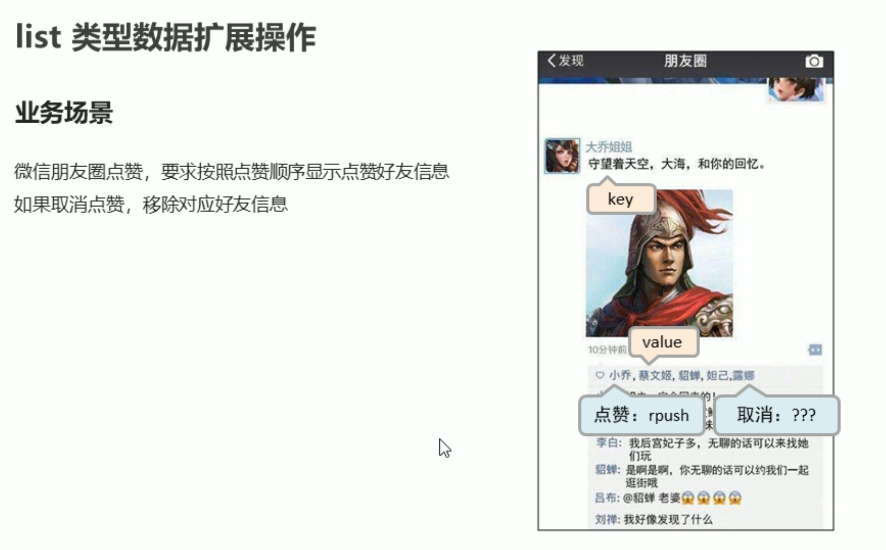
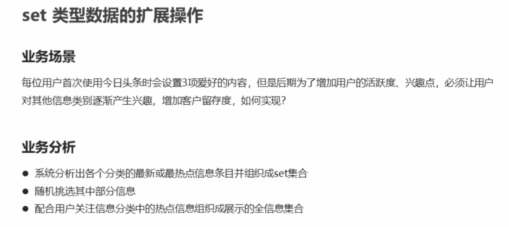
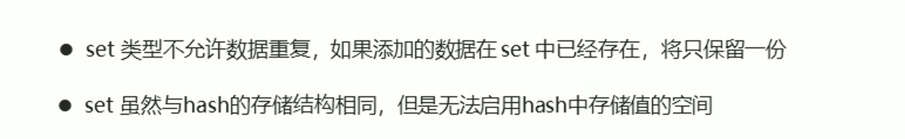
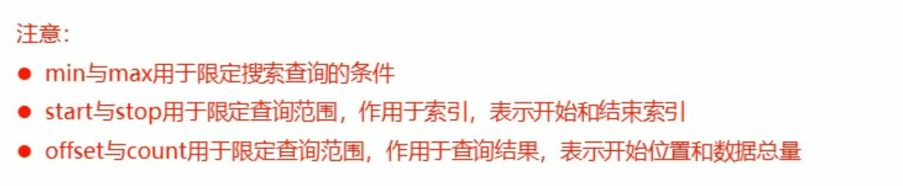
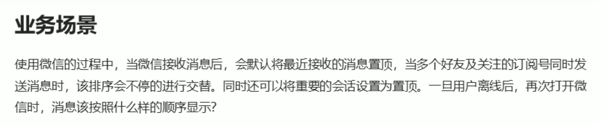

**Redis是一对键值数据库**

# 1.安装Redis


# 2.Redis的基本操作


# 3.数据类型介绍

## 3.1String类型


## 3.2Hash类型


## 3.3List类型





## 3.4Set类型








## 3.5sorted_set类型

   








# 4.通用命令

## 1.key通用命令

### 1.key的基本操作


### 2.key时效性控制


### 3.key的查询模式


### 4.key的其他操作


## 2.数据库通用命令

### 1.db的基本操作


### 2.db的其他操作


# 5.jedis

## 1.jedis简介


## 2.java连接

导入坐标

```xml
<dependency>
           <groupId>redis.clients</groupId>
           <artifactId>jedis</artifactId>
           <version>2.9.0</version>
       </dependency>
```


```java
public class D {
    public static void main(String[] args) {
      //1.连接数据库
        Jedis jedis = new Jedis("127.0.0.1", 6379);
        //操作数据库
        jedis.select(4);
      jedis.set("name","heima");
        String name = jedis.get("name");
        System.out.println(name);
        ///关闭数据库
        jedis.close();
    }
}
```

## 3.常规操作

```java
  @Test
    public void test01(){
        Jedis jedis = new Jedis("127.0.0.1", 6379);
        jedis.lpush("list1","a","b","c");
        List<String> list1 = jedis.lrange("list1", 0, -1);
        //System.out.println(list1.toString());
        for (String s:list1) {
            System.out.println(s);
        }
        System.out.println(jedis.llen("list1"));
        jedis.close();
    }
```

**其他都是一样的操作和redis的操作是一模一样的**


```java
package Redis;
import redis.clients.jedis.Jedis;
import redis.clients.jedis.exceptions.JedisBusyException;
import redis.clients.jedis.exceptions.JedisDataException;
/**
 * @author: 杨润
 * @date: 2022/12/12 16:41
 * @description:
 */
public class Service {

    private  String id ;
    private int num;
    public Service(String id,int num){
        this.id = id;
        this.num = num;
    }
    //控制单元
    public void service(){
        Jedis jedis = new Jedis("127.0.0.1", 6379);
        String s = jedis.get("compld:" + id);
        try {
        if (s == null){//不存在
            jedis.setex("compld:" + id,20,Long.MAX_VALUE-num+"");
        }else {//存在

            Long val = jedis.incr("compld:" + id);
            bussiness(id,num-(Long.MAX_VALUE-val));
        }
         }catch (JedisDataException e){
             System.out.println(id+"使用次数已经到达上线，请升级会员");
             return;
         }finally {
             jedis.close();
         }

    }
    //业务操作
    public void bussiness(String  id,Long val ){
        System.out.println(id+"业务操作"+val+"次");
    }
}

class MyThread extends Thread{
   Service service;
   private Object obj = new Object();
   public MyThread(String id,int num){
       service = new Service(id,num);
   }
    @Override
    public void run() {
        while (true){
            synchronized (obj){
                service.service();
                try {
                    Thread.sleep(1000);
                } catch (InterruptedException e) {
                    e.printStackTrace();
                }
            }
        }
    }
}
class Main{
    public static void main(String[] args) {
        MyThread myThread = new MyThread("初级用户",10);
        MyThread myThread1 = new MyThread("高级用户",30);
        myThread.start();
        myThread1.start();
    }
}
```

## 4.jedis工具类制作


```java
public class JedisUtils {
    public static Jedis getJedis(){
        JedisPoolConfig jpc = new JedisPoolConfig();
        jpc.setMaxTotal(30);//设置最大连接数
        jpc.setMaxIdle(10);
        String host = "127.0.0.1";
        int port = 6379;
        JedisPool jp = new JedisPool(jpc, host, port);
        return jp.getResource();
    }
}
```


