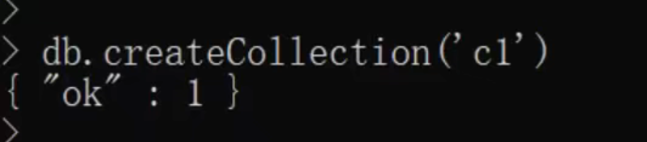
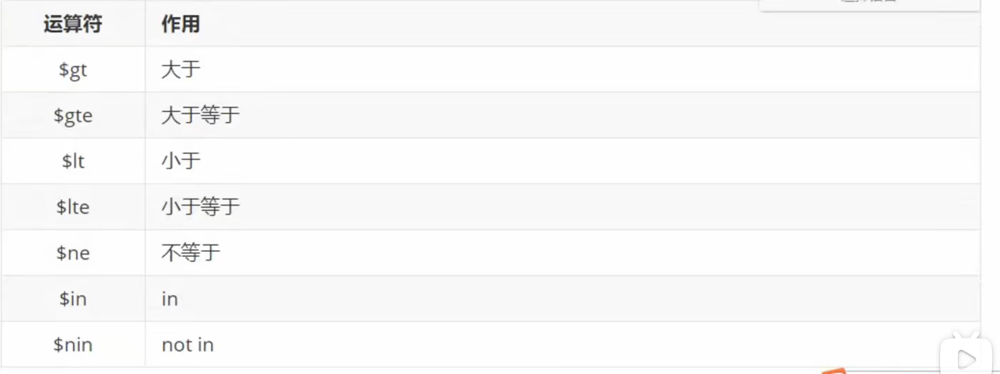
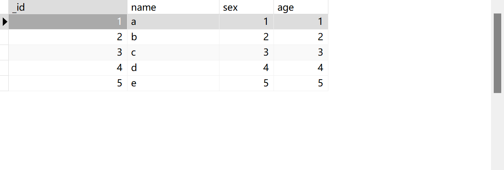

# 1.mongodb基本操作


## 1.查看数据库

：命令行参数方式启动服务

在 bin 目录中打开命令行提示符，输入如下命令：

`mongod --dbpath=..\data\db`

语法：show databases;

效果：


## 2.选择数据库

语法：use 数据库名称

效果：


## 3.查看集合

语法：show collections

效果：


## 4.创建集合

语法: db.createCollection("集合名字");

效果：




## 5.删除集合

语法：db.集合名.drop();

效果：


## 小总结


# 2.文档的增删改查

## 1.增 C (Create)


```mongodb
use test2;
db.createCollection("c1");
db.c1.insert({username:"webopenfather",age:18});
```


## 2.删D (Delete)


## 3.改U(Update)

基础语法：db.集合名.updatae(条件,新数据[是否新增，是否修改多条])

```
是否新增：指条件匹配不到数据则插入(true是插入，false否不插入默认)
是否修改多条数据：指将匹配成功的数据都要修改(true是，false否默认)
```

升级语法

```
db.集合名.update({条件},{新数据})
                     {修改器：{键：值}}
db.c1.update({usename:"zs1"}, {$set:{usename:"zs11"}});
```


```
db.c4.insert({name:"神龙教主",age:888,who:"男",other:"非国人"});
db.c4.find();
db.c4.update({name:"神龙教主"}, {
$set:{name:"神龙教主"},
$inc:{age:111},
$rename:{who:"sex"},
$unset:{other:true}})
```


## 4.查R(Read)

基础语法：db.集合名.find(条件[,查询的列])

```
条件 
   查询所有数据    {}或者不写
   查询age = 6的数据  {age：6}
   既要age=6又要性别=男 {age：6,sex:"男"}
    
 查询的列（可选参数）
   不写 - 查询全部列 （字段
   {age:1} 只显示age列 字段
   {age:0} 除了age列字段都显示
   留心：不管你怎么写系统自定义的_id都会在
```

升级语法：

```
db.集合名.find({键:值})  注：值不直接写
db.集合名.find(
  {
  键：{运算符:值}
  }
)
```



**练习1：查询年龄大于5岁的数据？**

```
db.c1.find({age:{$gt:5}});
```

**练习3：查询年龄是5岁、8岁、10岁的数据？**

```
db.c1.find({age:{$in:[5,8,10]}});
```

**练习：只看年龄列，或者年龄以外的列(_id别管它)?**

```
db.c1.find({},{age:1});只看年龄列
db.c1.find({},{age:0});年龄以外的列
```

# 3.排序和分页

## 1.排序

- 语法：db.集合名.find().sort(JSON数据)
- 说明：键-就是要排序的列/字段、值：1 升序  -1降序

练习：年龄升序或者降序

```
db.c2.find().sort({age:-1}) //降序
db.c2.find().sort({age:1}) //降序
```

## 2.Limit和Skip方法

语法：db.集合名.find().sort().skip(数字).limit(数字)

说明：skip跳过指定数量(可选)，limit限制查询的数量

练习:降序查询两条数据    降序跳过2跳并查询2跳数据

```
db.c2.find().sort({age:-1}).limit(2); :降序查询两条数据
db.c2.find().sort({age:-1}).skip(2).limit(2); 降序跳过2跳并查询2跳数据
```




## 3.实战分页


# 4.聚合查询


## 练习：

- 统计男生、女生的总年龄

```
db.c2.aggregate([
{
   $group:{
	  _id:"$sex",
		年龄:{$sum:"$age"}
	 }
}
])
```

- 统计男生、女生的总人数

```
db.c2.aggregate([
{
   $group:{
	  _id:"$sex",
	  人数:{$sum:1}
	 }
}
])
```

- 求学生的总数的平均年龄

```
db.c2.aggregate([
{
   $group:{
	  _id:null,
		人数:{$sum:1},
		平均年龄:{$avg:"$age"}
	 }
}
])
```

- 查询男生、女生人数，按人数升序

```
db.c2.aggregate([
{
   $group:{
	 _id:"$sex",
	 人数:{$sum:1}
	 },
},
{
 $sort:{
	 rs:1
	 }
}
])
```


