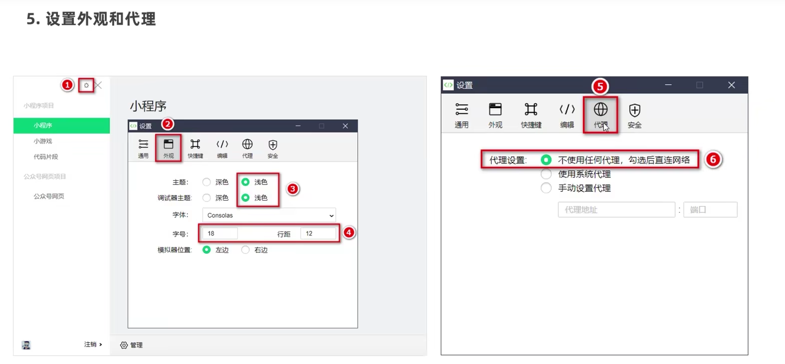
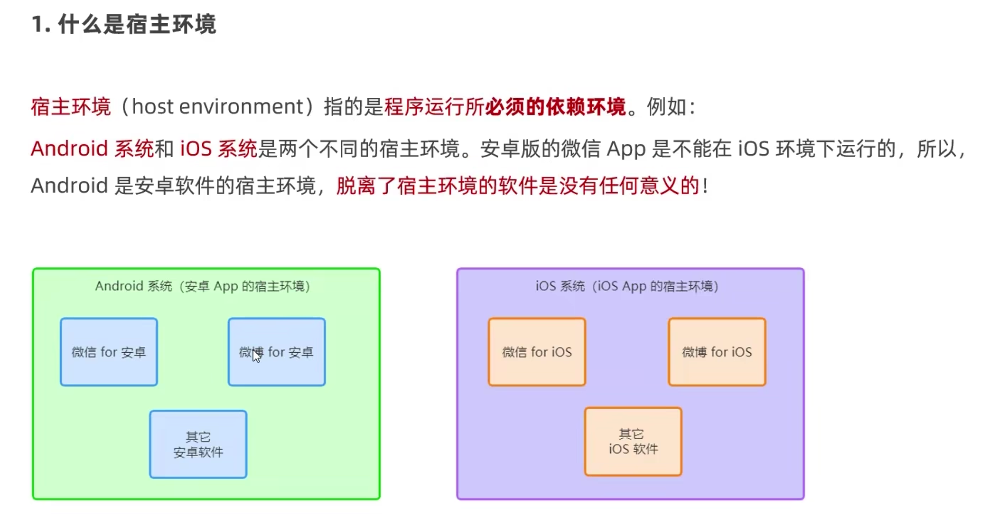

# 1.创建第一个微信小程序

## 1.1设置外观和代理

## 1.2界面的组成部分

## 1.3项目的基本组成结构

### 1.3.1小程序页面组成部分

### 1.3.2Json配置文件的作用

### 1.3.3页面的创建

## 1.4什么是wxml

## 1.5什么是wxss

## 1.6什么是微信里面的js

# 2.小程序的宿主环境

## 1.什么是宿主环境

## 2.组件

### 2.2.1view组件

### 2.2.1scroll-view组件

### 2.2.1swiper和swiper-item组件

