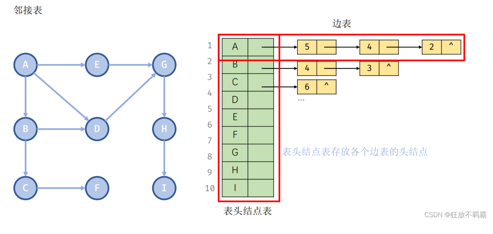
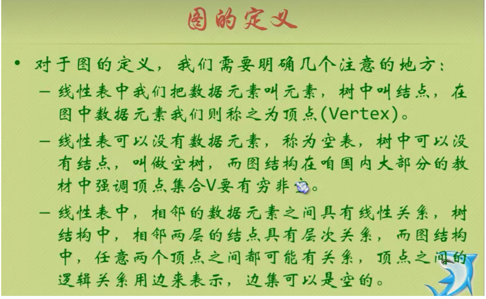
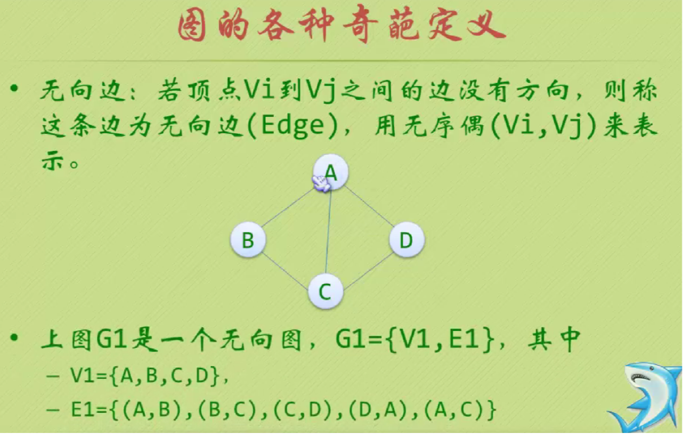
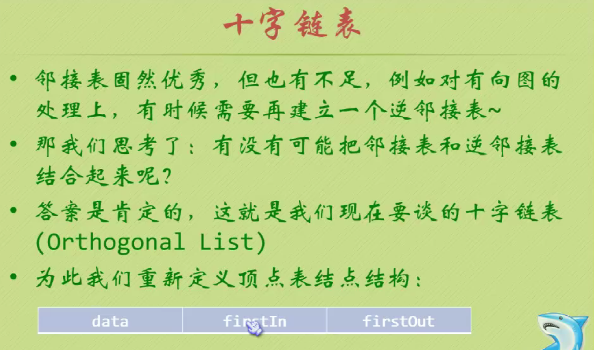

# 1.图的存储结构


**邻接矩阵的存储结构：**

```c
图的种类：

DG —— 有向图、DN —— 有向网、UDG ——无向图、UDN —— 无向网
#define MAX_VERTEX_NUM 20 /* 最多顶点个数 */
#define INFINITY 32768 /* 代表无穷大 */
 
typedef enum{DG, DN, UDG, UDN} GraphKind; /* 图的种类 */
typedef char VertexData;
 
/* 定义弧的类型 */
typedef struct ArcNode {
    AdjType adjvex;
    OtherInfo info;
} ArcNode;
 
/* 定义顶点的类型 */
typedef struct VertexNode {
    VertexData data; //顶点数据，一般为字符标签
} VertexNode;
 
/* 邻接矩阵表示法 */
typedef struct Graph {
    VertexNode vertex[MAX_VERTEX_NUM];               /* 顶点向量 */
    ArcNode arcs[MAX_VERTEX_NUM][MAX_VERTEX_NUM];    /* 邻接矩阵 */
    int vexnum, arcnum;                              /* 图的顶点数和弧数 */
    GraphKind kind;                                  /* 图的种类标志 */
} AdjMatrix, Graph;
```


## 1.邻接矩阵(无向图)


**采用邻接矩阵表示法创建无向网**

> **【算法思想】**
> **①输入总顶点数和总边数**
> **②依次输入点的信息存入顶点表中**
> **③初始化邻接矩阵，使每个权值初始化为极大值**
> **④构造邻接矩阵**
> **【算法描述】**

```c
#include<stdio.h>

#define OK 1
#define Maxint 32767
typedef int status ;

typedef struct
{
	char vexs[100];//顶点表
	int arcs[100][100];//邻接矩阵
	int vexnum,arcnum;//顶点数和边数
}AMGraphy;
status LocateVex(AMGraphy G,int u);
status CreateUDN(AMGraphy &G);

int main()
{
	AMGraphy G;
	CreateUDN(G);//创建邻接矩阵
    printf("邻接矩阵为：\n")
	for(int i=0;i<G.vexnum;i++)
	{
		for(int j=0;j<G.vexnum;j++)
		cout<<G.arcs[i][j]<<" ";
		cout<<endl;
	  }  
	return 0;
}

status CreateUDN(AMGraphy &G)
{//采用邻接矩阵表示法，创建无向网G
   cin>>G.vexnum>>G.arcnum;    //输入总顶点数，总边数 
   for(int i=0;i<G.vexnum;i++)
     cin>>G.vexs[i];          //依次输入点的信息 
     
   for(int i=0;i<G.vexnum;i++)    //初始化邻接矩阵，边的权值均为Maxint 
      for(int j=0;j<G.vexnum;j++)
	    G.arcs[i][j]=Maxint;
		
    for(int k=0;k<G.arcnum;k++)   //构造邻接矩阵 
	{
		char v1,v2;
		int w;
        printf("请输入两点及其之间权值：");
		cin>>v1>>v2>>w;       //输入一条边依附的顶点及权值 
		int i=LocateVex(G,v1);
		int j=LocateVex(G,v2); //确定v1，v1在G中的位置，即顶点数组的下标 
		G.arcs[i][j]=w;       //边<v1,v2>的权值置为w  如果没有权值的话可以弄成1
		G.arcs[j][i]=G.arcs[i][j];	//置<v1,v2>的对称边<v2,v1>的权值为w	
        //在创建无向网的基础上，不复制另一个顶点的往返，表示单向即可。注释掉那行代码。
	}
	return OK;
}

status LocateVex(AMGraphy G,int u)
{
	int i;
	for(i=0;i<G.vexnum;i++)
	  if(u==G.vexs[i]) return i;
	return -1;  
}


```

> **在创建无向网的基础上，不复制另一个顶点的往返，表示单向即可。注释掉那行代码。**


**行就出度，列就是入度。邻接矩阵横向为该顶点的出度，纵向为该节点的入度，度=横向+纵向**

## 2.邻接矩阵(有向图)


## 3.邻接矩阵(网)


**无穷就是代表没有的弧。**

```c
//邻接矩阵存储类型 
 typedef struct {
 	char vexs[100];//顶点集合 
 	int arcs[100][100];//矩阵 
 	int vexnum,arcnum;//顶点数和边数 
 }Graphy;
 
 //创建 邻接矩阵 无向图 
void createGraphy(Graphy *G)
{
//	1.初始化顶点数和边数
	scanf("%d%d",&G.vexnum,&G.arcnum); 
	//2.初始话顶点集合
	for(int i = 0 ; i < G.vexnum ;i++)
	  scanf("%c",&G.vexs[i]);
//	3.将矩阵初始化
	for(int i = 0 ; i < G.vexnum ;i++)
	 for(int j = 0 ; j < G.vexnum;j++)
	   G.arcs[i][j] = -1;
//	4.创建邻接矩阵 
  for(int i = 0 ; i  < G.arcnum ;i++)
  {
  	char v1,v2;
	scanf("%c%c",&v1,&v2);
	 int x = locatevex(G,v1);
	 int y = locatevex(G,v2);
	 G.arcs[x][y] = 1;
	 G.arcs[y][x] = G.arcs[x][y];
  }
}

int locatevex(Graphy G,char u)
{
	for(int i = 0 ; i < G.vexnum ; i++)
	 if(u == G.vexs[i])
	  return i;
	return -1;  
}


//创建 邻接矩阵 有向图 
void createGraphy(Graphy *G)
{
//	1.初始化顶点数和边数
	scanf("%d%d",&G.vexnum,&G.arcnum); 
	//2.初始话顶点集合
	for(int i = 0 ; i < G.vexnum ;i++)
	  scanf("%c",&G.vexs[i]);
//	3.将矩阵初始化
	for(int i = 0 ; i < G.vexnum ;i++)
	 for(int j = 0 ; j < G.vexnum;j++)
	   G.arcs[i][j] = -1;
//	4.创建邻接矩阵 
  for(int i = 0 ; i  < G.arcnum ;i++)
  {
  	char v1,v2;
	scanf("%c%c",&v1,&v2);
	 int x = locatevex(G,v1);
	 int y = locatevex(G,v2);
	 G.arcs[x][y] = 1;
  }
}

int locatevex(Graphy G,char u)
{
	for(int i = 0 ; i < G.vexnum ; i++)
	 if(u == G.vexs[i])
	  return i;
	return -1;  
}

 //创建 邻接矩阵 网 
void createGraphy(Graphy *G)
{
//	1.初始化顶点数和边数
	scanf("%d%d",&G.vexnum,&G.arcnum); 
	//2.初始话顶点集合
	for(int i = 0 ; i < G.vexnum ;i++)
	  scanf("%c",&G.vexs[i]);
//	3.将矩阵初始化
	for(int i = 0 ; i < G.vexnum ;i++)
	 for(int j = 0 ; j < G.vexnum;j++)
	   G.arcs[i][j] = -1;
//	4.创建邻接矩阵 
  for(int i = 0 ; i  < G.arcnum ;i++)
  {
  	char v1,v2,w;
	scanf("%c%c%c",&v1,&v2,&w);
	 int x = locatevex(G,v1);
	 int y = locatevex(G,v2);
	 G.arcs[x][y] = w;
  }
}

int locatevex(Graphy G,char u)
{
	for(int i = 0 ; i < G.vexnum ; i++)
	 if(u == G.vexs[i])
	  return i;
	return -1;  
}
```

销毁邻接矩阵：

```c
void DestroyGraph(Graph *G) {
    G->vexnum = G->arcnum = 0;
    G->kind = UNDEFINED;
}
```

## 4.邻接表(无向图)




存储结构：

```c
typedef char VertexType;//顶点类型由用户定义 
typedef int EdgeType;//边上的权值类型由用户定义 

typedef struct EdgeNode //边表节点 
{
	int adjvex;   //邻接点域， 存储该顶点对应的下标 
	EdgeType info; //用于存储权值。对于非网图可以不需要 
	struct EdgeNode *next; //链域。指向下一个邻接点 
 } EdgeNode;
 
 typedef struct VertexNode //顶点表节点 
 {
 	VertexType data; //顶点域。存储顶点信息 
 	EdgeNode * firstedge;  //边表头指针 
 }VertexNode,AdjList[MaxVex];
 
 typedef struct{
 	AdjList adjList; //L代表整个图的存储结构
 	int vexnum,numEdges;  //图中的顶点树和边数 
 }GraphyList;
```


## 5.邻接表(有向图)


## 6.邻接表(网)


**用邻接表表示法创建图**

```c
typedef char VertexType;//顶点类型由用户定义 
typedef int EdgeType;//边上的权值类型由用户定义 

typedef struct EdgeNode //边表节点 
{
	int adjvex;+  //邻接点域， 存储该顶点对应的下标 
	EdgeType info; //用于存储权值。对于非网图可以不需要 
	struct EdgeNode *next; //链域。指向下一个邻接点 
 } EdgeNode;
 
 typedef struct VertexNode //顶点表节点 
 {
 	VertexType data; //顶点域。存储顶点信息 
 	EdgeNode * firstedge;  //边表头指针 
 }VertexNode,AdjList[MaxVex];
 
 typedef struct{
 	AdjList adjList;
 	int vexnum,numEdges;  //图中的顶点树和边数 
 }GraphyList;
 
 
 //邻接表的创建
 
 void create(GraphyList *G) 
 {
 	 EdgeNode *e； 
 	printf("请输入顶点和边数\n");
 	scanf("%d%d",&G.vexnum,&G.numEdges);//输入顶点和边
	for(int i = 0 ; i < G.vexnum ; i++)
	{
		scanf("%c",&G.adjList[i].data);//输入顶点信息 
		G.adjList[i].firstedge = NULL;//将边表置于空表 
	  }  
	  for(int i = 0 ; i < G.numEdges ; i++)//建立边表 
	  {
	  	printf("请输入节点\n");
		int v1,v2;
		scanf("%c%c",&v1,&v2);//输入的（v1,v2）顶点上的序号
		 e = (EdgeNode*)malloc(sizeof(EdgeNode));//申请节点，生成边表节点 
		 e.adjvex = v2;//邻接序号为i 
	    e.next = G.adjList[v1].firstedge;//将e的指针指向当前顶点指向的节点 
	    G.adjList[v1].firstedge = e;//将当前顶点的节点指向的节点 
	    
          e = (EdgeNode*)malloc(sizeof(EdgeNode));//申请节点，生成边表节点
		 e.adjvex = v1;//邻接序号为ij 
	    e.next = G.adjList[v2].firstedge;//将e的指针指向当前顶点指向的节点
	    G.adjList[v2].firstedge = e;//将当前顶点的节点指向的节点 
	    //这里采用的头插法，所以e.next 指向 G.adjList[i].firstedge
	  }
     //如果是创建有向图的话，v2不用，还有
    //    e = (EdgeNode*)malloc(sizeof(EdgeNode));//申请节点，生成边表节点
	//	 e.adjvex = v2;//邻接序号为ij 
	  //  e.next = G.adjList[v2].firstedge;//将e的指针指向当前顶点指向的节点
//G.adjList[v2].firstedge = e;//将当前顶点的节点指向的节点 
 }
```

**销毁邻接表**

```c
void DestroyGraph(Graph *G) {
    ArcNode * p, * q;
 
    for (int i = 0; i < G->vexnum; ++i) {
        p = G->vertex[i].firstarc;
        /* 释放所有的边界点 */
        while (p != NULL) { /* p在前，q在后 */
            q = p;
            p = p->nextarc;
            free(q);
        }
    }
 
    G->arcnum = G->vexnum = 0;
    G->kind = UNDEFINED;
}
```

```c
//邻接表的存储类型
typedef struct EdgeNode{//边表节点 
	int adjvex;
	EdgeNode *next;
}EdgeNode; 

typedef struct vexNode{//顶点节点 
	int data;
	EdgeNode *firstNode;
}vexNode[100];

typedef struct {//图的类型 
	vexNode vexList;
	int vexnum,arcnum;
}Graphy;

//创建邻接表 无向图
void create(Graphy *G)
{
//	1.初始化顶点和边
  scanf("%d%d",&G.vexnum,&G.arcnum); 
//	2.初始化顶点表
//	3.初始化顶点指针，全部指向null相当于邻接矩阵的置于-1
  for(int i = 0 ; i < G.vexnum ; i++){
  	scanf("%d",G.vexList[i].data);
  	G.vexList[i].firstNode = null;
  }
//	4.创建邻接表 

EdgeNode *e;
for(int i = 0 ; i < G.arcnum ;i++){
	printf("请输入序号");
	int v1,v2;
	scanf("%d%d",&v1,&v2);
	e = (EdgeNode*) malloc(sizeof(EdgeNode));
	e.adjvex = 1;
	e.next = G.vexList[v1].firstNode;
	G.vexList[v1].firstNode = e;
	
	e = (EdgeNode*) malloc(sizeof(EdgeNode));
	e.adjvex = 1;
	e.next = G.vexList[v2].firstNode;
	G.vexList[v2].firstNode = e;
}
}


//创建邻接表有向图
void create(Graphy *G)
{
//	1.初始化顶点和边
  scanf("%d%d",&G.vexnum,&G.arcnum); 
//	2.初始化顶点表
//	3.初始化顶点指针，全部指向null相当于邻接矩阵的置于-1
  for(int i = 0 ; i < G.vexnum ; i++){
  	scanf("%d",G.vexList[i].data);
  	G.vexList[i].firstNode = null;
  }
//	4.创建邻接表 

EdgeNode *e;
for(int i = 0 ; i < G.arcnum ;i++){
	printf("请输入序号");
	int v1,v2;
	scanf("%d%d",&v1,&v2);
	e = (EdgeNode*) malloc(sizeof(EdgeNode));
	e.adjvex = 1;
	e.next = G.vexList[v1].firstNode;
	G.vexList[v1].firstNode = e;
}
}

//创建邻接表 网 
void create(Graphy *G)
{
//	1.初始化顶点和边
  scanf("%d%d",&G.vexnum,&G.arcnum); 
//	2.初始化顶点表
//	3.初始化顶点指针，全部指向null相当于邻接矩阵的置于-1
  for(int i = 0 ; i < G.vexnum ; i++){
  	scanf("%d",G.vexList[i].data);
  	G.vexList[i].firstNode = null;
  }
//	4.创建邻接表 

EdgeNode *e;
for(int i = 0 ; i < G.arcnum ;i++){
	printf("请输入序号");
	int v1,v2;
	char w;
	scanf("%d%d%c",&v1,&v2,&w);
	e = (EdgeNode*) malloc(sizeof(EdgeNode));
	e.adjvex = w;
	e.next = G.vexList[v1].firstNode;
	G.vexList[v1].firstNode = e;
	
}
}
```


# 2.图(顶点与边之间的关系)


## 1.连通图


# 3.图的结构







# 3.十字链表、邻接多重表、边集数组




**存储结构：**

```c
#define MAX_VERTEX_NUM 20 /* 最多顶点个数 */
typedef enum{DG, DN, UDG, UDN} GraphKind; /* 图的种类 */
 
/* 定义顶点结点 */
typedef struct VertexNode {
    VertexData data;
    ArcNode *firstin, *firstout;
} VertexNode;
 
/* 定义弧结点 */
typedef struct ArcNode {
    int tailvex, headvex;
    struct ArcNode *hlink, *tlink;
    OtherInfo info;
} ArcNode;
 
/* 十字链表表示法 */
typedef struct Graph {
    VertexNode vertex[MAX_VERTEX_NUM];
    int vexnum, arcnum; /*图的顶点数和弧数*/
    GraphKind kind;     /*图的种类*/
} OrthList, Graph;
```

```c
用十字链表表示法创建带权有向图 
void CreateGraph(Graph *G) {
    int n, e;
    int i, j, k;
    int kind, w;
    char vt, vh;
    ArcNode *p;
 
    scanf("%d,%d,%d", &kind, &n, &e);
    getchar();
    G->vexnum = n;
    G->arcnum = e;
    G->kind = DN;
 
    /* 生成顶点结点 */
    for (i = 0; i < n; i++) {
        scanf("%c", &G->vertex[i].data);
        G->vertex[i].firstin = NULL;
        G->vertex[i].firstout = NULL;
    }
    getchar();
 
    /* 生成弧结点 */
    for (k = 0; k < e; k++) {
        scanf("%c,%c,%d", &vt, &vh, &w);
        getchar();
        i = LocateVertex(G, vt);
        j = LocateVertex(G, vh);
        p = (ArcNode *)malloc(sizeof(ArcNode));
        p->info.weight = w;
        p->tailvex = i;
        p->headvex = j;
        /* 头插法 */
        p->tlink = G->vertex[i].firstout;
        G->vertex[i].firstout = p;
        p->hlink = G->vertex[j].firstin;
        G->vertex[j].firstin = p;
    }
}
```

**销毁十字链表**

> 邻接表中的所有弧结点被释放掉了，自然逆邻接表中的所有弧结点也被释放掉了。

```c
void DestroyGraph(Graph *G) {
    ArcNode *p, *q;
 
    for (int i = 0; i < G->vexnum; i++) {
        p = G->vertex[i].firstout;
        while (p != NULL) {
            q = p;
            p = p->tlink;
            free(q);
        }
    }
}
```


# 4.图的遍历深度优先


***e存储的是每个节点的值，ne是每个节点的下一个节点***


邻接矩阵的形式:

> 它是从图中的某个顶点v出发，访问此顶点，然后从v的未访问的邻接点出发，深度优先遍历图直到图中所有和v有路径相通的顶点都被访问到。若图中尚有顶点未访问，则选择图中另外未被访问的顶点做起点，重复上述过程，直到图中的所有顶点都被访问到为止。

```c
#define MAXVEX 9
Boolean visited[MAXVEX] ;//访问数组的标志

//邻接矩阵的深度优先递归算法
void dfs(Graphy G,int i)
{
	int j;
	 visited[i] = TRUE;
	 printf("%c",G.vexs[i]);//打印顶点 
	 for(j = 0 ; j < G.vexnum ; j++)
	  if(1 == G.arcs[j][i] && !visited[j])//书上是 G.arcs[i][j] 但是我认为如果ij的话就是入度，而且横着的是出度。shu'z
	   dfs(G,j);   //对未访问的邻接节点递归调用 
}

//邻接矩阵的深度遍历操作 
void DfsTraverse(Graphy G)
{
	for(int i = 0 ; i < G.vexnum ;i++)
	visited[i] = FALSE; //初始所有的顶点状态都是未访问的状态 
	for(int i = 0 ; i<G.vexnum ;i++ )
	if(!visited[i]) //对未访问过的节点调用bfs，若为连通图仅执行一次 
	 dfs(G,i);
}
```

**邻接表的形式**

```c

```


## 4.2骑士周游问题


### 第一种方式

```c
#include<stdio.h>
#include<time.h> 
#define X 8 
#define Y 8 //定义棋盘的长和宽，默认为8*8

int chess[X][Y];//定义全局变量（二维数组），表示棋盘每个格子在第几步的时候走过；

int nextxy(int *x, int *y, int count);//找到基于(x, y)位置的下一个可走的位置
int TravelChess(int x, int y, int tag);//深度优先遍历整个棋盘
void printChess();//打印棋盘
void initChess();//初始化棋盘

int nextxy(int *x, int *y, int count)//找到基于(x, y)位置的下一个可走的位置，count为选择8个方向中的一个；
{
	switch (count)
	{
	case 0:
	{
		if (*x + 2 <= X - 1 && *y - 1 >= 0 && chess[*x + 2][*y - 1] == 0)//如果马向右走2格，还在棋盘的长度范围内，且纵向也在宽度范围内，也就是没有走出棋盘；X-1是因为8个格子是从0-7；//并且下个位置没有被遍历过；
		{
			*x += 2;
			*y -= 1;//就把位置移到下个位置，也就是往右2上1走一步；
			return 1;//表示下个位置可走
		}
		break;
	}
	case 1:
	{
		if (*x + 2 <= X - 1 && *y + 1 <= Y - 1 && chess[*x + 2][*y + 1] == 0)//右2下1
		{
			*x += 2;
			*y += 1;
			return 1;
		}
		break;
	}
	case 2:
	{
		if (*x + 1 <= X - 1 && *y - 2 >= 0 && chess[*x + 1][*y - 2] == 0)//右1上2
		{
			*x += 1;
			*y -= 2;
			return 1;
		}
		break;
	}
	case 3:
	{
		if (*x + 1 <= X - 1 && *y + 2 <= Y - 1 && chess[*x + 1][*y + 2] == 0)//右1下2
		{
			*x += 1;
			*y += 2;
			return 1;
		}
		break;
	}
	case 4:
	{
		if (*x - 2 >= 0 && *y - 1 >= 0 && chess[*x - 2][*y - 1] == 0)//左2上1
		{
			*x -= 2;
			*y -= 1;
			return 1;
		}
		break;
	}
	case 5:
	{
		if (*x - 2 >= 0 && *y + 1 <= Y - 1 && chess[*x - 2][*y + 1] == 0)//左2下1
		{
			*x -= 2;
			*y += 1;
			return 1;
		}
		break;
	}
	case 6:
	{
		if (*x - 1 >= 0 && *y - 2 >= 0 && chess[*x - 1][*y - 2] == 0)//左1上2
		{
			*x -= 1;
			*y -= 2;
			return 1;
		}
		break;
	}
	case 7:
	{
		if (*x - 1 >= 0 && *y + 2 <= Y - 1 && chess[*x - 1][*y + 2] == 0)//左1下2
		{
			*x -= 1;
			*y += 2;
			return 1;
		}
		break;
	}
	default:
		break;
	}
	return 0;//无路可走
}

int TravelChess(int x, int y, int tag)//深度优先遍历整个棋盘；//(x, y)为起始位置，tag为步数，每走一步tag+1；
{
	int x1 = x;
	int y1 = y;
	int flag = 0;
	int count = 0;
	chess[x][y] = tag;//一开始所在的位置为1，步数也为1，一开始传进来的tag=1；

	if (tag == X * Y)//棋盘每个格子都走到了//递归退出的条件
	{
		printChess();//打印整个棋盘
		return 1;//如果走满了整个棋盘，最终会在这里return 1，不会在下面return 0；
	}

	flag = nextxy(&x1, &y1, count);//找到马的下一个可走的坐标，如果找到，flag = 1，否则为0；
	while (flag == 0 && count < 7)
	{
		count++;
		flag = nextxy(&x1, &y1, count);//如果没找到下一个可走的坐标，就count++，找下一个方向是否可走；
	}

	while (flag != 0)
	{
		if (TravelChess(x1, y1, tag+1) != 0)//递归
		{
			return 1;
		}
		//继续找下一步可走的坐标，如果找到，flag = 1，否则为0；
		x1 = x;
		y1 = y;
		count++;
		flag = nextxy(&x1, &y1, count);
		while (flag == 0 && count < 7)
		{
			count++;
			flag = nextxy(&x1, &y1, count);
		}
	}
	//都没找到，flag == 0了
	if (flag == 0)
	{
		chess[x][y] = 0;//重新开始找
	}
	return 0;
}

void printChess()//打印棋盘
{
	for (int i = 0; i < X; i++)
	{
		for (int j = 0; j < Y; j++)
		{
			printf("%2d\t", chess[i][j]);
		}
		printf("\n");
	}
	printf("\n");
}

void initChess()//初始化棋盘
{
	for (int i = 0; i < X; i++)
	{
		for (int j = 0; j < Y; j++)
		{
			chess[i][j] = 0;
		}
	}
}


int main()
{
	//cout << pow(8, 64) << endl;//8*8棋盘一共有8^64种走法
	//cout << CLOCKS_PER_SEC <<endl;//每秒1000次

	clock_t start = clock();//获取系统的时间戳

	initChess();
	if (TravelChess(2, 0, 1) == 0)//(2, 0)这个点比较容易得到结果，一开始tag=1；
	{
		printf("马踏棋盘失败！\n");
	}

	clock_t finish = clock();//获取系统的时间戳

	printf("\n本次计算一共耗时： %f秒\n\n", (double)(finish - start)/CLOCKS_PER_SEC);//CLOCKS_PER_SEC相当于CPU的频率

//	system("pause");
	return 0;
}
```

### 第二种方式

```c
#include <stdio.h>
#include <stdlib.h>
 
int chess[8][8] = {0};  // 初始化棋盘
int step = 1;   // 记录步数
 
void recurse(int x, int y)
{
    if ( x-2 >= 0 && y-1 >= 0 && 0 == chess[x-2][y-1] )//代表下一步可以走 
    {
        step ++;
        chess[x-2][y-1] = step;//将下一步的坐标记录下来 
        recurse(x-2, y-1);
        chess[x-2][y-1] = 0;//如果走到这一步代表下一步是走不通的，就将下一步置于0
        step --;//将刚试走的那一步减去 
    }
    if ( x-2 >= 0 && y+1 <= 7 && 0 == chess[x-2][y+1] )
    {
        step ++;
        chess[x-2][y+1] = step;
        recurse(x-2, y+1);
        chess[x-2][y+1] = 0;
        step --;
    }
    if ( x-1 >= 0 && y-2 >= 0 && 0 == chess[x-1][y-2] )
    {
        step ++;
        chess[x-1][y-2] = step;
        recurse(x-1, y-2);
        chess[x-1][y-2] = 0;
        step --;
    }
    if ( x-1 >= 0 && y+2 <= 7 && 0 == chess[x-1][y+2] )
    {
        step ++;
        chess[x-1][y+2] = step;
        recurse(x-1, y+2);
        chess[x-1][y+2] = 0;
        step --;
    }
    if ( x+1 <= 7 && y-2 >= 0 && 0 == chess[x+1][y-2] )
    {
        step ++;
        chess[x+1][y-2] = step;
        recurse(x+1, y-2);
        chess[x+1][y-2] = 0;
        step --;
    }
    if ( x+1 <= 7 && y+2 <= 7 && 0 == chess[x+1][y+2] )
    {
        step ++;
        chess[x+1][y+2] = step;
        recurse(x+1, y+2);
        chess[x+1][y+2] = 0;
        step --;
    }
    if ( x+2 <= 7 && y-1 >= 0 && 0 == chess[x+2][y-1] )
    {
        step ++;
        chess[x+2][y-1] = step;
        recurse(x+2, y-1);
        chess[x+2][y-1] = 0;
        step --;
    }
    if ( x+2 <= 7 && y+1 <= 7 && 0 == chess[x+2][y+1] )
    {
        step ++;
        chess[x+2][y+1] = step;
        recurse(x+2, y+1);
        chess[x+2][y+1] = 0;
        step --;
    }
    if ( 64 == step )//如果走到了64步，就代表全部走完了
    {
        for (int i = 0; i < 8; i++)
        {
            for (int j = 0; j < 8; j++)
            {
                printf("%-3d  ", chess[i][j]);
            }
            printf("\n");
        }
        exit(0);
    }
}
 
int main(void)
{
    chess[2][0] = 1;    // 初始化起点
    recurse(2, 0);
    return 0;
}
```

# 5.图的广度优先


# 6.最小生成树


## 1.普利姆算法(Prim)


```c
#include<stdio.h>
#define Ars 6
#define INF 999

void Prim(int arcs[][Ars],int v)
{
 char a[Ars] = {'A','B','C','D','E','F'};
 int i,j,k,min,total =0;
 int adjvex[Ars];
 int lowstcost[Ars];
 for(i = 0 ;i < Ars ;i++)
 {
  lowstcost[i] = arcs[v][i];
  adjvex[i] = 0;
 }
 for(i = 1; i < Ars ; i++)
 {
  j = 0,k = 0,min = INF;
  while(j < Ars)
  {
   if(lowstcost[j] != 0 && lowstcost[j] < min)
   {
    min = lowstcost[j];
    k = j;
   }
   j++;
  }
  printf("%c-->%c    %d\n",a[adjvex[k]],a[k],min);
  total += min;
  lowstcost[k] = 0;
  for(j = 1 ; j < Ars ; j++)
  {
   if(lowstcost[j] != 0 && arcs[k][j] < lowstcost[j] )
   {
    lowstcost[j] = arcs[k][j];
    adjvex[j] = k;
   }
  }
 }
 printf("\n最小路径：%d\n",total);
}


int main()
{
 int arsc[][Ars] ={
 {INF,6,1,5,INF,INF},
 {6,INF,5,INF,3,INF},
 {1,5,INF,5,6,4},
 {5,INF,5,INF,INF,2},
 {INF,3,6,INF,INF,6},
 {INF,INF,4,2,6,INF},
 };
 Prim(arsc,0);
 return 0;
}
```

