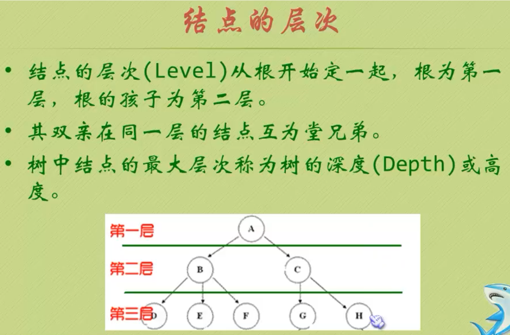
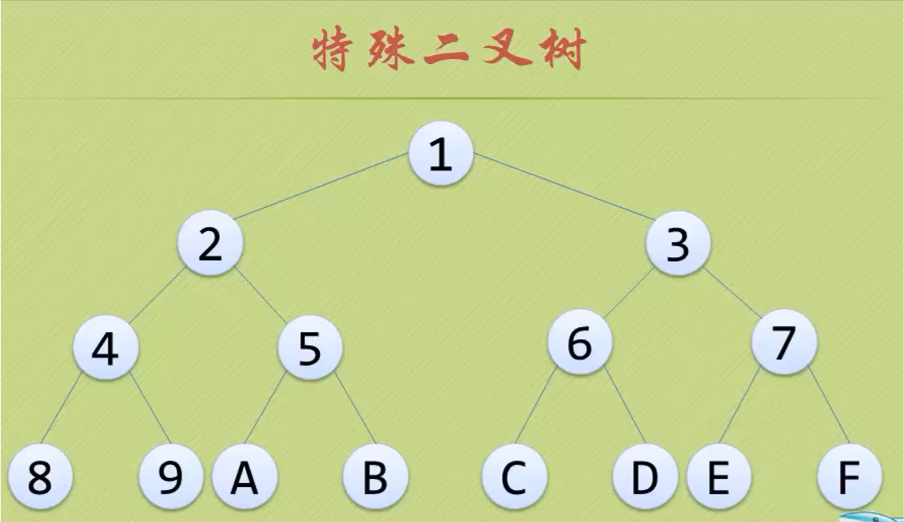

# 1.树的定义





# 2.树的存储结构


## 1.双亲表示法


## 2.孩子表示法


# 3.二叉树





## 1.二叉树的性质

### 1.性质一：


### 2.性质二


### 3.性质三


### 4.性质四


### 5.性质五


## 2.二叉链表


## 3.二叉树的遍历


```c
#include<stdio.h>
#include<stdlib.h>
typedef char ElemType;
typedef struct BiTNode
{
    ElemType data;
    struct BiTNode *lchild,*rchild;
}  BiTNode,*BiTree;

//创建二叉树
createBitree(BiTree *T)
{
    char c;
    scanf("%c",&c);
    if(' ' == c){
        *T = NULL;
    } else{
        *T = (BiTNode *)malloc(sizeof(BiTNode));
        (*T)->data = c;
        createBitree(&(*T)->lchild);
        createBitree(&(*T)->rchild);
    }
}
vist(ElemType e,int level)
{
    printf("%c在第%d层\n",e,level);
}
//遍历二叉树
show(BiTree T ,int level)
{
    if(T)
    {
        vist(T->data,level);
        show(T->lchild,level+1);
        show(T->rchild,level+1);
    }
}
int main()
{
    int level = 1;
    BiTree T = NULL;
    createBitree(&T);
    show(T,level);
}
```

# 4.线索二叉树


```c
#include<stdio.h>
#include<stdlib.h>
typedef char ElemType;
//线索存储标志
//Link(0):指向左右孩子
//thread(1):指向前后继结点得线索
typedef enum{Link,thread} pointerNag;
typedef struct BiThrNode
{
    ElemType data;
    struct BiThrNode *lchild,*rchild;
    pointerNag ltag;
    pointerNag rtag;
}BiThrNode,*BiThrTree;
//创建全局变量
BiThrTree pre;
//创建一个二叉树，用户约定用前序遍历创建二叉树
createBiTree(BiThrTree *T)
{
    char c;
    scanf("%c",&c);
    if(' ' == c){
        *T = NULL;
    }else{
        *T = (BiThrNode *)malloc(sizeof(BiThrNode));
        (*T)->data = c;
        (*T)->ltag = Link;
        (*T)->rtag = Link;
        createBiTree(&(*T)->lchild);
        createBiTree(&(*T)->rchild);
    }
}
//遍历二叉树，用中序遍历
InThreading(BiThrTree T)
{
    if( T )
    {
        InThreading(T->lchild);//左孩子线索化
        if(!T->lchild)//如果该结点没有左孩子，设置itag为Thread，并把lchild指向刚刚访问得结点
        {
            T->ltag = thread;
            T->lchild = pre;
         }
         if(!pre -> rchild)
         {
             pre ->rtag = thread;
             pre -> rchild = T;
         }
         pre = T;
        InThreading(T->rchild);//右孩子线索化
    }else{
        
    }
}
inoreding(BiThrTree *p,BiThrTree T)
{
    *p = (BiThrTree)malloc(sizeof(BiThrNode));
    (*p) -> ltag = Link;
    (*p) -> rtag = thread;
    (*p) -> lchild = *p;
    if(!T)
    {
        (*p) ->lchild = *p;
    }else
    {
        (*p) -> lchild = T;
        pre = *p;
        InThreading(T);
        pre -> rchild = *p;
        pre -> rtag = thread;
        (*p) ->rchild = pre;
    }
}
int main()
{
    BiThrTree p, T = NULL;
    createBiTree(&T);
    inoreding(&p,T);
    return 0;
}
```

## 1.树转化二叉树


## 2.森林转化二叉树


## 3.二叉树转换树、森林


# 5.二叉树的性质：

