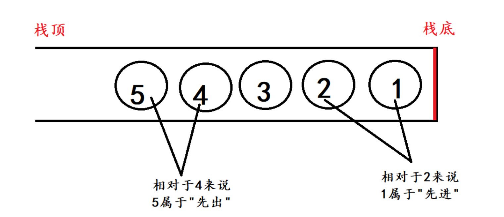
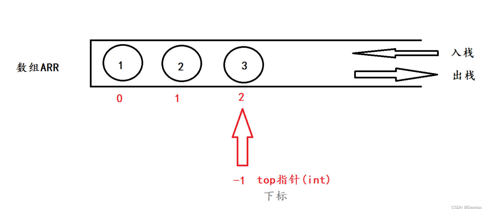
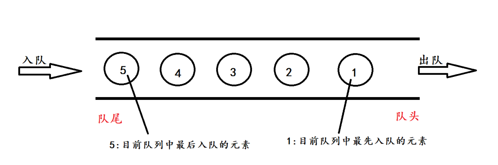

# 栈



1. **栈只能从一端存取,另一端是封闭的**
2. **在栈中,不论是存还是取,都必须遵循"先进后出"的原则**

**栈是一种只能从表的一端存取数据,且遵循"先进后出"原则的线性存储结构**

**进栈和出栈**

**进栈:将数据存储到栈里面去**

**出栈:将数据从栈中间取出来**

**栈的实现方法**

**栈:有点"特殊"的线性存储结构**

- **顺序表==>顺序栈 (顺序存储结构)**
- **链表==>链栈 (链式存储结构)**

## 1.顺序栈



```c
#include<stdio.h>

// ** 元素进栈 
// 参数: 存储结构,栈顶指针,数据 
// 返回值: 栈顶指针 
int push(int *arr,int top,int val)
{
	arr[++top] = val;
	return top;
}

// ** 元素出栈 
// 参数: 存储结构,栈顶指针 
// 返回值: 栈顶指针 
int pop(int *arr,int top)
{
	if(top == -1){
		printf("出栈失败\n");
	  return -1;
	}
	printf("%d\n",arr[top]);
	top--;
	return top;
	
}

int main()
{
	int arr[100];
	int top = -1;//初始化top
	top = push(arr,top,1);
	top = push(arr,top,2);
	top = push(arr,top,3);
	top = push(arr,top,4);
	
	top = pop(arr,top);
    return 0;
}
```

## 2.链栈

**一般会将链表的头部作为栈顶,尾部作为栈底**

```c
#include<stdio.h>
#include<stdlib.h>

typedef struct Node{
	int data;
	struct Node *next;
}Node;
// **添加元素 
// 参数: 头指针,数据 
// 返回值: 头指针 
Node* push(Node *Stack,int val)
{
	Node *q;
	q = (Node*)malloc(sizeof(Node));
	q->data = val;
	q->next = Stack;
	Stack = q;
	return Stack;
}

// **删除元素 
// 参数: 头指针 
// 返回值: 头指针
Node* pop(Node *Stack)
{
	Node *q = Stack;
	if(Stack == NULL){
		printf("栈已经为空\n");
		return NULL;
	}
	Stack = Stack ->next;
	printf("%d\n",q->data);
	free(q);
	return Stack;
}

int main()
{
	Node *Stack = NULL;
	Stack = push(Stack,1);
	Stack = push(Stack,2);
	Stack = push(Stack,3);
	Stack = push(Stack,4);
	
   Stack=pop(Stack);
    Stack=pop(Stack);
    Stack=pop(Stack);
    Stack=pop(Stack);
    Stack=pop(Stack);
	return 0;
}
```


# 队列



队列的两端都"开口",要求:只能从一端进入队列,从另一端出队列

队头和队尾

队头: 数据出队列的一端

队尾: 数据进入队列的一端

队列的实现方法

1. 顺序表==>顺序队列
2. 链表==>链队列

## 顺序队列

```c
#include<stdio.h>


// **入队 
// 参数: 存储结构,队尾,数据 
// 返回值: 队尾 
int enQueue(int *arr,int tail,int val)
{
	arr[tail++] = val;
	return tail;
}


// **出队 
// 参数: 存储结构,队头,队尾 
// 返回值: 队头 
int pop(int *arr,int front,int tail)
{
	if(front >= tail){
		printf("队列为空\n");
		return -1;
	}else{
		printf("%d\n",arr[front]);
		front++;
		return front;
	}
}


int main()
{
	int arr[100];
	int front = 0,tail = 0;
	tail = enQueue(arr,tail,1);
	tail = enQueue(arr,tail,2);
	tail = enQueue(arr,tail,3);
	tail = enQueue(arr,tail,4);
	tail = enQueue(arr,tail,5);
	
	
	front =  deQueue(arr,front,tail) ;
	front =  deQueue(arr,front,tail) ;
	front =  deQueue(arr,front,tail) ;
	front =  deQueue(arr,front,tail) ;
	front =  deQueue(arr,front,tail) ;
	front =  deQueue(arr,front,tail) ;
	return 0;
 } 
```

