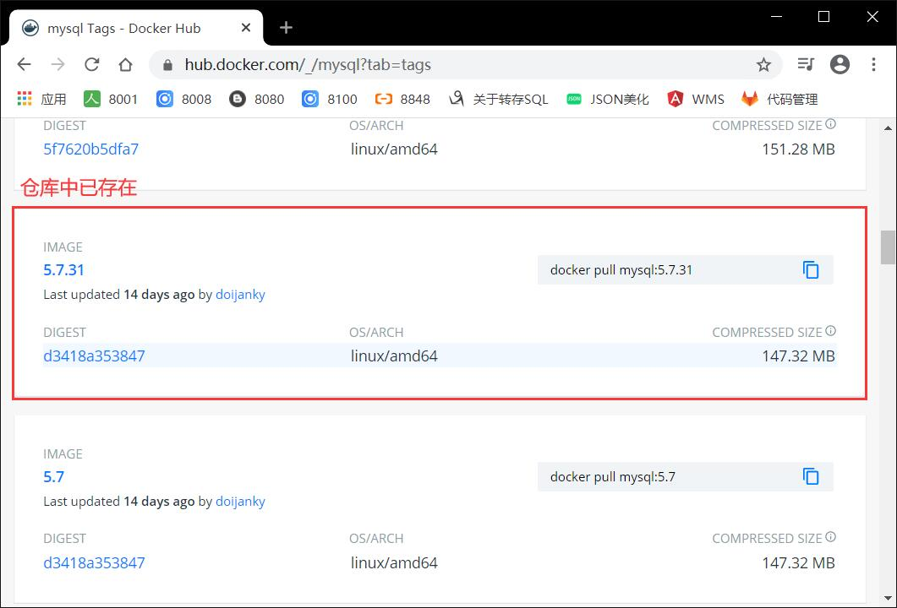
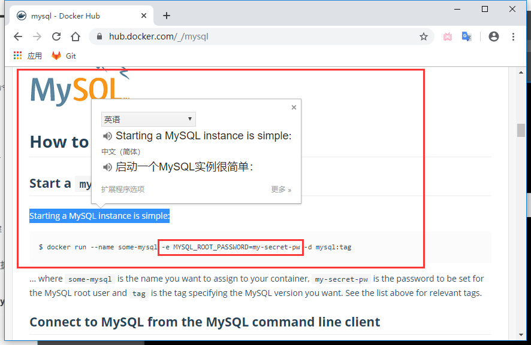

# Docker学习笔记

docker 是一个开源的应用容器引擎，让开发者可以打包他们的应用以及依赖包到一个可移植的镜像中，然后发布到任何流行的 linux 或 windows 机器上。他基于虚拟化技术为每个镜像创建独立的容器，相互之间不干扰，可以做到秒级启动程序。

笔记基于 Centos7 进行学习。

## Docker安装和运行

>根据官方文档走一遍安装流程

**1. **在安装之前，首先要保证系统中没有相关残留导致安装失败，卸载/清理依赖

```bash
yum remove docker \
    docker-client \
    docker-client-latest \
    docker-common \
    docker-latest \
    docker-latest-logrotate \
    docker-logrotate \
    docker-engine
```

**2. **清理依赖结束后，就需要安装 docker 所需的依赖了

~~~
yum install -y yum-utils
~~~

**3. **依赖安装完成后需要下载 docker 程序，官方默认提供的是国外的下载地址，这里换用阿里云的比较快

~~~bash
yum-config-manager \
    --add-repo \
    http://mirrors.aliyun.com/docker-ce/linux/centos/docker-ce.repo
~~~

**4. **下载地址更换完成后就可以进行下载了，稍等片刻后 docker 就会安装成功

~~~bash
yum -y install docker-ce docker-ce-cli containerd.io
~~~


> docker 运行

到目前为止如果上面命令都没有出现问题的话，docker 就已经安装完成了，接下来我们来运行一下 docker

~~~bash
# 启动docker服务
systemctl start docker
# 相对应的结束docker服务
systemctl stop docker
~~~

如果执行之后什么反应也没有就证明运行成功了，我们来查看一下当前 docker 的版本信息，执行正常的话就会打印出一堆版本相关的信息

~~~
docker version
~~~

接下来我们来运行一个 `hello-world` 的镜像来看一下运行流程

~~~
docker run hello-world
~~~

让我们详细查看一下运行的流程：


> 配置阿里云镜像加速

之前我们安装 docker 的时候使用的就是阿里云的镜像地址，下载速度相比于原地址快了不少，接下来我们想要让 docker 下载其他镜像包的时候也是用阿里镜像地址，过程如下：

1. 登陆/注册 阿里云官方网站
2. 点进控制台
3. 打开左侧侧边栏找到 `容器镜像服务` 并点击
4. 找到左侧最下面的 `镜像加速器`
5. 选择符合环境的代码执行即可：

~~~bash
# 每个人的地址都不一样，我这里的镜像加速地址为：
sudo mkdir -p /etc/docker
sudo tee /etc/docker/daemon.json <<-'EOF'
{
  "registry-mirrors": ["https://lvqfsd83.mirror.aliyuncs.com"]
}
EOF
sudo systemctl daemon-reload
sudo systemctl restart docker
~~~


## Docker常用命令

先来简单介绍一下 `镜像` 和 `容器` 之前的关系，镜像可以理解为一个模板，java 中的一个类，我们想使用 docker 安装一个 mysql 的话首先要将镜像下载到本地，然后通过镜像启动一个容器，一个镜像可以启动多个容器，就像 java 中一个类可以创建多个实例，容器与容器之前都是相互隔离的。

> docker 命令导图 ( 官方文档 )


### 常见帮助命令

docker 中的帮助命令，后面都会接触到：

~~~bash
docker version       # 查看docker版本信息
docker info          # 查看docker详细信息
docker *** --help    # 查看某个命令的帮助命令
docker stats         # 查看当前docker运行状态
docker ** inspect    # 查看元数据
docker history **    # 查看镜像构建历史
~~~

`docker version` 是查看版本信息的，类似 `java -version`，就不细说了，`docker info` 命令执行后会出现如下结果：

~~~bash
[root@MiWiFi-R4AC-srv ~]# docker info
Client:
 Debug Mode: false

Server:
 Containers: 2  # 当前容器有2个
  Running: 0    # 正在运行的有0个
  Paused: 0     # 暂停运行的有0个
  Stopped: 2    # 停止运行的有2个
 Images: 1      # 镜像有1个
 ...... 省略一大堆
~~~

`dockers *** help` 则是当你某个命令不知道怎么用的时候可以查看一下帮助文档，后面会简单的介绍一下


### 基本镜像命令

> images 查看所有镜像

`docker images` 命令的作用是查看镜像信息，他可以直接使用，同时也可以携带参数使用

~~~bash
# 直接使用会显示镜像信息
[root@MiWiFi-R4AC-srv ~]# docker images
REPOSITORY          TAG                 IMAGE ID            CREATED             SIZE
hello-world         latest              bf756fb1ae65        7 months ago        13.3kB
~~~

这里简单说一下显示的信息含义：

- `REPOSITORY`：当前镜像名称
- `TAG`：当前镜像版本号，当下载镜像时未指定版本号时，默认就会下载 latest 最新版
- `IMAGE ID`：当前镜像的 ID
- `CREATED`：镜像下载的时间
- `SIZE`：镜像占用大小 ( 一个 hello-world 才占用了 13.3kb 而已 )

~~~bash
# 使用 -a 命令代表显示所有的镜像信息，目前和直接使用差别不大
[root@MiWiFi-R4AC-srv ~]# docker images -a
REPOSITORY          TAG                 IMAGE ID            CREATED             SIZE
hello-world         latest              bf756fb1ae65        7 months ago        13.3kB
~~~

~~~bash
# 使用 -q 命令代表仅显示镜像的ID，可以配合上一个一起使用: docker images -aq
[root@MiWiFi-R4AC-srv ~]# docker images -q
bf756fb1ae65
~~~

images 的命令常用的只有这些，如果你有些命令参数忘记怎么用，或者想要查询一些新的命令参数，就可以使用上面提到的 `--help` 命令，他会遍历出几乎所有的命令：

~~~bash
[root@MiWiFi-R4AC-srv ~]# docker images --help

Usage:	docker images [OPTIONS] [REPOSITORY[:TAG]]

List images

Options:
  -a, --all             Show all images (default hides intermediate images)
      --digests         Show digests
  -f, --filter filter   Filter output based on conditions provided
      --format string   Pretty-print images using a Go template
      --no-trunc        Don't truncate output
  -q, --quiet           Only show numeric IDs
~~~


> search 搜索 docker 仓库( docker hub )

`docker search` 的命令就是搜索 docker hub 也就是 docker 仓库中已存在的镜像信息，假设说我现在要下载 mysql 的镜像，就可以先通过 search 命令查询 docker 仓库是否包含 mysql 的镜像，不过还是建议在官网查看 docker 仓库

Docker 仓库地址：`https://hub.docker.com/`

~~~bash
[root@MiWiFi-R4AC-srv ~]# docker search mysql
NAME                              DESCRIPTION                                     STARS               OFFICIAL            AUTOMATED
mysql                             MySQL is a widely used, open-source relation…   9854                [OK]                
mariadb                           MariaDB is a community-developed fork of MyS…   3599                [OK]                
mysql/mysql-server                Optimized MySQL Server Docker images. Create…   720                                     [OK]
percona                           Percona Server is a fork of the MySQL relati…   502                 [OK]                
.........
~~~


> pull 下载镜像

`docker pull` 命令就是从 docker hup 中下载镜像到本地，现在咱们继续上面的思路来下载 mysql

~~~bash
# 注意这个命令默认下载的是仓库中最新版本的mysql
# 这里我们要安装5版本的，我们就手动指定版本安装一下
# docker pull mysql

[root@MiWiFi-R4AC-srv ~]# docker pull mysql:5.7.31
5.7.31: Pulling from library/mysql
bf5952930446: Pull complete 
8254623a9871: Pull complete 
938e3e06dac4: Pull complete 
ea28ebf28884: Pull complete 
f3cef38785c2: Pull complete 
894f9792565a: Pull complete 
1d8a57523420: Pull complete 
5f09bf1d31c1: Pull complete 
1b6ff254abe7: Pull complete 
74310a0bf42d: Pull complete 
d398726627fd: Pull complete 
Digest: sha256:da58f943b94721d46e87d5de208dc07302a8b13e638cd1d24285d222376d6d84
Status: Downloaded newer image for mysql:5.7.31
docker.io/library/mysql:5.7.31
~~~

注意这里指定的版本必须是 docker 仓库中已存在的




> rmi 删除镜像

`docker rmi` 是删除某个镜像的命令，rm 在 Linux 中代表删除的意思，i 代表的就是 images，后面跟上目标镜像的 ID 可以进行删除操作，也可以同时删除多个

~~~bash
# 我们来删除一下方才下载的 mysql
[root@MiWiFi-R4AC-srv ~]# docker rmi 718a6da099d8
Untagged: mysql:5.7.31
Untagged: mysql@sha256:da58f943b94721d46e87d5de208dc07302a8b13e638cd1d24285d222376d6d84
Deleted: sha256:718a6da099d82183c064a964523c0deca80619cb033aadd15854771fe592a480
Deleted: sha256:058d93ef2bfb943ba6a19d8b679c702be96e34337901da9e1a07ad62b772bf3d
Deleted: sha256:7bca77783fcf15499a0386127dd7d5c679328a21b6566c8be861ba424ac13e49
Deleted: sha256:183d05512fa88dfa8c17abb9b6f09a79922d9e9ee001a33ef34d1bc094bf8f9f
Deleted: sha256:165805124136fdee738ed19021a522bb53de75c2ca9b6ca87076f51c27385fd7
Deleted: sha256:904abdc2d0bea0edbb1a8171d1a1353fa6de22150a9c5d81358799a5b6c38c8d
Deleted: sha256:d26f7649f78cf789267fbbca8aeb234932e230109c728632c6b9fbc60ca5591b
Deleted: sha256:7fcf7796e23ea5b42eb3bbd5bec160ba5f5f47ecb239053762f9cf766c143942
Deleted: sha256:826130797a5760bcd2bb19a6c6d92b5f4860bbffbfa954f5d3fc627904a76e9d
Deleted: sha256:53e0181c63e41fb85bce681ec8aadfa323cd00f70509107f7001a1d0614e5adf
Deleted: sha256:d6854b83e83d7eb48fb0ef778c58a8b839adb932dd036a085d94a7c2db98f890
Deleted: sha256:d0f104dc0a1f9c744b65b23b3fd4d4d3236b4656e67f776fe13f8ad8423b955c
~~~

~~~bash
# 强制删除
docker -f rmi
# 同时删除多个
docker rmi *** *** ***
# 小技巧：巧用linux命令删除全部镜像--将所有镜像ID作为rmi的参数
docker rmi $(docker images -aq)
~~~


### 容器相关命令

镜像的命令我们学习的差不多了，接下来我们来学习一下基于镜像运行的 **容器命令**，首先我们需要下载一个镜像以便于后面的学习，这里就下载一个 centos 镜像：

~~~bash
docker pull centos:centos7
~~~


#### 基本命令

> run 运行容器

镜像下载完成后，我们就基于这个镜像使用 `docker run` 命令启动第一个容器

~~~bash
# 运行centos的centos7版本
[root@localhost bin]# docker run centos:centos7
~~~

容器运行时的参数有很多，这里简单介绍一下日后都会用到：

~~~bash
docker run
  --name  为容器指定一个名称
  -d   后台运行容器，并返回容器ID
  -it  进入交互模式，可以通过控制台操作
  -p   小写-设置端口映射【主机端口:容器端口】
  -P   大写字母P：随机指定端口
  -i   以交互模式运行，通常与 -t 同时使用
  -t   为容器重新分配一个伪输入终端，通常与 -i 同时使用
  -e   通常用于对容器内的环境进行一些设置
  -v   绑定一个卷
# 例如：
docker run \
   --name mysql \
   -p 3306:3306 \  # 端口映射，【外部端口:容器内端口】
   mysql
~~~


> ps 查看容器

启动完成之后我们通过 `docker ps` 来查看一下当前正在运行的所有容器

~~~bash
[root@localhost bin]# docker ps
CONTAINER ID      IMAGE      COMMAND      CREATED       STATUS       PORTS      NAMES
~~~

这时发现了一个奇怪的现象：我们启动了一个 centos 的容器却没有查看到，现在我们用 `-a` 参数在查看一次：

~~~bash
[root@localhost bin]# docker ps -a
CONTAINER ID        IMAGE               COMMAND             CREATED             STATUS 
b405d31e169a        centos:centos7      "/bin/bash"         3 minutes ago       Exited 
~~~

-a 可以查看到所有的容器，这个时候我们就可以看到这个 centos7 了，这里我们需要留意一个坑：**当 docker 运行了一个容器但是没有任何工作的时候，docker 为了节省资源就会把这个容器停掉**


> 停止，删除容器

我们来看一下当前 docker 中的容器有哪些：

~~~bash
[root@localhost /]# docker ps -aq
4aabb967a88b
1ce360aeec9d
718aa9fe4a40
a189953b0140
f72af19691d4
b405d31e169a
~~~

我们来通过 `rm` 删除一个容器，之前使用过 `rmi` 其中的 i 表示 image 镜像，那么 `rm` 代表的就是容器，我们来执行一下删除命令：

~~~bash
# 移除目标容器
[root@localhost /]# docker rm 4aabb967a88b
4aabb967a88b
~~~

现在我们把这些容器全部删除：

~~~bash
# 查询所有容器的ID
[root@localhost /]# docker ps -aq
1ce360aeec9d
718aa9fe4a40
a189953b0140
f72af19691d4
b405d31e169a
# 移除所有
[root@localhost /]# docker rm $(docker ps -aq)
1ce360aeec9d
718aa9fe4a40
a189953b0140
f72af19691d4
b405d31e169a
# 再次查询，结果为空
[root@localhost /]# docker ps -aq
[root@localhost /]#
~~~


#### 交互命令

> 启动并进入这个容器

假设说现在我们要运行并进入 ( 交互模式 ) 这个容器，我们需要依靠 `-it` 参数进行交互模式：

~~~bash
# 运行centos使用-it参数通过bash进行交互模式
[root@localhost /]# docker run -it centos:centos7 /bin/bash
# 当我们使用 run -it 命令进入到该容器内部的时候，可以发现左侧的root@已经变成了容器ID，证明我
# 们现在使用的命令窗口是容器内的容器窗口，也就意味着我们成功运行并进入到了容器的内部
[root@718aa9fe4a40 /]# ls
anaconda-post.log  bin  dev  etc  home  lib  lib64  media  mnt  opt  proc  root  run  sbin  srv  sys  tmp  usr  var
# 推出该容器也很简单，输入exit命令即可，可以额看到root@后面的名称已经恢复至本机了。
[root@718aa9fe4a40 /]# exit
exit
[root@localhost /]#
~~~

当我们推出当前容器的时候，容器也就不执行任何工作了，会自动停止运行，这里我们可以用到 ==Ctrl + P + Q== 快捷键可以实现不中断运行的情况下推出当前容器： 

~~~bash
# 我们重新打开一个容器：
[root@localhost /]# docker run -it centos:centos7 /bin/bash
# 这里在进入容器之后使用了快捷键【Ctrl + p + q】
[root@1ce360aeec9d /]# [root@localhost /]# 
# 回到系统中之后可以看到centos还在运行中
[root@localhost /]# docker ps
CONTAINER ID        IMAGE               COMMAND             CREATED             STATUS 
1ce360aeec9d        centos:centos7      "/bin/bash"         16 seconds ago      Up 16 
~~~


> 进入已启动的容器

刚刚我们通过 `run` 命令配合 `-it` 参数运行并进入了容器，可如果容器正处于运行中，我们要中途进入容器修改一些内容，这是可以使用 `exec` 命令配合 `-it` 参数：

~~~bash
# 可以看到当我们使用 exec -it 命令后，root@后面又变成了当前容器的ID
[root@localhost /]# docker exec -it 1ce360aeec9d /bin/bash
[root@1ce360aeec9d /]# 
~~~

然后我们推出当前容器，这是我们发现了，执行 exit 后容器还是处于运行当中，因为我们的 `exec` 命令是新建一个命令窗口来操作容器的，推出仅仅是推出当前命令窗口，不会对原有的命令窗口造成影响

~~~bash
[root@1ce360aeec9d /]# exit
exit
[root@localhost /]# docker ps
CONTAINER ID        IMAGE               COMMAND             CREATED             STATUS 
1ce360aeec9d        centos:centos7      "/bin/bash"         19 minutes ago      Up 19 
~~~

<hr />

如果想要操作之前的命令窗口的话，可以使用 `attach` 命令进行操作：

~~~bash
[root@localhost /]# docker attach 1ce360aeec9d
[root@1ce360aeec9d /]# exit
exit
[root@localhost /]# docker ps
CONTAINER ID        IMAGE               COMMAND             CREATED             STATUS
~~~

这回我们就可以发现了，执行 exit 退出后我们就看不到正在运行中的容器了


#### 文件导出

>复制容器中的文件到主机

我们在运行容器的时候，有些情况下需要将虚拟机内的文件导出到系统中，这是可以使用 `cp` 命令进行操作：

~~~bash
# 运行一个容器，在home目录下创建一个文件
[root@localhost /]# docker run -it centos:centos7 /bin/bash
[root@4aabb967a88b /]# cd /home
# 这里用 vi 的命令创建了一个文件并且写了一些数据
[root@4aabb967a88b home]# vi good.txt
[root@4aabb967a88b home]# cat good.txt
centos container file
# 保持运行退出容器
[root@4aabb967a88b home]# [root@localhost /]# 
[root@localhost /]# docker ps
CONTAINER ID        IMAGE               COMMAND             CREATED        
4aabb967a88b        centos:centos7      "/bin/bash"         About a minute ago   Up 
~~~

好了，现在 centos7 的容器中已经有了一个文件了，我们现在要在系统中将容器中的文件拷贝出来：

~~~bash
# 拷贝4aabb967a88b容器中的/home/good.txt文件到系统中的/home目录下
[root@localhost /]# docker cp 4aabb967a88b:/home/good.txt /home
[root@localhost /]# cd /home
[root@localhost home]# ls
good.txt
[root@localhost home]# cat good.txt 
centos container file
~~~

我们在系统中已经可以看到这个 good.txt 文件了，查看后内容也是相对应的。


#### 其他命令

> logs查看容器运行日志

我们在容器运行的时候，想要查看控制台相关的日志信息，这个时候就需要用到 `logs` 命令：

~~~bash
# 查看容器运行日志，目标为4aabb967a88b，这些都是刚刚联系文件拷贝时产生的日志
[root@localhost /]# docker logs 4aabb967a88b
[root@4aabb967a88b /]# ls
anaconda-post.log  bin  dev  etc  home  lib  lib64  media  mnt  opt  proc  root  run  sbin  srv  sys  tmp  usr  var
[root@4aabb967a88b /]# cd /home
[root@4aabb967a88b home]# ls
[root@4aabb967a88b home]# vi good.txt
[root@4aabb967a88b home]# cat good.txt 
centos container file
[root@localhost /]#
~~~

logs 命令会把执行过的日志打印出来，如果加上 `-f` 的参数，那么就会不停止的显示实时日志

~~~bash
# 容器内的日志信息会实时显示在控制台上，相对的控制台也会被锁定
[root@localhost /]# docker logs -f 4aabb967a88b
[root@4aabb967a88b /]# ls
anaconda-post.log  bin  dev  etc  home  lib  lib64  media  mnt  opt  proc  root  run  sbin  srv  sys  tmp  usr  var
[root@4aabb967a88b /]# cd /home
[root@4aabb967a88b home]# ls
[root@4aabb967a88b home]# vi good.txt
[root@4aabb967a88b home]# cat good.txt 
centos container file
~~~

`-f` 参数用来显示实时日志，`-t` 用来显示带有时间戳的日志，二者可以分开使用也可以一起使用：

~~~bash
[root@localhost /]# docker logs -tf 4aabb967a88b
2020-08-19T03:32:12.533972619Z [root@4aabb967a88b /]# ls
2020-08-19T03:32:12.534040057Z anaconda-post.log  bin  dev  etc  home  lib  lib64  media  mnt  opt  proc  root  run  sbin  srv  sys  tmp  usr  var
2020-08-19T03:32:21.402580132Z [root@4aabb967a88b /]# cd /home
2020-08-19T03:32:22.260532852Z [root@4aabb967a88b home]# ls
2020-08-19T03:32:36.625635389Z [root@4aabb967a88b home]# vi good.txt
2020-08-19T03:32:56.779850263Z [root@4aabb967a88b home]# cat good.txt 
2020-08-19T03:33:27.951569452Z centos container file
~~~

xxxxxxxxxx # 连接到指定的服务后，执行关闭命令即可redis-clishutdown# 也可以直接关闭，或者指定IP,端口关闭redis-cli shutdownbash

> 容器内部进程查看

我们都知道在系统中有进程的概念，那么如何在原系统中查看容器内的进程信息？这里可以使用 top 命令：

~~~bash
UID                 PID                 PPID                C                   STIME 
root                2812                2796                0                   11:32 
~~~


> 查看容器元数据

元数据是指关于当前容器的所有信息，使用 `inspect` 命令可以查看：

~~~bash
[root@localhost /]# docker inspect $(docker ps -q)
[
    {
        "Id": "4aabb967a88b0bb037c59ce5a9019b4720ff7a4a2c06829a6c62daf268a8abaf",
        "Created": "2020-08-19T03:32:08.561373043Z",
        "Path": "/bin/bash",
        "Args": [],
        "State": {
            "Status": "running",
            "Running": true,
            "Paused": false,
            "Restarting": false,
            "OOMKilled": false,
            "Dead": false,
            "Pid": 2812,
            "ExitCode": 0,
            "Error": "",
            "StartedAt": "2020-08-19T03:32:08.966995236Z",
            "FinishedAt": "0001-01-01T00:00:00Z"
        },
        .......
]
~~~


## 提交一个镜像

我们 pull 下载的 centos7 就是一个镜像，基于这个镜像我们可以 run 运行多个容器，那么我们可以基于一个容器进行自定义的修改，最后提交为一个自定义的镜像，这样一来就可以为以后的部署节省了很多的时间

我们先删除掉之前那些容器，重新运行一个 centos7 的容器，然后在他上面安装一个 JDK8 并配置环境变量，过程就省略了，接下来我们就为该容器提交一个镜像


> commit 提交镜像

~~~bash
# 使用方法简介
docker commit 容器ID 镜像名称
    -a  提交的镜像作者；
    -c  使用Dockerfile指令来创建镜像；
    -m  提交时的说明文字；
    -p  在commit时，将容器暂停。
    
# 创建一个基于JDK8环境的docker镜像：
[root@localhost ~]# docker commit -a hanzhe -m "centos7 for jdk" b13234efc1ff zhe1
73c158ed0a60
[root@localhost ~]# docker images
REPOSITORY      TAG               IMAGE ID            CREATED             SIZE
zhe1            latest            73c158ed0a60        2 minutes ago       786MB
centos          centos7           7e6257c9f8d8        9 days ago          203MB
~~~

这样一来我们的容器就提交为了一个镜像，我们可以通过 run 命令来执行测试一下这个镜像：

~~~bash
# 这是一个初始就包含JDK8环境的镜像
[root@localhost ~]# docker run -it -d zhe1 /bin/bash
f65e7682e20b46edfff618308252ba92378f1f0171be7b2abae660a66f46cab4
[root@localhost ~]# docker exec -it f65e7682e20b46e /bin/bash
[root@f65e7682e20b /]# javac
Usage: javac <options> <source files>
where possible options include:
  -g                         Generate all debugging info
  -g:none                    Generate no debugging info
  -g:{lines,vars,source}     Generate only some debugging info
  -nowarn                    Generate no warnings
  -verbose                   Output messages about what the compiler is doing
  ......

[root@f65e7682e20b /]# java
Usage: java [-options] class [args...]
           (to execute a class)
   or  java [-options] -jar jarfile [args...]
           (to execute a jar file)
where options include:
    -d32	  use a 32-bit data model if available
    -d64	  use a 64-bit data model if available
    -server	  to select the "server" VM
                  The default VM is server.
    ......
~~~


## Docker数据持久化

在 docker 中运行环境是以容器为单位的，每个容器都是一个个独立的 linux 环境，如果我们通过 docker 安装了一个 mysql 进行使用，那么当这个容器被删除 ( `docker rm ** `) 的话，数据库里面的数据也就随之不见了，这样的情况太过危险，所以这里需要学习一项数据持久化的命令，将容器内的应用数据 ( 例如 mysql ) 在本地系统中保存一份，这样一来即使容器被删除了我们还可以在本地系统中找到对应的数据信息。

下载一个 mysql 的镜像用来练习使用：

~~~bash
[root@localhost ~]# docker pull mysql:5.7.31
5.7.31: Pulling from library/mysql
bf5952930446: Pull complete 
8254623a9871: Pull complete 
938e3e06dac4: Pull complete 
ea28ebf28884: Pull complete 
f3cef38785c2: Pull complete 
894f9792565a: Pull complete 
1d8a57523420: Pull complete 
5f09bf1d31c1: Pull complete 
1b6ff254abe7: Pull complete 
74310a0bf42d: Pull complete 
d398726627fd: Pull complete 
Digest: sha256:da58f943b94721d46e87d5de208dc07302a8b13e638cd1d24285d222376d6d84
Status: Downloaded newer image for mysql:5.7.31
docker.io/library/mysql:5.7.31
~~~


### 数据卷挂载

我们要运行一个 mysql 容器进行数据卷挂载，但是 mysql 的密码我们不知道怎么设置，我们打开 看 hub 官网找到 mysql，docker hub 对每个镜像的使用都提供了帮助文档：



可以看到密码的设置通过 -e 设置就可以了，接下来我们就可以运行 mysql 了：

~~~bash
docker run -d \
     --name mysql-1 \
     -p 3000:3306 \
     -v /home/mysql/config:/etc/mysql/conf.d \
     -v /home/mysql/data:/var/lib/mysql \
     -e MYSQL_ROOT_PASSWORD=zhang \
     mysql:5.7.31
~~~

这里使用的 `-v` 参数就是数据卷挂载，表现形式为：`-v 主机地址:容器地址`，他的作用是将主机中的某个目录挂载到容器中的目标目录，然后在容器中在操作目标目录进行读写操作的时候，实际上操作的就是主机的文件了。

~~~bash
# 映射目录的文件
[root@localhost data]# ls
auto.cnf    ca.pem           client-key.pem  ibdata1      ib_logfile1  mysql               private_key.pem  server-cert.pem  sys
ca-key.pem  client-cert.pem  ib_buffer_pool  ib_logfile0  ibtmp1       performance_schema  public_key.pem   server-key.pem
# 通过SQLYog远程连接创建数据库之后创建了一个test库，然后这边在查看一下文件列表，发现多了test
[root@localhost data]# ls
auto.cnf    ca.pem           client-key.pem  ibdata1      ib_logfile1  mysql               private_key.pem  server-cert.pem  sys
ca-key.pem  client-cert.pem  ib_buffer_pool  ib_logfile0  ibtmp1       performance_schema  public_key.pem   server-key.pem   test
[root@localhost data]#
~~~

这里需要注意点是，挂载的主机目录最好是一个不存在的目录 ( docker 会为你创建目录 ) 或者是空目录，不然的话本地的目录会将容器内的目录替换掉，容器内的源文件就会受到影响


### Volume挂载

除了使用卷挂载之外，我们还可以使用 Volume 进行挂载，Volume 挂载指的就是 docker 在本机中提供了一个目录专门用来映射目标容器内的文件夹，我们可以用它来实现挂载，用法也很简单，和卷挂载非常的像：

~~~bash
# volume挂载和卷挂载的区别就是，volume不需要指定主机的目录，docker会为你提供一个目录
docker run -d \
     --name mysql-2 \
     -p 3001:3306 \
     -v /etc/mysql/conf.d \
     -v /var/lib/mysql \
     -e MYSQL_ROOT_PASSWORD=zhang \
     mysql:5.7.31
~~~

这样一来我们就启动了一个 Volume 挂载的容器，这种挂载又被称为==匿名挂载==，我们现在来使用一个==具名挂载==：

~~~bash
docker run -d \
     --name mysql-3 \
     -p 3002:3306 \
     -v mysql3-config:/etc/mysql/conf.d \
     -v mysql3-data:/var/lib/mysql \
     -e MYSQL_ROOT_PASSWORD=zhang \
     mysql:5.7.31
~~~

在目录前面加上一个名字即可，注意不要使用 / 开头，不然会被当成卷挂载，接下来让我来查看一下挂载对应本地的目录位置：

~~~bash
[root@localhost data]# docker volume ls
DRIVER              VOLUME NAME
# 像是这种就是匿名挂载，名称是随机生成的，找起来非常的麻烦
local               3f56a1c686886a93b6d46aef13f66046bf9934e41ecdfce0f017be224c5ff128
local               6fb883d330302fb20a783739abb80bf14a4a69a3ca73260880a81d83bd63d994
local               78c00ad8d5f31df1dc6c943f99110525f2b202ba697cefa7266e328fc7d64863
local               cdec4b03ffcfcebeeba319dcbc18116f5a6140bf94e71a27697fe78a35f23331
local               d8ffc79ee3f8d64e7f7c37e95ef759f5889434254d6d323fb671de9c37b35682
local               ec857e5eacb7eca3b73e6d6e38546fef06e95a856234fa5df17ef9c901a3bc1d
local               ee73c200f57bc189d5bf99657226f7164724ffa97cf2d240050f98354e36bf97
# 这种起了名字的就是具名挂载，识别性较高
local               mysql3-config
local               mysql3-data
# 查看存储目标位置
[root@localhost data]# docker volume inspect mysql3-data
[
    {
        "CreatedAt": "2020-08-20T15:55:24+08:00",
        "Driver": "local",
        "Labels": null,
        # 对应的目录在这个位置
        "Mountpoint": "/var/lib/docker/volumes/mysql3-data/_data",
        "Name": "mysql3-data",
        "Options": null,
        "Scope": "local"
    }
]
~~~

校验位置是否正确：

~~~bash
# 移动到目标目录查看文件
[root@localhost data]# cd /var/lib/docker/volumes/mysql3-data/_data
[root@localhost _data]# ls
auto.cnf    ca.pem           client-key.pem  ibdata1      ib_logfile1  mysql               private_key.pem  server-cert.pem  sys
ca-key.pem  client-cert.pem  ib_buffer_pool  ib_logfile0  ibtmp1       performance_schema  public_key.pem   server-key.pem
# 新建了一个test3数据库后再来查看，发现多了对应的文件，目录正确
[root@localhost _data]# ls
auto.cnf    ca.pem           client-key.pem  ibdata1      ib_logfile1  mysql               private_key.pem  server-cert.pem  sys
ca-key.pem  client-cert.pem  ib_buffer_pool  ib_logfile0  ibtmp1       performance_schema  public_key.pem   server-key.pem   test3
~~~

匿名挂载可以通过查看元数据找到目录挂载位置：

~~~bash
[root@localhost /]# docker inspect 1e602fbc5ec8
[
    {
    	......
        "Mounts": [
            {
                "Type": "volume",
                "Name": "ec857e5eacb7eca3b73e6d6e38546fef06e95a856234fa5df17ef9c901a3bc1d",
                "Source": "/var/lib/docker/volumes/ec857e5eacb7eca3b73e6d6e38546fef06e95a856234fa5df17ef9c901a3bc1d/_data",
                "Destination": "/etc/mysql/conf.d",
                "Driver": "local",
                "Mode": "",
                "RW": true,
                "Propagation": ""
            },
            {
                "Type": "volume",
                "Name": "cdec4b03ffcfcebeeba319dcbc18116f5a6140bf94e71a27697fe78a35f23331",
                "Source": "/var/lib/docker/volumes/cdec4b03ffcfcebeeba319dcbc18116f5a6140bf94e71a27697fe78a35f23331/_data",
                "Destination": "/var/lib/mysql",
                "Driver": "local",
                "Mode": "",
                "RW": true,
                "Propagation": ""
            }
        ],
        ......
    }
]
~~~


> 扩展知识

当我们再看网上的命令的时候可能会看到对应的挂载结尾有一个 `:ro` 或者 `:rw`，例如：

~~~bash
docker run -d -p 3306:3306 -v /home/mysql/conf:/etc/mysql/conf.d:ro ...
docker run -d -p 3306:3306 -v /home/mysql/conf:/etc/mysql/conf.d:rw ...
~~~

这代表的是挂载的读写权限，ro：readonly只读，rw：readwriter读写，如果开启了只读权限的话容器内就不能对目录进行写入操作了，写入操作完全在宿主机中完成。
