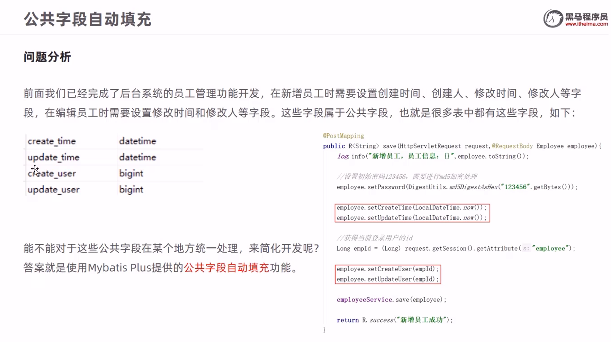
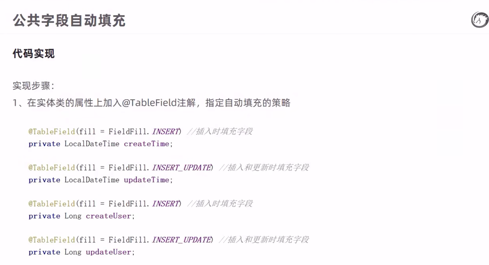
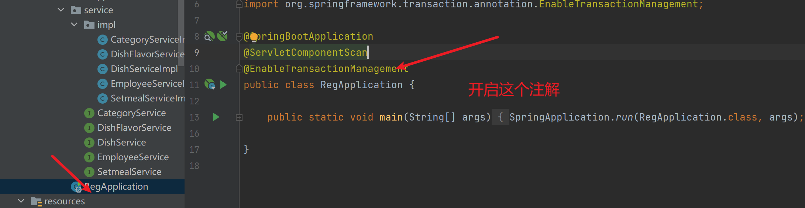

# 1.瑞吉外卖简介


application.yml配置

```yml
mybatis:
  configuration:
    log-impl: org.apache.ibatis.logging.stdout.StdOutImpl
    map-underscore-to-camel-case: true
  global-config:
    db-config:
      id-type:ASSIGN_IL
  mapper-locations: classpath:mybatis/*.xml  
spring:
  datasource:
    druid:
      driver-class-name: com.mysql.jdbc.Driver
      url: jdbc:mysql://localhost:3306/reg?serverTimezone=UTC&characterEncoding=utf8
      username: "root"
      password: "root"
```


前端静态资源映射类

```java
@Configuration
public class WebMvcConfig extends WebMvcConfigurationSupport {
    /**
     * 静态资源映射
     * @param registry
     */
    @Override
    protected void addResourceHandlers(ResourceHandlerRegistry registry) {
        registry.addResourceHandler("/backend/**").addResourceLocations("classpath:/backend/");
    }
}
```

# 2.后台登录功能开发


R类 返回结果集

```java
@Data
public class R<T> {

    private Integer code; //编码：1成功，0和其它数字为失败

    private String msg; //错误信息

    private T data; //数据

    private Map map = new HashMap(); //动态数据

    public static <T> R<T> success(T object) {
        R<T> r = new R<T>();
        r.data = object;
        r.code = 1;
        return r;
    }

    public static <T> R<T> error(String msg) {
        R r = new R();
        r.msg = msg;
        r.code = 0;
        return r;
    }

    public R<T> add(String key, Object value) {
        this.map.put(key, value);
        return this;
    }

}
```

登录Controller

```java
@RestController
@RequestMapping("/employee")
public class EmployeeController {
    @Autowired
    private EmployeeService employeeService;
    /**
     * 员工登录
     * @param request
     * @param e
     * @return
     */
    @PostMapping("/login")
    public R<Employee> login(HttpServletRequest request,@RequestBody Employee e){
       //将页面传来的密码进行MD5加密
        String password = e.getPassword();
        System.out.println(e);
       password = DigestUtils.md5DigestAsHex(password.getBytes());//这个就是进行MD5加密
        //根据页面提交的用户名查询数据库
        LambdaQueryWrapper<Employee> queryWrapper = new LambdaQueryWrapper<>();
        queryWrapper.eq(Employee::getUsername, e.getUsername());
        Employee emp = employeeService.getOne(queryWrapper);
        if (emp == null){//如果没有查询到则返回登录失败结果
            return R.error("登录失败");
        }
        if (!emp.getPassword().equals(password)){//密码比对。如果不一致则返回登录失败结果
            return R.error("登录失败");
        }
        if (emp.getStatus() == 0){//查看员工状态，如果为禁用状态，则返回员工禁用结果
            return R.error("账号已经禁用");
        }
        //登录成功，将员工id存入Session并返回登录成功结果
        request.getSession().setAttribute("employee",emp.getId());
        return R.success(emp);
    }
}
```

# 3.后台退出功能开发


```java
   /**
     * 员工退出
     * @param request
     * @return
     */
    @PostMapping("/logout")
    public R<String> logout(HttpServletRequest request){
     //清理Session中保存的当前员工的id
        request.getSession().removeAttribute("employee");
        return R.success("退出成功");
    }
```


# 4.员工管理界面

## 1.完善登录问题


**拦截类**

还要在启动器类上面加一个注解

```java

@WebFilter(filterName = "LoginCheckFilter",urlPatterns = "/*")
public class LoginCheckFilter implements Filter {
    //路径匹配器，支持通配符
    public static final AntPathMatcher PATH_MATCHER = new AntPathMatcher();
    @Override
    public void doFilter(ServletRequest servletRequest, ServletResponse servletResponse, FilterChain filterChain) throws IOException, ServletException {
        HttpServletRequest request = (HttpServletRequest) servletRequest;
        HttpServletResponse response = (HttpServletResponse) servletResponse;
        //获取本次请求的URL
        String requestURI = request.getRequestURI();
        //定义不需要处理的请求路径
        String[] urls = new String[]{  //这个一定要注意，前面也要加/
          "/employee/login",
          "/employee/logout",
          "/backend/**"
        };
        //判断本次请求是否需要处理
        boolean check = check(urls, requestURI);
        //如果不需要处理了就直接放行
        if (check){
            filterChain.doFilter(request,response);
            return;
        }
        //判断登录状态，如果已登录，则直接放行
        if (request.getSession().getAttribute("employee") != null){
            filterChain.doFilter(request,response);
            return;
        }
        //如果未登录则返回未登录结果，通过输出流方式向客户端页面响应数据
        response.getWriter().write(JSON.toJSONString(R.error("NOTLOGIN")));
        return;
    }
    /**
     * 路径匹配，检查本次请求是否需要放行
     * @param urls
     * @param requestURL
     * @return
     */
    public boolean check(String[] urls,String requestURL){
        for (String url: urls) {
            boolean match = PATH_MATCHER.match(url, requestURL);
            if (match) return true;
        }
        return false;
    }
}
```


## 2.新增员工


```java
 /**
     * 新增员工
     * @param request
     * @param employee
     * @return
     */
    @PostMapping
    public R<String> save(HttpServletRequest request,@RequestBody Employee employee){
        //设置初始密码123456，需要进行MD5加密处理
        employee.setPassword(DigestUtils.md5DigestAsHex("1234566".getBytes()));
        employee.setCreateTime(LocalDateTime.now());
        employee.setUpdateTime(LocalDateTime.now());
        //获得当前登录用户的id
        employee.setCreateUser((long)request.getSession().getAttribute("employee"));
        employee.setUpdateUser((long)request.getSession().getAttribute("employee"));
            employeeService.save(employee);
        return R.success("保存成功");
    }
```

### 2.1全局捕获异常


全局处理异常类

```java
/**
 * 全局异常类
 */
@ControllerAdvice(annotations = {RestController.class, Controller.class})//这个的意思就是所有这两种类型中出现异常都会到这里来进行拦截
@ResponseBody //加这个注解的原因是因为最后都是以JSON的格式进行返回
public class GlobalExceptionHandler {

    @ExceptionHandler(SQLIntegrityConstraintViolationException.class)//这个就是添加对应的异常，如果出现这样的异常就是跳转到这边处理
    public R<String > exceptionHandler(SQLIntegrityConstraintViolationException e){

        return R.error("添加失败");
    }
}
```

## 3.员工信息分页查询


```java
  /**
     * 员工信息分页查询
     * @param page
     * @param pageSize
     * @param name
     * @return
     */
    @GetMapping("/page")
    public R<Page> page(int page,int pageSize,String name){
      //构造分页构造器
        Page pageInfo = new Page(page, pageSize);
      //构造条件构造器
        LambdaQueryWrapper<Employee> queryWrapper = new LambdaQueryWrapper();
        //添加过滤条件
        if (name != null){
            queryWrapper.like(true,Employee::getName,name);
        }
        //添加排序条件
        queryWrapper.orderByDesc(Employee::getUpdateTime);
        employeeService.page(pageInfo,queryWrapper);
        return R.success(pageInfo);
    }
```

**MP分页查询工具类**

```java
/**
  MP分页查询工具类
 */
@Configuration
public class MybatisPlusConfig {

    @Bean
    public MybatisPlusInterceptor mybatisPlusInterceptor(){
        MybatisPlusInterceptor mybatisPlusInterceptor = new MybatisPlusInterceptor();
        mybatisPlusInterceptor.addInnerInterceptor(new PaginationInnerInterceptor());
        return mybatisPlusInterceptor;
    }
}
```

## 4.启用禁用员工账号


```java
package com.reg.common;

import com.fasterxml.jackson.databind.DeserializationFeature;
import com.fasterxml.jackson.databind.ObjectMapper;
import com.fasterxml.jackson.databind.module.SimpleModule;
import com.fasterxml.jackson.databind.ser.std.ToStringSerializer;
import com.fasterxml.jackson.datatype.jsr310.deser.LocalDateDeserializer;
import com.fasterxml.jackson.datatype.jsr310.deser.LocalDateTimeDeserializer;
import com.fasterxml.jackson.datatype.jsr310.deser.LocalTimeDeserializer;
import com.fasterxml.jackson.datatype.jsr310.ser.LocalDateSerializer;
import com.fasterxml.jackson.datatype.jsr310.ser.LocalDateTimeSerializer;
import com.fasterxml.jackson.datatype.jsr310.ser.LocalTimeSerializer;
import java.math.BigInteger;
import java.time.LocalDate;
import java.time.LocalDateTime;
import java.time.LocalTime;
import java.time.format.DateTimeFormatter;
import static com.fasterxml.jackson.databind.DeserializationFeature.FAIL_ON_UNKNOWN_PROPERTIES;
/**
 * 对象映射器:基于jackson将Java对象转为json，或者将json转为Java对象
 * 将JSON解析为Java对象的过程称为 [从JSON反序列化Java对象]
 * 从Java对象生成JSON的过程称为 [序列化Java对象到JSON]
 */
public class JacksonObjectMapper extends ObjectMapper {
    public static final String DEFAULT_DATE_FORMAT = "yyyy-MM-dd";
    public static final String DEFAULT_DATE_TIME_FORMAT = "yyyy-MM-dd HH:mm:ss";
    public static final String DEFAULT_TIME_FORMAT = "HH:mm:ss";
    public JacksonObjectMapper() {
        super();
        //收到未知属性时不报异常
        this.configure(FAIL_ON_UNKNOWN_PROPERTIES, false);
        //反序列化时，属性不存在的兼容处理
this.getDeserializationConfig().withoutFeatures(DeserializationFeature.FAIL_ON_UNKNOWN_PROPERTIES);
        SimpleModule simpleModule = new SimpleModule()
                .addDeserializer(LocalDateTime.class, new LocalDateTimeDeserializer(DateTimeFormatter.ofPattern(DEFAULT_DATE_TIME_FORMAT)))
                .addDeserializer(LocalDate.class, new LocalDateDeserializer(DateTimeFormatter.ofPattern(DEFAULT_DATE_FORMAT)))
                .addDeserializer(LocalTime.class, new LocalTimeDeserializer(DateTimeFormatter.ofPattern(DEFAULT_TIME_FORMAT)))

                .addSerializer(BigInteger.class, ToStringSerializer.instance)
                .addSerializer(Long.class, ToStringSerializer.instance)
                .addSerializer(LocalDateTime.class, new LocalDateTimeSerializer(DateTimeFormatter.ofPattern(DEFAULT_DATE_TIME_FORMAT)))
                .addSerializer(LocalDate.class, new LocalDateSerializer(DateTimeFormatter.ofPattern(DEFAULT_DATE_FORMAT)))
                .addSerializer(LocalTime.class, new LocalTimeSerializer(DateTimeFormatter.ofPattern(DEFAULT_TIME_FORMAT)));
        //注册功能模块 例如，可以添加自定义序列化器和反序列化器
        this.registerModule(simpleModule);
    }
}
```

```java
@Slf4j  使用这个注解是开启日志
    对应的是log.info(“在里面添加信息”);这些信息都会显示到控制台上。
```

```java
@Slf4j
@Configuration
public class WebMvcConfig  implements WebMvcConfigurer {
    /**
     * 静态资源映射
     * @param registry
     */
    @Override
    public void addResourceHandlers(ResourceHandlerRegistry registry) {
        registry.addResourceHandler("/backend/**").addResourceLocations("classpath:/backend/");
    }

    /**
     * 扩展mvc框架的消息转换器     这个在这个项目中有点问题，之后在慢慢解决
     * @param converters
     */
//    @Override
//    public void extendMessageConverters(List<HttpMessageConverter<?>> converters) {
////        log.info("扩展消息转换器");
//        //创建消息转换器对象
//        MappingJackson2CborHttpMessageConverter messageConverter = new MappingJackson2CborHttpMessageConverter();
//        //设置对象转换器，底层使用Jackson将java对象转为Json
//        messageConverter.setObjectMapper(new JacksonObjectMapper());
//        //将上面的消息转换器对象追加到mvc框架的转换器集合中
//        converters.add(0,messageConverter);//这个为0是因为要优先使用我们自己的转换器，所以就放到最前面。
//
//    }
}

```

## 5.编辑员工信息


```java
  /**
     * 根据id查询员工信息
     * @param id
     * @return
     */
    @GetMapping("/{id}")
    public R chage(@PathVariable Long id){
        Employee employee = employeeService.getById(id);
        if (employee != null){
            return R.success(employee);
        }
        return R.error("没有查询到员工信息");
    }
```

# 5.分类管理业务

## 1.公共字段自动填充







**基于ThreadLocal封装工具类，用户保存和获取当前登录用户id**

```java
package com.reg.common;
/**
基于ThreadLocal封装工具类，用户保存和获取当前登录用户id
 */
public class BaseContext {
    private static ThreadLocal<Long> threadLocal = new ThreadLocal<>();

    /**
     * 设置值
     * @param id
     */
    public static void setCurrentId(Long id){
        threadLocal.set(id);
    }

    /**
     * 获取值
     * @return
     */
    public static Long getCurrentId(){
        return threadLocal.get();
    }
}
```


**自定义元数据处理器**

```java
/**
 自定义元数据处理器
 */
@Component //这个就是让spring容器进行管理
public class MyMetaObjecthandler implements MetaObjectHandler {


    /**
     * 插入操作自动填充
     * @param metaObject
     */
    @Override
    public void insertFill(MetaObject metaObject) {
       metaObject.setValue("createTime", LocalDateTime.now());
        metaObject.setValue("updateTime", LocalDateTime.now());
        metaObject.setValue("createUser", BaseContext.getCurrentId());
        metaObject.setValue("updateUser", BaseContext.getCurrentId());
    }

    /**
     * 更新操作自动填充
     * @param metaObject
     */
    @Override
    public void updateFill(MetaObject metaObject) {
        metaObject.setValue("updateTime", LocalDateTime.now());
        metaObject.setValue("updateUser", BaseContext.getCurrentId());
    }
}
```


## 2.新增分类


```java
@GetMapping("/page")
public R<Page> page(int page,int pageSize){
    //构造分页构造器
    Page<Category> pageInfo = new Page(page, pageSize);
    //  //构造条件构造器
    LambdaQueryWrapper<Category> queryWrapper = new LambdaQueryWrapper<>();
    //添加排序条件，根据sort进行排序
    queryWrapper.orderByAsc(Category::getSort);
     //进行分页查询
     categoryService.page(pageInfo, queryWrapper);
    return R.success(pageInfo);
}
```

## 3.删除分类


```java
/**
 * 根据id删除分类
 * @param ids
 * @return
 */
@DeleteMapping
public R<String> delete(Long ids){
 log.info(""+ids);
   categoryService.remove(ids);
    return R.success("删除成功");
}
```

```java
public class CategoryServiceImpl extends ServiceImpl<CategoryMapper, Category> implements CategoryService  {

    @Autowired
   private DishService dishService;

    @Autowired
    private SetmealService setmealService;
    /**
     * 根据id删除分类，删除之前需要进行判断
     * @param id
     */
    @Override
    public void remove(long id) {
        LambdaQueryWrapper<Dish> queryWrapper = new LambdaQueryWrapper<>();
        queryWrapper.eq(Dish::getCategoryId,id);
        int count = dishService.count(queryWrapper);
        //查询当前分类是否关联了菜品，如果已经关联，，抛出一个业务异常
         if (count > 0){
             //已经关联套餐抛出异常
            throw  new CustomException("当前分类下关联了菜品，不能删除");
         }
      //查询当前分类是否关联了套餐，如果已经关联，抛出一个业务异常
        LambdaQueryWrapper<Setmeal> setmealLambdaQueryWrapper = new LambdaQueryWrapper<>();
        setmealLambdaQueryWrapper.eq(Setmeal::getCategoryId,id);
        int count1 =setmealService.count(setmealLambdaQueryWrapper);
        if (count1 > 0){
            //已经关联套餐抛出异常
            throw  new CustomException("当前分类下关联了套餐，不能删除");
        }
      //正常删除
        super.removeById(id);
    }
}
```

自定义异常

```java
public class CustomException extends RuntimeException{

    public CustomException(String message){
        super(message);
    }
}
```

调用全局异常

```java
/**
 * 全局异常类
 */

@ControllerAdvice(annotations = {RestController.class, Controller.class})//这个的意思就是所有这两种类型中出现异常都会到这里来进行拦截
@ResponseBody //加这个注解的原因是因为最后都是以JSON的格式进行返回
public class GlobalExceptionHandler {

    /**
     * 异常出来方法
     * @param e
     * @return
     */
    @ExceptionHandler(SQLIntegrityConstraintViolationException.class)//这个就是添加对应的异常，如果出现这样的异常就是跳转到这边处理
    public R<String > exceptionHandler(Exception e){
        return R.error("未知错误");
    }

    /**
     * 异常出来方法
     * @param c
     * @return
     */
    @ExceptionHandler(CustomException.class)//这个就是添加对应的异常，如果出现这样的异常就是跳转到这边处理
    public R<String > exceptionHandler(CustomException c){
        return R.error(c.getMessage());
    }
}
```

## 4.修改分类


```java
/**
 * 根据id删除分类信息
 * @param category
 * @return
 */
@PutMapping
public R<String> update(Category category){
 categoryService.updateById(category);
    return R.success("修改成功");
}
```

# 6.菜品关联业务开发

## 1.文件上传和下载


```java
@RestController
@RequestMapping("/common")
public class CommonController {

    @Value("${reg.path}")//从配置文件中获取值
    private String path;

   @PostMapping("/upload")
    public R<String> upload(MultipartFile file){//这个file的名字要和前端的文件上传的代码命名要保持一直，不然接收不到
        //file是一个临时文件，需要转存到指定位置，否则本次请求完成后临时文件会删除

        //原始文件名
        String originalFilename = file.getOriginalFilename();
        String substring = originalFilename.substring(originalFilename.lastIndexOf("."));//取后缀
        //使用UUID重新生成文件名，防止文件名称重复造成文件覆盖
        String fileName = UUID.randomUUID().toString()+substring;

        //创建一个目录对象
        File dir = new File(path);
        if (dir.exists()){
            //目录不存在，需要创建
            dir.mkdirs();
        }
        try {
            //将文件转存到这个位置
            file.transferTo(new File(path+fileName));
        } catch (IOException e) {
            e.printStackTrace();
        }
        return R.success(fileName);
    }
}
```

aplication.yml里面的配置

```yml
reg:
 path: F:\tu\
```

```java
/**
 * 文件的下载或者是文件的回显
 * @param name
 * @param response
 */
@GetMapping("/download")
public void download(String name, HttpServletResponse response){
    //输入流，，通过输入流读取文件内容
    try {
        FileInputStream fileInputStream = new FileInputStream(new File(path + name));
        //输出流，通过输出流将 文件写回浏览器，在浏览器中显示
        ServletOutputStream outputStream = response.getOutputStream();
        response.setContentType("image/jpeg");///在页面中显示的格式
        int len = 0;
        byte[] bytes = new byte[1024];
       while ( (len =  fileInputStream.read(bytes)) != -1){
          outputStream.write(bytes,0,len);
          outputStream.flush();
       }
    fileInputStream.close();
       outputStream.close();
    } catch (Exception e) {
        e.printStackTrace();
    }
}
```

## 2.新增菜品


```java
/**
 * 根据条件查询分类数据
 * @param category
 * @return
 */
@GetMapping("/list")
public R<List<Category> > list(Category category){
    //条件构造器
    LambdaQueryWrapper<Category> queryWrapper = new LambdaQueryWrapper<>();
    //添加条件
    queryWrapper.eq(category.getType() != null,Category::getType,category.getType());
    //添加排序条件
    queryWrapper.orderByAsc(Category::getSort).orderByAsc(Category::getUpdateTime);
    List<Category> list = categoryService.list(queryWrapper);
    if (list == null){
        return R.error("错误");
    }
    return R.success(list);
}
```





多张表的操作要开启事物控制。

```java
@Service
public class DishServiceImpl extends ServiceImpl<DishMapper, Dish> implements DishService {
    @Autowired
    private DishFlavorService dishFlavorService;

    /**
     * 新增菜品
     * @param dishDto
     * @return
     */
    @Override
    @Transactional
    public boolean save(DishDto dishDto) {
       /* //保存菜品的基本信息到菜品表

        //保存菜品口味数据到菜品口味表dish_flavor
        dishFlavorService.saveBatch(dishDto.getFlavors());*/
        System.out.println(dishDto);
        Long dishId= dishDto.getId();//菜品id
        //将菜品id添加到这个集合中去
        boolean save = super.save(dishDto);
        List<DishFlavor> flavors = dishDto.getFlavors();
        flavors  = flavors.stream().map((item) -> {
            item.setDishId(dishId);
            return item;
        }).collect(Collectors.toList());
     /*   if (!save && !){
            return false;
        }*/
        dishFlavorService.saveBatch(flavors);
        return true;
    }
}
```

```java
@RestController
@RequestMapping("/dish")
@Slf4j
public class DishController {

    @Autowired
    private DishService dishService;

    @Autowired
    private DishFlavorService dishFlavorService;

    /**
     * 新增菜品
     * @return
     */
    @PostMapping
    public R<String> save(@RequestBody DishDto dishDto){
        log.info(dishDto+"");
        boolean save = dishService.save(dishDto);
        if (!save){
            return R.error("添加失败");
        }
        return R.success("添加成功");
    }
}
```

## 3.菜品信息分页查询


## 4.修改菜品


service层代码

```java
/**
 * 根据id查询菜品信息和对应的口味信息
 * @param id
 * @return
 */
public DishDto getByIdWithFlavor(long id) {
    //查询菜品基本信息，从dish表中查询
    Dish dish = this.getById(id);
    DishDto dishDto = new DishDto();
   /* //拷贝
    BeanUtils.copyProperties(dish,dishDto);*/
    System.out.println(dish);
    try {
        dishDto.setImage(dish.getImage());//图片
        dishDto.setPrice(dish.getPrice());//价格
        dishDto.setName(dish.getName());//菜品价格
        dishDto.setDescription(dish.getDescription());//描述
        //查询当前菜品对应的口味信息，从dish_flavor表中查询
        LambdaQueryWrapper<DishFlavor> queryWrapper = new LambdaQueryWrapper<>();
        queryWrapper.eq(DishFlavor::getId,dish.getId());

        List<DishFlavor> list = dishFlavorService.list(queryWrapper);
        dishDto.setFlavors(list);
    }catch (Exception e){

    }


    return dishDto;
}
```

controller代码

```java
/**
 * 根据id查询菜品信息和对应的口味信息
 */
@GetMapping("{id}")
public R<DishDto> get(@PathVariable long id){//PathVariable这个注解是接收路径上穿过来的参数
    DishDto byIdWithFlavor = dishService.getByIdWithFlavor(id);
    if (byIdWithFlavor == null){
        return R.error("网络超时，请稍后在试");
    }
    return R.success(byIdWithFlavor);
}
```

P67


# 9.短信服务


# 10.java操作Redis


