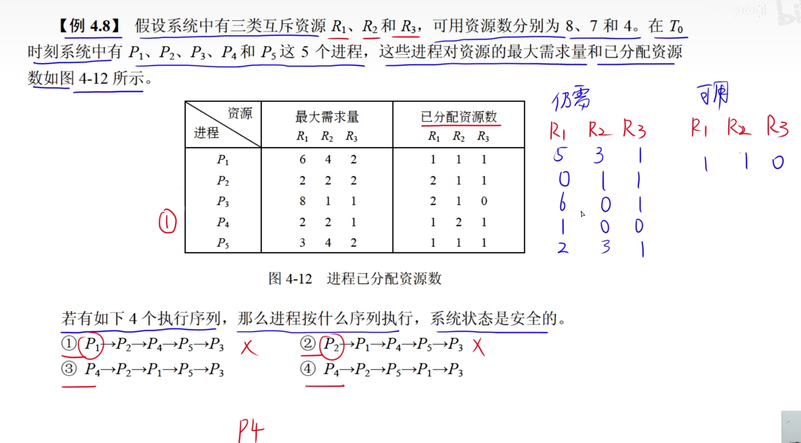
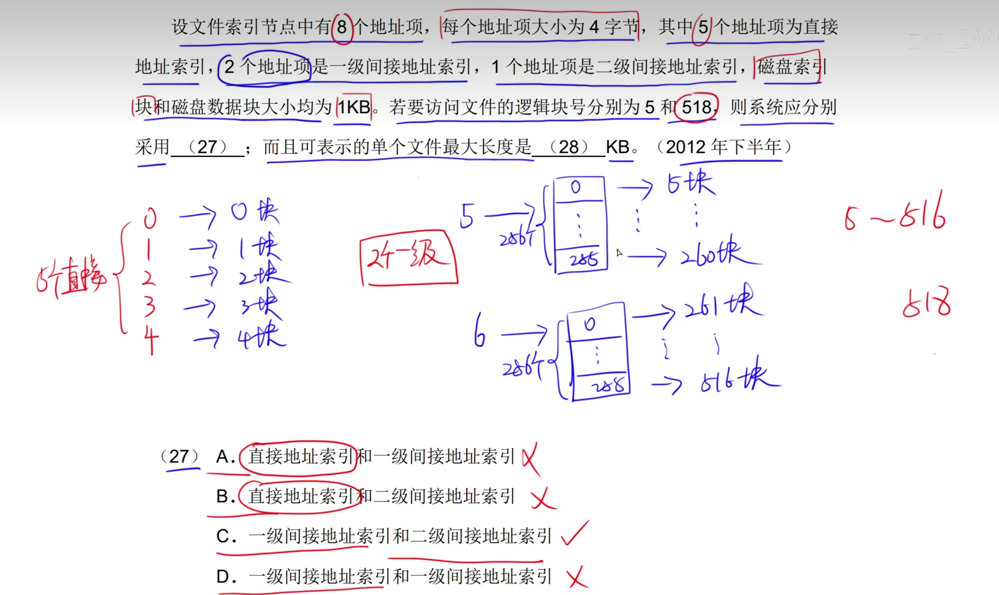

#  1.操作系统的地位

**操作系统的四个特征：并发性、共享性、虚拟性、不确定性。**

**系统的吞吐量：提高计算机系统在单位时间内处理工作的能力。**

# 2.程序顺序执行

## 2.1前趋图

# 3.程序并发执行和前驱图

## 3.1程序并发执行的问题

# 4.进程的三态模型

**这个到时候从头看**

# 5.同步和互斥

**资源共享就是互斥，相互合作就是同步**

# 6.信号量机制和PV操作

## 6.1PV操作实现进程的互斥

**共享的资源要进行互斥访问**

## 6.2PV操作实现进程的同步1

## 6.3PV操作实现进程的同步2

在前驱图中是：V   在p

在这个图中：是先p 在v

# 7.死锁

# 8.进程资源图

# 9.死锁避免

# 10.线程

**线程可以共享同属一个进程的所有资源，但是线程与线程之间是不可以见的。**

# 11.局部性原理

**为0的就淘汰就是淘汰未被访问过的。。**

# 12.分页存储管理

# 13.段页式存储管理

# 14.缓冲区

## 1.单缓冲区

**非空不能输入，非满不能传送。**

**单缓冲区公式：** 

## 2.双缓冲区

**双缓冲区的计算公式**

# 15.调度算法

## 1.磁盘调度算法

### 1.先来先服务(FCFS)

### 2.最短寻道时间优先(SSTF)

**谁离得最近就区访问谁。**

### **3.扫描算法(SCAN)或电梯调度*363.算法**

### 4.循环扫描算法(CSCAN)单向扫描算法

## 2.旋转调度算法

# ****16.多级索引结构

**直接地址索引：一个地址项指向一个磁盘数据块。**

# 17.目录

## 1.文件目录

## 2.目录结构

# 18.位示图

# 19.杂题选讲

