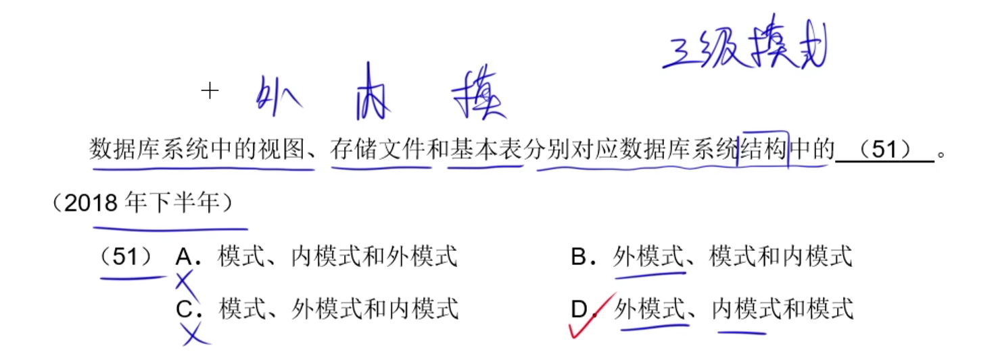
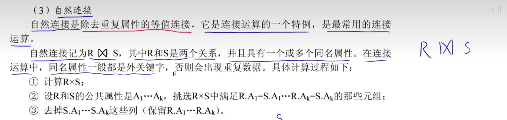
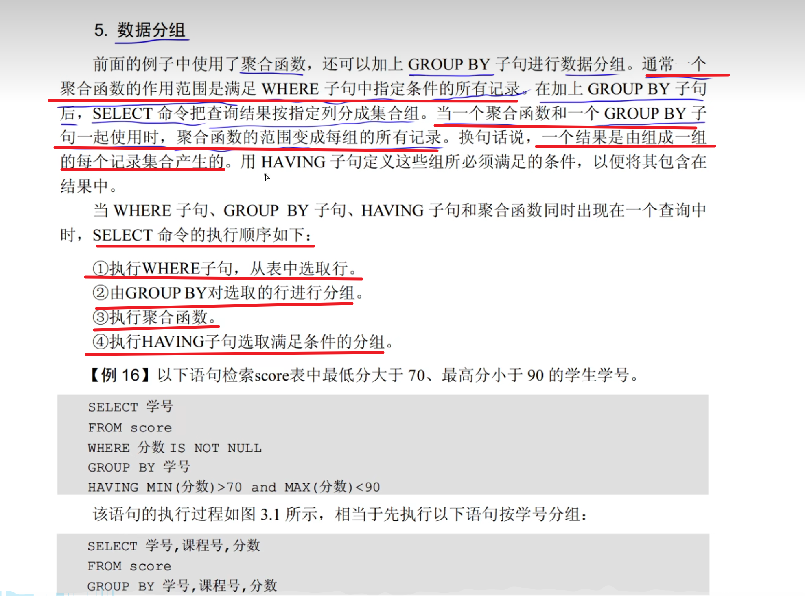
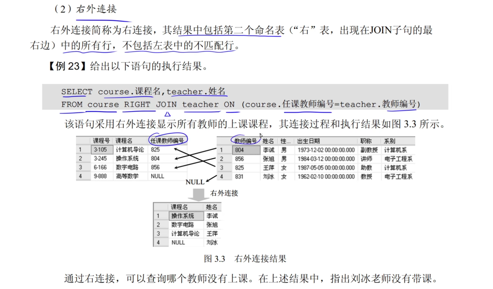
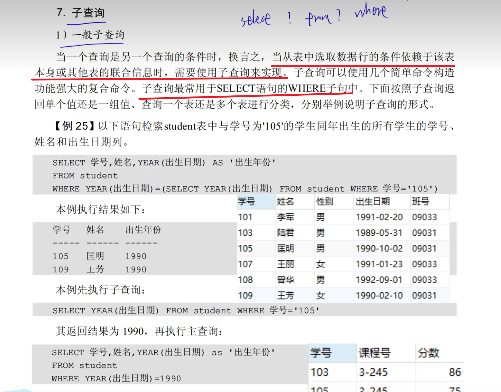
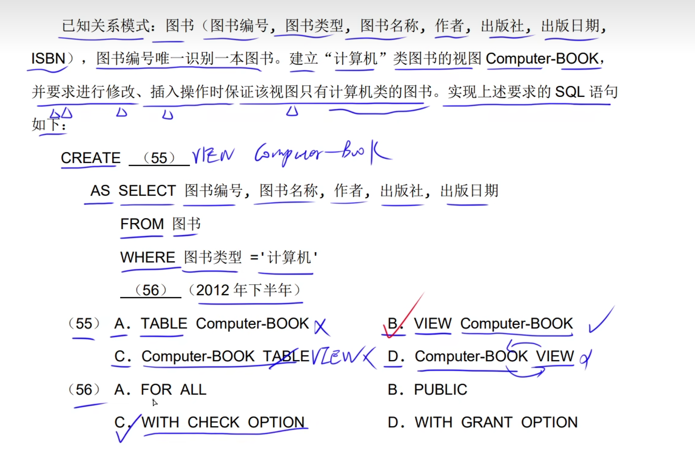

# 1.概念数据模型

# 2.结构数据模型

# 3.三级模式结构

## 3.1两级映像

# 4.关系模式基本术语

## 4.1并、差、笛卡儿积

## 4.2关系代数

## 4.3投影、选择

## 4.4连接和等值连接

## 4.5自然连接

## 4.6外连接 

### 1.左外连接

### 2右外连接

### 3.全外连接

## 4.7除

# 5.转SQL语言

## 5.1投影、选择转SQL语言

**SQL语言不支持列的序号**

## 5.2笛卡尔积转SQL语言

## 5.3自然连接转SQL语言

# 6.数据定义语言

## 6.1.列级、表现级完成性约束

**not null：值不能为空**

**unique：值唯一**

**not null unique：值不能为空但是唯一**

**defaule：默认值**

# 7.操作语言

## 2.数据查询语言

## 3.投影查询(select)

## 4.选择查询

## 5.排序查询

## 6.聚合查询

## 7.数据分组

**having 是对聚合函数之后判断，也就是聚合函数之后的where**

## 8.内连接

## 9.外连接

## 10.子查询

## 11.相关子查询和EXISTS子查询

## 12.查询结果并、交、差运算

# 8.SQL访问控制

# 9.视图

**对视图操作：实际上是对视图对应的那个表的操作**

# 10.索引

索引又称书签，类似于目录。

**索引是物理标识**

# 11.关系模式

## 1.关系模式 

## 2.函数依赖

## 3.码和推理规则

## 4.属性闭包计算

# 12.范式

## 1.第一范式

**第一范式：原子性**

### 1.1.部分函数依赖导致数据冗余，更新异常

## 2.第二范式

### 1.关系模式的分解

## 3.第三范式

## 4.BC范式

**消除了其中一个主属性依赖。**

**主属性之间不存在依赖**

> ***1NF ---> 2NF 解决了 ：消除了非主属性对候选码的部分函数依赖***
>
> ***2NF --> 3NF  解决了 ：消除了非主属性对候选码的传递函数依赖***
>
> ***3NF --> BCNF 解决了 ：***

## 5.第四范式

## 6.范式总结

## 7.消除部分函数依赖技巧

## 8.关系分解

## 9.无损连接和保持函数依赖

# 13.数据库设计

## 1.数据库设计

## 2.需求分析阶段 

## 3.E-R图实体、联系

## 4.E-R图属性

## 5.E-R图设计和弱实体

## 6.概念结构设计阶段

## 7.逻辑结构设计

## 8.物理设计阶段和实施与维护

# 14.事物管理

# 15.数据库的备份与恢复

# 16.封锁

# 17.分布式数据库

# 18.杂题选讲

