# 1.复杂度

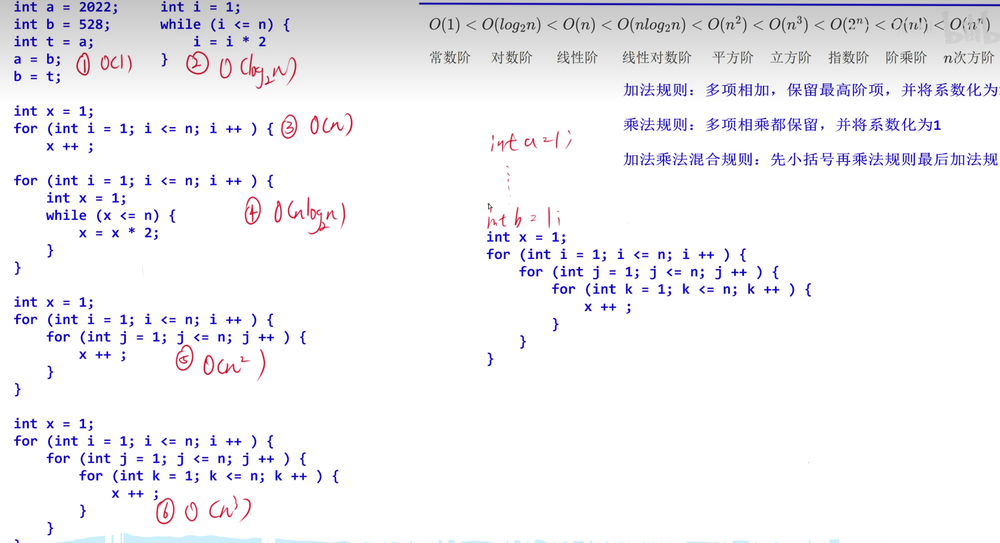


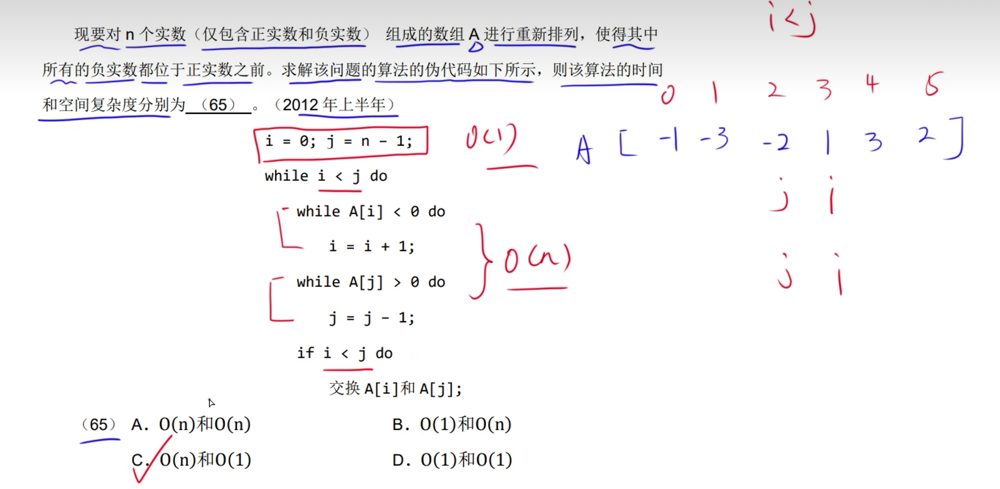


# 2.渐近符号


# 3.递归式时间、空间复杂度


## 1.递归式主方法


# 4.线性结构


## 1.顺序表的时间复杂度


## 2.链表的时间复杂度


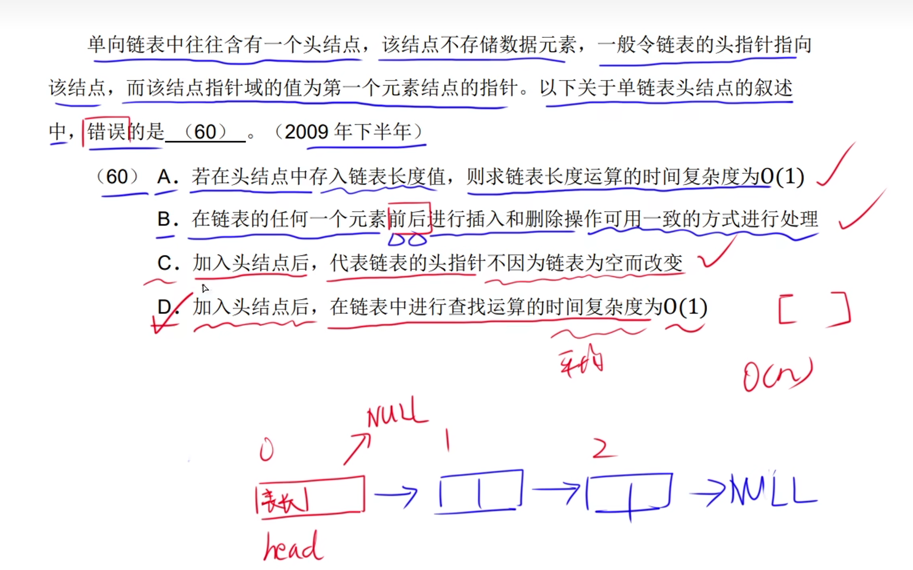


# 5.栈和队列


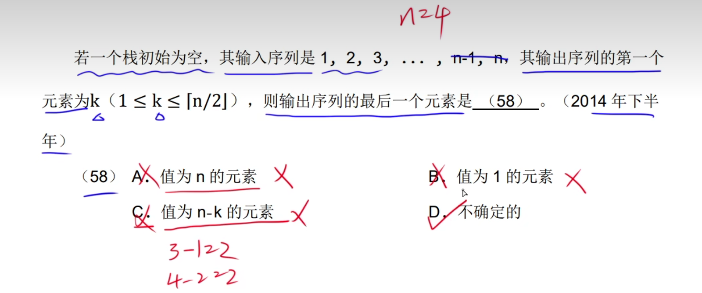


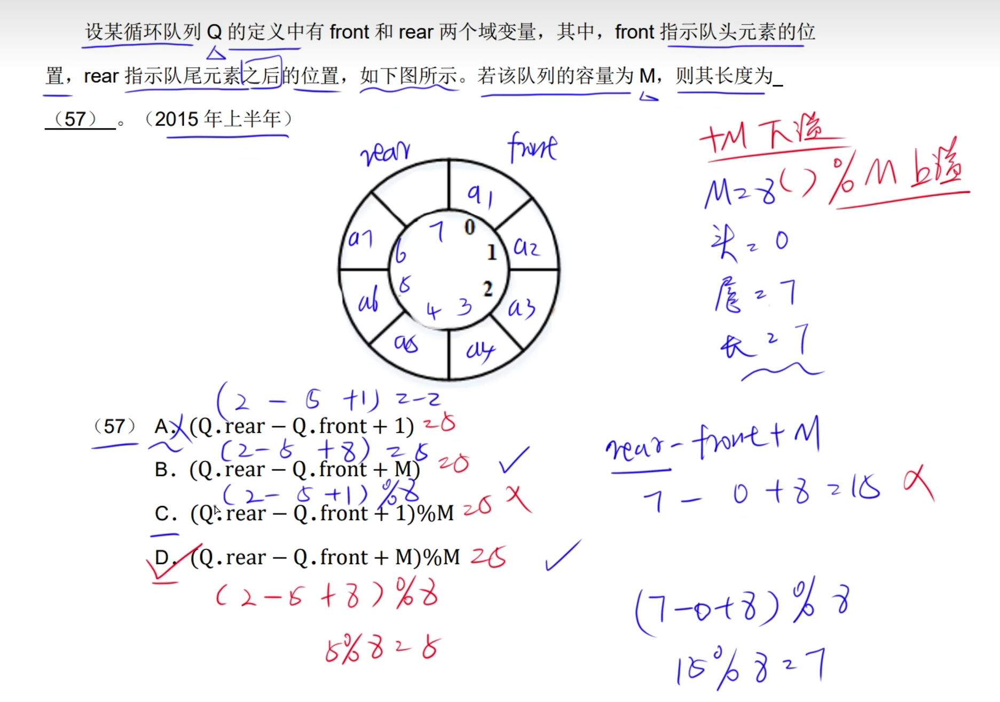

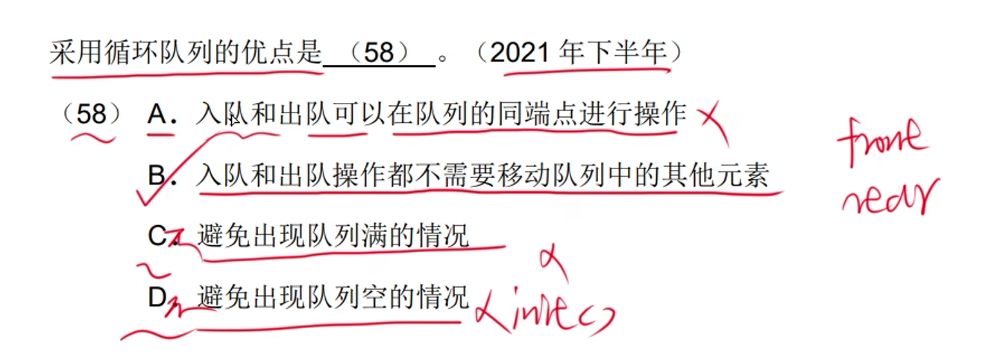


# 6.串


## 1.串的模式匹配


## 2.KMP算法


# 7.矩阵

## 1.对称矩阵


# 8.树


## 1.树的基本概念


## 2.二叉树


## 3.满二叉树和完全二叉树


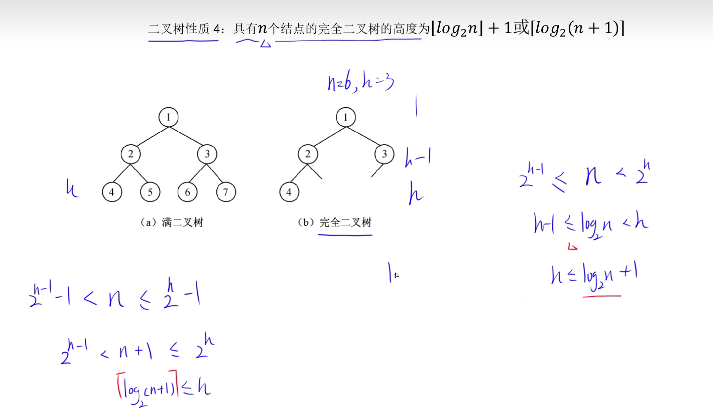


卡特兰数：


## 4.二叉树存储


## 5.遍历

### 1.先序遍历


### 2.中序遍历


### 3.后序遍历


### 4.层序遍历

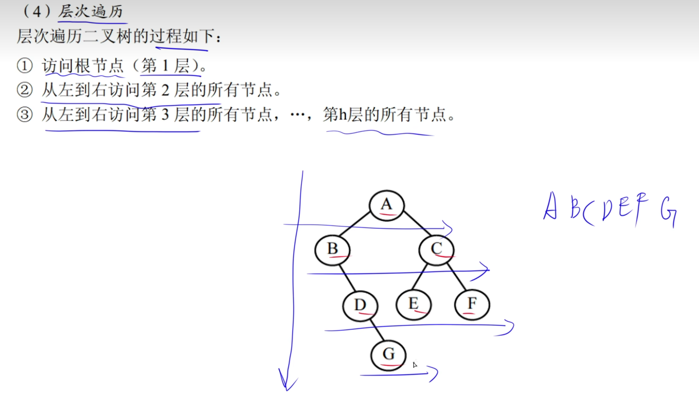

## 6.构造二叉树

### 1.先序+中序构造二叉树


### 2.后序+中序构造二叉树


### 3.层序序+中序构造二叉树


## 7.平衡二叉树

**完全二叉树一定是平衡二叉树，但是平衡二叉树不一定是完全二叉树**


## 8.二叉排序树(二叉查找树)


**二叉排序树，用中序遍历得到的序列才是有序序列**


## 9.最优二叉树

​	**最优二叉树又称哈夫曼树**


### 1.最优二叉树的构造规则


## 10.哈夫曼编码


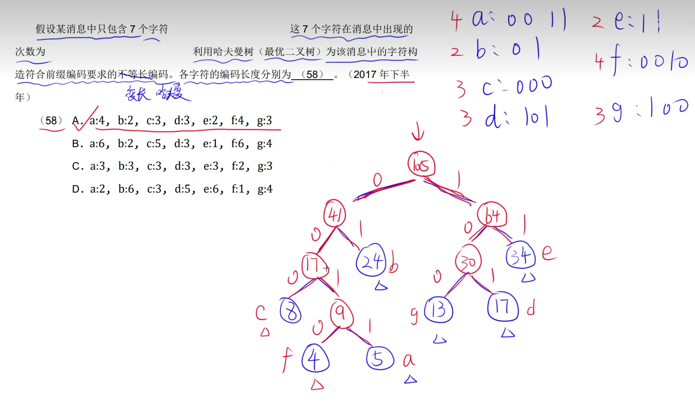


## 11.线索二叉树


# 9.图


## 1.无向图和有向图


## 2.完全图


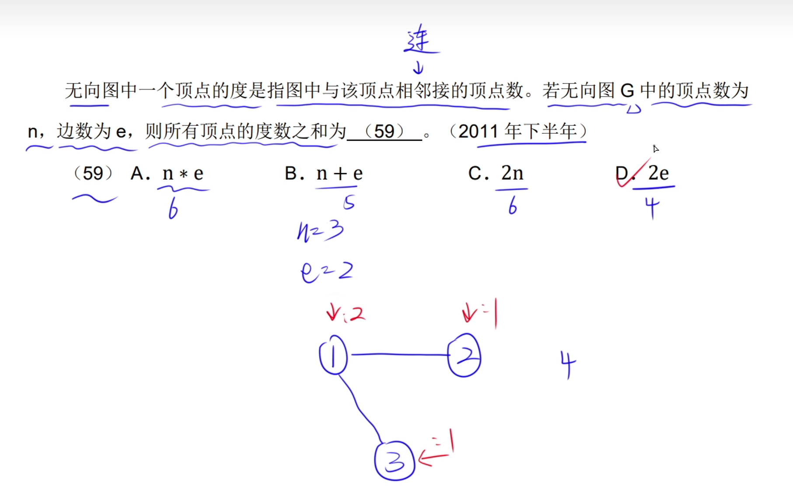


## 3.邻接矩阵和邻接表


## 4.稀疏图和稠密图


## 5.网


## 6.遍历

### 1.深度优先遍历(DFS)


### 2.广度优先遍历(BFS)


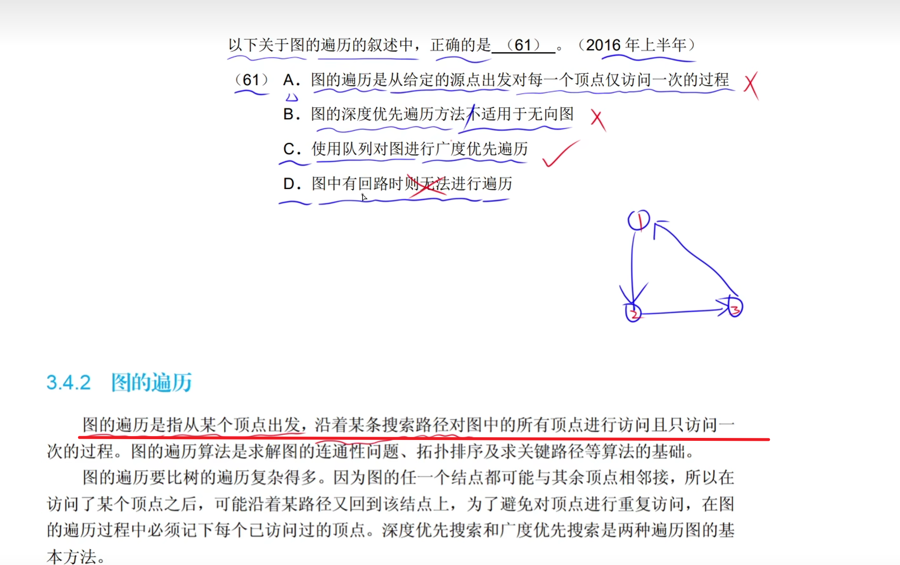


# 10.拓扑排序


# 11.查找


## 1.顺序查找


## 2.折半查找


## 3.哈希表


### 1.哈希函数构造与处理冲突


### 2.处理冲突拓展和装填因子


## 4.小顶堆和大顶堆


# 12.排序


## 1.直接插入排序


**局部有序，不是全局有序，每一次排序不能确定一个最终的位置。**


## 2.希尔排序


## 3.选择排序

**选择排序也是归位。归位的意思就是，每次排序都能确定一个元素的位置**


## 4.堆排序


```c
#include <stdio.h>
#include <string.h>
#include <stdlib.h>
#include <stdio.h>
int num;
void buildheap(int *a,int i,int n)	//构造堆  
{
    int c,temp;
    for (temp=a[i];2*i<=n;i=c)	//temp记录父亲节点的值，c为其左孩子节点，//2*i<=N,i=c当结点还有孩子节点时，将i指向其左孩子节点，继续循环
    {
        c=2*i;			//i的左孩子节点编号为2*i	
        if(c<n&& a[c+1]>a[c]) //找到i最大的孩子节点（左孩子和右孩子比较） 
            ++c;              //将最大的孩子编号给c
        if(temp<a[c])		//父亲节点值等于孩子节点和本身中最大的 
            a[i]=a[c];		
        else
            break;		//父亲节点最大，直接跳出循环			
    }
    a[i]=temp;    //将原本的“根节点”a[i]的值赋值给最后被交换的节点
}
void heapsort(int *a)	//排序 
{
    int i,temp;
    for(i=num/2;i>=1;i--)	//从（(num/2)为最后一个父亲节点）最后一个父亲节点开始构造堆，一直向上，构造到根节点。 
    {
        buildheap(a,i,num);
    }
    for(i=num;i>1;i--)	//删除根节点后，重新构造堆//i>1而不i>0的原因:当i=1时二叉树中只有一个元素，而不需要对其再进行一次构造堆了，他本身就是最大的了。 
    {
        temp=a[1];
        a[1]=a[i];
        a[i]=temp;
        buildheap(a,1,i-1);
    }
}
 
int main(int argc, char *argv[]) 
{
    printf("堆排序\n");
    printf("请输入要排序的元素的个数："); 
    scanf("%d",&num);
    int i,a[num+1];
    printf("请输入元素：");
    for(i=1;i<num+1;i++)//根节点i=1，与数组a大小为num+1的意义：根节点编号为1时，值为a[1]，其左孩子节点编号为2*i=2，值为a[2]。同理父亲节点编号为i，值为a[i]，其左孩子节点编号为2*i，值为a[2*i]。这样可以方便得出，父亲节点和孩子节点的关系。//且易找出该二叉树中最后一个父亲节点为num/2。//根节点i=0也可以实现，只是运算，理解方面要复杂一些。
        scanf("%d",&a[i]);
    heapsort(a);
    printf("排序后序列：\n");
    for(i=1;i<num+1;i++)
        printf("%d ",a[i]);
    printf("\n");
    return 0;
} 
```


## 5.冒泡排序


## 6.快速排序


**数据基本有序对插入排序就是最好的时间复杂度，对快速排序来说就是最坏的时间复杂度。**


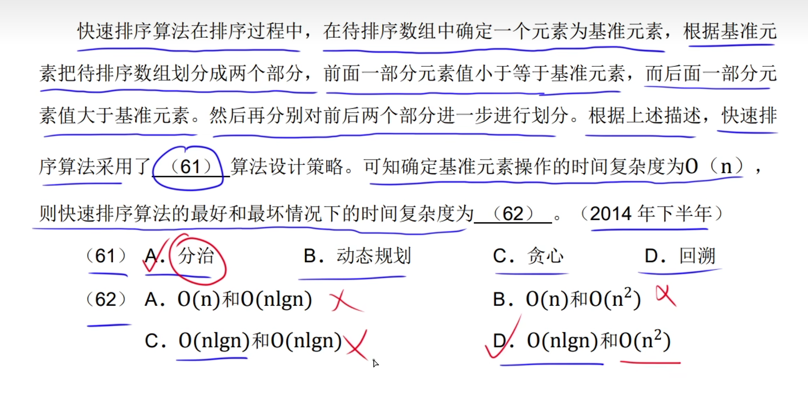


## 7.归并排序


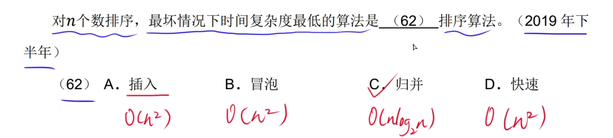


# 13.杂题选讲


