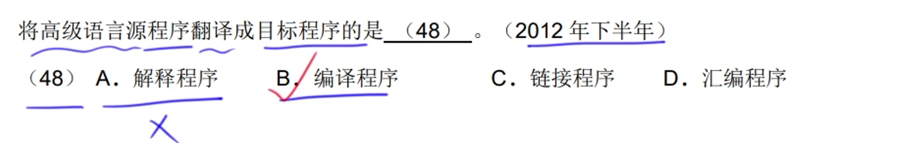
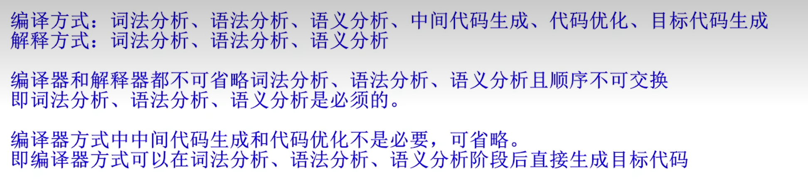
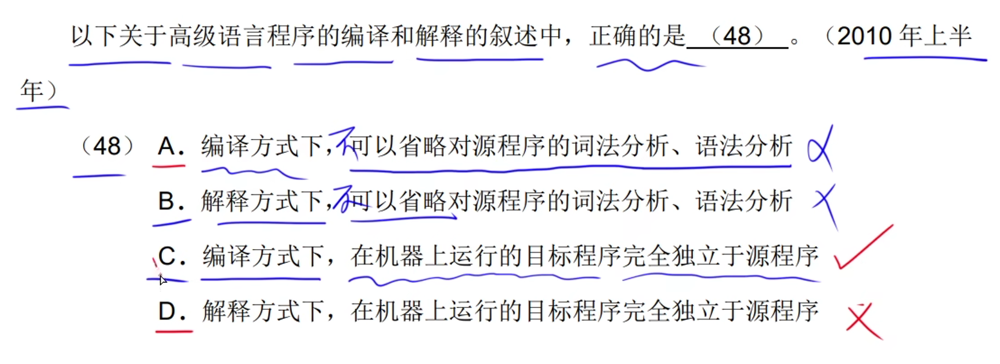
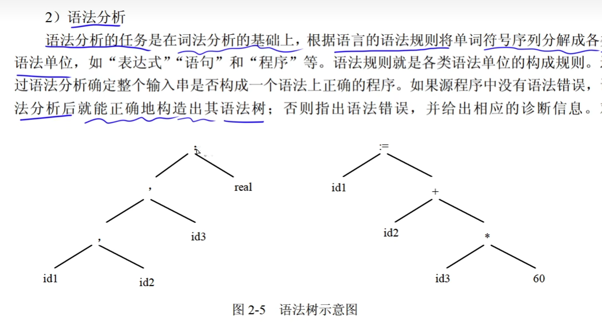
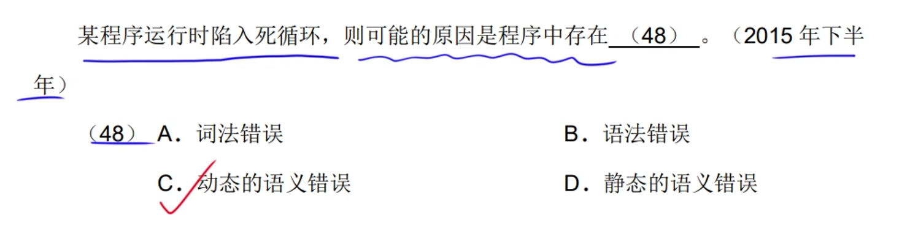
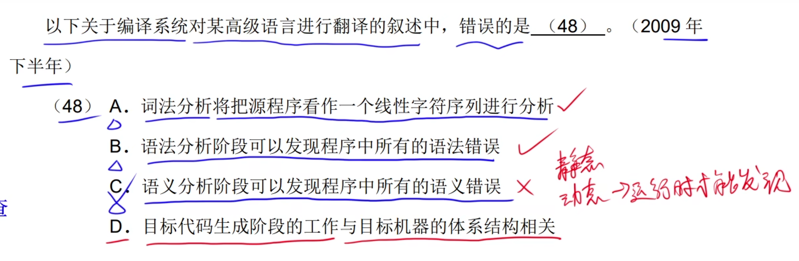
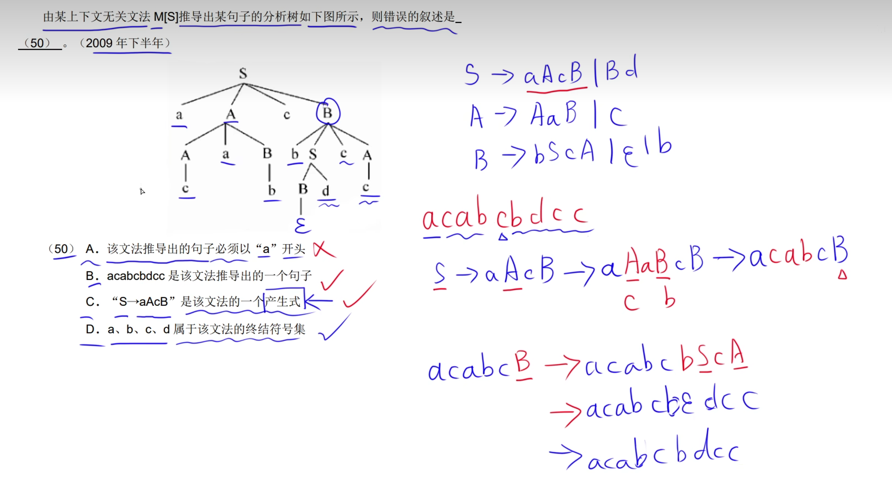
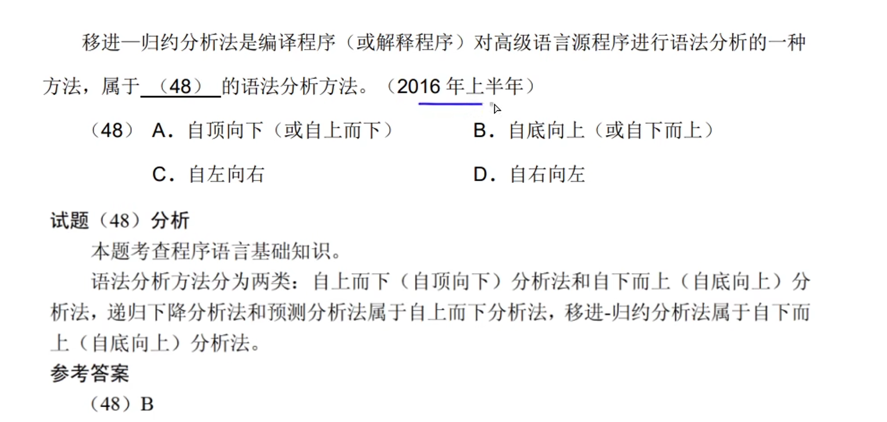
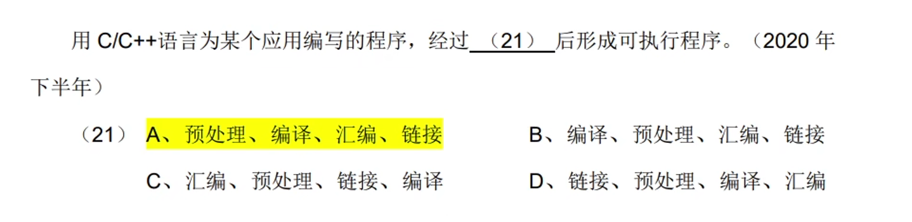

# 1.编辑程序和解释程序

## 1.低级语言和高级语言

机器语言和汇编语言被称为低级语言。

用某种高级语言或者汇编语言编写的程序被称为源程序。源程序不能直接在计算机上执行。 

## 2.编译程序和解释程序

编译程序：是将汇编语言翻译成目标程序

# 2.程序设计语言的基本成分

> **若一种程序设计语言规定其程序中的数据必须具有类型，则有利于**

1. > **便于为数据合理分配存储单元**

2. > **便于对参与表达式计算的数据对象进行检查**

3. > **便于对规定数据对象的取值范围及能够进行的运算**

**变量具有对应的存储单元，常量没有，因为常量存放在常量区，这个是特定分配的一块区域。**

## 1.值传递和地址传递

## 2.编译、解释程序翻译阶段

**编译器不参与运行控制**

## 3.符号表

## 4.词法分析

**词法分析的输出是记号流**

## 5.语法分析

**因为词法分析的输出流记号流，语法分析的接收是从词法分析过来的，所以，语法分析的输入是记号流**

输出是：语法树

**语法分析：判断结构是否有问题。**

**语法分析阶段可以发现程序中的所有语法错误。**

## 6.语义分析

**cpu访问寄存器的速度远远快于访问内存的速度。**

### 1.动态的语义错误

## 7.目标代码生成

就是判断其结构。

## 8.中间代码生成

## 9.正规式

**是一个词法分析的一个工具。**

> ***：是闭包的意思，可以出现0词或者多次。**

这个题目在于所有字符串中，

## 10.有限自动机

初态有一个圈，终态有两个圈。

一个DFA可以用两种直观的方式表示：状态转换图(有向图)和状态转换矩阵。

串识别完之后，要停留到终态上，不然就是不合法的。

## 11.上下文无关文法

## 12.中缀、后缀表达式转换

**后缀表达式利用栈来转换成中缀表达式。**

## 13.语法树中序、后续遍历

**最要是优先级的问题。**这个题目的语法树，根据中缀表达式画的。

# 3.杂题选讲

**脚本语言属于动态语言。**

**脚本语言被称为弱类型语言。**

**移进归纳分析法(自下而上)、递归下降分析法(自上而下)。**

**栈：用于函数的调用。**

**堆：用于申请和释放内存**

**变量在栈，对象在堆，jvm里面的内容。**

**元组类似于java中的数组。**

**大多数程序设计语言的语法规则用的是上下文无关文法。**
