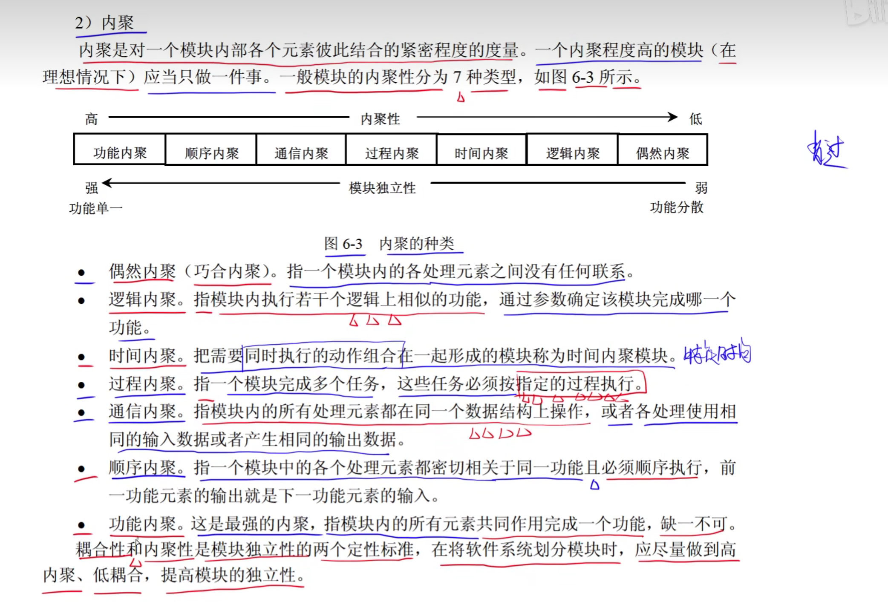
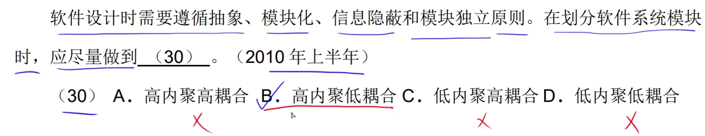
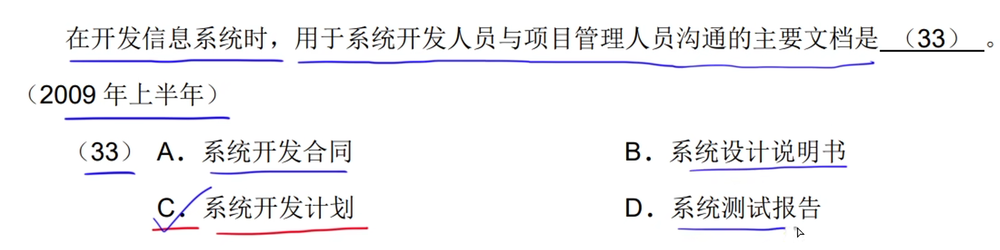
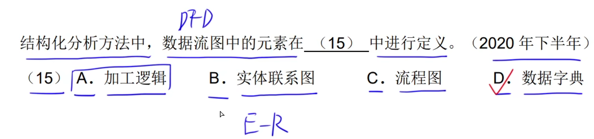

# 1.耦合

# 2.内聚

# 3.设计原则

# 4.系统文档

# 5.数据流图

## 1.数据流图的基本元素

## 2.外部实体

## 3.数据存储

## 4.加工

## 5.数据流

## 6.父图子图平衡

**在父图中指向的数据流在子图都会有指向，如果没有指向的就是数据流的缺失**

## 7.数据守恒

**旁边的文字说明在右边的图中都是连接上的，或者是旁边的是图就是根据这个文字创建的。**

**看图中的是否跟说明是否描述的一致**

**数据建模：E-R图     功能建模：DFD     行为建模：UML 状态转换图**

# 6.数据字典

# 7.杂题选讲

