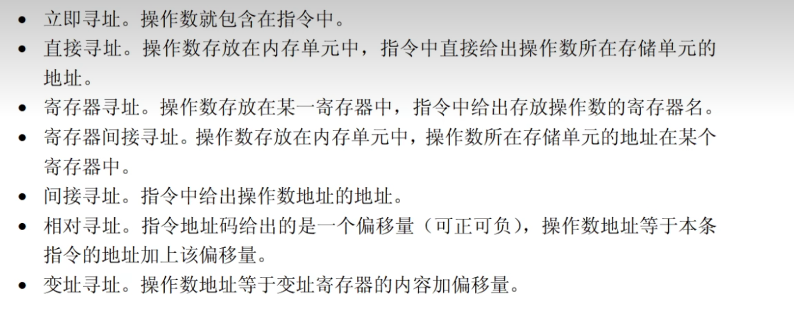
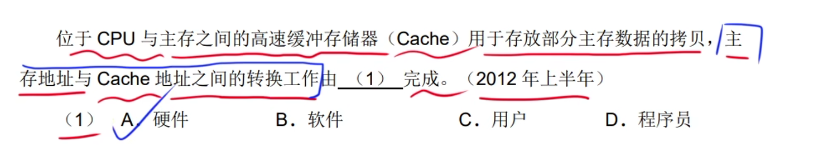
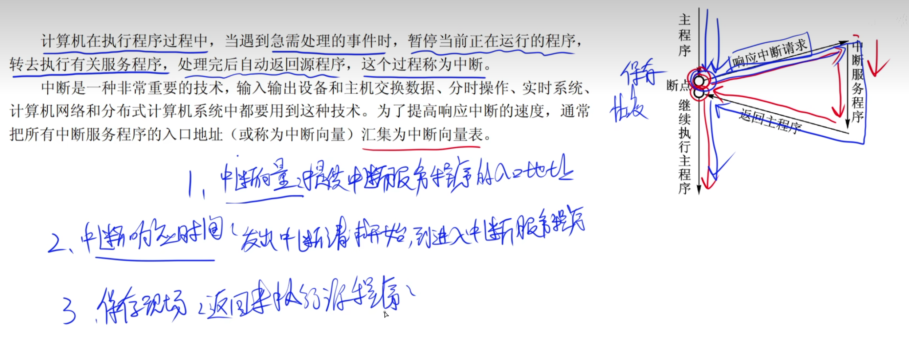
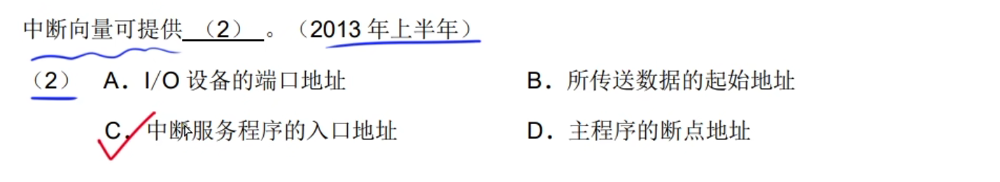

# 1.计算机系统硬件基本组成

> **计算机的基本硬件系统由运算器、控制器、存储器、输入设备和输出设备五大部分组成**

运算器、控制器等部件被集成在一起称为中央处理单元(CPU).

## 1.中央处理单元(CPU)

**CPU是计算机系统的核心**

**先获取在译码，最后执行指令。**

### 1.CPU的功能

> **程序控制、操作控制、时间控制属于控制器。**

> **数据处理 属于运算器**

### 2.CPU的组成

**程序计数器：PC的内容即使程序第一条指令的地址。**

**指令=地址码+操作码**

## 2.进制的转换

### 1.移码

> **移码：就是在一个数的补码上将符号位进行取反，就是移码。**

### 2.浮点数

## 3.寻址

## 4.校验码

### 1.奇偶校验码

只能检查错误不能纠正错误。

### 2.海明码

**这个公式很重要。**

**海明码可以进行检查错误和纠正错误。**

**海明码：码距==2 只能检查错误    码距 > 2 具有检查错误和纠错功能。**

### 3.循环冗余校验码

### 4.相关题目

**这个题目要明白意思，D9=8+4+2是p的位置，所以D5就是有8+2就B选项**

## 5.RISC与CISC

## 6.流水线公式

每个时刻都有一个输出的结果。

流水线公式可以提高设备的利用率。

> - **操作周期：最长时间段。**
> - **吞吐量：最长时间段的倒数。**
> - **执行n条指令的吞吐率：n/流水线的总时间(流水线公式)**
> - **流水线公式：第一条指令的执行时间+(n-1)*(最长段的时间)**

**当控制器发出进行某一微操作控制信号后，等待执行部件完成此操作后发出的“回答”信号或者结束信号，在开始新的微操作，称为异步控制方式。**

操作周期：就是最长的那个时间段。

## 7.存储器

**被访问的将来还要被访问的话，就是时间局部性。**

## 8.cache

**Cache设计的目标是在成本允许的条件下达到较高的命中率。**

**Cache对程序员来说是透明的。**

### 1.地址映象

> **看到主存和Cache之间地址的转换或者是映射都是由硬件完成的。**

## 9.中断

**中断方式因为CPU无需等待而提高了效率。**

> 1. **中断向量：提供中断服务程序的入口地址**
> 2. **中断响应时间：发出中断请求开始到进入中断服务程序**
> 3. **保护现场方便返回执行的源程序**

## 10.输入输出(IO)控制方式

### 1.程序查询方式

**一个字=8bit**

### 2.中断驱动方式

**程序中断方式在数据传输过程中需要cpu的干预**

### 3.直接存储器方式(DMA)

**块比字单位大**

> **程序查询方式 是串行操作，只有中断驱动方式和直接存储器方式是并行操作。**

**程序中断方式需要cpu保护现场，DMA方式不需要保护现场。**

**程序查询和中断驱动都是先将数据传输到cpu中**

**直接存储器存取：就是DMA**

**内存也被称为主存。**

## 11.总线

微机中的总线分为：数据总线、地址总线、控制总线。

- **数据总线：用来传送数据信息，是双向的。**
- ***地址总线：用来传送CPU发出的地址信息。<u>单向的</u>***
- **控制总线：用来传送控制信号、时序信号和状态信息等，是双向的。**

## 12.加密技术和认证技术

### 1.对称加密与非对称加密

### 2.摘要与数字签名

### 3.数字认证

**因为是用的是CA的私钥进行加密的，所以要用CA的公钥进行解密。**

**PKI：公开密钥体系**

**10：A   11 B**

### 4.加密算法

## 13.可靠性公式

## 14.杂题选讲

> - **逻辑与：两个都要为真才为真。**
> - **逻辑或：两个中的其中一个为真就可以。**
> - **逻辑同或：相同为1，不同为0**
> - **逻辑异或：相同为0，不同为1**

主动攻击：重放、IP地址欺骗、拒绝服务、系统干涉、修改数据命令。

被动攻击：会话拦截

4：指令A的CPI*指令A的比例相乘+指令B的CPI*指令B的比例相乘+指令C的CPI*指令C的比例相乘

5：用主频除于执行应用程序时的平均CPI，把G转换成M，就是800.

