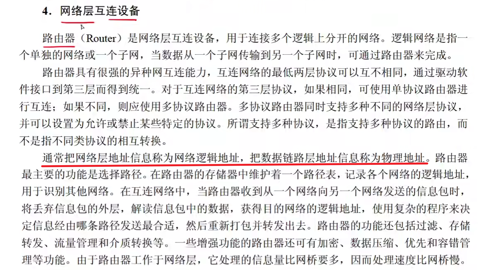
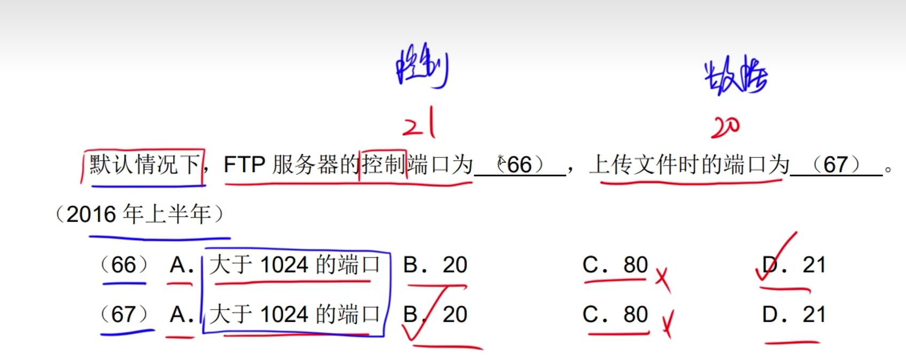
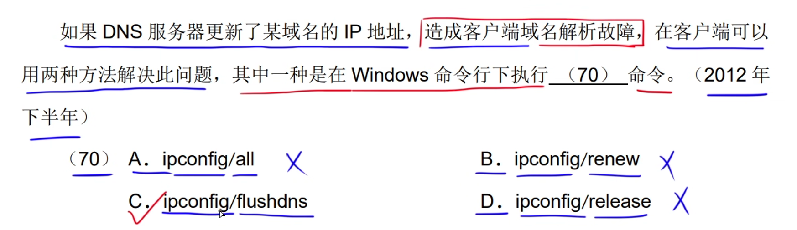
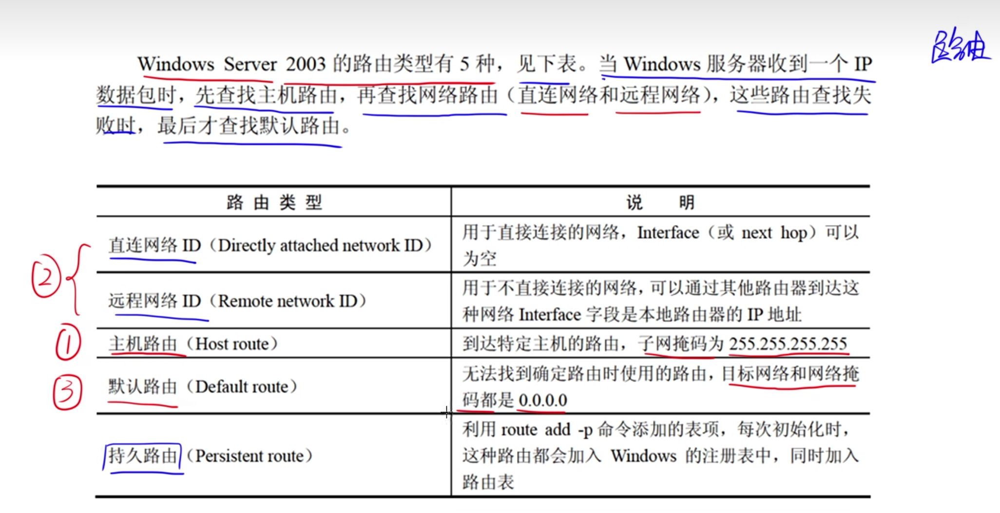

# 1.网络设备

# 2.协议簇

# 3.TCP和UDP

# 4.SMTP和POP3

**SMTP：端口号 25 传输Ascll   文本附件。发送邮件**

**POP3：端口号110     接收邮件**

**MIME：邮件附件扩展类型**

# 5.ARP

# 6.DHCP

# 7.URL

# 8.浏览器

# 9.IPV6

# 10.无线网络

# 11.Windows命令

# 12.路由

# 13.Linux命令

# 14.杂题选讲

