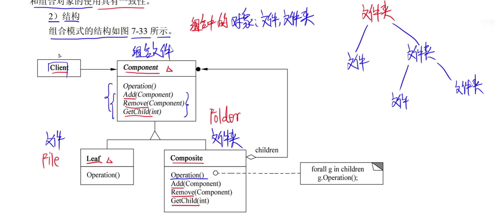

# 1.设计模式的要素


# 2.创建型设计模式


## 1.简短工厂模式


是继承抽象类

```java
/**
 * 简单工厂模式   要坚持对扩展开放，对修改关闭的原则  然而这个就不满足这个原则
 */
public class SimpleFactory {
    public static void main(String[] args) {
        Product product = Factory.createFactor("A");
        product.info();
    }
}

class Factory{ //工厂
    public static Product createFactor(String type){
        Product product = null;
        if (type.equals("A")){
            product = new ProductA();
        }else if (type.equals("B")){
            product = new ProductB();
        }else {
            System.out.println("错误");
        }
        return product;
    }
}

abstract class Product{ //抽象类
    public abstract void info();
}

class ProductA extends Product{ //产品A

    @Override
    public void info() {
        System.out.println("A产品");
    }
}

class ProductB extends Product{//产品B

    @Override
    public void info() {
        System.out.println("B产品");
    }
}
```

**不属于23种设计模式**

## 2.工厂方法模式(Factory Method)


```java
/**
工厂方法模式
 */
public class FactoryMode {
    public static void main(String[] args) {
        Factory factoryA = new FactoryA();
        //父类 对象名  = new 子类();
        //编译看左边  运行看右边
        Product product = factoryA.createProduct();
        product.info();

    }
}

interface Factory{//抽象工厂
    public Product createProduct();
}

class FactoryA implements Factory{

    @Override
    public Product createProduct() {
       return new productA();
    }
}

class FactoryB implements Factory{

    @Override
    public Product createProduct() {
        return new productB();
    }
}

interface Product{//抽象产品
    void info();
}

class productA implements Product{

    @Override
    public void info() {
        System.out.println("A产品");
    }
}
class productB implements Product{

    @Override
    public void info() {
        System.out.println("B产品");
    }
}
```


## 3.抽象工厂模式(AbstractFactory)


```java
/**
抽象工厂方法模式
 */
public class AbstractFactory {
    public static void main(String[] args) {

    }
}

interface Factory{//抽象工厂
    public ProductB createProductB();
    public ProductA createProductA();
}

class Factory1 implements Factory{


    @Override
    public ProductB createProductB() {
        return new productB1();
    }

    @Override
    public ProductA createProductA() {
        return new productA1();
    }
}

class Factory2 implements Factory{


    @Override
    public ProductB createProductB() {
        return new productB2();
    }

    @Override
    public ProductA createProductA() {
        return new productA2();
    }
}

interface ProductA{//抽象产品
    void info();
}

class productA1 implements ProductA{

    @Override
    public void info() {
        System.out.println("A1产品");
    }
}

class productA2 implements ProductA{

    @Override
    public void info() {
        System.out.println("A2产品");
    }
}

interface ProductB{
    void info();
}

class productB1 implements ProductB{

    @Override
    public void info() {
        System.out.println("B1产品");
    }
}

class productB2 implements ProductB{

    @Override
    public void info() {
        System.out.println("B2产品");
    }
}
```


## 4.生成器(Builder)


```java
/**
生成器模式
 */
public class Main {
    public static void main(String[] args){
        Director director = new Director();
        Builder1 builder1 = new Builder1();
        director.Construct(builder1);
        Product result = builder1.getResult();
        result.show();
    }
}

class Director{//类似于服务员

    public void Construct(Builder builder){
        builder.BuildPart();
    }
}

abstract class Builder{//抽象套餐
    public abstract void BuildPart();
    public abstract Product getResult();
}

class Builder1 extends Builder{//具体套餐1

    Product product = new Product();
    @Override
    public void BuildPart() {
        product.add("A");
        product.add("B");
        product.add("C");
        product.add("D");
        product.add("E");
    }

    @Override
    public Product getResult() {
        return product;
    }
}

class Builder2 extends Builder{//具体套餐2

    Product product = new Product();
    @Override
    public void BuildPart() {
        product.add("A");
        product.add("B");
        product.add("C");
    }

    @Override
    public Product getResult() {
        return product;
    }
}

class Product{//产品
     List<String> parts = new ArrayList<>();

     public void add(String part){
         parts.add(part);
     }

     public void show(){
         System.out.print("产品的组成: ");
         for (String s : parts)
             System.out.print(s+" ");
         System.out.println();
     }
}
```


## 5.Prototype(原型模式)


```java
/**
 原型模式
 */
public class main {
    public static void main(String[] args){
        Product product = new Product(2022,5.28);
        System.out.println(product.getId()+"  " +product.getPrice());
        System.out.println("克隆后：=============");
        Object clone = product.Clone();
        System.out.println(clone);
    }
}

interface Prototype{//抽象克隆
    public Object Clone();
}

class Product implements Prototype{//具体克隆
   private int id;
   private double price;

    public Product() {
    }

    public Product(int id, double price) {
        this.id = id;
        this.price = price;
    }

    public int getId() {
        return id;
    }

    public void setId(int id) {
        this.id = id;
    }

    public double getPrice() {
        return price;
    }

    public void setPrice(double price) {
        this.price = price;
    }

    @Override
    public Object Clone() {///具体的克隆方法
        Product product = new Product();//创建一个新的对象
        product.id = this.id;//将原来的对象方法的属性赋值给新创建的对象
        product.price = this.price;
        return product;//返回新创建的对象
    }

    @Override
    public String toString() {
        return "Product{" +
                "id=" + id +
                ", price=" + price +
                '}';
    }
}
```


## 6.单列模式(Singleton)


```java
/**
单列模式
 */
public class SingletonPattern {
    public static void main(String[] args) {
        Singleton instance = Singleton.getInstance();
        Singleton instance1 = Singleton.getInstance();
        System.out.println(instance.getNumber()+"    "+ instance1.getNumber());
        instance.setNumber(2);//虽然调用了两个方法，返回了两个对象，其实都是一个
        System.out.println(instance.getNumber()+"    "+ instance1.getNumber());
    }
}

class Singleton{
   private int number = 2022;

    public int getNumber() {
        return number;
    }

    public void setNumber(int number) {
        this.number = number;
    }

    private static Singleton instance =  new Singleton();//将这个设置成私有的，保证只有一个实列
  private Singleton(){ }//将构造器设置成私有的

   public static Singleton getInstance(){//返回唯一的一个实列
       return instance;
   }
}
```


# 3.结构型创建模式

## 1.适配器模式(Adapter)


```java
/**
适配器模式
 */
public class AdapterPattern {
    public static void main(String[] args) {
         Target USB = new Adapter();
         USB.Request();
    }
}

class Target{//USB接口
   public void Request(){
       System.out.println("USB接口");
   }
}

class Adapter extends Target{//转接器
   private Adaptee adaptee = new Adaptee();

   @Override
    public void Request(){
       adaptee.SpecificRequest();
   }

}

class Adaptee{//Type-C接口
    public void SpecificRequest(){
        System.out.println("Type-c数据线");
    }
}
```


## 2.桥接模式(Bridge)


```java
package m;

/**
桥接模式
 */
public class BridgePattern {
    public static void main(String[] args) {
        ProductA productA = new ProductA();
        Color red = new Red();
        productA.setName("产品A");
        productA.setColor(red);
        productA.Operation();
    }
}

abstract class Product{//抽象产品
    private String name;
    protected Color color;

    public String getName() {
        return name;
    }

    public void setName(String name) {
        this.name = name;
    }

    public void setColor(Color color){
        this.color = color;
    }

    public abstract void Operation();
}

class ProductA extends Product{//具体产品

    @Override
    public void Operation() {
        color.Operation(this.getName());
    }
}

interface Color{//抽象的颜色
  public void Operation(String name);
}

class Red implements Color{//具体的颜色

    @Override
    public void Operation(String name) {
        System.out.println(name+" ：红色");
    }
}

class Bule implements Color{//具体的颜色

    @Override
    public void Operation(String name) {
        System.out.println(name+ " ：蓝色");
    }
}
```


## 3.组合模式(Composite)





```java
package m1;

import java.util.ArrayList;
import java.util.List;

/**
组合模式
 */
public class CompositePattern {
    public static void main(String[] args) {
        AbstractFile root = new Folder("root");
        AbstractFile file1 = new File("file1");
//        file1.printName();
        AbstractFile folder = new Folder("Folder1");
//        folder.printName();
        root.Add(file1);
        root.Add(folder);
        print(root);
    }

    public static void print(AbstractFile file){//打印节点名称 利用递归，就相当于遍历树
        file.printName();//打印当前节点名称
        List<AbstractFile> children = file.getChildren();
        if (children == null) return;
        for (AbstractFile abstractFile : children){
            print(abstractFile);
        }
    }
}

abstract class AbstractFile{//抽象组合文件
  protected String name;
  public void printName(){
      System.out.println(name);
  }

  //添加文件或者文件夹
  public abstract void Add(AbstractFile file);

  //删除文件或者文件夹
  public abstract void Remove(AbstractFile file);

  //获取文件或者文件夹
    public abstract List<AbstractFile> getChildren();

}

class Folder extends AbstractFile{//文件夹
   private List<AbstractFile> childrenList = new ArrayList<>();

  public Folder(String name){
      this.name = name;
  }

    @Override
    public void Add(AbstractFile file) {
        childrenList.add(file);
    }

    @Override
    public void Remove(AbstractFile file) {
         childrenList.remove(file);
    }

    @Override
    public List<AbstractFile> getChildren() {
        return childrenList;
    }
}

class File extends AbstractFile{//文件
   public File(String name){
       this.name = name;
   }

    @Override
    public void Add(AbstractFile file) {
        return;
    }

    @Override
    public void Remove(AbstractFile file) {
        return;
    }

    @Override
    public List<AbstractFile> getChildren() {//文件是不存储子文件或者子文件夹的
        return null;//所以返回null
    }
}
```


## 4.装饰器模式(Decorator)
