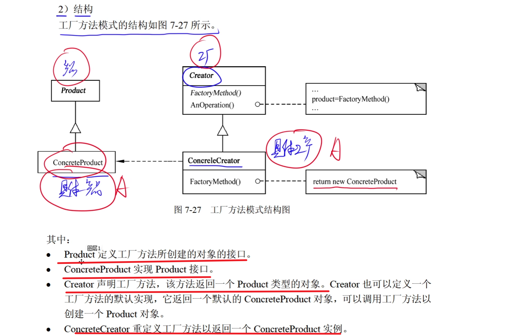
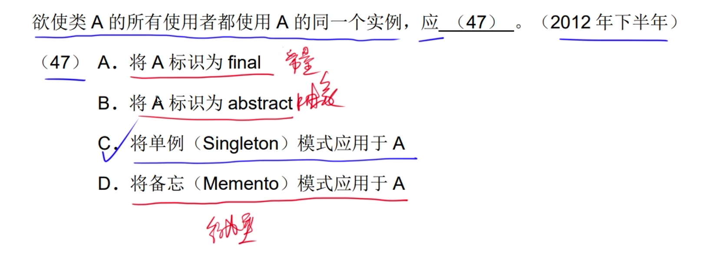
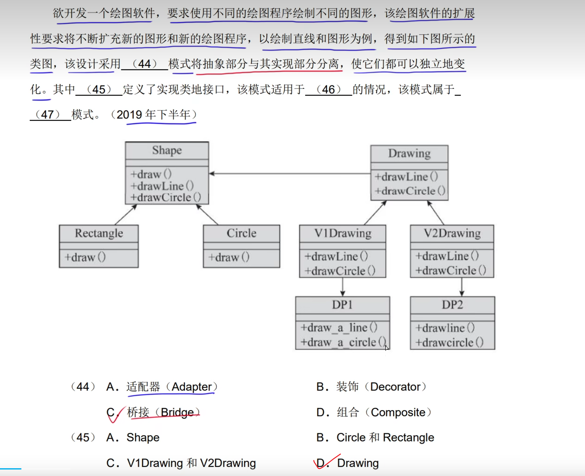
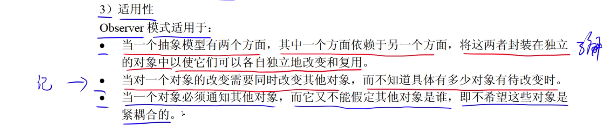

# 1.设计模式的要素


# 2.创建型设计模式


## 1.简短工厂模式


是继承抽象类

```java
/**
 * 简单工厂模式   要坚持对扩展开放，对修改关闭的原则  然而这个就不满足这个原则
 */
public class SimpleFactory {
    public static void main(String[] args) {
        Product product = Factory.createFactor("A");
        product.info();
    }
}

class Factory{ //工厂
    public static Product createFactor(String type){
        Product product = null;
        if (type.equals("A")){
            product = new ProductA();
        }else if (type.equals("B")){
            product = new ProductB();
        }else {
            System.out.println("错误");
        }
        return product;
    }
}

abstract class Product{ //抽象类
    public abstract void info();
}

class ProductA extends Product{ //产品A

    @Override
    public void info() {
        System.out.println("A产品");
    }
}

class ProductB extends Product{//产品B

    @Override
    public void info() {
        System.out.println("B产品");
    }
}
```

**不属于23种设计模式**

## 2.工厂方法模式(Factory Method)


```java
/**
工厂方法模式
 */
public class FactoryMode {
    public static void main(String[] args) {
        Factory factoryA = new FactoryA();
        //父类 对象名  = new 子类();
        //编译看左边  运行看右边
        Product product = factoryA.createProduct();
        product.info();

    }
}

interface Factory{//抽象工厂
    public Product createProduct();
}

class FactoryA implements Factory{

    @Override
    public Product createProduct() {
       return new productA();
    }
}

class FactoryB implements Factory{

    @Override
    public Product createProduct() {
        return new productB();
    }
}

interface Product{//抽象产品
    void info();
}

class productA implements Product{

    @Override
    public void info() {
        System.out.println("A产品");
    }
}
class productB implements Product{

    @Override
    public void info() {
        System.out.println("B产品");
    }
}
```





## 3.抽象工厂模式(AbstractFactory)


```java
/**
抽象工厂方法模式
 */
public class AbstractFactory {
    public static void main(String[] args) {

    }
}

interface Factory{//抽象工厂
    public ProductB createProductB();
    public ProductA createProductA();
}

class Factory1 implements Factory{


    @Override
    public ProductB createProductB() {
        return new productB1();
    }

    @Override
    public ProductA createProductA() {
        return new productA1();
    }
}

class Factory2 implements Factory{


    @Override
    public ProductB createProductB() {
        return new productB2();
    }

    @Override
    public ProductA createProductA() {
        return new productA2();
    }
}

interface ProductA{//抽象产品
    void info();
}

class productA1 implements ProductA{

    @Override
    public void info() {
        System.out.println("A1产品");
    }
}

class productA2 implements ProductA{

    @Override
    public void info() {
        System.out.println("A2产品");
    }
}

interface ProductB{
    void info();
}

class productB1 implements ProductB{

    @Override
    public void info() {
        System.out.println("B1产品");
    }
}

class productB2 implements ProductB{

    @Override
    public void info() {
        System.out.println("B2产品");
    }
}
```


## 4.生成器(Builder)


```java
/**
生成器模式
 */
public class Main {
    public static void main(String[] args){
        Director director = new Director();
        Builder1 builder1 = new Builder1();
        director.Construct(builder1);
        Product result = builder1.getResult();
        result.show();
    }
}

class Director{//类似于服务员

    public void Construct(Builder builder){
        builder.BuildPart();
    }
}

abstract class Builder{//抽象套餐
    public abstract void BuildPart();
    public abstract Product getResult();
}

class Builder1 extends Builder{//具体套餐1

    Product product = new Product();
    @Override
    public void BuildPart() {
        product.add("A");
        product.add("B");
        product.add("C");
        product.add("D");
        product.add("E");
    }

    @Override
    public Product getResult() {
        return product;
    }
}

class Builder2 extends Builder{//具体套餐2

    Product product = new Product();
    @Override
    public void BuildPart() {
        product.add("A");
        product.add("B");
        product.add("C");
    }

    @Override
    public Product getResult() {
        return product;
    }
}

class Product{//产品
     List<String> parts = new ArrayList<>();

     public void add(String part){
         parts.add(part);
     }

     public void show(){
         System.out.print("产品的组成: ");
         for (String s : parts)
             System.out.print(s+" ");
         System.out.println();
     }
}
```


## 5.Prototype(原型模式)


```java
/**
 原型模式
 */
public class main {
    public static void main(String[] args){
        Product product = new Product(2022,5.28);
        System.out.println(product.getId()+"  " +product.getPrice());
        System.out.println("克隆后：=============");
        Object clone = product.Clone();
        System.out.println(clone);
    }
}

interface Prototype{//抽象克隆
    public Object Clone();
}

class Product implements Prototype{//具体克隆
   private int id;
   private double price;

    public Product() {
    }

    public Product(int id, double price) {
        this.id = id;
        this.price = price;
    }

    public int getId() {
        return id;
    }

    public void setId(int id) {
        this.id = id;
    }

    public double getPrice() {
        return price;
    }

    public void setPrice(double price) {
        this.price = price;
    }

    @Override
    public Object Clone() {///具体的克隆方法
        Product product = new Product();//创建一个新的对象
        product.id = this.id;//将原来的对象方法的属性赋值给新创建的对象
        product.price = this.price;
        return product;//返回新创建的对象
    }

    @Override
    public String toString() {
        return "Product{" +
                "id=" + id +
                ", price=" + price +
                '}';
    }
}
```


## 6.单列模式(Singleton)


```java
/**
单列模式
 */
public class SingletonPattern {
    public static void main(String[] args) {
        Singleton instance = Singleton.getInstance();
        Singleton instance1 = Singleton.getInstance();
        System.out.println(instance.getNumber()+"    "+ instance1.getNumber());
        instance.setNumber(2);//虽然调用了两个方法，返回了两个对象，其实都是一个
        System.out.println(instance.getNumber()+"    "+ instance1.getNumber());
    }
}

class Singleton{
   private int number = 2022;

    public int getNumber() {
        return number;
    }

    public void setNumber(int number) {
        this.number = number;
    }

    private static Singleton instance =  new Singleton();//将这个设置成私有的，保证只有一个实列
  private Singleton(){ }//将构造器设置成私有的

   public static Singleton getInstance(){//返回唯一的一个实列
       return instance;
   }
}
```





# 3.结构型创建模式

## 1.适配器模式(Adapter)


```java
/**
适配器模式
 */
public class AdapterPattern {
    public static void main(String[] args) {
         Target USB = new Adapter();
         USB.Request();
    }
}

class Target{//USB接口
   public void Request(){
       System.out.println("USB接口");
   }
}

class Adapter extends Target{//转接器
   private Adaptee adaptee = new Adaptee();

   @Override
    public void Request(){
       adaptee.SpecificRequest();
   }

}

class Adaptee{//Type-C接口
    public void SpecificRequest(){
        System.out.println("Type-c数据线");
    }
}
```


## 2.桥接模式(Bridge)


```java
package m;

/**
桥接模式
 */
public class BridgePattern {
    public static void main(String[] args) {
        ProductA productA = new ProductA();
        Color red = new Red();
        productA.setName("产品A");
        productA.setColor(red);
        productA.Operation();
    }
}

abstract class Product{//抽象产品
    private String name;
    protected Color color;

    public String getName() {
        return name;
    }

    public void setName(String name) {
        this.name = name;
    }

    public void setColor(Color color){
        this.color = color;
    }

    public abstract void Operation();
}

class ProductA extends Product{//具体产品

    @Override
    public void Operation() {
        color.Operation(this.getName());
    }
}

interface Color{//抽象的颜色
  public void Operation(String name);
}

class Red implements Color{//具体的颜色

    @Override
    public void Operation(String name) {
        System.out.println(name+" ：红色");
    }
}

class Bule implements Color{//具体的颜色

    @Override
    public void Operation(String name) {
        System.out.println(name+ " ：蓝色");
    }
}
```





## 3.组合模式(Composite)


```java
package m1;

import java.util.ArrayList;
import java.util.List;

/**
组合模式
 */
public class CompositePattern {
    public static void main(String[] args) {
        AbstractFile root = new Folder("root");
        AbstractFile file1 = new File("file1");
//        file1.printName();
        AbstractFile folder = new Folder("Folder1");
//        folder.printName();
        root.Add(file1);
        root.Add(folder);
        print(root);
    }

    public static void print(AbstractFile file){//打印节点名称 利用递归，就相当于遍历树
        file.printName();//打印当前节点名称
        List<AbstractFile> children = file.getChildren();
        if (children == null) return;
        for (AbstractFile abstractFile : children){
            print(abstractFile);
        }
    }
}

abstract class AbstractFile{//抽象组合文件
  protected String name;
  public void printName(){
      System.out.println(name);
  }

  //添加文件或者文件夹
  public abstract void Add(AbstractFile file);

  //删除文件或者文件夹
  public abstract void Remove(AbstractFile file);

  //获取文件或者文件夹
    public abstract List<AbstractFile> getChildren();

}

class Folder extends AbstractFile{//文件夹
   private List<AbstractFile> childrenList = new ArrayList<>();

  public Folder(String name){
      this.name = name;
  }

    @Override
    public void Add(AbstractFile file) {
        childrenList.add(file);
    }

    @Override
    public void Remove(AbstractFile file) {
         childrenList.remove(file);
    }

    @Override
    public List<AbstractFile> getChildren() {
        return childrenList;
    }
}

class File extends AbstractFile{//文件
   public File(String name){
       this.name = name;
   }

    @Override
    public void Add(AbstractFile file) {
        return;
    }

    @Override
    public void Remove(AbstractFile file) {
        return;
    }

    @Override
    public List<AbstractFile> getChildren() {//文件是不存储子文件或者子文件夹的
        return null;//所以返回null
    }
}
```


## 4.装饰器模式(Decorator)


```java
/**
 * 装饰器模式
 */
public class DecoratorPattern {
    public static void main(String[] args) {
        Person zhangsan = new Student("张山");
        zhangsan.Operation();
        System.out.println("========================");
        //父类名 对象名 = new 子类名()
//        Decorator w = new DecoratorA(zhangsan);//这样也可以表示
        zhangsan = new DecoratorA(zhangsan); //添加一个
        zhangsan = new DecoratorB(zhangsan);//添加第二个
        zhangsan.Operation();
    }
}

abstract class Person{
  protected String name;

  public abstract void Operation();//职责

}

class Student extends Person{

    public Student(String name){
        this.name = name;
    }

    @Override
    public void Operation() {
        System.out.println(name + "：职责 是学习");
    }
}

abstract class Decorator extends Person{//抽象的装饰器
    protected Person person;

}

class DecoratorA extends Decorator{//具体的装饰器A
    public DecoratorA(Person person) {
        this.person = person;
    }

    @Override
    public void Operation() {//职责
         person.Operation();//原本的职责
        System.out.println("写作业");//增加的职责
    }
}

class DecoratorB extends Decorator{//具体的装饰器B
    public DecoratorB(Person person) {
        this.person = person;
    }
    @Override
    public void Operation() {//职责
        person.Operation();//原本的职责
        System.out.println("考试");//增加的职责
    }
}
```


## 5.外观模式(Facade)


```java
/**
 外观模式
 */
public class FacadePattern {
    public static void main(String[] args) {
        Facade facade = new Facade();
        facade.methodA();
        facade.methodB();
        facade.methodC();
    }
}

class Facade{
    SubSystemOne subSystemOne;
    SubSystemTwo subSystemTwo;
    SubSystemThree subSystemThree;

    public Facade(){
        subSystemOne = new SubSystemOne();
        subSystemTwo = new SubSystemTwo();
        subSystemThree = new SubSystemThree();
    }

    public void methodA(){
        subSystemOne.methodOne();
    }

    public void methodB(){
        subSystemTwo.methodTwo();
    }

    public void methodC(){
        subSystemThree.methodThree();
    }
}

class SubSystemOne{//功能一
    public void methodOne(){
        System.out.println("执行功能一");
    }
}

class SubSystemTwo{//功能二
    public void methodTwo(){
        System.out.println("执行功能二");
    }
}

class SubSystemThree{//功能三
    public void methodThree(){
        System.out.println("执行功能三");
    }
}
```


## 6.享元模式(Flyweight)


**一般是减少创建对象的数量和减少计算机的存储开销**


```java
/**
 享元模式
 */
public class FlyWeightPattern {
    public static void main(String[] args) {
        PieceFactory factory = new PieceFactory();
        Piece whitepiece = factory.getPiece(1);
        whitepiece.draw(2023,2022);
    }
}

class PieceFactory{

    private Piece[] pieces = {new WhitePiece(),new BlackPiece()};

    public Piece getPiece(int key){
        if (key == 1 ) return pieces[0];
        else return pieces[1];
    }
}

abstract class Piece{///棋子
   protected String color;

   public abstract void draw(int x,int y);
}

class WhitePiece extends Piece{//白棋
   public WhitePiece(){
       this.color = "white";
   }

    @Override
    public void draw(int x, int y) {
        System.out.println("draw a color: "+color+ "piece x : " + x + "y : " + y);
    }
}

class BlackPiece extends Piece{//黑棋
    public BlackPiece(){
        this.color = "black";
    }
    @Override
    public void draw(int x, int y) {
        System.out.println("draw a color: "+color+ "piece x : " + x + "y : " + y);
    }
}
```


## 7.代理模式(Proxy)


```java
/**
 代理模式
 */
public class ProxyPattern {
    public static void main(String[] args) {
        RealSubject realSubject = new RealSubject();
        Proxy proxy = new Proxy(realSubject);
        proxy.buy();
    }
}

interface Subject{
    public void buy();
}

class Proxy implements Subject{

    private RealSubject realSubject;

    public Proxy(RealSubject realSubject){
        this.realSubject = realSubject;
    }

    @Override
    public void buy() {
        System.out.println("办理购买前的手续");
         realSubject.buy();
        System.out.println("办理购买后的手续");
    }
}

class RealSubject implements Subject{

    @Override
    public void buy() {
        System.out.println("付钱");
    }
}
```


# 4.行为型设计模式

## 1.责任链模式(Chain of Responsibility)


```java
/**
 责任链模式
 */
public class chainofResponsibilityPattern {
    public static void main(String[] args) {
        FuDaoYuan fuDaoYuan = new FuDaoYuan();
        YuanZhang yuanZhang = new YuanZhang();
        XiaoZhang xiaoZhang = new XiaoZhang();
        fuDaoYuan.setNext(yuanZhang);//将辅导员后继节点设置成院长
        yuanZhang.setNext(xiaoZhang);//将院长的后继节点设置成校长
        fuDaoYuan.HandlerRequest(8);

    }
}

abstract class Handler{//抽象的类
  protected Handler next;

  public void setNext(Handler handler){
      this.next = handler;
  }

  public abstract void HandlerRequest(int request);
}

class FuDaoYuan extends Handler{// <= 7审批

    @Override
    public void HandlerRequest(int request) {
        if (request <= 7){
            System.out.println("辅导员审批通过");
        }else {
            if (next != null){
                next.HandlerRequest(request);
            }else {
                System.out.println("无法审批");
            }
        }
    }
}

class YuanZhang extends Handler{// <= 15审批

    @Override
    public void HandlerRequest(int request) {
        if (request <= 15){
            System.out.println("院长审批通过");
        }else {
            if (next != null){
                next.HandlerRequest(request);
            }else {
                System.out.println("无法审批");
            }
        }
    }
}

class XiaoZhang extends Handler{// <= 30审批

    @Override
    public void HandlerRequest(int request) {
        if (request <= 30){
            System.out.println("校长审批通过");
        }else {
            if (next != null){
                next.HandlerRequest(request);
            }else {
                System.out.println("无法审批");
            }
        }
    }
}
```

## 2.命令模式(Command)


```java
/**
 * 命令模式
 */
public class CommandPattern {
    public static void main(String[] args) {
        TV tv = new TV();//创建接收者
        OnCommand onCommand = new OnCommand(tv);//创建对应的指令
        Invoker invoker = new Invoker();//创建请求者对象
        invoker.setCommand(onCommand);//设置请求者的命令
        invoker.Call();
    }
}

class Invoker{//请求者
    private Command command; //命令
    public void setCommand(Command command){//设置请求者的命令
        this.command = command;
    }

    public void Call(){//调用
        command.Execte();
    }
}

interface Command {//命令接口
   public void Execte();//执行命令
}

class OnCommand implements Command{//开机命令

    private TV tv;

    public OnCommand(TV tv){
        this.tv = tv;
    }

    @Override
    public void Execte() {
     tv.OnAction();
    }

}

class OffCommand implements Command{//关机命令
    private TV tv;

    public OffCommand(TV tv){
        this.tv = tv;
    }

    @Override
    public void Execte() {
   tv.OffAction();
    }
}

class TV{//具体的接收者
   public void OnAction(){//开机行为
       System.out.println("开机");
   }

   public void OffAction(){//关机行为
       System.out.println("关机");
   }

}
```


## 3.解释器模式(Interpreter)


```java
import java.util.HashSet;
import java.util.Set;

/**
 * @author: 杨润
 * @date: 2023/2/1 16:02
 * @description:
 */
public class InterpreterPattern {
    public static void main(String[] args) {
        Context context = new Context();
        context.check("A区的开发人员");
        context.check("B区的测试1人员");
        context.check("C区的调式人员");
    }
}

class Context{
    private String[] regs = {"A区","B区","C区"};
    private String[] persons = {"开发人员","测试人员","调式人员"};


    private NonterminalExprssion nonterminalExprssion ;

    public Context(){
        TerminalExpression reg = new TerminalExpression(regs);
        TerminalExpression person = new TerminalExpression(persons);
        nonterminalExprssion = new NonterminalExprssion(reg,person);
    }

    public void check(String info){
        boolean bool = nonterminalExprssion.Interpret(info);
        if (bool) {
            System.out.println("识别成功");
        }else {
            System.out.println("识别失败");
        }
    }
}

interface Expression{
    public boolean Interpret(String info);
}

class NonterminalExprssion implements Expression{//非终结符解释器

    private TerminalExpression reg ;
    private TerminalExpression person ;

    public NonterminalExprssion(TerminalExpression reg, TerminalExpression person) {
        this.reg = reg;
        this.person = person;
    }

    @Override
    public boolean Interpret(String info) {
        String[] des = info.split("的");
        return reg.Interpret(des[0]) && person.Interpret(des[1]);
    }
}

class TerminalExpression implements Expression{//终结符解释器
     private Set<String> set = new HashSet<>();

     public TerminalExpression(String[] data){
         for (String s : data){
             set.add(s);
         }
     }

    @Override
    public boolean Interpret(String info) {
       return set.contains(info);
    }
}
```

## 4.迭代器模式(Iterator)


```java
import java.util.ArrayList;
import java.util.List;

/**
 * 迭代器模式
 */
public class IteratorPattern {
    public static void main(String[] args) {
    /*    List<Book> bookList = new ArrayList<>();*/
        BookAggregate bookAggregate = new BookAggregate();
        String[] books = {"数据结构","操作系统","计算机原理"};
        double[] prices = {12,32,121,212,12,3,22};
     /*   for (int i = 0; i < 5; i++) {
            bookList.add(new Book(books[i],prices[i]));
        }

        for (int i = 0; i < bookList.size(); i++) {
            Book book = bookList.get(i);
            System.out.println(book.getName()+":"+book.getPrice());
        }
*/
        for (int i = 0; i < 3; i++) {
            bookAggregate.add(new Book(books[i],prices[i]));
        }
        Iterator iterator = bookAggregate.CreateIterator();
        while (iterator.hasNext()){
            Book book = (Book) iterator.next();
            System.out.println(book.getName()+":"+book.getPrice());
        }

    }
}

interface Iterator{
    public boolean hasNext();
    public Object next();
}

class BookIterator implements Iterator{
    private int index;
    private BookAggregate bookAggregate;

    public BookIterator(BookAggregate bookAggregate) {
        this.index = 0;
        this.bookAggregate = bookAggregate;
    }

    @Override
    public boolean hasNext() {
        if (index < bookAggregate.getSize()) return true;
        return false;
    }

    @Override
    public Object next() {
        return bookAggregate.get(index++);
    }
}

interface Aggregate{
    public Iterator CreateIterator();
}
class BookAggregate implements Aggregate{
    private List<Book> list = new ArrayList<>();

    public void add(Book book){
        list.add(book);
    }

    public Book get(int index){
        return list.get(index);
    }

    public int getSize(){
        return list.size();
    }

    @Override
    public Iterator CreateIterator() {
        return new BookIterator(this);
    }
}


class Book{
    private String name;
    private Double price;

    public Book(String name, Double price) {
        this.name = name;
        this.price = price;
    }

    public String getName() {
        return name;
    }

    public void setName(String name) {
        this.name = name;
    }

    public Double getPrice() {
        return price;
    }

    public void setPrice(Double price) {
        this.price = price;
    }
}
```

## 5.中介者模式(Mediator)


```java
/**
 * 中介者模式
 */
public class MediatorPattern {
    public static void main(String[] args) {
        ConcreteMediator mediator = new ConcreteMediator();

        Colleague1 colleague1 = new Colleague1(mediator);
        Colleague2 colleague2 = new Colleague2(mediator);
        mediator.setColleague1(colleague1);
        mediator.setColleague2(colleague2);
        colleague1.sendMessage("软考加油");
        colleague2.sendMessage("祝大家考试顺利");
    }
}

abstract class Colleague{
    protected Mediator mediator;
}

class Colleague1 extends Colleague{
    public Colleague1(Mediator mediator) {
        this.mediator = mediator;
    }

    public void sendMessage(String message){
        mediator.sendMessage(message,this);
    }

    public void Notify(String message){
        System.out.println("同事1收到消息："+ message);
    }
}

class Colleague2 extends Colleague{
    public Colleague2(Mediator mediator) {
        this.mediator = mediator;
    }

    public void sendMessage(String message){
        mediator.sendMessage(message,this);
    }

    public void Notify(String message){
        System.out.println("同事2收到消息："+ message);
    }
}

abstract class Mediator{//抽象中介者
   public abstract void sendMessage(String message,Colleague colleague);
}

class ConcreteMediator extends Mediator{//具体的中介者
    private Colleague1 colleague1;
    private Colleague2 colleague2;

    public void setColleague1(Colleague1 colleague1) {
        this.colleague1 = colleague1;
    }

    public void setColleague2(Colleague2 colleague2) {
        this.colleague2 = colleague2;
    }

    @Override
    public void sendMessage(String message, Colleague colleague) {
        if (colleague == colleague1){
             //同事2接收消息
            colleague2.Notify(message);
        }else {
            //让同事1接收消息
            colleague1.Notify(message);
        }
    }
}
```

## 6.备忘录模式(Memento)


```java
import java.util.ArrayList;
import java.util.List;

/**
 * 备忘录模式
 */
public class MementoPattern {
    public static void main(String[] args) {
        Caretaker caretaker = new Caretaker();//创建者
        Originator originator = new Originator();//原发器
        originator.setState("1024");///设置状态
        Memento memento = originator.createMemento();///创建备忘录
        caretaker.addMemento(memento);

        originator.setState("2024");///设置状态
        Memento memento2 = originator.createMemento();///创建备忘录
        caretaker.addMemento(memento2);

        originator.setState("3024");///设置状态
        Memento memento4 = originator.createMemento();///创建备忘录
        caretaker.addMemento(memento4);
        caretaker.showMemento();

        Memento memento1 = caretaker.getMemento(2);
        originator.setMemento(memento1);
        System.out.println("根据第二次备份还原之后的状态为:"+ originator.getState());
    }
}

class Originator{//原发器
    private String state;

    public String getState() {
        return state;
    }

    public void setState(String state) {
        this.state = state;
    }

    public Memento createMemento(){//创建备忘录
        return new Memento(state);
    }

    public void setMemento(Memento memento){
        state = memento.getState();
    }
}

class Memento{//备忘录
    private String state;

    public Memento(String state) {
        this.state = state;
    }

    public String getState() {
        return state;
    }
}

class Caretaker{//管理者
   private List<Memento> mementoList = new ArrayList<>();

   public void addMemento(Memento memento){
       mementoList.add(memento);
   }

   public Memento getMemento(int index){
       return mementoList.get(index - 1);
   }

   public void showMemento(){
       int cnt = 1;
       for (Memento memento : mementoList){
           System.out.println("第"+cnt+"次备份，状态为:"+memento.getState());
           cnt++;
       }
   }
}
```

## 7.Observer(观察者)




```java
import java.util.ArrayList;
import java.util.List;
/**
 * 观察者模式
 */
public class ObserverPaeetern {
    public static void main(String[] args) {
        subject subject = new ConcreteSubject("up主");

        Observer observer1 = new ConcreteObserver("张山",subject);
        Observer observer2 = new ConcreteObserver("李四",subject);
        Observer observer3 = new ConcreteObserver("王五",subject);
        subject.show();
    }
}

interface subject{// 目标接口
   public void Attach(Observer observer);//添加观察者
   public void Detach(Observer observer);//删除观察者
   public void Notify();//状态改变之后，通知所有观察者
    public void show();//查看所有的观察者
    public String getState();//获取状态
    public void setState(String state);//设置状态(改变状态)
}

class ConcreteSubject implements subject{//具体的目标
  private List<Observer> observers = new ArrayList<>();//用来存放所有的观察者
   private String state;
   private String name;

    public ConcreteSubject(String name) {
        this.name = name;
        state = "未更新";
    }

    public String getState() {
        return state;
    }

    public void setState(String state) {
        this.state = state;
        Notify();//修改状态了之后要通知所有的观察者
    }

    @Override
    public void Attach(Observer observer) {
           observers.add(observer);
    }

    @Override
    public void Detach(Observer observer) {
           observers.remove(observer);
    }

    @Override
    public void Notify() {
      for (Observer observer : observers){
          observer.upDate();
      }
    }

    @Override
    public void show() {
       for (Observer observer : observers){
           System.out.println(observer.getName());
       }
    }
}

interface Observer{//观察者接口
    public String getName();
    public void upDate();//收到通知，更新观察者的状态
}

class ConcreteObserver implements Observer{//具体的观察者
  private String name;
  private subject subject;
    private String state;

    public ConcreteObserver(String name, subject subject) {
        this.name = name;
        this.subject = subject;
        subject.Attach(this);///将自己添加到观察者的列表中
        state = subject.getState();
    }

    public String getName() {
        return name;
    }

    @Override
    public void upDate() {
        System.out.println(name+"收到通知");
        state = subject.getState();//让当前观察者的状态 和改变了状态之后的目标的状态保持一致
    }
}
```


## 8.状态模式(State)


```java
/**
 * 状态模式
 */
public class StatePattern {
    public static void main(String[] args) {
        Context1 context = new Context1();
        context.Request();
        context.Request();
        context.Request();
//        context.Request();
    }
}

class Context1{//贩卖机
    private int count;
    private State state;

    public Context1(){
        count = 3;
        state = new StateA();
    }

    public void Request(){
        state.Handle(this);
    }

    public int getCount() {
        return count;
    }

    public void setCount(int count) {
        this.count = count;
    }

    public State getState() {
        return state;
    }

    public void setState(State state) {
        this.state = state;
    }
}

interface State{//抽象的货
    public void Handle(Context1 context);
}

class StateA implements State{//有货

    @Override
    public void Handle(Context1 context) {
        int count = context.getCount();
        if (count >= 1) {
            context.setCount(count - 1);
            System.out.println("购买成功还剩下:"+context.getCount());
            if (context.getCount() == 0){//如果里面的东西没有了就转换成无货售卖
                context.setState(new StateB());
            }
        }else {
            System.out.println("购买失败");
        }
    }
}

class StateB implements State{//无货
    @Override
    public void Handle(Context1 context) {
        int count = context.getCount();
        if (count == 0){
            System.out.println("购买失败！等待补货");
            context.setCount(2);
            System.out.println("补货成功，请重新购买");
            context.setState(new StateA());
        }
    }

}
```


## 9.策略模式(Strategy)


```java
/**
 * 策略模式
 */
public class StrategyPattern {
    public static void main(String[] args) {
        Add add = new Add();
        OperationContext operationContext = new OperationContext(add);
        operationContext.operation(1,2);
    }
}

class OperationContext{
    private Strategy strategy;

    public OperationContext(Strategy strategy) {
        this.strategy = strategy;
    }

    public void operation(int a,int b){
        strategy.twoOperation(a,b);
    }


}

interface Strategy{//策略
    public void twoOperation(int a,int b);
}

class Add implements Strategy{//加法

    @Override
    public void twoOperation(int a, int b) {
        System.out.println(a+b);
    }
}

class sub implements Strategy{//减法

    @Override
    public void twoOperation(int a, int b) {
        System.out.println(a-b);
    }
}
```


## 10.模板方法模式(Template Method)


```java
/**
 * 模板方法模式
 */
public class TemplateMethodPattern {
    public static void main(String[] args) {
        Student student = new Student();
        Teacher teacher = new Teacher();
        student.TemplateMethod();

        System.out.println("分割线===============");
        teacher.TemplateMethod();
    }
}

abstract class Person{

    public void TemplateMethod(){
        System.out.println("上课  去教室");
        PrimitiveOperation1();
        System.out.println("下课  离开教室");
        PrimitiveOperation2();
    }

    public abstract void PrimitiveOperation1();//原语操作1：上课过程学生 听课  老师讲课
    public abstract void PrimitiveOperation2();//原语操作2：作业 学生 写作业  老师 批改作业
}

class Student extends Person{

    @Override
    public void PrimitiveOperation1() {
        System.out.println("听课 学习 做笔记 提出问题");
    }

    @Override
    public void PrimitiveOperation2() {
        System.out.println("写作业 提交作业");
    }
}

class Teacher extends Person{

    @Override
    public void PrimitiveOperation1() {
        System.out.println("上课 讲课 解答问题  布置作业");
    }

    @Override
    public void PrimitiveOperation2() {
        System.out.println("批改作业  批改分数");
    }
}
```

## 11.访问者模式(Visitor)
