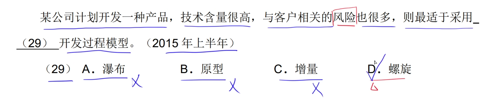
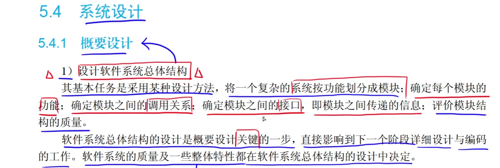
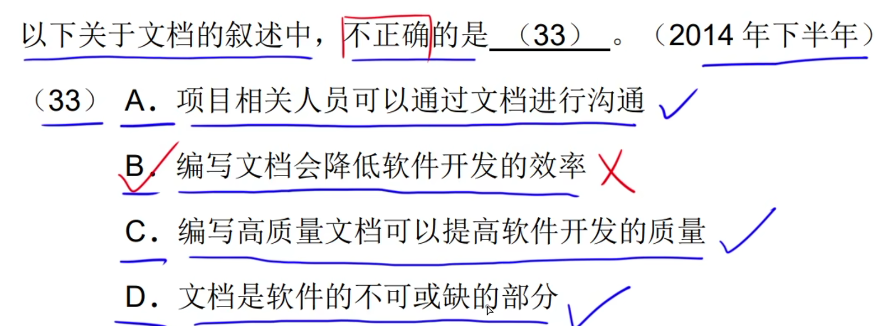
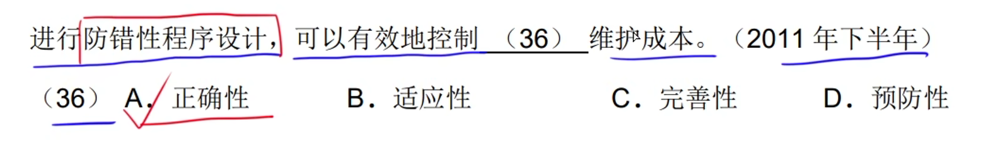
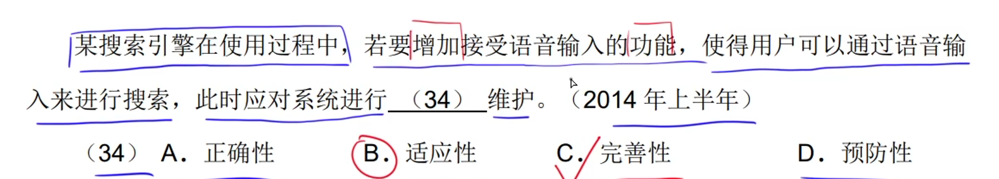
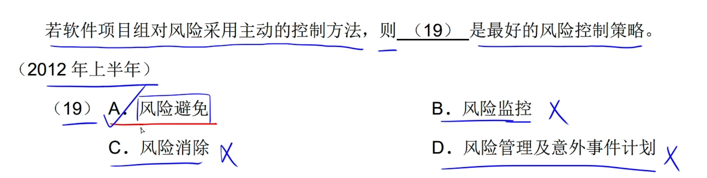
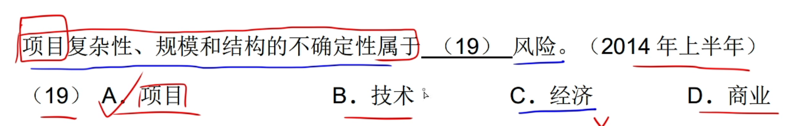
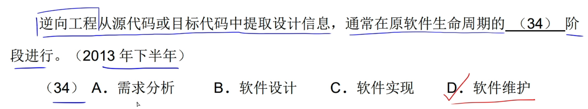

# 1.软件过程

## 1.CMM

**CMM：能力成熟度模型**

## 2.CMMI

**CMMI：能力成熟度模型集成**

# 2.软件工程模型

## 1.瀑布模型

## 2.V模型

## 3.增量模型

## 4.演化模型

### 1.原型模型

### 2.螺旋模型

## 5.喷泉模型

## 6.统一过程(UP)模型

# 3.敏捷方法

# 4.需求分析

## 1.软件需求

# 5.系统设计

## 1.概要设计

## 2.详细设计

# 6.系统测试

# 7.传统软件的测试策略

## 1.单元测试

## 2.集成测试

# 7.测试方法

## 1.黑盒测试

## 2.McCabe度量法

**计算有向图G的环路复杂性：边数  — 节点 + 2** 

## 3.白盒测试

### 1.逻辑覆盖

#### 1.语句覆盖

#### 2.判断覆盖

#### 3.条件覆盖

#### 4.判定条件覆盖

#### 5.条件组合覆盖

#### 6.路径覆盖

## 4.白盒测试+McCabe度量法

## 5.伪代码+白盒测试+McCabe度量法

# 8.运行和维护

## 1.系统可维护性评价指标

## 2.软件维护

**软件维护比软件开发的时间要长**

## 3.软件文档

## 4.系统维护

## 5.软件可靠性、可用性、可维护性

## 6.沟通路径

# 9.软件评估运算

# 10.进度管理

## 1.Gantt图(甘特图)

## 2.PERT(项目计划评审技术图)

**多个任务指向同一个节点，就取多个任务中的最大值。**

**最迟时刻，如果有多个任务指向，就取他们的最小值。**

****

**松弛时间：最迟时刻 — 最早时刻**

关键路径：就是松弛时间全部为0的就是关键路径。

## 3.项目活动图

# 11.软件配置管理

# 12.风险管理

## 1.风险管理

## 2.风险识别

## 3.风险预测

## 4.风险评估

## 5.风险控制

## 6.题目

# 13.软件质量

## 1.ISO/IEC9126软件质量模型

## 2.Mc Call软件质量模型

# 14.软件评审

跳过

# 15.软件容错技术

# 16.软件工具

