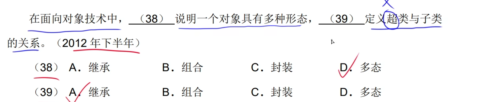
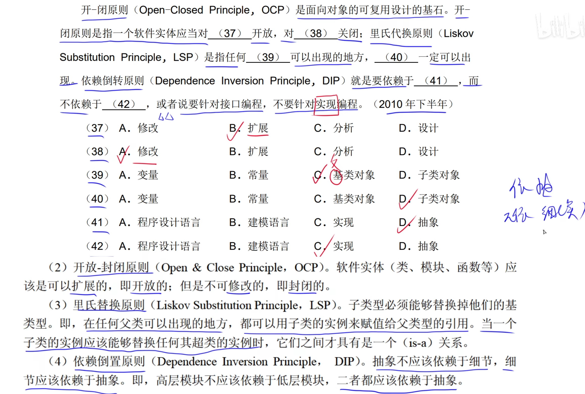
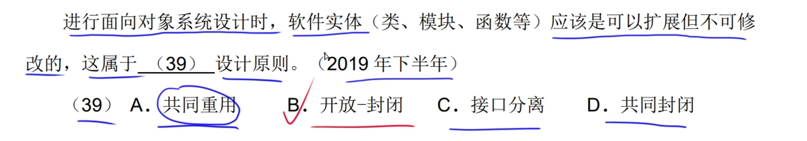
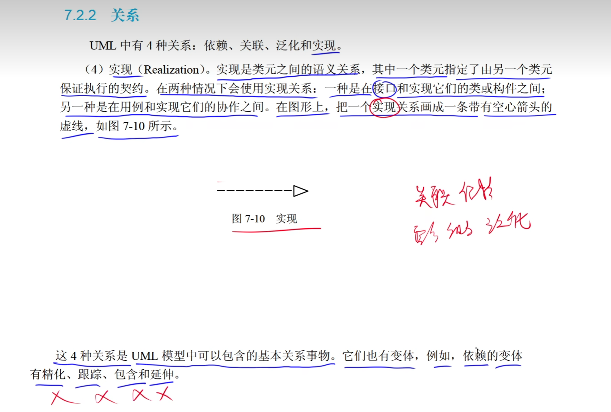
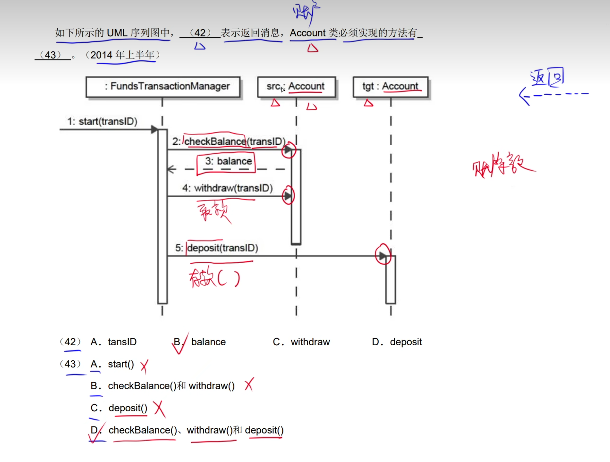

# 1.面向对象基础

## 1.面向过程和面向对象

## 2.类

## 3.对象

**属性的别名叫做状态。**

：属性、数据、状态。**

**成员函数(别名)：操作、行为、方法、函数。**

## 9.继承

**这个c选项，如果父类是设置的private的，可以继承但是不能使用。**

**父类==基类==超类**

**子类==派生类**

**覆盖(别名)：重写、置换**

## 10.多态

## 11.静态、动态绑定

## 12.面向对象设计原则

## 13.面向对象分析

## 14.面向对象设计

## 15.面向对象测试

## 16.面向对象程序设计

## 17.杂题选讲

# 2.UML

## 1.事物

**UML中的4种事物：结构事物、行为事物、分组事物、注释事物。**

## 2.关系

**UML中有4种关系：依赖、关联、泛化、实现。**

### 2.1依赖

**依赖是临时、偶然的。**

### 2.2关联

**关联分为两种：组合、聚合。**

**一个雇主可以对应0个或多个员工，一个员工可以对应0个或1个雇主。**

#### 1.关联多重度

**关联比依赖的强度大。**

### 2.3泛化关系

**泛化关系类型于面向对象中的继承。**

### 2.4实现

## 3.UML类图

### 1.类图

**因为A是抽象，不能直接实例化，所以D的  A的直接对象是错误的。**

### 2.对象图

**对象图有初始值。**

### 3.用例图

#### 3.1包含关系

#### 3.2扩展关系

**包含是必然的，扩展是不必需。**

#### 3.3.泛化关系

### 4.序列图

**交互图别名：顺序图**

**为什么check()不是，是因为check是person方法，Acconut只是调用了Person方法而已，所以不属于Account的方法。**

### 5.通信图

### 6.状态图

**这个D答案为什么是错误的，因为当前的状态是在A，所以不可能跳到B**

### 7.活动图

**状态图和活动图的区分，就是转换的时候，上面有事件表达式。有事件表达式的就是状态图，反之就是活动图。**

### 8.构件图

**别名：组件图**

### 9.部署图

## 4.UML图总和

## 5.杂题选讲

# 3.设计模式

